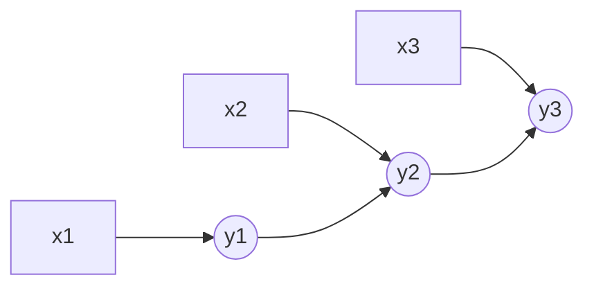

# 条件随机场

条件随机场（Conditional Random Field, CRF）是一种判别式序列标注模型。与 HMM 建模联合概率 $P(X,Y)$ 不同，CRF 直接建模条件概率 $P(Y|X)$。

## 概念详解

在线性链 CRF 中，输入序列为 $X=(x_1,\cdots,x_T)$，标签序列为 $Y=(y_1,\cdots,y_T)$。模型同时考虑当前位置的观测特征和相邻标签之间的转移关系。



## 数学公式及其推导

线性链 CRF 的条件概率定义为：

$$
P(Y|X)=\frac{1}{Z(X)}\exp\left(\sum_{t=1}^{T}\sum_k w_k f_k(y_{t-1},y_t,X,t)\right)
$$

归一化因子为：

$$
Z(X)=\sum_Y\exp\left(\sum_{t=1}^{T}\sum_k w_k f_k(y_{t-1},y_t,X,t)\right)
$$

训练时最大化：

$$
\log P(Y|X)=Score(X,Y)-\log Z(X)
$$

它提高真实路径分数，同时降低所有路径的归一化概率。

## 应用代码：Viterbi 解码

```python
import numpy as np

tags = ["B", "I", "O"]
emission = np.array([[2.0, 0.1, 0.3], [0.2, 1.8, 0.4], [0.1, 0.5, 2.2]])
transition = np.array([[0.5, 1.0, 0.1], [0.1, 0.8, 0.7], [0.6, 0.1, 0.5]])

T, C = emission.shape
dp = np.zeros((T, C))
path = np.zeros((T, C), dtype=int)
dp[0] = emission[0]

for t in range(1, T):
    for j in range(C):
        scores = dp[t - 1] + transition[:, j] + emission[t, j]
        path[t, j] = np.argmax(scores)
        dp[t, j] = np.max(scores)

best = [int(np.argmax(dp[-1]))]
for t in range(T - 1, 0, -1):
    best.append(path[t, best[-1]])

print([tags[i] for i in reversed(best)])
```

## 小结

CRF 的优势是能显式建模标签之间的约束关系。BERT-CRF 等模型常用神经网络产生发射分数，再用 CRF 建模标签转移。
