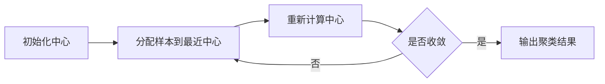

# 聚类

聚类是一类无监督学习方法，目标是在没有标签的情况下，把相似样本分到同一组。常见方法包括 K-Means、层次聚类、DBSCAN 和高斯混合模型。

## 概念详解

以 K-Means 为例，给定样本集合 $\{x_i\}_{i=1}^{N}$，希望找到 $K$ 个簇中心 $\{\mu_k\}_{k=1}^{K}$，使样本到所属簇中心的距离尽可能小。



## 数学公式及其推导

K-Means 的目标函数为：

$$
J=\sum_{i=1}^{N}\sum_{k=1}^{K}r_{ik}||x_i-\mu_k||^2
$$

其中 $r_{ik}\in\{0,1\}$，表示样本 $x_i$ 是否属于第 $k$ 个簇。

固定中心 $\mu_k$ 时，最优分配为：

$$
r_{ik}=1,\quad k=\arg\min_j||x_i-\mu_j||^2
$$

固定分配 $r_{ik}$ 时，对 $\mu_k$ 求导：

$$
\frac{\partial J}{\partial \mu_k}
=2\sum_{i=1}^{N}r_{ik}(\mu_k-x_i)=0
$$

得到：

$$
\mu_k=\frac{\sum_{i=1}^{N}r_{ik}x_i}{\sum_{i=1}^{N}r_{ik}}
$$

## 应用代码

```python
from sklearn.datasets import make_blobs
from sklearn.cluster import KMeans
from sklearn.metrics import silhouette_score

X, _ = make_blobs(n_samples=300, centers=3, cluster_std=0.7, random_state=0)

kmeans = KMeans(n_clusters=3, n_init=10, random_state=0)
labels = kmeans.fit_predict(X)

print("簇中心:")
print(kmeans.cluster_centers_)
print("轮廓系数:", silhouette_score(X, labels))
```

## 小结

K-Means 简单高效，但需要预先指定簇数，并且倾向于发现球形簇。对于任意形状簇或含噪声数据，可以考虑 DBSCAN。
