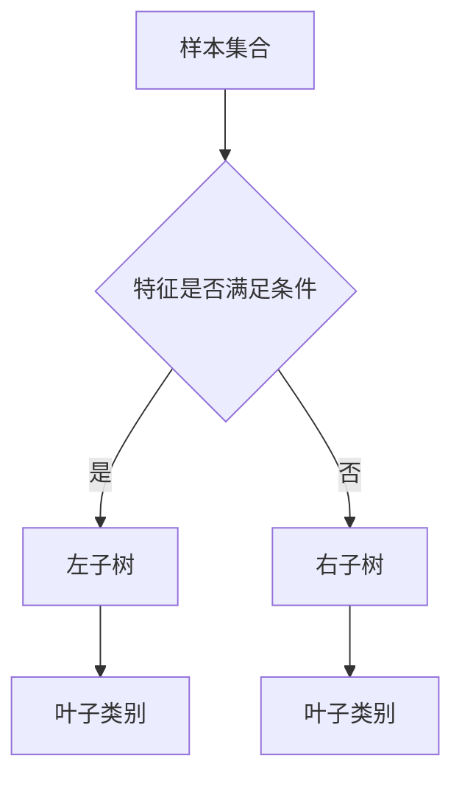

# 决策树

决策树通过一系列“如果……那么……”的规则进行分类或回归。每个内部节点对应一个特征判断，每条边对应判断结果，叶子节点给出最终预测。

## 概念详解

决策树的核心是选择最能划分数据的特征。常见准则包括信息增益、信息增益率和基尼指数。



## 数学公式及其推导

信息熵衡量样本集合的不确定性：

$$
H(D)=-\sum_{k=1}^{K}p_k\log_2 p_k
$$

如果用特征 $A$ 划分数据，得到若干子集 $D_v$，条件熵为：

$$
H(D|A)=\sum_v\frac{|D_v|}{|D|}H(D_v)
$$

信息增益定义为：

$$
g(D,A)=H(D)-H(D|A)
$$

CART 分类树常用基尼指数：

$$
Gini(D)=1-\sum_{k=1}^{K}p_k^2
$$

二叉划分后的基尼指数为：

$$
Gini(D,A)=\frac{|D_1|}{|D|}Gini(D_1)+\frac{|D_2|}{|D|}Gini(D_2)
$$

选择使 $Gini(D,A)$ 最小的特征和切分点。

## 应用代码

```python
import numpy as np
from sklearn.tree import DecisionTreeClassifier, export_text

X = np.array([[0, 0], [0, 1], [1, 0], [1, 1], [2, 1], [2, 2]])
y = np.array([0, 0, 1, 1, 1, 0])

tree = DecisionTreeClassifier(criterion="gini", max_depth=3, random_state=0)
tree.fit(X, y)

print(tree.predict([[1, 0], [2, 2]]))
print(export_text(tree, feature_names=["x1", "x2"]))
```

## 小结

决策树可解释性强，适合处理非线性边界，但容易过拟合。实际应用中常通过剪枝、限制深度或使用随机森林、提升树提高泛化能力。
