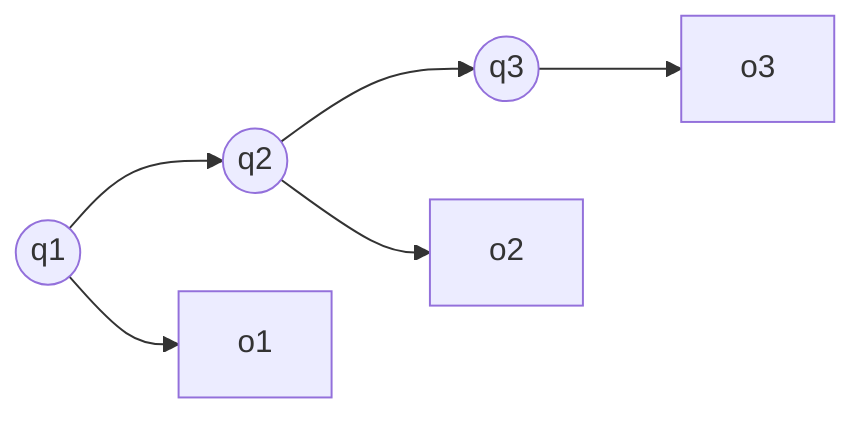

# 隐马尔可夫模型

隐马尔可夫模型（Hidden Markov Model, HMM）是一种序列概率模型。它假设系统存在不可直接观测的隐藏状态，观测序列由隐藏状态生成。

## 概念详解

HMM 包含三个核心参数：

$$
\lambda=(A,B,\pi)
$$

- $\pi_i=P(q_1=i)$：初始状态分布。
- $A_{ij}=P(q_{t+1}=j|q_t=i)$：状态转移概率。
- $B_j(o_t)=P(o_t|q_t=j)$：发射概率。



## 前向算法推导

定义前向变量：

$$
\alpha_t(i)=P(o_1,o_2,\cdots,o_t,q_t=i|\lambda)
$$

初始化：

$$
\alpha_1(i)=\pi_iB_i(o_1)
$$

递推：

$$
\alpha_{t+1}(j)=\left[\sum_i\alpha_t(i)A_{ij}\right]B_j(o_{t+1})
$$

最终：

$$
P(O|\lambda)=\sum_i\alpha_T(i)
$$

## 应用代码

```python
import numpy as np

pi = np.array([0.6, 0.4])
A = np.array([[0.7, 0.3], [0.4, 0.6]])
B = np.array([[0.5, 0.5], [0.1, 0.9]])
O = np.array([0, 1, 1, 0])

alpha = np.zeros((len(O), len(pi)))
alpha[0] = pi * B[:, O[0]]
for t in range(1, len(O)):
    alpha[t] = alpha[t - 1] @ A * B[:, O[t]]

print(alpha)
print("P(O) =", alpha[-1].sum())
```

## 小结

HMM 用“隐藏状态链 + 观测生成”描述序列，是语音识别、词性标注、生物序列分析中的经典模型。
