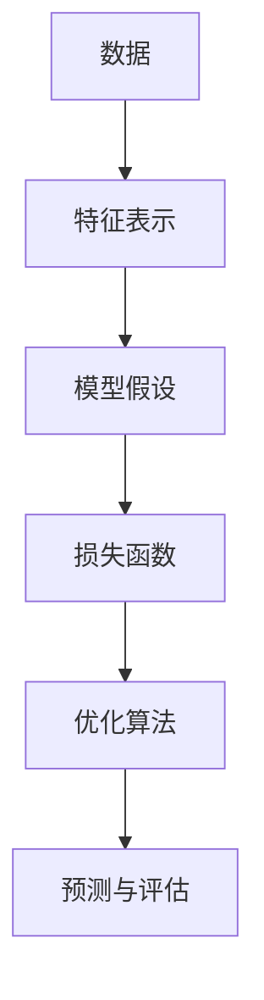

# 基础机器学习

基础机器学习关注从数据中学习规律。给定训练集 $D=\{(x_i,y_i)\}_{i=1}^{N}$，模型希望学习函数 $f_\theta(x)$，使它在未知样本上也能可靠预测。

学习过程通常可以写成经验风险最小化：

$$
\theta^\*=\arg\min_\theta \frac{1}{N}\sum_{i=1}^{N}L(f_\theta(x_i),y_i)+\lambda\Omega(\theta)
$$

其中 $L$ 是损失函数，$\Omega(\theta)$ 是正则项，$\lambda$ 控制模型复杂度。

## 学习范式

| 类型 | 输入 | 输出 | 典型算法 |
| --- | --- | --- | --- |
| 监督学习 | $x,y$ 同时给出 | 分类或回归 | 感知机、Logistic 回归、SVM、决策树 |
| 无监督学习 | 只有 $x$ | 数据结构或隐变量 | 聚类、PCA、SVD、GMM |
| 概率建模 | 样本与概率假设 | 概率分布 | 朴素贝叶斯、HMM、CRF、MCMC |



## 通用代码骨架

```python
def train(model, X, y, lr=0.01, epochs=200):
    for epoch in range(epochs):
        pred = model.forward(X)
        loss = model.loss(pred, y)
        grad = model.backward(X, y, pred)
        model.update(grad, lr)
    return model
```

后续章节会围绕“概念详解、数学公式及其推导、应用代码”展开。传统机器学习模型参数量通常较小，可解释性较强，是理解深度学习前非常重要的基础。
