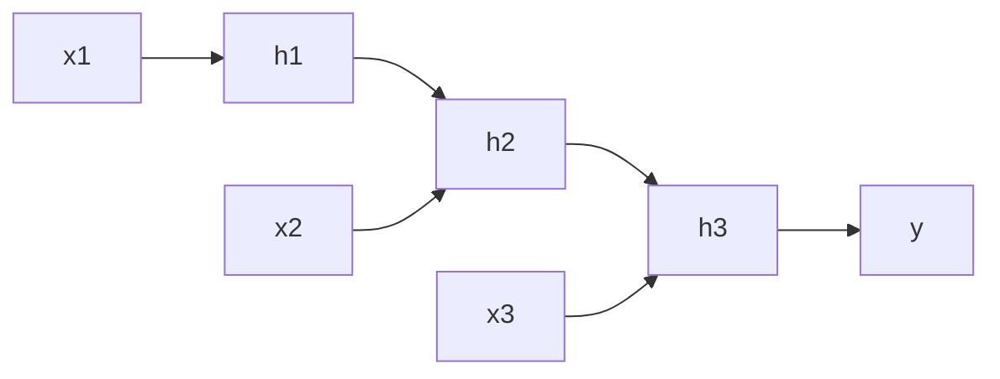

# 循环神经网络

循环神经网络（Recurrent Neural Network, RNN）用于处理序列数据。它通过隐藏状态保存历史信息，因此适合文本、时间序列、语音等任务。

## 概念详解

给定序列 $x_1,x_2,\cdots,x_T$，RNN 在每个时间步更新隐藏状态：

$$
h_t=\phi(W_xx_t+W_hh_{t-1}+b)
$$

输出为：

$$
y_t=W_yh_t+c
$$

其中 $h_t$ 同时依赖当前输入 $x_t$ 和上一时刻状态 $h_{t-1}$。



## 梯度传播推导

损失对早期隐藏状态的梯度会经过多次连乘：

$$
\frac{\partial L}{\partial h_t}
=\frac{\partial L}{\partial h_T}
\prod_{k=t+1}^{T}\frac{\partial h_k}{\partial h_{k-1}}
$$

而：

$$
\frac{\partial h_k}{\partial h_{k-1}}
=\text{diag}(\phi'(a_k))W_h
$$

如果该矩阵范数长期小于 1，梯度会消失；长期大于 1，梯度会爆炸。这也是 LSTM、GRU 被提出的重要原因。

## 应用代码

```python
import torch
from torch import nn

class RNNClassifier(nn.Module):
    def __init__(self, input_dim=8, hidden_dim=16, num_classes=2):
        super().__init__()
        self.rnn = nn.RNN(input_dim, hidden_dim, batch_first=True)
        self.fc = nn.Linear(hidden_dim, num_classes)

    def forward(self, x):
        out, h = self.rnn(x)
        return self.fc(out[:, -1, :])

X = torch.randn(32, 10, 8)  # batch, seq_len, input_dim
y = torch.randint(0, 2, (32,))

model = RNNClassifier()
loss_fn = nn.CrossEntropyLoss()
optim = torch.optim.Adam(model.parameters(), lr=1e-3)

for _ in range(100):
    logits = model(X)
    loss = loss_fn(logits, y)
    optim.zero_grad()
    loss.backward()
    optim.step()

print(loss.item())
```

## 小结

RNN 的关键是隐藏状态递推。它能自然处理序列，但长距离依赖困难，因此现代长序列任务更多使用 LSTM、GRU 或 Transformer。
