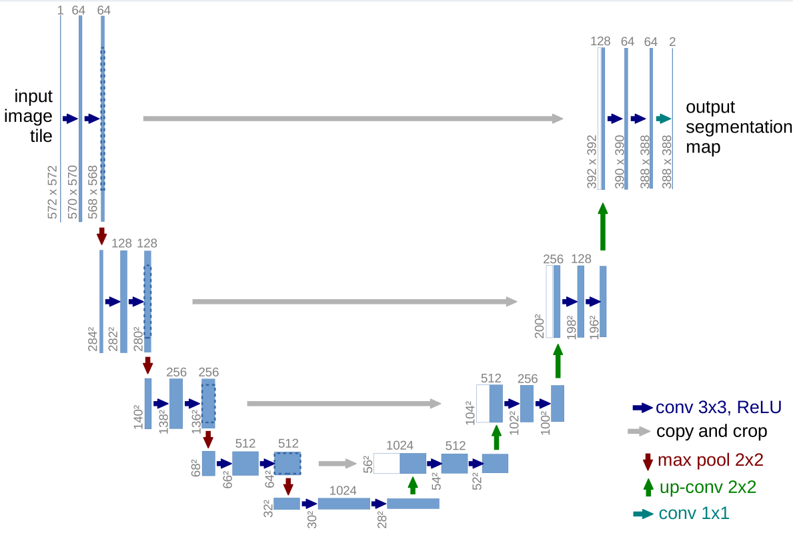
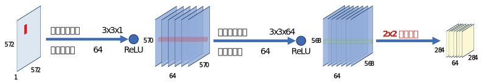
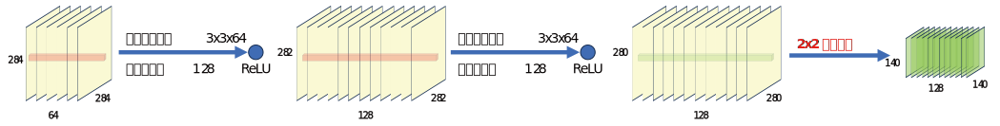
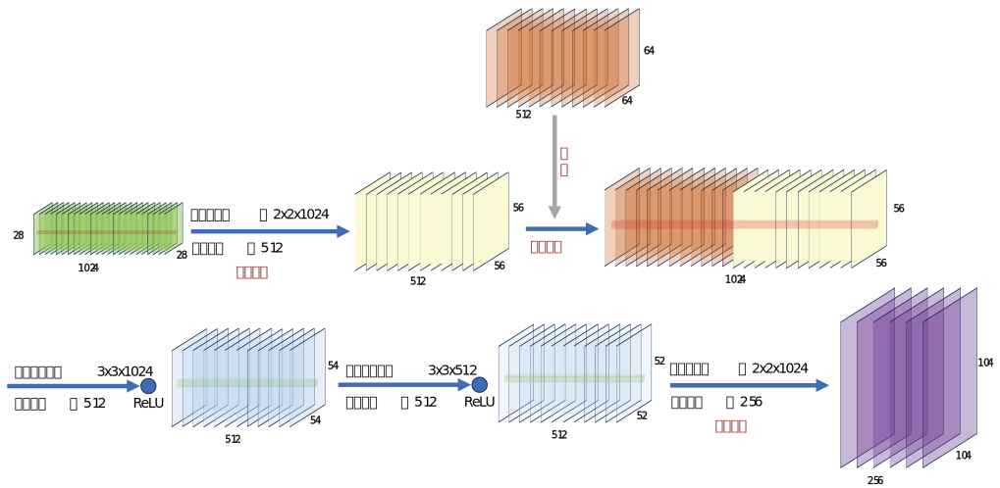

# U-net

Unet是2015年发的论文，起初用于医学图像处理，Unet这篇论文提出了如何利用少样本进行深度学习，模型训练效果较优。

## 模型架构

Unet模型采用编码-解码器架构，整体呈现U字形，这也是其名称的来源。在编码器阶段采用3x3卷积核与ReLU激活函数对特征不断提取，使用2x2池化层对像素进行缩小，同时增加通道数量；而在解码器阶段则是不断扩大矩阵，减少通道数，同时还会直接采用编码器输出的数据进行数据融合，弥补上采样过程中丢失的细节信息。

### 下采样
下采样可以压缩空间尺寸、保留关键信息、提升语义层级，其具体实现方式如下：
对于原始输入的572x572x1的图像矩阵，使用64个3x3卷积核进行卷积，每个卷积核都会对输入图像进行计算，再经过ReLU激活函数，最终得到64个570x570x1的图像，即570x570x64。
对该层输出再进行一次3x3卷积和ReLU激活函数，得到568x568x64的三维数据。
对输出数据进行max pool 2x2的池化操作，数据缩小到284x284，通道数不变。
使用 128 个$3 \times 3 \times 64$的卷积核卷积，得到$282 \times 282 \times 128$的数据

接下来将对上采样的第一轮单独分析，起始输入一个$572 \times 572 \times 1$的单通道特征图，使用64个不同的$3 \times 3\times 1$卷积核进行卷积运算，并对输出进行ReLU激活，得到$570 \times 570 \times 64$的特征图；再用64个不同的$3 \times 3\times 64$卷积核进行卷积运算，并对输出进行ReLU激活，得到$568 \times 568 \times 64$的特征图；最后进行$2 \times 2$最大值池化，对每个通道单独进行池化操作，得到$284 \times 284 \times 64$的特征图，其大小减半，通道数不变。

同样的操作继续对池化输出层进行特征提取运算，该轮计算得到$140 \times 140 \times 128$的特征图，相比上一轮的尺寸继续减半而通道数翻倍。

以此往复，直到得到$28 \times 28 \times 1024$的特征图，之所以频繁使用多个卷积核计算使其通道数不断增加，是因为这样的设计相当于使用了多种不同方法提取了特征，保证了信息采样的丰富性。

### 上采样

下面对上采样步骤进行讲解，针对得到的$28 \times 28 \times 1024$的特征图，使用512个$2 \times 2 \times 1024$的卷积核进行转置卷积，得到尺寸翻倍通道数减半的特征图，其尺寸为$56 \times 56\times 512$；随后拷贝与之对称的下采样过程得到的特征图，并对其进行裁剪，使矩阵大小相同，然后将两者拼接，又得到了$56 \times 56\times 1024$的特征图；使用512个$3 \times 3\times 1024$和$3 \times 3\times 512$的卷积核进行两次卷积并激活，得到新的$52 \times 52\times 512$的特征图，尺寸变化为56→54→52，其运算结果将进入下一轮上采样。

最终得到大小为$388 \times 388\times 64$的特征图，使用2个$1 \times 1\times 64$卷积核得到输出图，这里的卷积核数量应对应分割任务的类别数。
