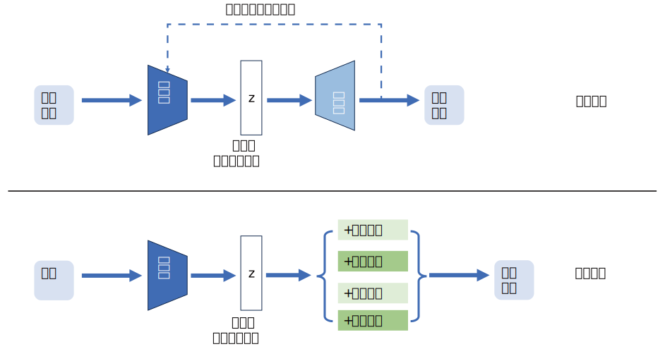

# 传统编码-解码器
在介绍VAE之前，需要先了解传统的自编码器（AE）的结构，其设计框架如下：

## 模型架构

自编码器（Autoencoder，AE）是一种无监督学习的神经网络模型，主要用于数据的降维、特征学习以及数据的重构等任务。通俗的讲，自编码器的泛化生成能力很差，几乎不能单独使用，它更多的是承担数据降维和特征提取的角色。

**1.编码器**

编码器的实际实现也是一种多层神经网络，可以由`多层感知机`或`卷积神经网络`等架构实现。

`多层感知机`由多个全连接层组成，适合处理像表格数据这样结构相对简单、维度固定的数据；`卷积神经网络`特别适合处理具有网格结构的数据，如图像、音频等，能够有效提取数据中的局部特征，减少模型参数数量，避免过拟合。

在更多的实际应用中，还可能会编码器的具体实现进行少许改进，但万变不离其宗，都离不开之前所介绍的基本神经网络模型，相关内容可参考前文所讲。

**2.隐变量空间**

编码器得到的隐变量空间是一个 抽象的、机器可理解的特征容器，其中的每一个数据点都是原始数据经过编码器所提取到的所谓“特征”，可以认为该降维压缩后的数据可以最大限度的表征原始数据特征。

隐变量空间的维度即是编码器的输出维度，也对应着编码器神经网络的输出维度。隐变量是对高维数据的降表示，在保留原始数据关键特征的同时，去除了冗余信息，它的含义通常难以解释，是机器学习到的抽象的数值，但这种抽象数据能让解码器较好重构原始数据。

隐变量空间是在编码器和解码器的训练过程中，通过最小化重构误差逐渐形成的。随着训练的进行，编码器会不断调整对原始数据的编码方式，使得隐变量空间中的数据分布能更好地服务于重构任务，隐变量也能更精准地捕捉原始数据的关键特征。

**3.解码器**

解码器是将编码器输出的低维隐变量还原或生成为与原始数据格式相同的高维数据，它的主要任务就是评估和引导编码器学习到有效的数据表示，我们可以通俗的把它理解为一个可以监督编码器编码效果的组件。

解码器通常与编码器结构对应，由对称多层感知机、转置卷积层或其他对应结构实现，可以接受编码产生的隐变量$z$，重新解码得到“原数据”

**4.外联模型**

正如前文所述，自编码器多数时候是作为一个特征提取工具，配合其他模型的输入使用。例如，一个训练好的编码器结构可以与`分类模型`（如逻辑回归、随机森林、轻量 CNN）或`回归模型`（如线性回归、XGBoost）相连，将所提取的特征作为他们的输入，用于标注数据少、原始数据维度高的场景（比如高维传感器数据分类、罕见疾病影像诊断）。

## 运行逻辑

### 训练

在AE的训练流程中，编码器层接受高维数据输入$\mathbf{x}_i$，经过多层网络运算后得到低维隐变量$z_i$，随后将$z_i$输入解码器，解码器输出的重构样本 $\hat{\mathbf{x}}_i$与原始输入计算损失函数，经过优化器更新模型参数。

通过不断重复上述训练循环，自编码器的编码器和解码器参数会逐渐优化，使得解码器能够越来越准确地重构出原始输入数据，同时编码器也能提取到更有效的数据特征表示。

### 损失函数

自编码器训练过程同样需要选择合适的损失函数，以下介绍两种常用的损失函数，根据数据的类型和具体的任务需求来进行合理的选择。 

**1.均方误差损失**

当处理连续值数据时，均方误差损失是一个常用的选择，例如图像数据（像素值是连续的）、数值型的传感器数据等。

**公式**：对于一个包含 $N$ 个样本的批次，假设第 $i$ 个原始输入样本为 $\mathbf{x}_i$，对应的重构样本为 $\hat{\mathbf{x}}_i$，均方误差损失的计算公式为：

$$ L_{MSE} = \frac{1}{N}\sum_{i = 1}^{N}\sum_{j = 1}^{D}(x_{ij} - \hat{x}_{ij})^2 $$

其中 $D$ 是样本的维度，$x_{ij}$ 是第 $i$ 个原始样本的第 $j$ 个特征值，$\hat{x}_{ij}$ 是第 $i$ 个重构样本的第 $j$ 个特征值。

**2.交叉熵损失**

当处理离散值数据，比如文本数据中的类别标签、图像的分类标签等，交叉熵损失比较适用。

**公式**：对于二分类问题，交叉熵损失的计算公式为：

$$ L = - \frac{1}{N}\sum_{i = 1}^{N}[y_i\log(\hat{y}_i) + (1 - y_i)\log(1 \hat{y}_i)] $$

其中 $N$ 是样本数量，$y_i$ 是第 $i$ 个样本的真实标签（0或1），$\hat{y}_i$ 是模型预测第 $i$ 个样本为正类（标签为1）的概率。

对于多分类问题（假设类别数为 $C$ ），交叉熵损失的计算公式为：
$$L = - \frac{1}{N}\sum_{i = 1}^{N}\sum_{c = 1}^{C}y_{ic}\log(\hat{y}_{ic})$$
其中 $y_{ic}$ 表示第 $i$ 个样本在第 $c$ 个类别上的真实标签（通常是one - hot编码，即只有一个类别为1，其余为0），$\hat{y}_{ic}$ 是模型预测第 $i$ 个样本属于第 $c$ 个类别的概率。

### 推理

AE的推理过程极为简单，如上图所示，将训练好的编码器与其他模型相连接，利用编码器提取到的数据特征达到更优的预测效果。

## 与PCA（主成分分析）的区别

讲到这里我们很容易想到，另一种降维压缩方法，主成分分析（PCA），二者的主要差异如下：

PCA是一种基于线性代数的统计方法。它通过对数据的协方差矩阵进行特征分解，找到数据中的主要成分（即主成分），这些主成分是原始特征的线性组合，且彼此正交。其目标是在尽可能保留数据方差（信息）的前提下，将高维数据映射到低维空间，使得数据在新的低维空间中更加紧凑、易于处理。 简单来说，PCA 试图找到数据中最能代表整体变化的方向。

AE是一种基于神经网络的机器学习模型。它利用神经网络强大的非线性拟合能力，让编码器将输入数据映射到低维的潜在空间，解码器再将潜在空间的表示还原为原始数据。训练时通过最小化重构误差（如均方误差、交叉熵损失等）来调整网络参数，使得编码器能够提取到对重构数据最关键的特征。

两者最大的区别在于PCA只是一种线性变换，而AE可以做非线性处理。