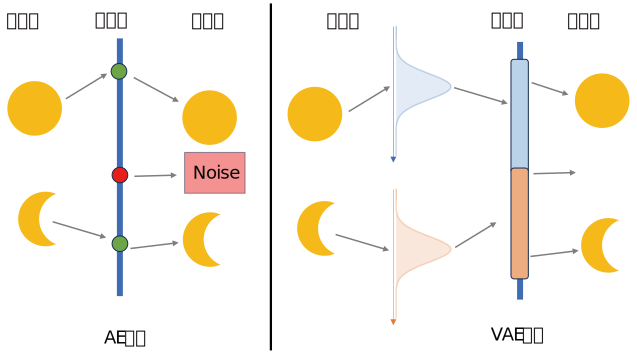
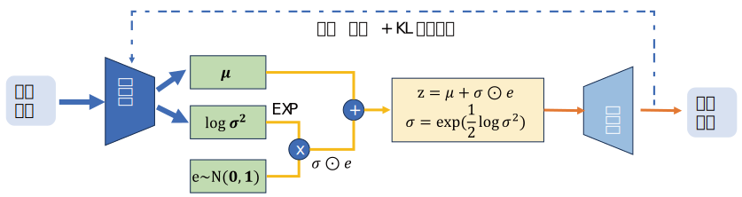
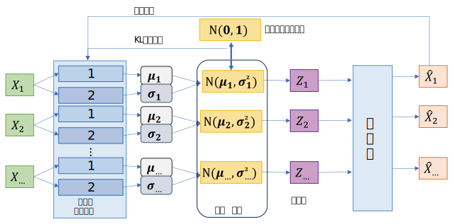
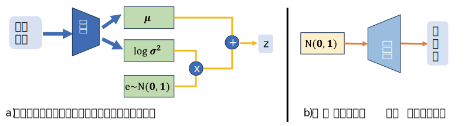

# VAE

## AE的不足之处

AE 的潜在空间是离散且无规律的，输入数据映射到低维潜在空间后，隐变量的分布没有约束，导致同类数据的隐变量可能聚集在孤立的小区域，区域之间存在大量空白。当从这个潜在空间中随机采样一个点时，大概率会落在 “无意义的空白区域”，解码器无法将其转换为有意义的新数据，而是输出噪声（如下图所示），这也同时导致 AE 难以生成与训练数据不同但合理的新数据。

## VAE的优势

相比较AE的得到的无规律的、碎片化的隐空间，VAE通过生成均值和方差得到对应隐变量服从的正态分布的参数，使得采样得到的隐空间变得连续，在解码采样过程中具有了“创作”能力。

如上图所示，在AE模型中，一个输入对应隐空间中一个点，在未采样的点上解码将会得到噪声输出，显然这不是我们需要的“创作生成能力”；在VAE模型中，每个输入会被编码产生一个分布，解码器中隐空间中采样时，可能会采到隐空间任意一点，该点将同时结合了两个输入的特征（满月和月牙），解码得到半满月，也就是说，模型具备了一定的“创作能力”。同时，隐空间的连续性让“插值生成”、“随机生成”成为可能。

## 设计思想

VAE的设计架构如图所示，同样是由编码器-解码器两部分组成，与AE不同的是，VAE的编码器接受输入$x$，输出均值$\mu$和对数方差$log \sigma^2$，经指数运算得到$\sigma = exp(\frac{1}{2} log \sigma^2)$，这样做是为了保证方差恒为正数；同时还会在$\mathcal{N} (0,1)$的正态分布中采样得到$e$，最终将三者组合得到隐变量$z=\mu + \sigma \odot e$。

在解码器阶段，解码器接收重参数化得到的隐变量$z$，解码得到重构数据$\hat{x}$，通过计算损失函数对模型参数进行优化，最终实现生成全新的、与训练数据风格一致的数据，这是VAE模型的核心能力。

> [!CAUTION]
> $z$是重参数化后得到的确定值，不是分布

### 重参数化思想
对于重参数化技巧（$z = \mu + \sigma \odot e$，其中$e \sim \mathcal{N}(0,1)$），如果直接从分布中随机采样得到$z$，这个 “采样” 操作是不可导的，因为采样是 “随机选择一个值”，没有明确的 “输入 - 输出的函数关系”，导致梯度无法通过采样步骤反向传播，模型参数（编码器、解码器的权重）就无法被优化。

VAE 将 **“从分布中采样” 的操作，转化为“从标准分布采样 + 可导的线性变换”**，使采样过程可微，让整个模型可以利用反向传播训练。

## 损失函数

VAE的损失函数主要由`重构损失`和` KL 散度损失`两部分构成，如果没有KL散度损失，则VAE就退化成了AE模型。

### 重构损失
这部分和AE模型的损失函数相似，通常使用`均方误差损失`或`交叉熵损失`，主要衡量解码器输出的重构数据与原始输入数据之间的差异，促使模型学习到能准确重构数据的编码。

### KL散度损失
用于衡量编码器输出的隐变量分布 $q_{\phi}(\mathbf{z}|\mathbf{x})$与先验分布$p(\mathbf{z})$，通常是标准正态分布 $\mathcal{N}(0, 1)$之间的差异，其中$\phi$是神经网络参数。

KL散度是衡量两个分布间的相似度的，对于VAE来说，则是尽可能使编码器输出的$(\mu , \sigma^2)$接近于$(0,1)$，但同时又不能要求所有输入都得到输出$\mu = 0,\sigma^2 = 1$，如果所有输入的隐变量分布都完全一样，解码器无法通过隐变量区分差异，最终生成的图像会变得模糊、无差异。

## 模型流程

### 训练
VAE的训练过程可以总结为下图：

每一轮训练中，输入数据$X_i$在两个神经网络作用下分别生成均值$\mu_i$和方差$\sigma_i$（经过指数化），在标准正态分布中采样得到$e_i \sim \mathcal{N}(0,1)$，计算得到$z_i = \mu_i + \sigma_i \odot e_i$，将$z_i$输入解码器得到输出$\hat{X}_i$。

在反向传播过程中，利用$\hat{X}_i$和$X_i$计算重构损失，利用$\mathcal{N}(\mu_i,\sigma_i)$和标准正态分布$\mathcal{N}(0,1)$计算KL散度损失，迭代优化模型参数，最终地道道训练好的模型。

### 推理
训练好的VAE模型有两种推理过程，一种是使用编码器的推理，接受原始数据输入，得到该输入在隐空间的对应坐标；另一种是更常用的“生成”过程，即通过对标准正态分布的采样，利用解码器生成数据，从而实现“创作”过程。

## 重构技巧的等价性

下面讨论VAE中重参数化技巧的核心数学原理，该等价性在后续的一众模型中均有涉及。

### 等价性描述

当满足以下条件时，`z = μ + σ * e` 与 `z ~ N(μ, σ²)` 是等价的：
1.  `e` 是一个从**标准正态分布**中采样的随机变量，即 `e ~ N(0, 1)`。
2.  `μ` (mu) 是一个常数（或与`e`无关的参数），代表**均值**。
3.  `σ` (sigma) 是一个大于0的常数（或与`e`无关的参数），代表**标准差**。

$z \sim \mathcal{N}(\mu,\sigma^2)$相当于一个标准正态分布$\mathcal{N}(0,1)$缩放$\sigma$，再平移$\mu$，因此可以写成$z=\mu + \sigma*e$

### VAE重参数化的意义

为了实现反向传播，让模型可以被训练。

1.  **直接采样的问题**: `z ~ N(μ, σ²)` 这个操作是**不可导的**。
    *   在VAE中，`μ`和`σ`是由编码器神经网络计算出来的，它们是依赖于模型参数的。
    *   如果我们直接从 `N(μ, σ²)` 中“随机挑选”一个`z`，这个“挑选”过程是一个黑箱，梯度无法从`z`传递回`μ`和`σ`，导致编码器的参数无法被优化。

2.  **重参数化的解决方案**: `z = μ + σ * e`
    *   这个公式将随机性**转移**到了一个与模型参数无关的外部变量`e`上。
    *   在计算梯度时，`e`被视为一个固定的输入（一个随机的常数）。
    *   现在，`z`是`μ`和`σ`的**确定性、可微分的函数**。
    *   因此，梯度可以顺畅地从`z`（以及后续的解码器和损失函数）反向传播到`μ`和`σ`，最终更新编码器的权重。

