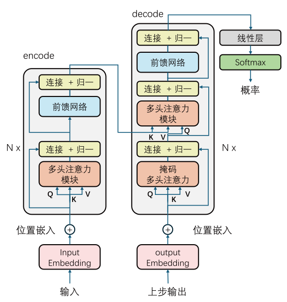

# Transformers

大名鼎鼎的Transformer模型最早是谷歌DeepMind在2017年的论文《Attention Is All You Need》首次提出 Transformer 架构。这篇论文摒弃了传统的循环结构，完全基于注意力机制构建了一个全新的模型架构。本节讲详细讲述Transformer模型的架构流程。

## 概述

原文中通过一张图清晰地展示了该模型的架构，如图，它主要由编码器和解码器两个部分组成，编码器和解码器又分别是N个相同模块的堆叠。

整个体系实际上是由`多头注意力层`、`残差连接层`、`归一化层`、`前馈网络层`的排列组合构成。

## 文字嵌入

在处理序列问题时，第一步永远是把序列处理为计算机可以理解的“数字”，对于文本序列就是所谓词嵌入。
假设有输入序列可被分词为$N$，对于其中的每个词，可以将其转变为维度为$C$的嵌入向量$w=[c_1,c_2,\cdots,c_C]$。

整个输入序列可以用输入矩阵表示：$W=[w_1,w_2,\cdots,w_N]$

词嵌入编码得到语义信息，位置编码得到位置信息，注意力编码上下文信息。

## QKV计算
QKV矩阵的计算是注意力的核心，首先说明单个字词的注意力计算，示意图如下：

单个词向量分别乘以权重矩阵 $W_q$、$W_k$、$W_v$，得到 $q_1$、$k_1$、$v_1$这三个新的词向量。可以把他们理解为query、key、和value，其中query编码了要查询的值，key编码了被查询的值，value编码了具体的值；权重矩阵 $W_q$、$W_k$、$W_v$ 是神经网络需要学习训练的部分。

得到query、key、value三个向量后，根据注意力计算公式就可以计算相似度权重，权重代表上下文的每个词对当前词的影响程度，随后再将上下文信息注入原始向量，得到最后的编码向量。

我们利用矩阵运算的性质，将输入的序列的N个词“打包”成一个矩阵，可以同样并行计算所有词的query、key、value向量，而得到了三个新矩阵，分别为Q、K、V矩阵。示意图如下：

在实际工程中，借助GPU强大的并行计算能力，可以很快的计算出所有输入词的QKV矩阵。而且可以发现，需要学习的模型权重 $W_q$、$W_k$、$W_v$ 的形状是 $(C, D)$，分别指词向量维度和模型输出维度，并没有对输入序列长度做约束，借此就可以处理任意序列/可变长序列。

## 注意力计算

在得到QKV矩阵后，就需要进行注意力的计算，实际上计算公式有多种多样，按原论文中的表述，他们使用如下的缩放点积注意力来计算。

### 缩放点积注意力模块

缩放点积注意力算法是自注意力的一种实现形式，它通过如下公式计算：

$$Attention = softmax(\frac{QK^T}{\sqrt{d}})V$$

对于形状为$(N,D)$的QKV矩阵来说，$Q$作为查询矩阵和键矩阵$K$的转置$K^T$做矩阵乘法，计算得到一个$(N,N)$方阵，这个方阵的每个元素表示$q_i - k_j$的相似度，或者说$q_i$受哪个$k_j$的上下文影响最大。

得到$QK^T$方阵后，对每个元素除以$\sqrt{d}$（$d$是键向量的维度D），使得元素更加平缓，因为 Softmax 对大数值敏感，过大的点积会导致 Softmax 输出过于尖锐（只有一个权重接近 1，其余接近 0），缩放后能让注意力更均衡，让模型不会过度聚焦于某一个键，而是广泛的学习全局信息。

最后按行进行$softmax$归一化，把注意力分数变成概率分布，矩阵的每一行概率和为1，这时也相当于每行中的元素是一个权重值，这个权重表示，当前 query 对各个 key 的注意力权重，当前 query 对各个 key 的注意力权重，在后续计算中进行加权求和。

具体的运算过程如下：

计算$Attention$最后一步得，所谓加权求和实际上利用了矩阵乘法的性质，从示意图最右侧可以看出，$softmax * V$相当于用注意力分数的每一行点乘$V$的每一列，加和作为结果$Res$的值，以第一个元素为例，$Res_{1,1}=a_{1,1}*v_{1,1}+a_{1,2}*v_{2,1}+a_{1,3}*v_{3,1}$，即输出矩阵第一个向量的第一个元素综合考虑了上下文所有词，并按他们的影响程度权重计算，这样新得到的词向量就抽象的融合了上下文信息。

### 多头注意力模块

所谓多头注意力就是将多个注意力层堆叠，如果把单个注意力头类比为一个提取输入数据特征的评委，那么多头注意力就相当于多个评委，每个评委注意不同的侧重点，再将多个评委的意见整合到一起，这样做有利于模型学习到更加丰富的信息。

此时就涉及到头数$h$和单层输出维度$d'$的设置问题，如果输入QKV矩阵依旧是$(N,D)$，那么每个注意力头都会输出一个$(N,D)$矩阵，这时拼接的话就会得到$(N,D*h )$它的维度将会翻倍，这对硬件有着巨大的挑战，而且参数量暴增容易导致过拟合。

在原论文中，作者设置了头数是$h$，而单个头的输出维度是$d'=\frac{D}{h}$，这里的 $D$ 是单头时的维度。这么做相当于把原先单头注意力的QKV矩阵拆分成$h$等份，经过注意力计算后得到$h$个输出矩阵$(N,\frac{D}{h})$，将每个输出拼接，总维度仍为$D$，在计算量和参数量不变的情况下，很好的做到了多头注意力，采集更丰富的信息。

在实际的操作中，会把QKV矩阵分别经过线性层处理，得到符合形状的$(N,\frac{D}{h})$输入矩阵，再经过注意力公式计算即可。下图是多头注意力的详细示意图：

多头注意力通过**多视角拆分 - 并行计算 - 整合特征**，让模型能同时关注不同子空间的信息（比如有的头关注语法，有的头关注语义），从而学习到更全面的表示，提升模型性能。

### 掩膜注意力模块

上文我们看到，对于一个序列来说，通过几次矩阵运算就可以同时算出所有分词的特征向量，并不需要等待上一个字符生成后再计算下一个字符，这种并行计算方法大大提高了效率。

不过，在训练过程中，我们不能一次性把已知答案所有的上下文全部输入，

现在需要设计一种方法，让序列中字符在被计算后只包含它之前地上下文信息，而不让他提前看到后文，即可使用如下的掩码操作：

在QK矩阵计算相似度时，人为地把结果矩阵地上三角部分设为$- \infty$，这样在经过$softmax$后，上三角部分全变为0，再计算注意力时，可以看到第一个字符“我”向量与矩阵相乘时，后两个字符相似度为0，结果中只包含“我”向量地信息；第二个字符“和”相乘时，只包含“我”、“和”两个字符地信息；最后，“你”字符相乘时，将包含全部上下文信息。

通过这种方法，我们巧妙地生成了每行词向量只包含它上文信息的矩阵，在训练过程中并行地训练模型。

### 交叉注意力模块

核心问题：**如何将输入序列和输出序列对应？**

在上文的讨论中，我们通过编码器得到了包含输入序列上下文信息的矩阵，也得到了包含已经输出序列的上下文信息矩阵，在生成过程中，我们期望设计一个模块，能够根据输入序列和前一步生成的序列，继续生成下一个字符，那这就需要交叉注意力模块，他负责把输入输出相联系。

Transformer所涉及的全部三种注意力机制：

| 注意力类型       | 输入Q      | 输入K,V      | 学习目标         |
| ---------------- | ---------- | ------------ | ---------------- |
| 编码器自注意力   | 输入词自身 | 所有输入词   | 源语言内部关系   |
| 解码器掩码注意力 | 当前输出词 | 已生成输出词 | 目标语言内部关系 |
| 解码器交叉注意力 | 解码器状态 | 编码器输出   | 跨语言对齐映射   |

## Transformer处理流程

了解完Transformer的所有注意力模块后，简略介绍一下模型的其他模以及数据的总体流程图。

### 编码器

1. 对于文本序列来说，将输入序列分词后进行词嵌入，生成的词向量包含语义信息；
2. 通过语义编码（通常是正弦位置编码），此时的词向量包含位置信息。这个位置信息是指这个词在句子中的哪个位置，并不是“上下文的语义”位置；
3. 对词向量分别乘以权重矩阵 $W_q$、$W_k$、$W_v$，得到QKV矩阵，输入多头注意力模块，根据注意力公式计算得到注意力词向量，此时的向量将包含上下文信息，每个向量的值都会受全文中词的影响；
4. 注意力模块的输出会和第二步的输出进行一次残差连接，并计算归一化，残差操作将避免长距离传递的数据稀释；
5. 将归一化矩阵输入一个前馈网络，网络输出和前馈网络输入再进行一次残差连接，其结果进行归一化。前馈层会增强模型的非线性表达能力，增加泛化能力；
6. 步骤3的输入和步骤5的输出矩阵形状一致，因此步骤3~5组成的编码器模块可以首位相连，堆叠N个，在原论文中$N=6$。

### 解码器

### 训练

### 推理