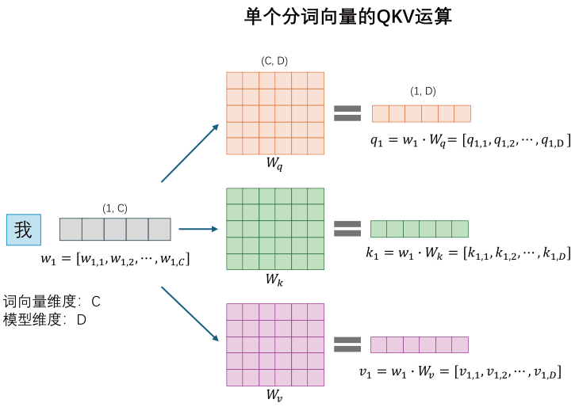
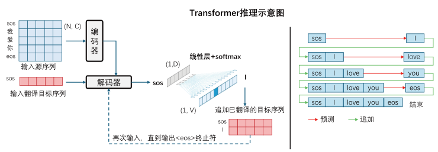

# Transformers

大名鼎鼎的Transformer模型最早是谷歌DeepMind在2017年的论文《Attention Is All You Need》首次提出 Transformer 架构。这篇论文摒弃了传统的循环结构，完全基于注意力机制构建了一个全新的模型架构。本节将详细讲述Transformer模型的架构流程。

## 概述

Transformer广泛应用于seq2seq任务，可以处理一个序列到另一个序列的映射，例如：
- 文本翻译领域：语言A和语言B的相互翻译
- 文本生成领域：大预言模型，ChatGPT等
- 音频处理领域：音频识别和文字转语音
- 序列分类领域：语言情感分析
- 生物医药领域：基因序列、蛋白序列分析

Transformer主要解决了以下问题：

- 传统 RNN 及其变体难以捕捉远距离依赖关系
- 基于自注意力机制，能够并行处理序列中的所有元素，提升了训练速度和效率
- 通过多头注意力、残差连接等缓解梯度消失 / 爆炸问题

## 模型架构

原文中通过一张图清晰地展示了该模型的架构，如图，它主要由编码器和解码器两个部分组成，编码器和解码器又分别是N个相同模块的堆叠。

整个体系实际上是由`多头注意力层`、`残差连接层`、`归一化层`、`前馈网络层`的排列组合构成。

文本信息经过三个阶段的处理：词嵌入编码得到语义信息，位置编码得到位置信息，注意力编码上下文信息，最终将得到一个抽象的，包含了全部语义和上下文信息的向量，通过该向量来预测可能的输出值。

## 前置准备

### 文字嵌入

在处理序列问题时，第一步永远是把序列处理为计算机可以理解的“数字”，对于文本序列就是所谓词嵌入。
假设有输入序列可被分词为$N$，对于其中的每个词，可以将其转变为维度为$C$的嵌入向量$w=[c_1,c_2,\cdots,c_C]$，整个输入序列可以用输入矩阵表示：$W=[w_1,w_2,\cdots,w_N]$

从文本到向量已有很多成熟的模块，且这部分并不是Transformer的核心创新点，在此不做赘述，可以参考本站其它教学学习。

总之，经过文字嵌入后，句子中的每个词将被转化为独特的向量，后续的计算将围绕词向量展开。

### QKV计算
QKV矩阵的计算是注意力的核心，首先说明单个字词的注意力计算，示意图如下：

单个词向量分别乘以权重矩阵 $W_q$、$W_k$、$W_v$，得到 $q_1$、$k_1$、$v_1$这三个新的词向量。可以把它们理解为query、key、和value，其中query编码了要查询的值，key编码了被查询的值，value编码了具体的值；权重矩阵 $W_q$、$W_k$、$W_v$ 是神经网络需要学习训练的部分。

得到query、key、value三个向量后，根据注意力计算公式就可以计算相似度权重，权重代表上下文的每个词对当前词的影响程度，随后再将上下文信息注入原始向量，得到最后的编码向量。

我们利用矩阵运算的性质，将输入的序列的N个词“打包”成一个矩阵，可以同样并行计算所有词的query、key、value向量，而得到了三个新矩阵，分别为Q、K、V矩阵。示意图如下：

在实际工程中，借助GPU强大的并行计算能力，可以很快的计算出所有输入词的QKV矩阵。而且可以发现，需要学习的模型权重 $W_q$、$W_k$、$W_v$ 的形状是 $(C, D)$，分别指词向量维度和模型输出维度，并没有对输入序列长度做约束，借此就可以处理任意序列/可变长序列。

## 注意力计算

在得到QKV矩阵后，就需要进行注意力的计算，实际上计算公式有多种多样，按原论文中的表述，它们使用如下的缩放点积注意力来计算。

### 缩放点积注意力模块

缩放点积注意力算法是自注意力的一种实现形式，它通过如下公式计算：

$$Attention = softmax(\frac{QK^T}{\sqrt{d}})V$$

对于形状为$(N,D)$的QKV矩阵来说，$Q$作为查询矩阵和键矩阵$K$的转置$K^T$做矩阵乘法，计算得到一个$(N,N)$方阵，这个方阵的每个元素表示$q_i - k_j$的相似度，或者说$q_i$受哪个$k_j$的上下文影响最大。

得到$QK^T$方阵后，对每个元素除以$\sqrt{d}$（$d$是键向量的维度D），使得元素更加平缓，因为 Softmax 对大数值敏感，过大的点积会导致 Softmax 输出过于尖锐（只有一个权重接近 1，其余接近 0），缩放后能让注意力更均衡，让模型不会过度聚焦于某一个键，而是广泛的学习全局信息。

最后按行进行$softmax$归一化，把注意力分数变成概率分布，矩阵的每一行概率和为1，这时也相当于每行中的元素是一个权重值，这个权重表示，当前 query 对各个 key 的注意力权重，当前 query 对各个 key 的注意力权重，在后续计算中进行加权求和。

具体的运算过程如下：

计算$Attention$最后一步得，所谓加权求和实际上利用了矩阵乘法的性质，从示意图最右侧可以看出，$softmax \times V$相当于用注意力分数的每一行点乘$V$的每一列，加和作为结果$Res$的值，以第一个元素为例，$Res_{1,1}=a_{1,1} \cdot v_{1,1}+a_{1,2} \cdot v_{2,1}+a_{1,3} \cdot v_{3,1}$，即输出矩阵第一个向量的第一个元素综合考虑了上下文所有词，并按它们的影响程度权重计算，这样新得到的词向量就抽象的融合了上下文信息。

### 多头注意力模块

所谓多头注意力就是将多个注意力层堆叠，如果把单个注意力头类比为一个提取输入数据特征的评委，那么多头注意力就相当于多个评委，每个评委注意不同的侧重点，再将多个评委的意见整合到一起，这样做有利于模型学习到更加丰富的信息。

此时就涉及到头数$h$和单层输出维度$d'$的设置问题，如果输入QKV矩阵依旧是$(N,D)$，那么每个注意力头都会输出一个$(N,D)$矩阵，这时拼接的话就会得到$(N,D \times h )$它的维度将会翻倍，这对硬件有着巨大的挑战，而且参数量暴增容易导致过拟合。

在原论文中，作者设置了头数是$h$，而单个头的输出维度是$d'=\frac{D}{h}$，这里的 $D$ 是单头时的维度。这么做相当于把原先单头注意力的QKV矩阵拆分成$h$等份，经过注意力计算后得到$h$个输出矩阵$(N,\frac{D}{h})$，将每个输出拼接，总维度仍为$D$，在计算量和参数量不变的情况下，很好的做到了多头注意力，采集更丰富的信息。

在实际的操作中，会把QKV矩阵分别经过线性层处理，得到符合形状的$(N,\frac{D}{h})$输入矩阵，再经过注意力公式计算即可。下图是多头注意力的详细示意图：

多头注意力通过**多视角拆分 - 并行计算 - 整合特征**，让模型能同时关注不同子空间的信息（比如有的头关注语法，有的头关注语义），从而学习到更全面的表示，提升模型性能。

### 掩膜注意力模块

上文我们看到，对于一个序列来说，通过几次矩阵运算就可以同时算出所有分词的特征向量，并不需要等待上一个字符生成后再计算下一个字符，这种并行计算方法大大提高了效率。

不过，在训练过程中，我们不能一次性把已知答案所有的上下文全部输入，

现在需要设计一种方法，让序列中字符在被计算后只包含它之前的上下文信息，而不让它提前看到后文，即可使用如下的掩码操作：

在QK矩阵计算相似度时，人为地把结果矩阵的上三角部分设为$- \infty$，这样在经过$softmax$后，上三角部分全变为0，再计算注意力时，可以看到第一个字符“我”向量与矩阵相乘时，后两个字符相似度为0，结果中只包含“我”向量的信息；第二个字符“和”相乘时，只包含“我”、“和”两个字符的信息；最后，“你”字符相乘时，将包含全部上下文信息。

通过这种方法，我们巧妙地生成了每行词向量只包含它上文信息的矩阵，在训练过程中并行地训练模型。

### 交叉注意力模块

核心问题：**如何将输入序列和输出序列对应？**

在上文的讨论中，我们通过编码器得到了包含输入序列上下文信息的矩阵，也得到了包含已经输出序列的上下文信息矩阵，在生成过程中，我们期望设计一个模块，能够根据输入序列和前一步生成的序列，继续生成下一个字符，那这就需要交叉注意力模块，它负责把输入输出相联系。

所谓交叉注意力就是该模块的QKV来自不同的部分，在Transformer里，是用编码器的输出来计算K、V矩阵，用解码器的掩码注意力模块计算Q矩阵，利用Q这三个KV计算注意力，这个注意力的结果就包含了两个序列的相似度权重信息。

**交叉注意力就是要让 “输出序列生成” 既符合 “已生成输出的上下文”，又对齐 “输入序列的语义”。**

例如，编码器得到的$(N,D)$矩阵$H_{enc}$让每个输入词向量带上了输入序列的上下文；解码器掩码注意力输出的$(n,D)$矩阵$H_{dec}$让已生成的$n$个词向量带上了它的上下文；那么交叉注意力的权重矩阵$W_q$、$W_k$、$W_v$的形状都是$(D,D)$，得到QKV是：

$$
\begin{align*}
Q_{dec} &= H_{\text{dec}} \times W_q \quad \text{dim: } (n,D) \times (D,D) \to (n,D) \\
K_{enc} &= H_{\text{enc}} \times W_k \quad \text{dim: } (N,D) \times (D,D) \to (N,D) \\
V_{enc} &= H_{\text{enc}} \times W_v \quad \text{dim: } (N,D) \times (D,D) \to (N,D)
\end{align*}
$$

计算示意图如下：

计算相似度矩阵$Q_{dec} \times K_{enc}^T$，再进行$softmax(Q_{dec}K_{enc}^T)$归一化处理得到：

$$
Q_{dec} \times K_{enc}^T =  
\begin{bmatrix}
q_1     \\
q_2     \\
\vdots  \\
q_n
\end{bmatrix} \times 
\begin{bmatrix}
k_1,k_2,\cdots,k_N
\end{bmatrix} = 
\begin{bmatrix}
q_1 \cdot k_1, &q_1 \cdot k_2, &\cdots, &q_1 \cdot k_N  \\
q_2 \cdot k_1, &q_2 \cdot k_2, &\cdots, &q_2 \cdot k_N  \\
\vdots   &\vdots   &\ddots  &\vdots   \\
q_n \cdot k_1, &q_n \cdot k_2, &\cdots, &q_n \cdot k_N  \\
\end{bmatrix}
$$

最后用$V_{enc}$来计算注意力，相当于加权求和，$Attention=softmax(Q_{dec}K_{enc}^T)V_{enc}$，形状为$(n,D)$。该矩阵的每一行，对应解码器中 “已生成的第 i 个目标词”，而行向量的每一个维度，则融合了编码器中与该目标词语义相关的源序列信息。

后续的流程中，将根据这个向量来预测序列的下一个可能的输出，而交叉注意力模块则是将两个不同来源序列相对应的核心。

**总结**

Transformer所涉及的全部三种注意力机制：

| 注意力类型       | 输入Q      | 输入K,V      | 学习目标         |
| ---------------- | ---------- | ------------ | ---------------- |
| 编码器自注意力   | 输入词自身 | 所有输入词   | 源语言内部关系   |
| 解码器掩码注意力 | 当前输出词 | 已生成输出词 | 目标语言内部关系 |
| 解码器交叉注意力 | 解码器状态 | 编码器输出   | 跨语言对齐映射   |

需要明确的一点是，如果$N=1$的最简化无堆叠的的Transformer将需要$3 \times 3=9$个权重矩阵，编码器多头注意力、解码器掩码注意力、解码器交叉注意力各三个权重矩阵。权重矩阵并不是立刻得到的，而是通过神经网络不断训练优化得到的，最终的训练目的将会使输入经过权重计算后得到的QKV矩阵最能代表我们设定的功能，所求出的注意力也将最能反应序列的上下文信息，而这几个权重则是Transformer的核心！

## Transformer处理流程

了解完Transformer的所有注意力模块后，简略介绍一下模型的其它模以及数据的总体流程图。

### 编码器

1. 对于文本序列来说，将输入序列分词后进行词嵌入，生成的词向量包含语义信息；
2. 通过语义编码（通常是正弦位置编码），此时的词向量包含位置信息。这个位置信息是指这个词在句子中的哪个位置，并不是“上下文的语义”位置；
3. 对词向量分别乘以权重矩阵 $W_q$、$W_k$、$W_v$，得到QKV矩阵，输入多头注意力模块，根据注意力公式计算得到注意力词向量，此时的向量将包含上下文信息，每个向量的值都会受全文中词的影响；
4. 注意力模块的输出会和第二步的输出进行一次残差连接，并计算归一化，残差操作将避免长距离传递的数据稀释；
5. 将归一化矩阵输入一个前馈网络，网络输出和前馈网络输入再进行一次残差连接，其结果进行归一化。前馈层会增强模型的非线性表达能力，增加泛化能力；
6. 步骤3的输入和步骤5的输出矩阵形状一致，因此步骤3~5组成的编码器模块可以首位相连，堆叠N个，在原论文中$N=6$。

### 解码器

解码器部分的处理流程在训练和推理阶段略有不同，在此分两部分讲解。

#### 训练

1. 训练时，每条数据将以 “我爱你” -> "I love you"对应同时输入编码器和解码器，序列`<我爱你>`首尾分别增加起始符`<sos>`和终止符`<eos>`，变成序列`<sos 我 爱 你 eos>`在编码器中生成带上下文语义的向量；
2. 序列`<I love you>`首尾分别增加起始符`<sos>`和终止符`<eos>`，变成序列`<sos I love you eos>`，再经过掩码注意力得到的每一行向量只包含它前面的序列上下文，而屏蔽后文，最终交叉注意力的输出矩阵，维度为 $(n, D)$；
3. 交叉注意力矩阵被送入前馈层，前馈层对矩阵中的每一行（对应目标序列中的每个词向量）独立进行线性变换、激活函数运算等，最终输出的结果维度还是 $(n, D)$；
4. 前馈层的输出经过线性变换和 $Softmax$ 函数，得到每个位置预测下一个词的概率分布，维度是 $(n, V)$，V 是词表大小；
5. 将每个位置的预测结果与真实目标序列中对应位置的词进行比较，使用损失函数并行计算所有位置的损失值，再求和得到总的损失；
6. 反向传播更新权重。

#### 推理

模型训练完成后进行推理，此时只知道输入序列`<我爱你>`，需要模型自己来判断生成序列`<I love you>`，这时需要自回归逐词生成：

1. 序列`<我爱你>`在编码器中生成带上下文语义的向量，此时解码器输入起始符`<sos>`;
2. 起始符`<sos>`经过掩码注意力模块生成序列上下文，当然这里它并没有上文；
3. 两个结果被送入交叉注意模块，计算交叉注意力结果向量，形状为$(1,D)$，该向量包含了输入序列的上下文语意和起始符语义；
4. 经过前馈层得到预测下一个词的向量表示，经过$softmax$层，输出模型所预测的下一个词的概率分布，维度是 $(1, V)$，V 是词表大小。正常情况下，这里将预测得到字符`<I>`；
5. 将预测的词写入序列，得到`<sos I>`，把它再送入解码器的输入端，循环步骤2~4，直到生成终止符。

### 损失函数

最后简要介绍Transformer损失函数的计算方法，在用于seq2seq任务时，最常用是交叉熵损失：

**模型输出结果**

经过Transformer解码器中的前馈网络、线性层和Softmax函数后，会得到每个位置预测下一个词的概率分布。假设目标序列长度为 $n$，词表大小为 $V$，那么预测结果是一个维度为 $(n, V)$ 的矩阵，矩阵中第 $i$ 行第 $j$ 列的元素 $p_{ij}$ ，表示在目标序列的第 $i$ 个位置预测为词表中第 $j$ 个词的概率，**每一行概率最高的那个值将会作为模型的输出词**。

给定的真实目标序列可以表示为一个长度为 $n$ 的向量，每个元素是目标序列中对应位置词在词表中的索引。例如，在机器翻译任务 “我爱你 → I love you” 中，假设 “I” “love” “you” 在词表中的编号分别为 $100$、$110$、$120$，真实目标序列向量就是 $[100, 110, 120]$ 。
 
**单个位置的交叉熵损失**

以目标序列第 $i$ 个位置为例，预测的概率分布为 $P_i = [p_{i1}, p_{i2}, \cdots, p_{iV}]$ ，设真实词的索引为 $y_i$ ，预测词的索引为 $x_i$ ，起初可能出现真实词和预测此不一致的情况。

我们根据真实词的索引取出它对应位置的概率值 $p_{iy_i}$ ，则该位置的交叉熵损失 $L_i$ 为：

$$
L_i = -\log(p_{iy_i})
$$

这意味着模型预测真实词的概率越高，该位置的损失值就越低。训练的过程就是让模型预测的最大概率词和真实词更加接近。

**平均交叉熵损失**

最后，将目标序列所有位置的交叉熵损失求和，再除以序列长度 $n$ ，得到平均交叉熵损失，即训练时使用的损失值 $L$ ：

$$
L = -\frac{1}{n}\sum_{i = 1}^{n}\log(p_{iy_i})
$$

**举例说明**

假设目标序列长度 $n = 3$，词表大小 $V = 10$，模型预测结果为：
$$
\begin{bmatrix}
0.1 & 0.2 & 0.3 & 0.05 & 0.05 & 0.1 & 0.05 & 0.05 & 0.05 & 0.05 \\
0.05 & 0.1 & 0.2 & 0.3 & 0.05 & 0.05 & 0.1 & 0.05 & 0.05 & 0.05 \\
0.05 & 0.05 & 0.1 & 0.2 & 0.3 & 0.05 & 0.05 & 0.1 & 0.05 & 0.05
\end{bmatrix}
$$

给定的真实目标序列为 $[1, 3, 4]$ （词表索引从 $0$ 开始），那么：

 - 矩阵第一行是模型预测的在该位置最可能输出词表中的哪个词。已知应该输出的真实词对应索引`1`，概率为$0.2$，但模型预测的最大概率词对应索引`2`，概率为$0.3$，因此我们要加损失，调整模型参数；该位置的损失为： $L_1 = -\log(0.2)$；
 - 第 $2$ 个位置损失 $L_2 = -\log(0.3)$，同理，但这一行模型正确的预测到了词表中第四个值出现的概率最大；
 - 第 $3$ 个位置损失 $L_3 = -\log(0.3)$，同理。

平均交叉熵损失 $L = -\frac{1}{3} \times (-\log(0.2) - \log(0.3) - \log(0.3))$ 

通过计算损失，利用反向传播算法将损失值反向传播到整个Transformer模型，更新模型中的可训练参数，使模型预测结果不断接近真实目标序列，提升模型性能。在实际应用中，还可能结合一些正则化方法（如L1、L2正则化）来防止模型过拟合，进一步优化训练效果。 