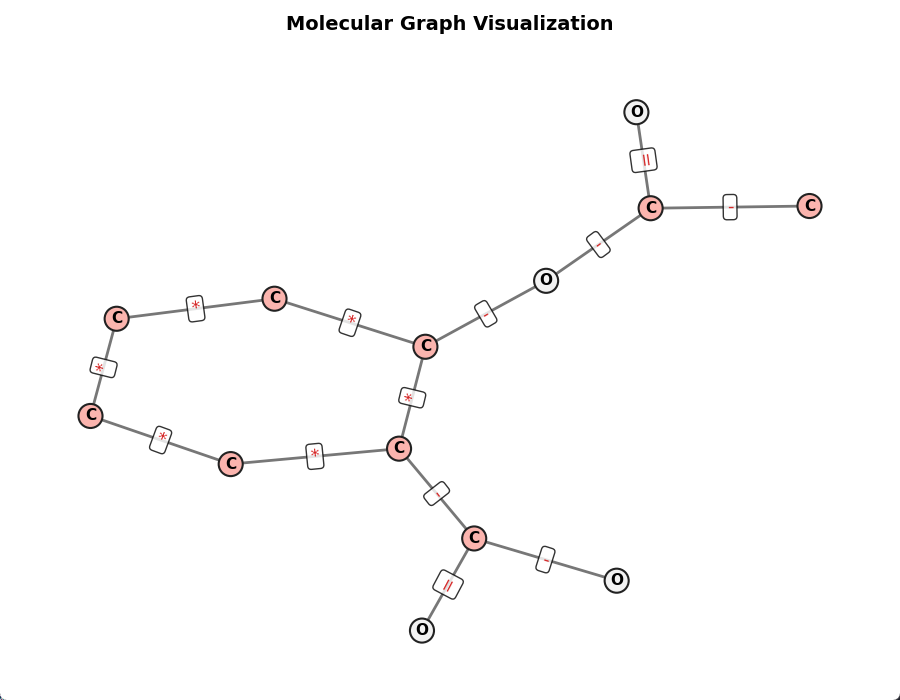

# 基于GCN的分子性质预测

前文讲到图数据天然适合描述分子的二维结构数据，本文将使用ZNIC数据集实现一个分子性质预测模型，以下是代码详解。

## 项目目录

本项目的目录结构如下：

```
GCN Molecular Property/
├── data/               # 数据集文件
│   └── ECOL.csv
├── result/             # 结果目录
│   ├── model.pth   # 模型权重
│   └── losses.csv      # 平均损失记录
├── ChemGraph.py        # 化学结构转换工具
├── config.py           # 超参数配置文件
├── dataset.py          # 加载数据集
├── GCNModel.py         # GCN模块
├── predict.py          # 推理预测代码
└── train.py            # 训练代码
```

## 超参数配置

这里主要设置了数据集文件路径和模型权重保存路径，批次大小、训练轮数、学习率等。其中最主要的是节点向量维度`N_DIM`，该值必须和`graph`中的节点向量维度一致，在不同的学习任务中可能会选择不同的原子节点属性，这会造成节点维度的变化，需要特别注意输入参数的一致性。

以下代码在`config.py`中实现：
```python
import torch
import torch.nn as nn

# 设备
DEVICE = "cuda" if torch.cuda.is_available() else "cpu"

# 数据集路径
DELANEY_FILE = "./data/ZINC.csv"
# 权重保存文件
PT_PATH = "./result/model.pth"
# 损失保存路径
LOSS_PATH = "./result/losses.csv"

# 节点特征向量维度
N_DIM = 22
# 批次大小
BATCH_SIZE = 32
# 训练轮数
EPOCH = 200
# 学习率
LR = 5e-3
```

## 化学结构工具


以下代码在`ChemGraph.py`中实现：

为了将化学结构转变为计算机可以理解的数据，需要借助RDkit库和PyG库，将mol对象变为图结构，构建的图数据包含节点特征、边索引、边特征三个张量。

```python
from rdkit import Chem
from rdkit.Chem import rdchem
import numpy as np
import torch
from torch_geometric.data import Data

import networkx as nx
import matplotlib.pyplot as plt

ATOM_TYPE = ('C', 'O', 'N','H', 'P', 'S',  'F', 'Cl', 'Br', 'I', 'UNK')
ATOM_LEN = len(ATOM_TYPE)
HYBRIDS = (
            Chem.rdchem.HybridizationType.SP,
            Chem.rdchem.HybridizationType.SP2,
            Chem.rdchem.HybridizationType.SP3,
            Chem.rdchem.HybridizationType.SP3D,
            Chem.rdchem.HybridizationType.SP3D2,
            'UNK'
        )
HYB_LEN = len(HYBRIDS)
BIND_TYPE = (
    rdchem.BondType.SINGLE,
    rdchem.BondType.DOUBLE,
    rdchem.BondType.TRIPLE,
    rdchem.BondType.AROMATIC
)
BIND_LEN = len(BIND_TYPE)
```

接受smiles式输出图数据
```python
# 从分子生成图
def mol_to_graph(mol: rdchem.Mol) -> Data:
    nodes_features = []
    for atom in mol.GetAtoms():
        node = []
        # 原子类型编码
        atom_hot = [0] * ATOM_LEN
        atom_symbol = atom.GetSymbol() if atom.GetSymbol() in ATOM_TYPE else 'UNK'
        idx = ATOM_TYPE.index(atom_symbol)
        atom_hot[idx] = 1

        # 原子杂化编码
        hyb_hot = [0] * HYB_LEN
        hyb = atom.GetHybridization() if atom.GetHybridization() in HYBRIDS else "UNK"
        idx = HYBRIDS.index(hyb)
        hyb_hot[idx] = 1

        other_feats = [
                float(atom.GetIsAromatic()),    # 芳香族（布尔转0/1）
                atom.GetTotalValence(),         # 总价电子数
                atom.GetDegree(),               # 配位数
                atom.GetFormalCharge(),         # 形式电荷
                atom.GetNumRadicalElectrons()   # 自由基电子数
            ]
        node = atom_hot+hyb_hot+other_feats
        nodes_features.append([float(f) for f in node])
    x = torch.tensor(nodes_features, dtype=torch.float)

    # 边索引和边特征
    edge_indices = []
    edge_features = []
    for bond in mol.GetBonds():
        u, v = bond.GetBeginAtomIdx(), bond.GetEndAtomIdx() 
        # 无向图双向边
        edge_indices.extend([[u, v], [v, u]]) 
        
        bond_type = bond.GetBondType()
        # 独热编码键类型：[单键, 双键, 三键, 芳香键]
        bind_hot = [0] * BIND_LEN
        idx = BIND_TYPE.index(bond_type)
        bind_hot[idx] = 1
        # 双向边特征相同
        edge_features.extend([bind_hot,bind_hot])  

    edge_index = torch.tensor(edge_indices, dtype=torch.long).t().contiguous()
    edge_attr = torch.tensor(edge_features, dtype=torch.float)
    
    return Data(
        x=x,                                # 节点特征
        edge_index=edge_index,              # 边索引
        edge_attr=edge_attr,                # 边特征
        num_nodes=mol.GetNumAtoms()         # 节点数
    )
```

从图数据还原为mol对象
```python
# 从图还原分子
def graph_to_mol(graph: Data) -> rdchem.Mol:
    # 初始化分子
    mol = Chem.RWMol()

    # 遍历节点
    for node in graph.x.numpy():
        # 前 ATOM_LEN 为原子序数
        atom_type_idx = np.argmax(node[:ATOM_LEN])
        atom_symbol = ATOM_TYPE[atom_type_idx]
        if atom_symbol == 'UNK':
            # 未知原子默认用碳替代
            atom_symbol = 'C'  
        atom = Chem.Atom(atom_symbol)

        # 杂化类型
        hyb_start = ATOM_LEN
        hyb_end = hyb_start + HYB_LEN
        hyb_idx = np.argmax(node[hyb_start:hyb_end])
        hybrid_type = HYBRIDS[hyb_idx]
        if hybrid_type != 'UNK':
            atom.SetHybridization(hybrid_type)
        
        # 解析芳香性
        is_aromatic = bool(round(node[hyb_end]))
        atom.SetIsAromatic(is_aromatic)
        
        # 添加原子到分子
        mol.AddAtom(atom)

    edges_index = graph.edge_index.T.numpy()
    edges_type = graph.edge_attr.numpy()

    for i in range(len(edges_index)//2):
        u, v = edges_index[2*i][0], edges_index[2*i][1]
        bind_type = BIND_TYPE[np.argmax(edges_type[2*i])]
        mol.AddBond(int(u), int(v), bind_type)

    try:  
        # 校验并修复分子（如价态、隐式氢）
        Chem.SanitizeMol(mol)
        mol.UpdatePropertyCache(strict=False) 
    except Exception as e:
        print(f"分子修正警告：{e}，返回未修正分子")
    
    return mol
```

可视化展示生成的图数据，同时显示节点元素符号、连接状态和边特征（成键类型）
```python
# 分子图可视化函数
def visualize_molecule(pyg_graph, figsize=(9, 7)):
    # 构建NetworkX图并提取唯一边（去重双向边）
    G = nx.Graph()
    G.add_nodes_from(range(pyg_graph.num_nodes))
    edges = list(zip(pyg_graph.edge_index[0].numpy(), pyg_graph.edge_index[1].numpy()))
    unique_edges = []
    seen = set()
    for u, v in edges:
        if (u, v) not in seen and (v, u) not in seen:
            seen.add((u, v))
            unique_edges.append((u, v))
    G.add_edges_from(unique_edges)
    
    # 节点配置：原子序数作为标签，颜色/大小区分原子类型
    node_labels = {}
    node_colors = []
    for i, node in enumerate(pyg_graph.x.numpy()):
        index = np.argmax(node[:ATOM_LEN])
        atom_symbol = ATOM_TYPE[index]

        node_labels[i] = atom_symbol
        atom_number = Chem.Atom(atom_symbol).GetAtomicNum()
        node_colors.append(atom_number)

    
    # 边配置：从edge_attr（独热编码）解析键类型
    bond_symbols = ['-', '=', '≡', '*']
    edge_labels = {}
    for i, (u, v) in enumerate(unique_edges):
        bond_feat = pyg_graph.edge_attr[i * 2].numpy()
        bond_idx = bond_feat.argmax()
        edge_labels[(u, v)] = bond_symbols[bond_idx]
    
    # 布局选择：根据分子结构自动适配
    # 判断是否含环（简单规则：存在节点度数≥3）
    has_ring = any(G.degree(node) >= 3 for node in G.nodes)
    if has_ring:
        pos = nx.kamada_kawai_layout(G, scale=3)
    else:
        pos = nx.spring_layout(G, seed=42, k=2.0, iterations=100)
    
    # 绘制图形
    fig, ax = plt.subplots(figsize=figsize)
    
    # 绘制边
    nx.draw_networkx_edges(
        G, pos, ax=ax,
        edge_color='#555555', width=2, alpha=0.8
    )
    
    # 绘制节点
    scatter = nx.draw_networkx_nodes(
        G, pos, ax=ax,
        node_color=node_colors, 
        cmap=plt.cm.Pastel1, edgecolors='#222222', linewidths=1.5
    )
    
    # 绘制节点标签（原子序数）
    nx.draw_networkx_labels(
        G, pos, ax=ax, labels=node_labels,
        font_size=11, font_weight='bold',
        
    )
    
    # 绘制边标签（键类型）
    nx.draw_networkx_edge_labels(
        G, pos, ax=ax, edge_labels=edge_labels,
        font_size=13, font_color='#D62828',
        bbox=dict(boxstyle='round,pad=0.2', facecolor='white', alpha=0.8)
    )
    
    # 美化设置
    ax.set_title('Molecular Graph Visualization', fontsize=14, fontweight='bold', pad=20)
    ax.axis('off')  # 隐藏坐标轴
    plt.tight_layout()
    plt.show()
```

最后编写测试模块，将阿司匹林分子smiles式转为图，并显示图结构。
```python

if __name__ == '__main__':
    smiles = "CC(=O)OC1=CC=CC=C1C(=O)O"
    mol = Chem.MolFromSmiles(smiles)

    G = mol_to_graph(mol)
    visualize_molecule(G)
    new_smiles = graph_to_mol(G)
    print("new smiles:", Chem.MolToSmiles(new_smiles))
```

下图展示的阿司匹林分子图可视化，观察边属性和节点属性和分子信息一致：


## 加载数据集

以下代码在`dataset.py`中实现：

需要导入csv文件中的数据，生成mol对象，选择需要的数据，构造新的df对象。
```python
import pandas as pd
from rdkit import Chem
import torch
from torch.utils.data import Subset
from torch_geometric.loader import DataLoader
from torch_geometric.data import Dataset
from ChemGraph import mol_to_graph
from config import *

# 选择要学习预测的指标
TASK = 'logP'
# 读取数据集csv文件
df = pd.read_csv(DELANEY_FILE)
# 将smiles转为rdkit的mol对象
df["mol"] = df["SMILES"].apply(lambda x: Chem.MolFromSmiles(x))
# 去除转化失败的空值
df = df[df["mol"].notna()]
# 选择属性构造新列表
df = df[["ZINC ID", "SMILES", TASK,"mol"]]
# 预计算所有graph
if "graph" not in df.columns:
    df["graph"] = df["mol"].apply(lambda x: mol_to_graph(x))
    # 过滤转换失败的样本（若有）
    df = df[df["graph"].notna()].reset_index(drop=True)
```

定义MolGraphDataset，继承Data类，并实现get方法。加载后的数据集应该包含节点特征向量、边索引张量、边属性张量、化学性质张量。
```python
# 数据类，继承Dataset
class MolGraphDataset(Dataset):
    # 初始化方法需传入df对象、mol对象列名、选择的属性、转换函数
    def __init__(self, df,  # df对象
        mol_col="mol",      # mol对象所在列名
        target_col=TASK,    # 选择要学习的属性列
        transform_fn=None   # 预处理函数
        ):
        super().__init__()
        self.df = df
        self.mol_col = mol_col
        self.target_col = target_col
        self.transform_fn = transform_fn
    # len方法
    def len(self):
        return len(self.df)
    # get方法
    def get(self, idx):
        row = self.df.iloc[idx]
        mol = row[self.mol_col]
        try:
            G = row["graph"]
            # 在graph中增加要学习的性质张量
            if self.target_col is not None:
                target = torch.tensor([row[self.target_col]], dtype=torch.float)
                G.y = target
            return G
        except:
            return None
```

随后实例化数据类，设置划分比例和随机种子，将数据集随即划分为训练集/测试集，生成DataLoader可迭代对象。
```python
# 初始化完整的分子图数据集
full_dataset = MolGraphDataset(
    df=df,
    mol_col="mol",
    target_col=TASK,
)
data_size = len(full_dataset)

# 划分比例
test_ratio = 0.10
# 测试集大小
test_size = int(data_size * test_ratio)
# 训练集大小
train_size = data_size - test_size

# 生成随机打乱的索引
random_seed = 42
torch.manual_seed(random_seed)
indices = torch.randperm(data_size)

# 分割为训练集和测试集索引
train_indices = indices[:train_size]
test_indices = indices[train_size:]

# 用Subset构建训练集和测试集
train_dataset = Subset(full_dataset, train_indices)
test_dataset = Subset(full_dataset, test_indices)

# 构建数据加载器
train_loader = DataLoader(
    train_dataset,
    batch_size=BATCH_SIZE,
    shuffle=True,       # 训练集打乱
    drop_last=False,    # 不丢弃最后一个不足批次的数据
    num_workers=0,      # 多进程加载
    pin_memory=True     # 加速传输
)
test_loader = DataLoader(
    test_dataset,
    batch_size=BATCH_SIZE,
    shuffle=False,      # 测试集不打乱
    drop_last=False,
    num_workers=0,
    pin_memory=True
)
```

经过`DataLoader`打包后，节点特征`x`会被纵向拼接`[总节点数, 节点特征维度]` ；

边索引 `edge_index` 会被调整偏移量后拼接`[2，总边数]`，确保不同图的边索引不冲突；

边属性 `edge_attr` 会变成`[总边数，边特征维度]`；

每个图的标签 `y` 会被保存在 `Batch.y` 中`[批大小, 标签维度]`。

单元模块测试，输出数据集的基本信息。
```python
if __name__ == '__main__':
    print(f"Number of molecules in the dataset: {df.shape[0]}")
    print(df.head())
    print(f"完整数据集大小: {data_size}")
    print(f"训练集大小: {len(train_dataset)}, 测试集大小: {len(test_dataset)}")
    print("验证训练集批次：")
    for batch in train_loader:
        print(f"节点特征形状: {batch.x.shape}")
        print(f"标签形状: {batch.y.shape}")
        print(f"边索引形状: {batch.edge_index.shape}")
        print(f"边属性形状: {batch.edge_attr.shape}")
        break
```

输出内容如下：
```bash
Number of molecules in the dataset: 1128
  Compound ID                                             SMILES   logS                                                mol                                              graph
0   Amigdalin  OCC3OC(OCC2OC(OC(C#N)c1ccccc1)C(O)C(O)C2O)C(O)... -0.974  <rdkit.Chem.rdchem.Mol object at 0x00000217ADB...  [(x, [tensor([0., 1., 0., 0., 0., 0., 0., 0., ...
1    Fenfuram                             Cc1occc1C(=O)Nc2ccccc2 -2.885  <rdkit.Chem.rdchem.Mol object at 0x00000217ADB...  [(x, [tensor([1., 0., 0., 0., 0., 0., 0., 0., ...
2      citral                               CC(C)=CCCC(C)=CC(=O) -2.579  <rdkit.Chem.rdchem.Mol object at 0x00000217ADB...  [(x, [tensor([1., 0., 0., 0., 0., 0., 0., 0., ...
3      Picene                 c1ccc2c(c1)ccc3c2ccc4c5ccccc5ccc43 -6.618  <rdkit.Chem.rdchem.Mol object at 0x00000217ADB...  [(x, [tensor([1., 0., 0., 0., 0., 0., 0., 0., ...
4   Thiophene                                            c1ccsc1 -2.232  <rdkit.Chem.rdchem.Mol object at 0x00000217ADB...  [(x, [tensor([1., 0., 0., 0., 0., 0., 0., 0., ...
完整数据集大小: 1128
训练集大小: 1016, 测试集大小: 112
验证训练集批次：
节点特征形状: torch.Size([833, 22])
标签形状: torch.Size([64])
边索引形状: torch.Size([2, 1740])
边属性形状: torch.Size([1740, 4])
```

## 模型定义

以下代码在`GCNModel.py`中实现：

利用GCN图卷积模块构建预测网络，为了快速入门测试，这个简单的GCN模块没有融合边的特征。
```python
import torch.nn as nn
from torch_geometric.nn.conv import GCNConv
from torch_geometric.nn.pool import global_mean_pool

class GCNModel(nn.Module):
    def __init__(self, ndim, hidden_dims, dropout=0.2):
        super(GCNModel, self).__init__()
        dims = [ndim] + hidden_dims
        # 存储所有GCNConv层
        self.convs = nn.ModuleList()        
        # 存储所有激活层
        self.acts = nn.ModuleList()       
        # 存储所有Dropout层
        self.dropouts = nn.ModuleList()     
        # 归一化层
        self.bn = nn.BatchNorm1d(dims[0])

        for i in range(len(dims)-1):
            self.convs.append(GCNConv(dims[i], dims[i+1]))
            self.acts.append(nn.ReLU())
            self.dropouts.append(nn.Dropout(dropout))
        # 线性层
        self.fc = nn.Linear(dims[-1], 1)

    def forward(self, data):
        out = self.bn(data.x)
        edge_index = data.edge_index.long()

        # 逐层调用，显式传递edge_index给GCNConv
        for conv, act, dropout in zip(self.convs, self.acts, self.dropouts):
            # GCNConv层
            out = conv(out, edge_index)  
            # ReLU层
            out = act(out)          
            # Dropout层
            out = dropout(out)           

        out = global_mean_pool(out, data.batch)
        return self.fc(out)
```

测试模块
```python
if __name__ == '__main__':
    from config import *
    model = GCNModel(ndim=N_DIM, hidden_dims=[128, 64, 32])
    model = model.to(DEVICE)
    model = model.float()
    optimizer = torch.optim.Adam(model.parameters(), lr=LR)
    criterion = nn.MSELoss()
    print("Number of trainable parameters:",
        sum(p.numel() for p in model.parameters() if p.requires_grad))
    print(model)
```

打印的模型结构信息：
```bash
Number of trainable parameters: 13357
GCNModel(
  (bn): BatchNorm1d(22, eps=1e-05, momentum=0.1, affine=True, track_running_stats=True)
  (net): Sequential(
    (0): GCNConv(22, 128)
    (1): ReLU()
    (2): GCNConv(128, 64)
    (3): ReLU()
    (4): GCNConv(64, 32)
    (5): ReLU()
  )
  (fc): Linear(in_features=32, out_features=1, bias=True)
)
```

## 训练模型

以下代码在`train.py`中实现：
```python
import numpy as np
import matplotlib.pyplot as plt
from tqdm import tqdm
import torch
import torch.nn as nn

from dataset import *
from ChemGraph import *
from GCNModel import *
from config import *

# 训练周期
def train_epoch(model, criterion, optimizer, dataloader):
    losses = []
    # 训练模式
    model.train()
    for G in dataloader:
        G = G.to(DEVICE, non_blocking=True)
        # 获取属性标签
        y_true = G.y
        # 清空梯度
        optimizer.zero_grad()
        # 生成模型预测值
        y_pred = model(G)
        # 计算损失函数
        loss = criterion(y_pred, y_true.reshape(y_pred.shape))
        # 反向传播
        loss.backward()
        # 更新权重
        optimizer.step()
        # 记录损失值
        losses.append(loss.cpu().detach().item())
    return losses

# 测试周期
def val_epoch(model, criterion, dataloader):
    losses = []
    # 评估模式
    model.eval()
    # 关闭梯度更新
    with torch.no_grad():
        for G in dataloader:
            G = G.to(DEVICE, non_blocking=True)
            # 真实值
            y_true = G.y
            # 模型预测值
            y_pred = model(G)
            # 计算误差
            loss = criterion(y_pred, y_true.reshape(y_pred.shape))
            # 记录损失
            losses.append(loss.cpu().detach().item())
    return losses
```

正式训练部分，模型的训练和评估同时进行：
```python
if __name__ == '__main__':
    # 模型初始化
    model = GCNModel(ndim=N_DIM, hidden_dims=[128, 64, 32])
    # 迁移设备
    model.to(DEVICE)
    # 确保模型参数为float类型
    model = model.float()
    # 优化器
    optimizer = torch.optim.Adam(model.parameters(), lr=LR)
    # 均方差损失函数
    criterion = nn.MSELoss()
    # 训练误差
    train_loss = []
    # 评估误差
    val_loss = []
    # 初始化进度条
    loss_dict = {"avg_train_loss":0,"avg_val_loss":0}
    pbar = tqdm(
        range(1, EPOCH+1), 
        desc="Epoch", 
        leave=True, 
        postfix=loss_dict,
        dynamic_ncols=True
    )
    # 训练循环
    for epoch in pbar:
        # 训练并更新权重
        losses = train_epoch(model, criterion, optimizer, train_loader)
        avg_train_loss = np.mean(losses)
        train_loss.append(avg_train_loss)
        # 评估
        losses = val_epoch(model, criterion, test_loader)
        avg_val_loss = np.mean(losses)
        val_loss.append(avg_val_loss)
        # 更新进度条参数
        loss_dict["avg_train_loss"] = avg_train_loss
        loss_dict["avg_val_loss"] = avg_val_loss
        pbar.set_postfix(loss_dict)
    # 保存模型
    torch.save(model.state_dict(), PT_PATH)
    print("\n训练完成！模型权重已保存为:", PT_PATH)

    # 保存每轮损失
    import pandas as pd
    df = pd.DataFrame({
        'Epoch': range(1, len(train_loss) + 1),
        'Training Loss': train_loss,
        'Test Loss': val_loss
    })
    df.to_csv(LOSS_PATH, index=False)

    # 展示损失函数
    f, ax = plt.subplots(1, 1, figsize=(5,5))
    ax.plot(train_loss, c="blue", label="Training")
    ax.plot(val_loss, c="red", label="Test")
    plt.xlabel("Epoch")
    plt.ylabel("Loss")
    plt.legend()
    plt.show()

```

整个训练过程的输出如下：
```bash
Epoch: 100%|██████| 200/200 [00:30<00:00,  6.58it/s, avg_train_loss=0.542, avg_val_loss=0.508]

训练完成！模型权重已保存为: ./result/model.pth
```

采样两种模型训练后的全程平均误差曲线图：


## 预测模型

最后实现一个单输入预测函数，利用训练好的模型对给定smiles分子进行性质预测。

以下代码实现在`predict.py`中：
```python
from rdkit import Chem
import torch

from ChemGraph import *
from config import *
from GCNModel import *

# 单输入预测
def predict(smiles, model, transform_fn, device):
    # 将SMILES转换为RDKit的Mol对象
    mol = Chem.MolFromSmiles(smiles)
    if mol is None:
        print(f"SMILES {smiles} 无效，无法转换为分子！")
        return None
    # 转换为PyG的Data对象（同训练时的处理）
    data = transform_fn(mol)
    data = data.to(device)
    # 前向传播预测
    with torch.no_grad():
        prediction = model(data)
    # 返回预测值（转换为numpy或Python数值）
    return prediction.cpu().numpy()[0, 0]

if __name__ == '__main__':
    model = GCNModel(ndim=N_DIM, hidden_dims=[128, 64, 32])
    model = model.to(DEVICE)
    model = model.float()
    model.load_state_dict(torch.load(PT_PATH, map_location=DEVICE))
    model.eval()

    smiles = "COC"
    prediction = predict(
        smiles=smiles,
        model=model,
        transform_fn=mol_to_graph,
        device=DEVICE
    )

    print(f"分子 {smiles} ；预测性质值为: {prediction:.4f}")
```

模型的输出值：

```bash
分子 COC ；预测性质值为: 0.2920
```