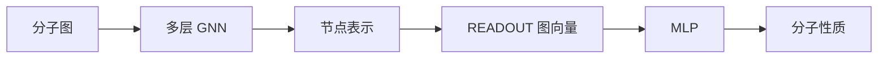

# 常见图神经网络

图神经网络的核心思想是**一个节点的表示不仅由自身特征决定，还由邻居节点和边关系共同决定**。在第 $t$ 层中，节点 $v$ 的表示记为$h_v^{(t)}$，一层图神经网络通常可以拆成三个步骤：1) 生成边消息；2) 聚合邻居消息；3) 更新节点表示。大多数 GNN 都可以写成消息传递形式：

$$
m_{u \to v}^{(t)}
= \phi_m
\left(
h_u^{(t)}, h_v^{(t)}, e_{uv}
\right)
$$

其中 $m_{u \to v}^{(t)}$ 表示节点 $u$ 传给节点 $v$ 的消息，$e_{uv}$ 是边特征。

对节点 $v$ 的所有邻居消息进行聚合：

$$
m_v^{(t)}
= \operatorname{AGG}
\left(
\{m_{u \to v}^{(t)}: u \in \mathcal{N}(v)\}
\right)
$$

再更新节点表示：

$$
h_v^{(t+1)}
= \phi_u
\left(
h_v^{(t)}, m_v^{(t)}
\right)
$$

其中：

| 符号 | 含义 |
| --- | --- |
| $\mathcal{N}(v)$ | 节点 $v$ 的邻居集合 |
| $\phi_m$ | 消息函数，通常是线性层或 MLP |
| $\operatorname{AGG}$ | 聚合函数，如求和、平均、最大值。聚合函数必须对邻居顺序不敏感。因为图中邻居没有固定顺序，所以常用：$\operatorname{sum},\quad \operatorname{mean},\quad \operatorname{max}$ |
| $\phi_u$ | 更新函数，通常是线性层、MLP、GRU 等 |


## GCN

GCN 即图卷积网络。它可以看作在图结构上的卷积操作：**节点从邻居接收信息，并用节点度进行归一化**。

设加入自环后的邻接矩阵为：

$$
\hat{A} = A + I
$$

其中 $A$ 是邻接矩阵，$I$ 是单位矩阵。对应的度矩阵为：

$$
\hat{D}_{ii} = \sum_j \hat{A}_{ij}
$$

GCN 的矩阵形式为：

$$
H^{(t+1)}
= \sigma
\left(
\hat{D}^{-\frac{1}{2}}
\hat{A}
\hat{D}^{-\frac{1}{2}}
H^{(t)}W^{(t)}
\right)
$$

其中：

| 符号 | 含义 |
| --- | --- |
| $H^{(t)}$ | 第 $t$ 层所有节点表示组成的矩阵 |
| $W^{(t)}$ | 第 $t$ 层可学习参数 |
| $\sigma$ | 非线性激活函数 |
| $\hat{D}^{-\frac{1}{2}}\hat{A}\hat{D}^{-\frac{1}{2}}$ | 对邻居消息做对称归一化 |

写成单个节点的形式：

$$
h_v^{(t+1)}
= \sigma
\left(
\sum_{u \in \mathcal{N}(v) \cup \{v\}}
\frac{1}{\sqrt{\hat{d}_u\hat{d}_v}}
W^{(t)}h_u^{(t)}
\right)
$$

这里的 $\hat{d}_u$ 和 $\hat{d}_v$ 是加入自环后的节点度。

GCN 适合处理同质图、节点分类、图分类等任务。它的结构简洁，但当网络层数太深时，节点表示可能变得过于相似，这称为过平滑。

## GraphSAGE

GraphSAGE 的核心思想是采样和聚合。它不一定聚合全部邻居，而是可以采样一部分邻居，因此更适合大规模图。

先聚合邻居：

$$
m_v^{(t)}
= \operatorname{AGG}^{(t)}
\left(
\{h_u^{(t)}: u \in \mathcal{N}(v)\}
\right)
$$

再把自身表示和邻居表示拼接：

$$
h_v^{(t+1)}
= \sigma
\left(
W^{(t)}
\left[
h_v^{(t)} \| m_v^{(t)}
\right]
\right)
$$

其中 $\|$ 表示向量拼接。

GraphSAGE 常见聚合方式：

| 聚合器 | 表达式 | 说明 |
| --- | --- | --- |
| Mean | $\frac{1}{|\mathcal{N}(v)|}\sum_{u \in \mathcal{N}(v)}h_u$ | 简单平均 |
| Max Pooling | $\max(\operatorname{MLP}(h_u))$ | 先变换再取最大值 |
| LSTM | $\operatorname{LSTM}(\{h_u\})$ | 表达能力强，但需要处理顺序 |

GraphSAGE 适合节点数量很大、无法一次读取完整邻接矩阵的场景，例如社交网络、推荐系统和大规模知识图谱。

## GIN

GIN 的全称是 Graph Isomorphism Network。它的设计目标是增强 GNN 区分不同图结构的能力。

GIN 的节点更新公式为：

$$
h_v^{(t+1)}
= \operatorname{MLP}^{(t)}
\left(
(1+\epsilon^{(t)})h_v^{(t)}
+ \sum_{u \in \mathcal{N}(v)}h_u^{(t)}
\right)
$$

其中 $\epsilon^{(t)}$ 可以是可学习参数，也可以是固定常数。

GIN 使用求和聚合，是因为求和比平均或最大值更容易保留邻居多重集合的信息。

例如两个节点的邻居特征分别为：

$$
\{1, 1, 2\}
$$

和：

$$
\{1, 2, 2\}
$$

如果使用平均值，两者可能更难区分；而求和可以保留更多数量信息。

GIN 常用于图分类任务，例如分子性质预测。因为分子性质往往与局部子结构密切相关，而 GIN 对结构差异比较敏感。

## GAT

GAT 的全称是 Graph Attention Network，即图注意力网络。它的核心思想是：不同邻居对中心节点的重要性不同，因此应该学习注意力权重。

先对节点特征做线性变换：

$$
z_v^{(t)} = W^{(t)}h_v^{(t)}
$$

对边 $(u,v)$ 计算注意力打分：

$$
e_{uv}^{(t)}
= \operatorname{LeakyReLU}
\left(
a^T[z_u^{(t)} \| z_v^{(t)}]
\right)
$$

其中 $a$ 是可学习注意力向量。

再对节点 $v$ 的所有邻居进行 softmax 归一化：

$$
\alpha_{uv}^{(t)}
=
\frac{
\exp(e_{uv}^{(t)})
}{
\sum_{k \in \mathcal{N}(v)}
\exp(e_{kv}^{(t)})
}
$$

最后聚合邻居表示：

$$
h_v^{(t+1)}
= \sigma
\left(
\sum_{u \in \mathcal{N}(v)}
\alpha_{uv}^{(t)}z_u^{(t)}
\right)
$$

GAT 可以扩展为多头注意力：

$$
h_v^{(t+1)}
=
\mathop{\|}_{k=1}^{K}
\sigma
\left(
\sum_{u \in \mathcal{N}(v)}
\alpha_{uv}^{(t,k)}W^{(t,k)}h_u^{(t)}
\right)
$$

其中 $K$ 是注意力头数量。

GAT 适合邻居重要性差异明显的图，例如社交关系图、知识图谱和分子图中不同化学环境的重要性判断。

## MPNN

MPNN 的全称是 Message Passing Neural Network。它是一类更通用的消息传递模型，很多分子图神经网络都可以归入 MPNN 框架。

边消息为：

$$
m_{u \to v}^{(t)}
= M_t
\left(
h_u^{(t)}, h_v^{(t)}, e_{uv}
\right)
$$

节点聚合为：

$$
m_v^{(t)}
=
\sum_{u \in \mathcal{N}(v)}
m_{u \to v}^{(t)}
$$

节点更新为：

$$
h_v^{(t+1)}
= U_t
\left(
h_v^{(t)}, m_v^{(t)}
\right)
$$

图级读出为：

$$
\hat{y}
= R
\left(
\{h_v^{(T)}: v \in V\}
\right)
$$

其中 $M_t$、$U_t$、$R$ 都可以由神经网络实现。

在分子任务中，边特征 $e_{uv}$ 通常包括键类型、是否芳香、是否共轭、是否在环中等信息。因此 MPNN 比只使用邻接关系的 GCN 更适合表达化学键差异。

## SchNet

SchNet 是一种面向原子体系的连续滤波卷积网络，常用于分子能量、原子力、量子化学性质预测等任务。与普通 GNN 只使用离散边不同，SchNet 直接使用原子间距离构造连续滤波器，因此适合处理三维分子结构。

设第 $i$ 个原子的坐标为：

$$
r_i \in \mathbb{R}^3
$$

原子间距离为：

$$
d_{ij} = \|r_i-r_j\|_2
$$

SchNet 的核心更新可以写成：

$$
h_i^{(t+1)}
= h_i^{(t)}
+ \sum_{j \in \mathcal{N}(i)}
h_j^{(t)} \odot W^{(t)}(d_{ij})
$$

其中：

| 符号 | 含义 |
| --- | --- |
| $h_i^{(t)}$ | 第 $t$ 层中原子 $i$ 的隐藏表示 |
| $d_{ij}$ | 原子 $i$ 和原子 $j$ 之间的距离 |
| $W^{(t)}(d_{ij})$ | 由距离生成的连续滤波器 |
| $\odot$ | 按元素相乘 |

由于神经网络不擅长直接处理单个距离标量，SchNet 通常先用径向基函数把距离展开为高维向量：

$$
e_k(d_{ij})
= \exp
\left(
-\gamma(d_{ij}-\mu_k)^2
\right)
$$

其中 $\mu_k$ 是第 $k$ 个径向基中心，$\gamma$ 控制基函数宽度。

距离展开后得到：

$$
e(d_{ij})
= [e_1(d_{ij}), e_2(d_{ij}), \cdots, e_K(d_{ij})]
$$

再输入 MLP 生成滤波器：

$$
W^{(t)}(d_{ij})
= \operatorname{MLP}^{(t)}(e(d_{ij}))
$$

因此 SchNet 的消息可以写为：

$$
m_{j \to i}^{(t)}
= h_j^{(t)} \odot \operatorname{MLP}^{(t)}(e(d_{ij}))
$$

节点更新为：

$$
h_i^{(t+1)}
= h_i^{(t)}
+ \sum_{j \in \mathcal{N}(i)}m_{j \to i}^{(t)}
$$

因为 SchNet 使用的是距离 $d_{ij}$，而距离对平移和旋转不变，所以 SchNet 天然适合预测分子能量这类标量性质。不过，SchNet 主要使用距离信息，对角度和方向信息的表达能力相对有限。

## EGNN

EGNN 的全称是 E(n)-Equivariant Graph Neural Network，即对 $n$ 维欧氏空间中的平移、旋转、反射等变的图神经网络。它常用于三维分子、蛋白质结构、粒子系统等带坐标的图数据。

EGNN 同时更新节点特征和节点坐标。设节点 $i$ 的特征为：

$$
h_i^{(t)}
$$

坐标为：

$$
x_i^{(t)} \in \mathbb{R}^n
$$

首先计算距离平方：

$$
d_{ij}^{(t)}
= \|x_i^{(t)}-x_j^{(t)}\|^2
$$

然后构造边消息：

$$
m_{ij}^{(t)}
= \phi_e
\left(
h_i^{(t)}, h_j^{(t)}, d_{ij}^{(t)}, e_{ij}
\right)
$$

其中 $\phi_e$ 通常是 MLP。

EGNN 的坐标更新为：

$$
x_i^{(t+1)}
= x_i^{(t)}
+ \frac{1}{|\mathcal{N}(i)|}
\sum_{j \in \mathcal{N}(i)}
(x_i^{(t)}-x_j^{(t)})
\phi_x(m_{ij}^{(t)})
$$

其中 $\phi_x(m_{ij}^{(t)})$ 输出一个标量，控制沿相对方向 $(x_i-x_j)$ 移动的幅度。

节点消息聚合为：

$$
m_i^{(t)}
= \sum_{j \in \mathcal{N}(i)}m_{ij}^{(t)}
$$

节点特征更新为：

$$
h_i^{(t+1)}
= \phi_h
\left(
h_i^{(t)}, m_i^{(t)}
\right)
$$

EGNN 的关键在于：

1. 消息函数使用距离平方 $\|x_i-x_j\|^2$，这是旋转和平移不变的量。
2. 坐标更新只使用相对方向 $x_i-x_j$，这个方向会随着坐标一起旋转。
3. 控制坐标变化幅度的 $\phi_x(m_{ij})$ 是标量，不会引入新的坐标轴方向。

因此，如果输入坐标发生欧氏变换：

$$
x_i' = Qx_i + t
$$

EGNN 更新后的坐标也满足：

$$
{x_i'}^{(t+1)}
= Qx_i^{(t+1)} + t
$$

这就是坐标等变性。相比 SchNet，EGNN 不仅能预测图级标量，也适合处理坐标生成、构象更新、动力学模拟等需要向量输出的任务。

## R-GCN

R-GCN 的全称是 Relational Graph Convolutional Network，适合处理多关系图或异质图。

在知识图谱中，不同边有不同关系类型，例如：

```text
药物 --治疗--> 疾病
蛋白 --参与--> 通路
基因 --编码--> 蛋白
```

设关系类型集合为 $\mathcal{R}$，则 R-GCN 的更新公式为：

$$
h_v^{(t+1)}
= \sigma
\left(
\sum_{r \in \mathcal{R}}
\sum_{u \in \mathcal{N}_r(v)}
\frac{1}{c_{v,r}}
W_r^{(t)}h_u^{(t)}
+ W_0^{(t)}h_v^{(t)}
\right)
$$

其中：

| 符号 | 含义 |
| --- | --- |
| $\mathcal{R}$ | 关系类型集合 |
| $\mathcal{N}_r(v)$ | 通过关系 $r$ 指向节点 $v$ 的邻居 |
| $W_r^{(t)}$ | 第 $r$ 类关系对应的权重矩阵 |
| $W_0^{(t)}$ | 自环权重 |
| $c_{v,r}$ | 归一化常数 |

R-GCN 的特点是为不同关系类型使用不同参数，因此能表达边语义差异。

## 图级读出层

很多任务不是预测单个节点，而是预测整个图的性质。例如分子毒性、分子溶解度、图分类标签等。

经过多层 GNN 后，需要把所有节点表示汇总成一个图向量：

$$
h_G = \operatorname{READOUT}
\left(
\{h_v^{(T)}: v \in V\}
\right)
$$

常见读出方式：

$$
h_G = \sum_{v \in V} h_v^{(T)}
$$

$$
h_G = \frac{1}{|V|}\sum_{v \in V} h_v^{(T)}
$$

$$
h_G = \max_{v \in V} h_v^{(T)}
$$

得到图向量后，再用 MLP 预测：

$$
\hat{y} = \operatorname{MLP}(h_G)
$$

在分子性质预测中，常见流程是：



## 常见模型对比

| 模型 | 核心思想 | 优点 | 常见应用 |
| --- | --- | --- | --- |
| GCN | 度归一化邻居聚合 | 简洁稳定 | 节点分类、图分类 |
| GraphSAGE | 采样邻居并聚合 | 适合大图 | 推荐系统、社交网络 |
| GIN | 求和聚合 + MLP | 图结构区分能力强 | 分子性质预测 |
| GAT | 学习邻居注意力权重 | 可解释邻居重要性 | 知识图谱、分子图 |
| MPNN | 显式消息函数和更新函数 | 可使用边特征 | 化学分子图 |
| SchNet | 距离生成连续滤波器 | 适合三维原子体系标量预测 | 分子能量、量子化学性质 |
| EGNN | 距离消息 + 相对坐标更新 | 保持坐标等变性 | 构象建模、分子动力学 |
| R-GCN | 按关系类型聚合 | 适合多关系图 | 知识图谱、异质图 |

这些模型并不是互相割裂的。它们都可以理解为消息传递框架下的不同设计：区别主要在于消息如何生成、邻居如何聚合、节点如何更新，以及是否使用边特征或关系类型。
