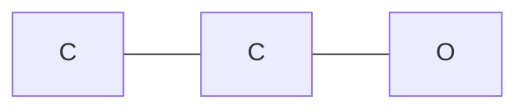

# 分子结构的数学表示

为了让计算机识别化学分子结构，我们需要设计一套转换规则，把分子的化学信息转为机器学习模型可以处理的数学对象。

对人来说，一个分子可以用结构式、球棍模型、分子式或名称表示；但对模型来说，输入通常只能是向量、矩阵、张量或图。因此分子表示的核心问题是：

> 如何把原子、化学键、空间构象和化学性质编码成数学数据？

常见表示方式可以分为三类：

| 表示方式 | 典型形式 | 适合模型 |
| --- | --- | --- |
| 序列表示 | SMILES、SELFIES、InChI | RNN、Transformer、语言模型 |
| 二维图表示 | 节点特征、边索引、边特征 | GCN、GAT、GIN、MPNN |
| 三维结构表示 | 原子坐标、距离矩阵、空间图 | SchNet、DimeNet、EGNN |

## 分子数据中包含哪些信息

一个分子通常至少包含以下信息：

| 信息 | 示例 | 数学表示 |
| --- | --- | --- |
| 原子类型 | C、N、O、Cl | one-hot 向量或整数编号 |
| 化学键 | 单键、双键、芳香键 | 边特征向量 |
| 连接关系 | 哪两个原子相连 | 邻接矩阵或边索引 |
| 原子属性 | 电荷、价态、杂化方式 | 节点特征 |
| 分子整体属性 | 分子量、LogP、TPSA | 全局特征 |
| 三维坐标 | $(x,y,z)$ | 坐标矩阵 |
| 构象信息 | 键长、键角、二面角 | 距离或几何特征 |

在分子性质预测任务中，模型的目标通常可以写成：

$$
\hat{y} = f(M)
$$

其中 $M$ 是分子的数学表示，$\hat{y}$ 是模型预测的性质，例如水溶性、毒性、结合亲和力或分子能量。

## 序列表示

### SMILES
序列表示把分子写成字符串。最常见的是SMILES，全称是 Simplified Molecular Input Line Entry System。它用一行字符串表示分子结构，例如：

| 分子 | SMILES |
| --- | --- |
| 甲烷 | `C` |
| 乙醇 | `CCO` |
| 苯 | `c1ccccc1` |
| 乙酸 | `CC(=O)O` |

以乙醇 `CCO` 为例，其中每个字符表示原子，字符之间隐含化学键。：

```text
C - C - O
```

SMILES 可以被看作一个 token 序列，其中 $L$ 是序列长度，$s_i$ 是第 $i$ 个 token：

$$
S = (s_1, s_2, \dots, s_L)
$$

然后可以将每个 token 映射成向量：

$$
z_i = \text{Embedding}(s_i)
$$

最终得到序列矩阵：

$$
Z =
\begin{bmatrix}
z_1 \\
z_2 \\
\vdots \\
z_L
\end{bmatrix}
\in \mathbb{R}^{L \times d}
$$

其中 $d$ 是 embedding 维度。

### SMILES 的优缺点

优点：

- 简洁，易于存储和传播。
- 可以直接用于 NLP 模型。
- 大量化学数据库都支持 SMILES。

缺点：

- 同一个分子可能有多个合法 SMILES。
- 字符串相似不一定代表分子结构相似。
- 三维构象信息通常缺失。
- 模型需要自己从序列中学习图结构。

例如乙醇可能写作：

```text
CCO
OCC
```

这两个 SMILES 表示同一个分子，但序列方向不同。

### SELFIES

SELFIES 是一种更稳定的分子字符串表示。它的特点是生成的字符串更容易对应合法分子，因此常用于分子生成任务。

例如乙醇可以表示为：

```text
[C][C][O]
```

与 SMILES 相比，SELFIES 更适合生成模型，因为随机生成的 SELFIES 更可能被解析为有效分子。

## 分子指纹表示

分子指纹将分子转换为固定长度的二进制向量或数值向量。例如：

$$
v = [0,1,0,0,1,1,\dots,0] \in \{0,1\}^d
$$

其中每一位表示某类子结构是否出现。

### MACCS 指纹

MACCS 指纹通常为 166 位，每一位对应一个预定义的化学子结构。实际使用中不需要手动定义这些位，RDKit 可以自动计算。

### Morgan 指纹

Morgan 指纹也叫 ECFP，是分子机器学习中非常常用的指纹。它是以每个原子为中心，逐层扩展邻域，提取局部子结构。

设第 $r$ 轮时，原子 $i$ 的局部环境表示为：

$$
c_i^{(r)}
$$

第 $r+1$ 轮时，将中心原子和邻居信息组合：

$$
c_i^{(r+1)}
= \text{Hash}
\left(
c_i^{(r)}, \{c_j^{(r)}: j \in \mathcal{N}(i)\}
\right)
$$

最后把所有原子的局部结构哈希到固定长度向量中。

这种过程与 GNN 的消息传递很像：

| Morgan 指纹 | GNN |
| --- | --- |
| 逐层扩展原子邻域 | 逐层聚合邻居信息 |
| 哈希局部子结构 | MLP 学习消息表示 |
| 得到固定长度指纹 | 得到节点或图向量 |

指纹表示的优点是简单、高效、适合传统机器学习模型；缺点是表达能力依赖人工设计和哈希规则，难以端到端学习。

## 二维图表示

分子天然可以表示为图：

$$
G = (V, E)
$$

其中：$V$ 是节点集合，表示原子；$E$ 边集合，表示化学键。例如乙醇 `CCO` 可以表示为：



### 节点的描述

节点特征用于描述每个原子的化学属性。设分子有 $N$ 个原子，每个原子用 $d$ 维向量表示：

$$
X \in \mathbb{R}^{N \times d}
$$

其中第 $i$ 行$x_i \in \mathbb{R}^d$，表示第 $i$ 个原子的特征。

常见原子特征：

| 特征 | 说明 | 表示方式 |
| --- | --- | --- |
| 原子类型 | C、N、O、S、Cl 等 | one-hot |
| 原子序数 | 元素周期表编号 | 整数或归一化数值 |
| 度 | 与几个原子相连 | 整数 |
| 形式电荷 | formal charge | 整数 |
| 芳香性 | 是否芳香原子 | 0/1 |
| 杂化方式 | sp、sp2、sp3 | one-hot |
| 隐式氢数量 | 连接的 H 数量 | 整数 |
| 是否在环中 | ring membership | 0/1 |

例如只考虑原子类型：

```text
ATOM_TYPES = [C, N, O, F]
```

那么：

| 原子 | one-hot |
| --- | --- |
| C | `[1, 0, 0, 0]` |
| N | `[0, 1, 0, 0]` |
| O | `[0, 0, 1, 0]` |
| F | `[0, 0, 0, 1]` |

乙醇 `CCO` 的节点特征矩阵可以写成：

$$
X =
\begin{bmatrix}
1 & 0 & 0 & 0 \\
1 & 0 & 0 & 0 \\
0 & 0 & 1 & 0
\end{bmatrix}
$$

### 边的描述

**邻接矩阵**

如果分子有 $N$ 个原子，可以用邻接矩阵表示连接关系：

$$
A \in \mathbb{R}^{N \times N}
$$

其中：

$$
A_{ij} =
\begin{cases}
1, & \text{原子 } i \text{ 和原子 } j \text{ 存在化学键} \\
0, & \text{否则}
\end{cases}
$$

乙醇有 3 个重原子，连接关系为：

```text
0: C
1: C
2: O
```

邻接矩阵为：

$$
A =
\begin{bmatrix}
0 & 1 & 0 \\
1 & 0 & 1 \\
0 & 1 & 0
\end{bmatrix}
$$

邻接矩阵直观，但对于大图比较浪费空间。因为大多数分子图很稀疏，矩阵中多数元素是 0。

**邻接列表**

在 PyTorch Geometric 中，更常用边索引 `edge_index` 表示图结构。对无向边，需要写成两个方向$
0 \leftrightarrow 1,\quad 1 \leftrightarrow 2
$，对应：

```python
edge_index = [
    [0, 1, 1, 2],
    [1, 0, 2, 1],
]
```

第一行是源节点，第二行是目标节点。


**边特征**

边特征用于描述化学键属性。设图中有 $M$ 条有向边，每条边有 $b$ 维特征：

$$
E_{\text{attr}} \in \mathbb{R}^{M \times b}
$$

常见边特征：

| 特征 | 说明 | 表示方式 |
| --- | --- | --- |
| 键类型 | 单键、双键、三键、芳香键 | one-hot |
| 是否共轭 | conjugated | 0/1 |
| 是否在环中 | ring bond | 0/1 |
| 立体化学 | 顺反、楔线等 | one-hot |
| 键长 | 三维结构中的距离 | 数值 |

例如定义：

```text
BOND_TYPES = [single, double, triple, aromatic]
```

则：

| 键 | one-hot |
| --- | --- |
| 单键 | `[1, 0, 0, 0]` |
| 双键 | `[0, 1, 0, 0]` |
| 三键 | `[0, 0, 1, 0]` |
| 芳香键 | `[0, 0, 0, 1]` |

乙醇中两条化学键都是单键。因为无向边通常拆成双向边，所以边特征为：

$$
E_{\text{attr}} =
\begin{bmatrix}
1 & 0 & 0 & 0 \\
1 & 0 & 0 & 0 \\
1 & 0 & 0 & 0 \\
1 & 0 & 0 & 0
\end{bmatrix}
$$


### 图级特征

除了节点和边，分子还可以有整体特征：

$$
u \in \mathbb{R}^{g}
$$

常见图级特征：

| 特征 | 说明 |
| --- | --- |
| 分子量 | molecular weight |
| LogP | 脂水分配系数 |
| TPSA | 拓扑极性表面积 |
| HBD | 氢键供体数 |
| HBA | 氢键受体数 |
| Rotatable Bonds | 可旋转键数量 |

在 GNN 中，图级特征可以在读出阶段与图向量拼接（其中 $\|$ 表示向量拼接）：

$$
h_G = \text{readout}(\{h_i\}_{i=1}^{N})
$$

$$
\hat{y} = \text{MLP}([h_G \| u])
$$


## 三维结构表示

二维图只表示原子连接关系，但很多分子性质与三维结构密切相关。在三维结构中，每个原子有坐标：

$$
r_i = (x_i, y_i, z_i) \in \mathbb{R}^3
$$

整个分子的坐标矩阵为：

$$
R =
\begin{bmatrix}
x_1 & y_1 & z_1 \\
x_2 & y_2 & z_2 \\
\vdots & \vdots & \vdots \\
x_N & y_N & z_N
\end{bmatrix}
\in \mathbb{R}^{N \times 3}
$$

### 距离矩阵

由坐标可以计算任意两个原子的欧氏距离：

$$
d_{ij} = \|r_i - r_j\|_2
$$

距离矩阵为：

$$
D =
\begin{bmatrix}
d_{11} & d_{12} & \cdots & d_{1N} \\
d_{21} & d_{22} & \cdots & d_{2N} \\
\vdots & \vdots & \ddots & \vdots \\
d_{N1} & d_{N2} & \cdots & d_{NN}
\end{bmatrix}
$$

距离矩阵有两个重要性质：

$$
d_{ij} = d_{ji}
$$

$$
d_{ii} = 0
$$

距离对平移和旋转不变，因此常用于三维分子模型。

### 键角

三个原子 $i,j,k$ 可以形成键角，其中 $j$ 是中心原子：

$$
\theta_{ijk}
= \arccos
\left(
\frac{(r_i-r_j)\cdot(r_k-r_j)}
{\|r_i-r_j\|\|r_k-r_j\|}
\right)
$$

键角能够描述局部几何形状。例如 sp、sp2、sp3 杂化对应不同的典型键角。

### 二面角

四个原子 $i,j,k,l$ 可以形成二面角。二面角描述两个平面之间的夹角，常用于表示构象变化。例如蛋白质主链中的 $\phi$、$\psi$ 角本质上就是二面角，在分子生成、构象预测、蛋白质结构建模中，二面角非常重要。

设四个原子的坐标分别为：

$$
r_i,\ r_j,\ r_k,\ r_l \in \mathbb{R}^3
$$

先定义三条连续的键向量：

$$
b_1 = r_j - r_i
$$

$$
b_2 = r_k - r_j
$$

$$
b_3 = r_l - r_k
$$

二面角可以理解为平面 $(i,j,k)$ 和平面 $(j,k,l)$ 之间的夹角。两个平面的法向量分别为平面内两条不平行向量的叉乘：

$$
n_1 = b_1 \times b_2
$$

$$
n_2 = b_2 \times b_3
$$

如果只关心夹角大小，可以使用：

$$
\phi
= \arccos
\left(
\frac{n_1 \cdot n_2}
{\|n_1\|\|n_2\|}
\right)
$$

但在分子构象中，二面角通常需要保留正负方向，因此更常用带符号的计算公式：

$$
\phi
= \operatorname{atan2}
\left(
\frac{b_2}{\|b_2\|} \cdot (n_1 \times n_2),
n_1 \cdot n_2
\right)
$$

其中 $\operatorname{atan2}(y,x)$ 可以根据两个输入同时判断角度大小和象限，使 $\phi$ 的取值范围通常为：

$$
\phi \in (-\pi, \pi]
$$

用角度表示时，对应范围为：

$$
\phi \in (-180^\circ, 180^\circ]
$$

## 不同表示类型的选择

| 任务 | 推荐表示 |
| --- | --- |
| 小数据集性质预测 | Morgan 指纹 + 传统机器学习 |
| 大规模性质预测 | 分子图 + GNN |
| 分子生成 | SMILES、SELFIES、图生成模型 |
| 构象预测 | 三维坐标 + 等变模型 |
| 蛋白-配体结合 | 三维空间图、距离图 |
| 量子化学性质 | 三维结构、原子序数、距离 |

简单经验：

- 只关心二维连接关系时，使用分子图。
- 关心构象、空间距离、结合姿态时，使用三维表示。
- 需要快速基线模型时，使用分子指纹。
- 需要端到端学习时，使用 GNN 或 Transformer。
