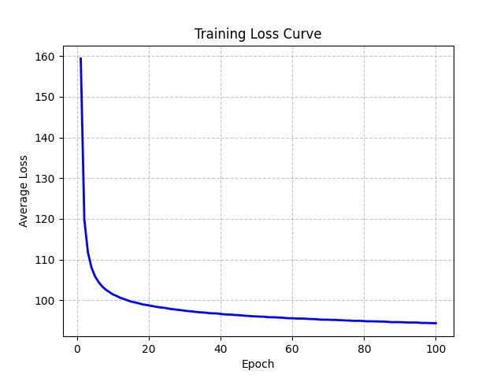
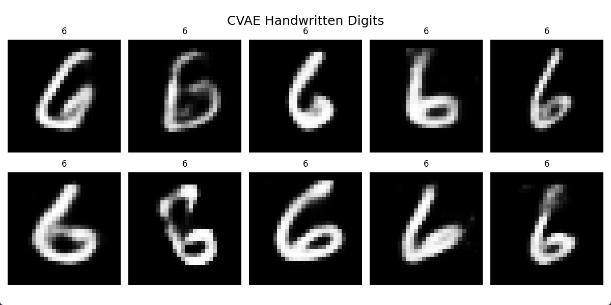
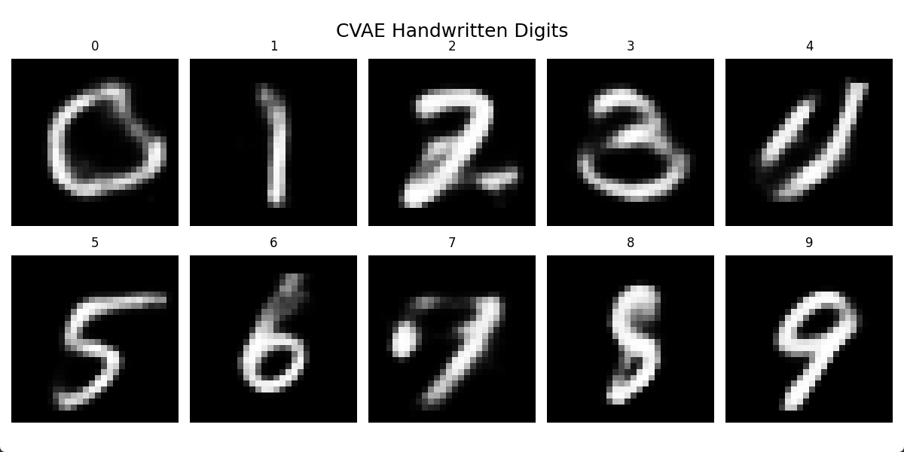

# 基于CVAE的手写字生成
本实例使用`python 3.9`和`PyTorch`完成CVAE模型训练和推理代码实现，模型借助MNIST数据集学习到条件生成后，可以根据给定的字段输出手写字体图像。

配置好基础python环境后，将文中代码依次复制粘贴到一个`py`文件内，即可运行。

**注**：首次运行时需要下载MNIST数据集，需要保证网络畅通。

## 导入库
```python
import os
import torch
import torch.nn as nn
import torch.nn.functional as F
from torchvision import datasets, transforms
from torch.utils.data import DataLoader
import matplotlib.pyplot as plt
from torchvision.utils import save_image
```

## 定义模型
```python
# 创建CVAE类，继承nn.module父类
class CVAE(nn.Module):
    def __init__(self, input_dim=784, h_dim=600, z_dim=50, num_classes=10):
        """
        :param input_dim: 输入数据维度 (MNIST为784)
        :param h_dim: 隐藏层维度
        :param z_dim: 隐变量维度
        :param num_classes: 类别数量 (MNIST为10)
        """
        # 调用父类构造函数
        super(CVAE, self).__init__()

        # 初始化类参数（模型超参数）
        self.input_dim = input_dim
        self.z_dim = z_dim
        self.num_classes = num_classes

        # --- 编码器 (Encoder) ---
        # 输入: 图像x (784维) + 标签c (10维One-Hot)
        self.fc1 = nn.Linear(input_dim + num_classes, h_dim)
        self.fc2 = nn.Linear(h_dim, z_dim)  # 均值 mu
        self.fc3 = nn.Linear(h_dim, z_dim)  # 对数方差 log_var

        # --- 解码器 (Decoder) ---
        # 输入: 隐变量z (20维) + 标签c (10维One-Hot)
        self.fc4 = nn.Linear(z_dim + num_classes, h_dim)
        self.fc5 = nn.Linear(h_dim, input_dim)
```
编码器函数
```python
    def encode(self, x, c):
        # 将输入的二维图像 x 展平（Flatten）成一维向量
        x_flat = x.view(x.size(0), -1)
        
        # 把图像和标签拼接
        inputs = torch.cat([x_flat, c], dim=1)

        # 把输入送入第一层，并使用relu激活
        h = F.relu(self.fc1(inputs))

        # 将隐藏层特征 h 分别送入两个并行的全连接层，得到隐变量分布的均值和对数方差，并将它们作为结果返回。
        return self.fc2(h), self.fc3(h)
```
重参数化采样函数
```python
    def reparameterize(self, mu, log_var):
        # 从编码器输出的 “对数方差” 计算出 “标准差”
        std = torch.exp(0.5 * log_var)

        # 从标准正态分布中采样一个与 std 形状完全相同的随机噪声向量 eps
        eps = torch.randn_like(std)

        # 返回最终的隐变量 z
        return mu + eps * std
```
解码器函数
```python
    def decode(self, z, c):
        # 拼接隐变量和标签
        inputs = torch.cat([z, c], dim=1)

        # 输入计算全连接层，并用relu激活
        h = F.relu(self.fc4(inputs))

        # 输入计算，并用sigmoid激活
        return torch.sigmoid(self.fc5(h))
```
定义前向传播路径
```python
    def forward(self, x, c):
        # 将输入的图像张量 x 展平成二维张量
        x_flat = x.view(-1, self.input_dim) 
        
        # 调用 encode 方法，获取隐变量分布的参数
        mu, log_var = self.encode(x_flat, c)
        
        # 从参数化采样
        z = self.reparameterize(mu, log_var)
        
        # 输入解码器并返回
        return self.decode(z, c), mu, log_var
```
## 训练函数

定义模型相关的超参数和配置
```python
def train_cvae():
    batch_size = 128        # 批次大小
    learning_rate = 1e-3    # 学习率
    epochs = 100            # 训练轮次
    z_dim = 50              # 隐空间维数
    num_classes = 10        # 分类数
    device = torch.device('cuda' if torch.cuda.is_available() else 'cpu')   # 设备
    os.makedirs('cvae_results', exist_ok=True)  # 保存目录
    checkpoint_path = 'cvae_checkpoint.pth'     # 训练结果文件
```

加载数据集
```python
    # transforms 图像数据的预处理
    transform = transforms.Compose(
        # 转换成 PyTorch 张量，自动归一化
        [transforms.ToTensor()]
        )

    # 使用torchvision.datasets模块中封装好的 MNIST 数据集
    train_dataset = datasets.MNIST(
        root='./mnist',         # 保存路径
        train=True,             # 指定加载 “训练集”
        download=True,          # 是否下载
        transform=transform     # 指定加载数据时应用的预处理流水线
        )

    # 创建训练数据加载器，自动将训练集分成指定大小的数据包
    train_loader = DataLoader(
        dataset=train_dataset,  # 指定要加载的数据集
        batch_size=batch_size,  # 指定每批次包含的样本数量
        shuffle=True            # 是否打乱数据集顺序
        )
```

模型加载、优化器设置
```python
    # 创建模型，选择设备
    model = CVAE(z_dim=z_dim, num_classes=num_classes).to(device)

    # 设置优化器
    optimizer = torch.optim.Adam(model.parameters(), lr=learning_rate)

    # 记录损失函数监控
    train_losses = [] 
```

训练循环
```python
    for epoch in range(epochs):
        
        # 初始化损失
        total_loss = 0

        # 循环取出迭代索引和内容
        for batch_idx, (data, labels) in enumerate(train_loader):

            # 将当前批次的图像数据 data 和标签 labels 迁移到指定的计算设备
            data, labels = data.to(device), labels.to(device)
            
            # 将标签转换为One-Hot编码
            c = F.one_hot(labels, num_classes=num_classes).float()

            # 前向传播
            recon_batch, mu, log_var = model(data, c)
            
            # 重构损失
            recon_loss = F.binary_cross_entropy(
                recon_batch, 
                data.view(-1, 784), 
                reduction='sum'
                )

            # KL散度损失
            kl_loss = -0.5 * torch.sum(1 + log_var - mu.pow(2) - log_var.exp())
            
            # 总损失
            loss = recon_loss + kl_loss
            
            # 反向传播与参数更新
            optimizer.zero_grad()   # 清空梯度
            loss.backward()         # 计算梯度
            optimizer.step()        # 计算梯度

            # 取出损失值的纯数字，累加
            total_loss += loss.item()
            
            # 打印进度
            if (batch_idx + 1) % 100 == 0:
                print(f'Epoch [{epoch+1}/{epochs}] \
                      Batch [{batch_idx+1}/{len(train_loader)}] \
                      Loss: {loss.item()/len(data):.4f}'
                      )

        # 打印每个epoch的平均损失
        average_loss = total_loss / len(train_loader.dataset)
        train_losses.append(average_loss)
        print(f'Epoch [{epoch+1}/{epochs}], Average Loss: {average_loss:.4f}\n')

        # 每个epoch结束后，保存一张重构图像示例
        if (epoch + 1) % 10 == 0:
            with torch.no_grad():
                sample = torch.randn(
                    64, 
                    z_dim
                    ).to(device)

                sample_labels = torch.tensor(
                    [i % 10 for i in range(64)], 
                    device=device
                    )

                sample_c = F.one_hot(
                    sample_labels, 
                    num_classes=num_classes
                    ).float()

                generated = model.decode(sample, sample_c).cpu()

                save_image(
                    generated.view(64, 1, 28, 28),
                     f'cvae_results/epoch_{epoch+1}.png'
                    )

```

绘制损失函数图像
```python      
    # 绘制损失曲线        
    plt.plot(range(1, epochs+1), train_losses, color='blue', linewidth=2)
    plt.title('Training Loss Curve')
    plt.xlabel('Epoch')
    plt.ylabel('Average Loss')
    plt.grid(True, linestyle='--', alpha=0.7)
    plt.savefig('CVAE_loss.png')
    plt.show() 
```


保存模型
```python
    torch.save({
        'epoch': epochs,                                # 训练轮次
        'model_state_dict': model.state_dict(),         # 模型权重
        'optimizer_state_dict': optimizer.state_dict(), # 优化器状态
        }, 
        checkpoint_path                                 # 保存路径
        )

    print(f"Model saved to {checkpoint_path}")

```

在`main()`中运行`train_cvae()`即可开始训练。

## 推理函数
定义超参数和配置信息，该函数接受两个参数，当 `flag` 为 `Flase` 时，将忽视 `input` 的值，输出0~9十个手写字；当 `flag` 为 `True` 时，输出根据 `input` 条件输出十个手写字。
```python
def inference_cvae(input=6,flag=False):
    z_dim = 50
    num_classes = 10
    device = torch.device('cuda' if torch.cuda.is_available() else 'cpu')
    checkpoint_path = 'cvae_checkpoint.pth'

    # 加载模型
    if not os.path.exists(checkpoint_path):
        print(f"Error: Checkpoint file \
              '{checkpoint_path}' not found. \
              Please run train_cvae() first.")
        return
    model = CVAE(z_dim=z_dim, num_classes=num_classes).to(device)
    checkpoint = torch.load(checkpoint_path, map_location=device)
    model.load_state_dict(checkpoint['model_state_dict'])
    model.eval()  # 固定为评估模式，禁用训练相关层

    print(f"Model loaded from {checkpoint_path}")

```
根据输入内容推理
```python
    with torch.no_grad():   # 推理时不计算梯度，节省资源
        all_generated = []  # 存储当前轮次0-9的所有生成图像
        all_digits = []     # 存储当前轮次的数字标签

        # 逐个生成0-9的手写体
        for digit in range(num_classes):
            # 是否为随机模式
            if randam: digit = input

            # 准备当前数字的One-Hot标签
            c_labels = torch.full((1,), digit, dtype=torch.long).to(device)
            c = F.one_hot(c_labels, num_classes=num_classes).float()

            # 采样隐变量z（每个样本对应一个随机z，保证风格差异）
            z = torch.randn(1, z_dim).to(device)

            # 解码生成图像
            generated = model.decode(z, c)

            # 调整形状为[样本数, 1, 28, 28]，并转移到CPU
            generated = generated.view(1, 1, 28, 28).cpu()

            # 加入当前轮次的结果列表
            all_generated.extend(generated)

            # 对应数字标签
            all_digits.extend([digit] * 1)
```
绘制并保存图像
```python
        # 创建画布：2行5列；图像尺寸：28x28
        fig, axes = plt.subplots(2, 5, figsize=(12, 6))
        fig.suptitle(f'CVAE Handwritten Digits', fontsize=18, y=0.95)

        # 遍历所有子图，填充图像和标签
        for ax, img_tensor, digit in zip(axes.flatten(), all_generated, all_digits):
            # 转换张量为numpy数组，squeeze()去除通道维度
            img = img_tensor.squeeze().numpy()
            # 显示灰度图像
            ax.imshow(img, cmap='gray')
            # 图像下方标注数字
            ax.set_title(str(digit), fontsize=12, pad=8)
            # 关闭坐标轴，只保留图像和标签
            ax.axis('off')

        # 调整子图间距，避免标签或标题重叠
        plt.tight_layout(rect=[0, 0, 1, 1])

        # 保存生成结果
        save_path = f'CVAE_result.png'
        plt.savefig(save_path, dpi=150, bbox_inches='tight')
        plt.show()
        print(f"result saved as: {save_path}\n")
```
在`main()`中运行`inference_cvae()`即可。


```python
if __name__ == '__main__':
    # 训练CVAE模型
    train_cvae()

    # 推理，生成数字6的手写体
    inference_cvae(input=6, flag=True)

    # 推理，随机生成数字0-9的手写体
    inference_cvae(flag=False)
```

## 运行结果

每轮训练的输出如下：
```bash
Epoch [98/100]                       Batch [100/469]                       Loss: 96.7401
Epoch [98/100]                       Batch [200/469]                       Loss: 91.3916
Epoch [98/100]                       Batch [300/469]                       Loss: 91.5976
Epoch [98/100]                       Batch [400/469]                       Loss: 90.0979
Epoch [98/100], Average Loss: 94.2734
```

损失函数变化曲线：



模型推理结果如图：

**给定数字输出**



**输出0-9**


