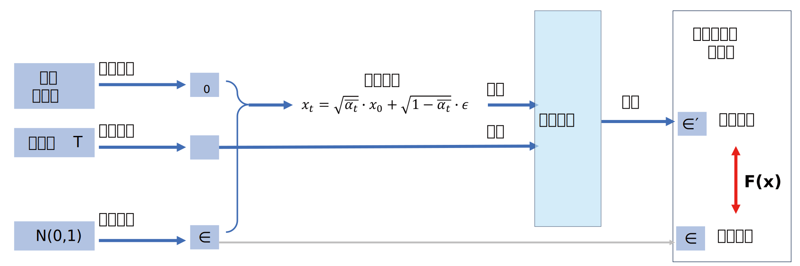
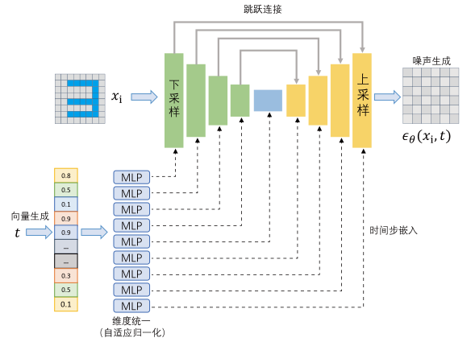
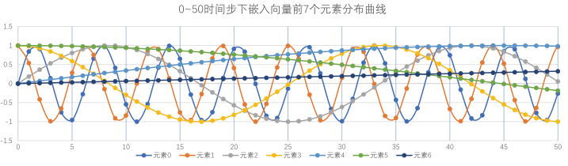
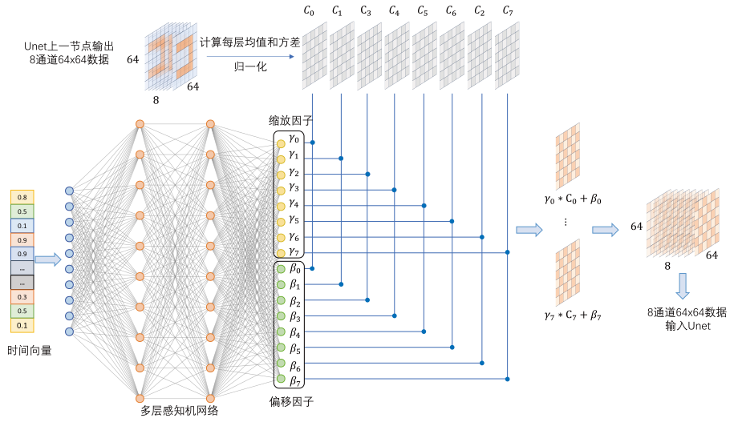
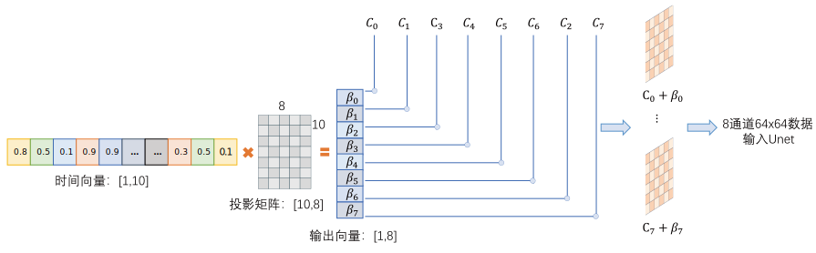
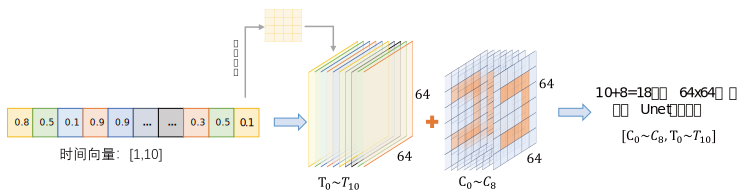

# DDPM

上文我们介绍了扩散模型的核心思想，而DDPM作为首个将扩散模型具体实现的模型，自2020年论文发表以来就受到广泛应用，本文将对DDPM的原理和实现做具体说明。

## 公式推导

首先我们对扩散模型加噪和去噪的噪声计算公式进行推导，以便后续工作的展开。

### 前向加噪

模型训练时需要输入给定原始图像加噪后的数据，设原数据为$x_0$，第t步加噪后的数据为$x_t$，最终加噪完成的数据$x_T$应为纯噪声数据。

我们假设随机噪声符合正态分布，即$\varepsilon_t = \mathcal{N}(0,1)$，加噪过程可以描述为均值为$\sqrt{1-\beta_t}x_{t-1}$，方差为$\beta_tI$的正态分布，$I$ 代表单位矩阵：
$$q(x_t|x_{t-1}) = \mathcal{N}(x_t;\sqrt{1-\beta_t}x_{t-1},\beta_tI)$$

由此可以得到加噪迭代公式：

$$
x_t = \sqrt{\alpha_t}x_{t-1} + \sqrt{\beta_t}\varepsilon_t; \quad \alpha_t = 1- \beta_t
$$


迭代后推导出的加噪公式，即第t步加噪后的数据可表示为：
$$ x_t = \sqrt{\bar{\alpha}_t}\cdot x_0 + \sqrt{1-\bar{\alpha}_t} \cdot \varepsilon , \quad \bar{\alpha}_t = \prod_T \alpha_t$$
写成加噪分布的形式为：
$$
q(x_{t}|x_0) =\mathcal{N}(x_{t};\sqrt{\bar{\alpha}_t}x_0,(1-\bar{\alpha}_t)I)
$$

### 反向去噪

Diffusion Model并不是直接由$x_t$预测$x_{t-1}$，而是预测加在$x_t$上的“噪声”，通过去噪得到$x_{t-1}$，这样做是兼顾 “训练效率、模型稳定性、生成多样性” 的最优选择。

反向过程则是从纯噪声$x_T$ 到真实数据 $x_0$，这里反向分布公式可由**贝叶斯定理**推出：
$$q(x_{t-1} | x_t) = \frac{q(x_t|x_{t-1}) \cdot q(x_{t-1}|x_0)}{q(x_t|x_0)}$$

该公式表示给定$x_t$去求$x_{t-1}$，分子分母的三个分布在前向加噪中都已得到，分式的三个分布都是高斯分布，则$q(x_{t-1} | x_t)$也必然是高斯分布。

- 单步加噪分布，$\alpha_t=1-\beta_t$，$\beta_t$是单步噪声方差：
  $$q(x_t|x_{t-1}) \thicksim \mathcal{N}(\sqrt{\alpha_t}x_{t-1},(1-\alpha_t)I)$$

- 从$x_0$到$x_{t-1}$的累计加噪分布，$\bar{\alpha}_{t-1} = \prod\nolimits_{i=1}^{t-1} \alpha_i$
  $$q(x_{t-1}|x_0) \thicksim \mathcal{N}( \sqrt{\bar{\alpha}_{t-1}}x_0,(1-\bar{\alpha}_{t-1})I )$$

- 从$x_0$到$x_t$的累计加噪分布，$\bar{\alpha}_t = \prod\nolimits_{i=1}^t \alpha_i$
  $$q(x_t|x_0) \thicksim \mathcal{N} ( \sqrt{\bar{\alpha}_t}x_0,(1-\bar{\alpha}_t)I )$$


随后推导出已知第t步时第t-1步的数据分布$q(x_{t-1}|x_t)$的均值和方差，用角标表示条件分布。
均值：
$$ \mu_{t-1|t} = \frac{\sqrt{\alpha_t}(1-\bar{\alpha}_{t-1})}{1-\bar{\alpha}_t}x_t + \frac{\sqrt{\bar{\alpha}_{t-1}}(1-\alpha_t)}{1-\bar{\alpha}_t} x_0 $$
方差：
$$ \sigma_{t-1|t} = \frac{1-\bar{\alpha}_{t-1}}{1-\bar{\alpha}_t}(1-\alpha_t)I$$

这里的均值使用了参数$x_0$，但在预测中我们并不预先知道，不然就不用预测了，所以我们要用$x_t$来预测$x_0$，由前向扩散公式反解出$x_0$，这里$\varepsilon_t$是第t步的真实噪声：
$$x_0 = \frac{1}{\sqrt{\bar{\alpha}_t}} (x_t - \sqrt{1-\bar{\alpha}_t} \cdot \varepsilon_t) $$

将其代入反向分布的均值$\mu_{t-1|t}$中，用预测噪声$\varepsilon_ \theta$近似真实噪声$\varepsilon_t$，得到反向去噪公式：
$$ x_{t-1} = \frac{1}{\sqrt{\alpha_t}} (x_t - \frac{\beta_t}{\sqrt{1-\bar{\alpha}_t}} \cdot \varepsilon_ \theta(x_t,t)) + \sigma_t \cdot z $$


这里$\sigma_t = \sqrt{\frac{1-\bar{\alpha}_{t-1}}{1-\bar{\alpha}_t}(1-\alpha_t)}$是噪声强度系数，$z \thicksim \mathcal{N}(0,1)$是随机噪声。
因此，利用该公式，针对模型每轮预测的噪声$\varepsilon_ \theta$，都可以得到下一步的数据$x_{t-1}$


## 损失函数


## 模型运行流程

### 训练

DDPM的单步训练示意图如下：



图中，我们先把预测网路部分抽形为一个黑盒模型，它接收时间步$t$和含噪数据$x_t$，预测出加在数据中的噪声$\varepsilon$，再通过反向过程去除噪声得到下一步的数据$x_{t-1}$

### 推理


## 预测网络

接下来我们讨论Diffusion Model预测噪声功能的核心部分，根据上述讨论，我们可以理解，扩散模型实际上还是一种神经网络，只不过该神经网络的输入数据经过处理，接收含噪数据和时间步，输出的预测数据也经过了处理得到去噪后数据，最常用的噪声预测网络是——**Unet网络**。

对于它的具体框架我们在前文已做讨论，在此不做展开，只对其如何预测噪声进行说明，整个预测网络的计算流程如下示意图：



## 时间步嵌入

根据扩散模型的原理我们知道，在预测网络训练时需要输入当前的时间$T$，所谓时间步嵌入就是将标量$T$通过给定的数学公式转换为一个时间向量，再通过线性变换与图像数据输入融合，而上图的下半部分就是时间步向量生成和嵌入的具体示意图。

### 时序向量生成

我们首先定义一个计算公式将标量$T$得到时间向量，通常会选择基于正弦和余弦函数的位置编码来做时间步嵌入，其具体公式如下：

$$
\begin{align*}
& PE(t,2i) = sin(\frac{t}{10000^k}) \\
& PE(t,2i+1) = cos(\frac{t}{10000^k}) \\
& k=\frac{2i}{d_{model}}
\end{align*}
$$

公式$PE(t,x)$表示时间步 $t$ 对应的嵌入向量的第$x$个元素，$x$的取值范围是$[0, d_{model}-1]$。对于向量的偶数位元素使用$sin$计算，奇数位使用$cos$计算。

**示例**

我们想计算一个十一维嵌入向量第$t=4$时刻第$5$个元素的值，因为$5$是奇数，所以使用$cos$公式计算，且$i=\frac{(5-1)}{2}=2$，代入：

$$
\begin{align*}
k=&\frac{2 \times 2}{11} = \frac{4}{11} \\
PE(4,5)=&cos(\frac{4}{10000^{(4/11)}}) \approx 0.99015
\end{align*}
$$


对于一个维度是11的嵌入向量，我们可以计算出$t_0 \sim t_9$每个时间步对应的向量：

```
t_0:[0,	1,	0,	1,	0,	1,	0,	1,	0,	1,	0]
t_1:[0.841470985,	0.540302306,	0.18628711,	0.98249535,	0.035104703,	0.99938364,	0.006579285,	0.999978356,	0.001232846,	0.99999924,	0.000231013]
t_2:[0.909297427,	-0.416146837,	0.366052439,	0.930594225,	0.070166132,	0.99753532,	0.013158285,	0.999913426,	0.002465691,	0.99999696,	0.000462026]
t_3:[0.141120008,	-0.989992497,	0.533002529,	0.846113647,	0.105141066,	0.994457317,	0.019736715,	0.999805212,	0.003698532,	0.99999316,	0.000693039]
t_4:[-0.756802495,	-0.653643621,	0.681292572,	0.732011223,	0.13998639,	0.990153428,	0.026314291,	0.999653719,	0.004931367,	0.999987841,	0.000924052]
t_5:[-0.958924275,	0.283662185,	0.80573104,	0.592281598,	0.17465915,	0.984628956,	0.032890728,	0.999458954,	0.006164195,	0.999981001,	0.001155065]
t_6:[-0.279415498,	0.960170287,	0.901961427,	0.431816609,	0.209116605,	0.977890713,	0.039465741,	0.999220924,	0.007397013,	0.999972642,	0.001386077]
t_7:[0.656986599,	0.753902254,	0.966614776,	0.256234022,	0.243316277,	0.969947003,	0.046039046,	0.998939641,	0.00862982,	0.999962762,	0.00161709]
t_8:[0.989358247,	-0.145500034,	0.997427618,	0.071680862,	0.277216008,	0.960807621,	0.052610358,	0.998615116,	0.009862614,	0.999951363,	0.001848103]
t_9:[0.412118485,	-0.911130262,	0.993321218,	-0.115381796,	0.310774009,	0.950483832,	0.059179393,	0.998247364,	0.011095393,	0.999938444,	0.002079115]
```
通过绘图查看0~50时间步下嵌入向量前7个元素的分布，观察$t、i$两个变量对数值的影响。



### 向量嵌入

在得到$t_i$时刻的$n$维嵌入向量后，往往需要将其与图像数据嵌入，这个过程需要解决两组数据大小不一致和选用什么融合方法的两个问题。在扩散模型中，主要通过自适应归一化的方式将时间步向量注入到 `UNet` 网络。


**实例归一化**

对于输入的特征图 x ，假设其形状为 $(N, C, H, W)$，其中 N 是批量大小， C 是通道数， H 和 W 分别是特征图的高度和宽度。实例归一化是对每个样本的每个通道分别计算均值 $\mu_{n,c}$和方差 $\sigma_{n,c}^2$，并进行归一化：

$$\text{IN}(x)_{n,c,h,w} = \frac{x_{n,c,h,w} - \mu_{n,c}}{\sqrt{\sigma_{n,c}^2 + \epsilon}}$$

其中 $\epsilon$是一个很小的常数，用于防止分母为零。

**生成缩放和偏移因子**

将时间步嵌入向量输入到一个多层感知机（MLP）中，经过变换输出**与特征图通道数 $C$ 相同维度**的缩放因子 $\gamma$ 和偏移因子 $\beta$ ，即 $[\gamma, \beta] = \text{MLP}(\text{condition})$ 。


**自适应调整**

使用生成的缩放因子 $\gamma$ 和偏移因子 $\beta$ 对实例归一化后的特征图进行调整，得到最终经过 $\text{AdaIN}$ 操作的特征图，在计算过程中，标量$\gamma_i$和$\beta_i$会利用广播机制与矩阵中的每一个值做乘法和加法：

$$\text{AdaIN}(x)_{n,c,h,w} = \gamma_c \cdot \text{IN}(x)_{n,c,h,w} + \beta_c$$


上述利用自适应归一化方法进行时间步嵌入的示意图如下：



本示例中时间向量维度为$10$，上节点输入数据为$[8,64,64]$，$8$通道，$64 \times 64$大小图像，多层感知机输出节点为$8*2=16$，前八个节点作为缩放因子 $[\gamma_0, \cdots , \gamma_7]$ ，后八个节点作为偏移因子 $[\beta_0, \cdots , \beta_7]$ ，对输入的每一通道进行归一化后得到八个归一化后的矩阵$[C_0,\cdots ,C_7]$，最后将系数和矩阵相乘（广播机制），得到$[\gamma_0 * C_0 + \beta_0, \cdots , \gamma_7 * C_7 + \beta_7]$，将其输入`Unet`的下一节点。

### 其他嵌入方法
除了常用的自适应归一化方法外，以下三种方法也可进行时间步嵌入：

**简单相加**

将嵌入向量通过线性层投影到与特征图相同的通道维度后，直接与特征图进行逐元素相加，将嵌入向量携带的信息叠加到网络特征上。

对时间步嵌入向量进行线性变换，使其维度与待融合的特征图通道数相同。例如，若特征图通道数为 $C$，嵌入向量维度为 $D$，则通过一个线性层 $W$（维度为 $C \times D$）对嵌入向量进行变换，得到投影后的嵌入向量 $\text{proj}(PE)$ 。将投影后的嵌入向量 $\text{proj}(PE)$ 与特征图 $x$ 进行逐元素相加，得到融合后的特征 $x_{\text{fused}} = x + \text{proj}(PE)$ 。其示意图如下：



优势：实现简单，计算量相对较小，能快速将嵌入向量的信息融入到网络特征中，在一些简单场景或对计算资源要求较高的情况下较为适用。

**拼接**

在通道维度上直接将嵌入向量与特征图拼接在一起，然后通过后续的卷积层等操作，让模型学习到嵌入向量和网络特征的联合表示。

同样先将嵌入向量通过线性层投影到合适的通道数，使其与特征图在通道维度上可以进行拼接操作。沿通道维度将投影后的嵌入向量与特征图拼接起来，得到新的特征表示 $x_{\text{concat}} = \text{concat}(x, \text{proj}(PE))$ 。对拼接后的特征图进行卷积等操作，进一步提取和融合信息，其具体步骤示意图如下：

  


优势：保留了嵌入向量和网络特征的原始信息，为模型提供了更丰富的输入，有助于模型学习到两者之间更复杂的关系，在一些对特征信息完整性要求较高的任务中表现较好 ，但会增加特征图的通道数，从而增加后续卷积层的计算量。