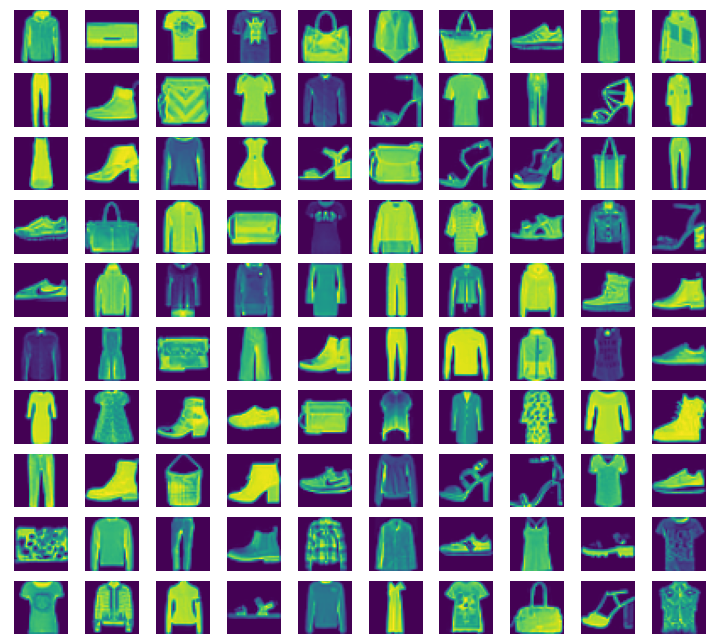
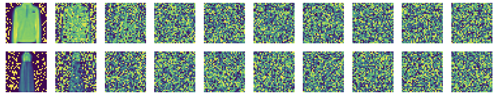

# 基于DDPM实现图像生成项目

本项目将利用PyTorch手动实现一个图像生成项目，数据集使用FASHION-MNIST，项目结构如下：

```
data                        # 数据集下载目录
├──MNIST
├──FASHION_MNIST
└──CIFAR10
model                       # 模型实现
└── PTH                     # 训练完成的权重
|   ├── number_model.pt     # MNIST数据集结果
|   ├── fashion_model.pt    # FASHION_MNIST结果
|   └── CIFAR_model.pt      # CIFAR10数据集结果
├── config.py               # 配置文件
├── conv_block.py           # 卷积块
├── dataset.py              # 数据集定义
├── denoise.py              # 去噪
├── noise.py                # 加噪
├── TimeEmbedding.py        # 时间步嵌入生成
└── unet.py                 # Unet网络定义
train.py                    # 训练入口
inference.py                # 推理入口
```


## 超参数配置

这部分代码由**config.py**文件实现，主要定义了DDPM的各种超参数：

```python
import torch 

# === 数据集相关参数 ===
DATASET_NAME = "huggan/flowers-102-categories"
LOCAL_CACHE_DIR = "./data"

# === 图像相关参数 ===
IMG_SIZE=32             # 图像尺寸
IMG_CHANNEL= 1          # 图像通道数，彩色图像为3，灰度图像为1

# === 训练相关参数 ===
T=1000                  # 加噪最大步数
TIME_EMB_SIZE=256       # Time时刻emb的维度
EPOCH=1000              # 训练轮数
BATCH_SIZE=64           # 批次大小
LEARNING_RATE = 1e-4    # 学习率

# 训练设备
DEVICE = "cuda" if torch.cuda.is_available() else "cpu" 

# 模型保存路径
MODEL_PTH = 'fashion_model.pt'  
```

## 数据集载入

这部分代码由**dataset.py**文件实现，主要完成图像数据与Tensoer互相转换、数据集载入：

PIL转Tensoer，尺寸统一
```python
pil_to_tensor=transforms.Compose([
    # PIL图像尺寸统一  
    transforms.Resize((IMG_SIZE,IMG_SIZE)),
    # PIL图像转tensor, (H,W,C) ->（C,H,W）,像素值[0,1]
    transforms.ToTensor()
])
```
Tensoer转PIL
```python
tensor_to_pil=transforms.Compose([
    # 像素还原
    transforms.Lambda(lambda t: t*255),
    # 像素值取整
    transforms.Lambda(lambda t: t.type(torch.uint8)),
    # tensor转回PIL图像, (C,H,W) -> (H,W,C) 
    transforms.ToPILImage(),
])
```

数据集的加载（三选一）：
```python
user_dataset=torchvision.datasets.MNIST(
    root=".",
    train=True,
    download=True,
    transform=pil_to_tensor
    ) 

user_dataset = torchvision.datasets.CIFAR10(
    './data', 
    train=True, 
    download=True, 
    transform=pil_to_tensor
    )

user_dataset = torchvision.datasets.FashionMNIST(
    './data', 
    train=True, 
    download=True, 
    transform=pil_to_tensor
    )
```

模块测试，随机选择100条数据进行可视化：
```python
if __name__=='__main__':
    print("数据集信息:")
    print(user_dataset)

    # 随机选择100个样本
    indices = random.sample(range(len(user_dataset)), 100)

    # 绘制10x10网格
    plt.figure(figsize=(10, 10))

    for i, idx in enumerate(indices):
        image, label = user_dataset[idx]
        pil_image = tensor_to_pil(image)
        
        plt.subplot(10, 10, i + 1)
        plt.imshow(pil_image)
        plt.axis('off')

    plt.tight_layout()
    plt.show()
```

以**FASHION_MNIST**数据集为例，输出如下：


## 加噪
这部分代码在**noise.py**中实现，完成对给定数据添加噪声的功能

根据加噪公式，直接计算第$t$时刻的加噪后图像：

$$
x_t = \sqrt{\bar{\alpha}_t}\cdot x_0 + \sqrt{1-\bar{\alpha}_t} \cdot \varepsilon
$$

首先定义以下超参数：
- $\alpha_t = 1- \beta_t, \quad \beta_t,t \in [0,T]$

- $\bar{\alpha}_t = \prod_T \alpha_t$

```python
# 超参数定义
# 线性beta调度器，beta_t从0.0001线性增加到0.02
betas=torch.linspace(0.0001,0.02,T).to(DEVICE)
# 计算alpha
alphas=1-betas
# 计算各时间步的alpha_t累乘
# [a1,a1*a2,a1*a2*a3,.....]
alphas_cumprod=torch.cumprod(alphas,dim=-1)
# 计算各时间步的alpha_t-1累乘 
# [1,a1,a1*a2,a1*a2*a3,.....]
alphas_cumprod_prev=torch.cat(
    (
        torch.tensor([1.0]),alphas_cumprod[:-1]),
        dim=-1
    )
```
定义前向加噪函数
```python
# 定义前向加噪函数
def forward_diffusion(batch_x,batch_t): 
    '''
    batch_x: (batch,channel,width,height)
    batch_t: (batch_size,)
    '''
    # 生成第t步的高斯噪音   
    # (batch,channel,width,height)
    batch_noise_t=torch.randn_like(batch_x)
    # 将系数维数调整到和batch一致
    batch_alphas_cumprod=alphas_cumprod[batch_t].view(
        batch_x.size(0),1,1,1
        ) 
    # 按公式加噪
    batch_x_t=torch.sqrt(batch_alphas_cumprod)*batch_x \
        +torch.sqrt(1-batch_alphas_cumprod)*batch_noise_t
    # 输出加噪后的图像和噪音
    return batch_x_t,batch_noise_t
```

单元测试，随机抽取10张图片，展示其加噪过程：
```python
if __name__=='__main__':

    indices = random.sample(range(len(user_dataset)), 10)
    
    image_list = [user_dataset[idx][0] for idx in indices]

    batch_x = torch.stack(image_list, dim=0).to(DEVICE)

    batch_x = batch_x * 2 - 1

    plt.figure(figsize=(10,10))
    t_list = range(0,T,int(T/10))

    for img_idx in range(10):
        original_img = batch_x[img_idx:img_idx+1, :, :, :] 
        
        for col_idx, t in enumerate(t_list):
            print(t)
            batch_t = torch.full((original_img.size(0),), t, dtype=torch.long, device=DEVICE)

            noisy_img, _ = forward_diffusion(original_img, batch_t)
            
            subplot_pos = img_idx * 10 + col_idx + 1
            ax = plt.subplot(10, 10, subplot_pos)
            
            pil_img = tensor_to_pil((noisy_img[0] + 1) / 2)
            ax.imshow(pil_img)
                
            ax.axis('off')
    plt.show()s
```

加噪结果：


## 时间步嵌入
回顾时间步向量公式：
$$
\begin{align*}
& PE(t,2i) = sin(\frac{t}{10000^k}) \\
& PE(t,2i+1) = cos(\frac{t}{10000^k}) \\
& k=\frac{2i}{d_{model}}
\end{align*}
$$

构建该向量需要向量维数 $d_{model}$，时间步 $t$，计算向量每个元素时需要位置索引 $i$。

以一个十维向量$d_{model}=10$为例，它第$t=100$时的向量可计算为：

|index|0|1|2|3|4|5|6|7|8|9|
|---|---|---|---|---|---|---|---|---|---|---|
|i|0|0|1|1|2|2|3|3|4|4|
|k|0|0|0.2|0.2|0.4|0.4|0.6|0.6|0.8|0.8|
|$PE(t,x)$|sin0|cos0|sin0.2|cos0.2|sin0.4|cos0.4|sin0.6|cos0.6|sin0.8|co0.8|

其中：$i=\frac{index}{2}/\frac{index-1}{2}$，$k=\frac{2i}{d_{model}}$

观察发现时间向量两两成对，在奇数时利用$sin x$，偶数时利用$cosx$，因此我们可以创建一个大小为$d_{model}/2$的索引序列，生成`[sin i,cos i]`，再将其拼接即可得到完整的时间向量。

以下代码在**TimeEmbedding.py**中实现：

```python
import torch 
from torch import nn 
import math 
from config import *

class TimeEmbedding(nn.Module):
    def __init__(self,d_model):
        super().__init__()

        # d_model是时间向量维度，在config中定义
        self.d_model=d_model
        # 半索引张量的大小
        self.half_size=d_model//2

        # 生成半索引张量    [0,1,2,...,d_model/2-1]
        i = torch.arange(self.half_size)
        # 计算k张量         k=2i/d_model
        k = i / (self.half_size)
        # 计算指数张量      j=1/10000^k
        j = torch.exp(k * (-1*math.log(10000)))
        # 结果存为buffer
        self.register_buffer('J',j)

    def forward(self,t):
        # 将 t 扩展成二维张量
        t=t.view(t.size(0),1)
        # 将系数 J 扩展为与t同批次大小的张量
        J=self.J.unsqueeze(0).expand(t.size(0),self.half_size)
        # 计算t时刻的时间嵌入系数
        t_index = J * t
        # 计算sin和cos值
        sin_vals = (t_index).sin()
        cos_vals = (t_index).cos()
        # 拼接sin和cos值，得到最终的时间嵌入
        embedding = torch.stack([sin_vals, cos_vals], dim=2)
        embedding = embedding.view(t.size(0), self.d_model)

        # 生成的张量大小为： (N, time_emb_size)
        return embedding
```
单元测试，将输出大小为的十维的两个给定时间步的时间步张量：
```python
if __name__=='__main__':
    time_pos_emb=TimeEmbedding(10).to(DEVICE)
    t = torch.tensor([100,12], device=DEVICE)
    print("t: ",t)
    print("==========================")
    embedding=time_pos_emb(t) 
    print("embedding: ",embedding)
```
输出结果：
```python
t:  tensor([100,  12])
==========================
embedding:  tensor([[-0.5064,  0.8623, -0.1405, -0.9901,  0.5889, -0.8082,  0.3877,  0.9218,
          0.0631,  0.9980],
        [-0.5366,  0.8439,  0.9457, -0.3251,  0.2969,  0.9549,  0.0478,  0.9989,
          0.0076,  1.0000]])
```

## 单层卷积块
此部分代码实现在**conv_block.py**，完成UNet的每一层卷积操作的实现：
```python
from torch import nn

class ConvBlock(nn.Module):
    def __init__(self,in_channel,out_channel,time_emb_size):
    '''
        in_channel：    输入通道数
        out_channel：   输出通道数
        time_emb_size： 时间向量大小（超参数中定义）
    '''
        super().__init__()

        # 改通道数,不改大小
        self.seq1 = nn.Sequential(
            # 第一次卷积操作，使用out_channel个卷积核计算
            nn.Conv2d(
                in_channel,
                out_channel,
                kernel_size=3,
                stride=1,
                padding=1
                ), 
            # 对所有通道分组（32组），归一化计算
            nn.GroupNorm(32,out_channel),
            # 使用更平滑的SiLU激活函数
            nn.SiLU(),
        )

        # 时间向量过一个线性层，把向量大小变成out_channel
        # (N, time_emb_size) -> (N, out_channel)
        self.time_emb_linear=nn.Linear(
            time_emb_size,
            out_channel
            )

        # 创建SiLU激活层
        self.silu=nn.SiLU()

        # 第二次特征提取 
        self.seq2=nn.Sequential(
            # 不改变张量尺寸 -> (N, C, H, W)
            nn.Conv2d(
                out_channel,
                out_channel,
                kernel_size=3,
                stride=1,
                padding=1
                ), 
            # 同样进行归一化操作
            nn.GroupNorm(32,out_channel),
            # SiLU激活函数
            nn.SiLU(),
        )

        # 残差结构,如果in_channel和out_channel不一样；
        # 用1x1卷积改通道数
        if in_channel != out_channel:
            self.residual = nn.Conv2d(
                in_channel,
                out_channel, 
                kernel_size=1
                )
        else:
            self.residual = nn.Identity()


    def forward(self,x,t_emb):
    '''
        x：     输入的批次张量(N, C, H, W)
        t_emb： 时间步张量(N,C)
    '''
        # 先计算输入x的残差
        residual = self.residual(x)

        # 改通道数,不改大小
        x=self.seq1(x)  

        # time_emb转成channel宽,加到每个像素点上
        # view变换：(N, t_emb_size) -> (N, out_channel, 1, 1)
        t_emb=self.silu(
            self.time_emb_linear(t_emb)
            ).view(x.size(0),x.size(1),1,1)
        
        # 图像数据与时间张量直接相加后进行二次特征提取
        # Torch广播机制会将t_emb在H、W维度上复制扩展
        x=self.seq2(x+t_emb)
        # 最终结果与残差直接相加
        output = x + residual
        # 大小 (N, out_channel, H, W)
        return output
```


## Unet网络
此部分代码实现在**unet.py**中，主要定义了UNet预测网络的结构和前向传播路径：
```python
class UNet(nn.Module):
    def __init__(self,img_channel,channels=[64, 128, 256, 512, 1024],time_emb_size=256):
        '''
        img_channel:    图像通道数
        channels:       每层采样的通道列表
        time_emb_size:  时间向量大小
        '''
        super().__init__()

        # 把图像通道数加在列表最前面
        channels=[img_channel]+channels
        
        # time转embedding
        self.time_emb=nn.Sequential(
            # 生成时间步向量，大小 (N, time_emb_size)
            TimeEmbedding(time_emb_size),
            # 过一个线性层
            nn.Linear(time_emb_size,time_emb_size),
            # ReLU激活
            nn.ReLU(),
        )

        # === encoder部分 === #

        # 每个encoder conv block增加一倍通道数
        # 创建卷积列表
        self.enc_convs=nn.ModuleList()
        # 取通道数
        for i in range(len(channels)-1):
            # 添加[in_channel, out_channel]卷积
            self.enc_convs.append(
                ConvBlock(
                    channels[i],
                    channels[i+1],
                    time_emb_size
                    )
                )
        
        # 创建池化层列表
        self.maxpools=nn.ModuleList()
        # 每个encoder conv后马上缩小一倍图像尺寸
        # 最后一个conv后不缩小
        for i in range(len(channels)-2):
            self.maxpools.append(
                nn.MaxPool2d(
                    kernel_size=2,
                    stride=2,
                    padding=0
                    )
                )
        
        # === decoder部分 === #
        
        # 每个decoder conv前放大一倍图像尺寸，缩小一倍通道数
        self.deconvs=nn.ModuleList()
        for i in range(len(channels)-2):
            self.deconvs.append(
                nn.ConvTranspose2d(
                    channels[-i-1],
                    channels[-i-2],
                    kernel_size=2,
                    stride=2
                    )
                )

        # 每个decoder conv block减少一倍通道数
        self.dec_convs=nn.ModuleList()
        for i in range(len(channels)-2):
            self.dec_convs.append(
                ConvBlock(
                    channels[-i-1],
                    channels[-i-2],
                    time_emb_size
                    )
                )

        # 还原通道数,尺寸不变
        self.output=nn.Conv2d(
            channels[1],
            img_channel,
            kernel_size=1,
            stride=1,
            padding=0
            )

    def forward(self,x,t):
        # time生成embedding (N, time_emb_size)
        t_emb=self.time_emb(t)
        
        # encoder阶段
        # 存储残差连接
        residual=[]
        # 此时的enc_convs存储的是一系列卷积层
        for i,conv in enumerate(self.enc_convs):
            # 先卷积
            x=conv(x,t_emb)
            # 把结果存入残差列表
            if i!=len(self.enc_convs)-1:
                residual.append(x)
                # 对卷积再加一个最大池化
                x=self.maxpools[i](x)
            
        # decoder阶段
        for i,deconv in enumerate(self.deconvs):
            # 还是先卷积
            x=deconv(x)
            # 再和对应的编码器输出进行残差连接
            residual_x=residual.pop(-1)
            # 选择对应第i个卷积块
            x=self.dec_convs[i](
                # 残差特征和x在C通道维度上拼接
                # 输出尺寸：(N, C_res+C_x, H, Ws)
                torch.cat((residual_x,x),dim=1),
                t_emb
                )

        # 还原通道数
        return self.output(x) 
```


## 训练

```python
from config import *
from torch.utils.data import DataLoader
from dataset import user_dataset
from unet import UNet
from noise import forward_diffusion
import torch 
from torch import nn 
import os 
from tqdm import tqdm
from torch.optim.lr_scheduler import CosineAnnealingLR

# 数据加载器
dataloader=DataLoader(
    user_dataset,
    batch_size=BATCH_SIZE,
    num_workers=4,
    persistent_workers=True,
    shuffle=True
    )   

# 导入模型
try:
    model=torch.load('model.pt')
except:
    model=UNet(IMG_CHANNEL,time_emb_size=TIME_EMB_SIZE).to(DEVICE)

# 优化器
optimizer=torch.optim.Adam(model.parameters(),lr=LEARNING_RATE)
# 学习率调度器
scheduler = CosineAnnealingLR(optimizer, T_max=EPOCH, eta_min=1e-6)
# 损失函数
loss_fn=nn.MSELoss() 
```
以下为所运行的main函数：
```python
if __name__=='__main__':
    # 加载模型
    model.train()

    # =======启动输出======== #
    print("开始训练")
    print(f"数据集样本数: {len(user_dataset)}")
    print(f"训练轮数: {EPOCH}, 批次大小: {BATCH_SIZE}, 每轮批次数: {len(dataloader)}")
    print(f"训练设备: {DEVICE}")
    print("模型结构:", model)

    # 循环每个EPOCH
    for epoch in range(EPOCH):
        # 初始化loss
        last_loss=0

        # 启用tqdm进度条
        loop = tqdm(
            enumerate(dataloader), 
            total=len(dataloader), 
            leave=True
            )
        loop.set_description(f"Epoch [{epoch+1}/{EPOCH}]")

        # 本轮的每个批次样本 (S, C, W. H)
        for i, data in loop:
            # 图像的像素范围转换到[-1,1],和高斯分布对应
            batch_x=data[0].to(DEVICE)*2-1
            # 为每张图片生成随机t时刻
            batch_t=torch.randint(0,T,(batch_x.size(0),)).to(DEVICE)
            # 生成t时刻的加噪图片和对应噪音
            batch_x_t,batch_noise_t=forward_diffusion(batch_x,batch_t)
            # 模型预测t时刻的噪音
            batch_predict_t=model(batch_x_t,batch_t)
            # 求损失
            loss=loss_fn(batch_predict_t,batch_noise_t)


            # 优化参数
            optimizer.zero_grad()
            loss.backward()
            optimizer.step()
            
            # 记录loss
            last_loss+=loss.item()
            loop.set_postfix(loss=loss.item())

        scheduler.step()

        epoch_loss = last_loss / len(dataloader)
        current_lr = scheduler.get_last_lr()[0]
        print(f'Epoch [{epoch+1}/{EPOCH}] Finished.  LR: {current_lr:.6f}\n, Average Loss: {epoch_loss:.4f}')


        # 保存模型
        torch.save(model,'model.pt.tmp')
        os.replace('model.pt.tmp','fashion_model.pt')
```

## 去噪

```python
import torch 
from config import *
from noise import *
import matplotlib.pyplot as plt 
from dataset import tensor_to_pil
from lora import LoraLayer
from torch import nn 
from lora import inject_lora

def backward_denoise(model, batch_x_t):
    steps = [batch_x_t,]

    # 模型+系数导入，同时迁移到同一设备
    model = model.to(DEVICE)
    global alphas, alphas_cumprod, betas
    batch_x_t = batch_x_t.to(DEVICE)
    alphas = alphas.to(DEVICE)
    alphas_cumprod = alphas_cumprod.to(DEVICE)
    betas = betas.to(DEVICE)
    
    model.eval()
    with torch.no_grad():
        for t in range(T-1, -1, -1):
            batch_t = torch.full((batch_x_t.size(0),), t).to(DEVICE)
            batch_predict_noise_t = model(batch_x_t, batch_t)
            
            shape = (batch_x_t.size(0), 1, 1, 1)
            batch_mean_t = 1 / torch.sqrt(alphas[batch_t].view(*shape)) * (
                batch_x_t - (1 - alphas[batch_t].view(*shape)) / 
                torch.sqrt(1 - alphas_cumprod[batch_t].view(*shape)) * batch_predict_noise_t
            )
            
            if t != 0:
                sigma_t = torch.sqrt(betas[batch_t].view(*shape))
                batch_x_t = batch_mean_t + torch.randn_like(batch_x_t) * sigma_t
            else:
                batch_x_t = batch_mean_t
                
            batch_x_t = torch.clamp(batch_x_t, -1.0, 1.0).detach()
            steps.append(batch_x_t)
    return steps
```


## 推理

```python

```