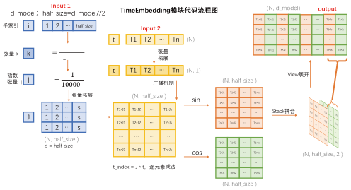
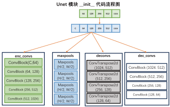
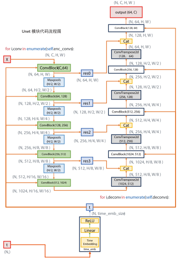
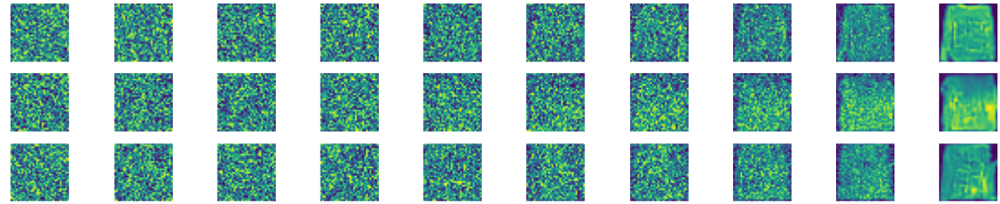
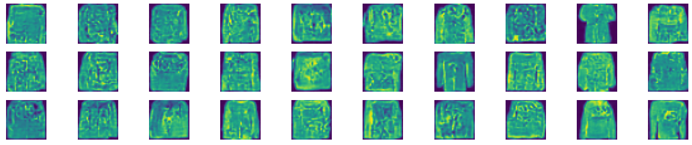

# 基于DDPM实现图像生成项目

本项目将利用PyTorch手动实现一个图像生成项目，数据集使用**FASHION-MNIST**，项目结构如下：

```
data                        # 数据集下载目录
├──MNIST
├──FASHION_MNIST
└──CIFAR10
model                       # 模型实现
└── PTH                     # 训练完成的权重
|   ├── number_model.pt     # MNIST数据集结果
|   ├── fashion_model.pt    # FASHION_MNIST结果
|   └── CIFAR_model.pt      # CIFAR10数据集结果
├── config.py               # 配置文件
├── conv_block.py           # 卷积块
├── dataset.py              # 数据集定义
├── denoise.py              # 去噪
├── noise.py                # 加噪
├── TimeEmbedding.py        # 时间步嵌入生成
└── unet.py                 # Unet网络定义
train.py                    # 训练入口
inference.py                # 推理入口
```


## 超参数配置

这部分代码由**config.py**文件实现，主要定义了DDPM的各种超参数：

```python
import torch 

# === 图像相关参数 ===
IMG_SIZE=32             # 图像尺寸
IMG_CHANNEL= 1          # 图像通道数，彩色图像为3，灰度图像为1

# === 训练相关参数 ===
T=1000                  # 加噪最大步数
TIME_EMB_SIZE=256       # Time时刻emb的维度
EPOCH=1000              # 训练轮数
BATCH_SIZE=64           # 批次大小
LEARNING_RATE = 1e-4    # 学习率

# 训练设备
DEVICE = "cuda" if torch.cuda.is_available() else "cpu" 

# 模型保存路径
MODEL_PTH = './model/PTH/fashion_model.pt'

```

噪声系数等，定义以下超参数：

- $\alpha_t = 1- \beta_t, \quad \beta_t,t \in [0,T]$

- $\bar{\alpha}_t = \prod_T \alpha_t$

构造两个列表来存储 $\alpha_t$ 和 $\alpha_{t-1}$，这样可以巧妙的通过一个索引来同时得到`t`和`t-1`的值，“以空间换时间”。
```python
# === 噪音相关参数 ===
# 线性beta调度器，beta_t从0.0001线性增加到0.02
betas=torch.linspace(0.0001,0.02,T).to(DEVICE)
# 计算alpha
alphas=1-betas
# 计算各时间步的alpha累乘 
# [a1,a1*a2,a1*a2*a3,.....]
alphas_cumprod=torch.cumprod(alphas,dim=-1)   
# 计算各时间步的alpha累乘的前一个时间步 
# [1,a1,a1*a2,a1*a2*a3,.....]
alphas_cumprod_prev=torch.cat(
    (
        torch.tensor([1.0], device=DEVICE),
        alphas_cumprod[:-1]),
        dim=-1
    )
# denoise用的方差
variance = (1 - alphas_cumprod_prev) / (1 - alphas_cumprod) * betas
```

## 数据集载入

这部分代码由**dataset.py**文件实现，主要完成图像数据与Tensoer互相转换、数据集载入：


```python
import random
import torchvision
from torchvision import transforms 
import matplotlib.pyplot as plt
from .config import *
```

PIL转Tensoer，将所有图片尺寸统一，像素归一化到[0, 1]，张量形状变成[C, H, W]，符合Torch格式。
```python
# PIL转Tensoer
pil_to_tensor=transforms.Compose([
    # PIL图像尺寸统一  
    transforms.Resize((IMG_SIZE,IMG_SIZE)),
    # PIL图像转tensor, (H,W,C) ->（C,H,W）,像素值[0,1]
    transforms.ToTensor()
])
```
Tensoer转PIL，将张量还原取整，重新变成PIL对象。
```python
# Tensoer转PIL
tensor_to_pil=transforms.Compose([
    # 像素还原
    transforms.Lambda(lambda t: t*255),
    # 像素值取整
    transforms.Lambda(lambda t: t.type(torch.uint8)),
    # tensor转回PIL图像, (C,H,W) -> (H,W,C) 
    transforms.ToPILImage(),
])
```

数据集的加载（二选一），本例使用FASHION-MNIST数据集进行训练：
```python
# user_dataset=torchvision.datasets.MNIST(
#     root="./data",
#     train=True,
#     download=True,
#     transform=pil_to_tensor
#     ) 

user_dataset = torchvision.datasets.FashionMNIST(
    './data', 
    train=True, 
    download=True, 
    transform=pil_to_tensor
    )

```

模块测试，随机选择100条数据进行可视化：
```python
if __name__=='__main__':
    print("数据集信息:")
    print(user_dataset)

    # 随机选择100个样本
    indices = random.sample(range(len(user_dataset)), 100)

    # 绘制10x10网格
    plt.figure(figsize=(10, 10))

    for i, idx in enumerate(indices):
        image, label = user_dataset[idx]
        pil_image = tensor_to_pil(image)
        
        plt.subplot(10, 10, i + 1)
        plt.imshow(pil_image)
        plt.axis('off')

    plt.tight_layout()
    plt.show()
```
执行以下命令进行单元测试：
```bash
python -m model.dataset
```
以**FASHION_MNIST**数据集为例，输出如下：


## 加噪
这部分代码在**noise.py**中实现，完成对给定数据添加噪声的功能

根据加噪公式，直接计算第$t$时刻的加噪后图像：

$$
x_t = \sqrt{\bar{\alpha}_t}\cdot x_0 + \sqrt{1-\bar{\alpha}_t} \cdot \varepsilon
$$

导入依赖
```python
import random
import torch 
from .config import *
from .dataset import tensor_to_pil,user_dataset
import matplotlib.pyplot as plt 
```

定义前向加噪函数
```python
# 定义前向加噪函数
def forward_diffusion(batch_x,batch_t): 
    '''
    batch_x: (batch,channel,height,width)
    batch_t: (batch_size,)
    '''
    # 生成第t步的高斯噪音   
    # (batch,channel,width,height)
    batch_noise_t=torch.randn_like(batch_x)
    # 将系数维数调整到和batch一致
    batch_alphas_cumprod=alphas_cumprod[batch_t].view(
        batch_x.size(0),1,1,1
        ) 
    # 按公式加噪
    batch_x_t=torch.sqrt(batch_alphas_cumprod)*batch_x \
        +torch.sqrt(1-batch_alphas_cumprod)*batch_noise_t
    # 输出加噪后的图像和噪音
    return batch_x_t,batch_noise_t
```

单元测试，随机抽取10张图片，展示其加噪过程：

```python
if __name__=='__main__':
    # 随机选择10个样本
    indices = random.sample(range(len(user_dataset)), 10)
    image_list = [user_dataset[idx][0] for idx in indices]
    # 拼成一个batch
    batch_x = torch.stack(image_list, dim=0).to(DEVICE)
    # 像素值范围调整到[-1,1]
    batch_x = batch_x * 2 - 1
    # 绘制加噪过程
    plt.figure(figsize=(10,10))
    # 选择10个时间步
    t_list = range(0,T,int(T/10))
    # 对每个样本，绘制10个时间步的加噪结果
    for img_idx in range(10):
        original_img = batch_x[img_idx:img_idx+1, :, :, :] 
        # 每行绘制一个样本
        for col_idx, t in enumerate(t_list):
            batch_t = torch.full(
                (original_img.size(0),), 
                t, 
                dtype=torch.long, 
                device=DEVICE
                )
            # 前向加噪
            noisy_img, _ = forward_diffusion(original_img, batch_t)
            # 图片展示位置
            subplot_pos = img_idx * 10 + col_idx + 1
            ax = plt.subplot(10, 10, subplot_pos)
            
            pil_img = tensor_to_pil((noisy_img[0] + 1) / 2)
            ax.imshow(pil_img)
            # 关闭坐标轴，让图片更干净
            ax.axis('off')
    plt.show()
```
执行以下命令进行单元测试：
```bash
python -m model.noise
```
测试加噪结果：


## 时间步嵌入
回顾时间步向量公式：
$$
\begin{align*}
& PE(t,2i) = sin(\frac{t}{10000^k}) \\
& PE(t,2i+1) = cos(\frac{t}{10000^k}) \\
& k=\frac{2i}{d_{model}}
\end{align*}
$$

构建该向量需要向量维数 $d_{model}$，时间步 $t$，计算向量每个元素时需要位置索引 $i$。

以一个十维向量$d_{model}=10$为例，它第$t=100$时的向量可计算为：

|元素索引|0|1|2|3|4|5|6|7|8|9|
|---|---|---|---|---|---|---|---|---|---|---|
|i|0|0|1|1|2|2|3|3|4|4|
|k|0|0|0.2|0.2|0.4|0.4|0.6|0.6|0.8|0.8|
|$PE(t,x)$|sin0|cos0|sin0.2|cos0.2|sin0.4|cos0.4|sin0.6|cos0.6|sin0.8|co0.8|

其中：$i=\frac{index}{2}/\frac{index-1}{2}$，$k=\frac{2i}{d_{model}}$

观察发现时间向量两两成对，在奇数时利用$sin x$，偶数时利用$cosx$，因此我们可以创建一个大小为$d_{model}/2$的索引序列，生成`[sin i,cos i]`，再将其拼接即可得到完整的时间向量。

以下代码在**TimeEmbedding.py**中实现：

```python
import torch 
from torch import nn 
import math 
from config import *

class TimeEmbedding(nn.Module):
    def __init__(self,d_model):
        super().__init__()

        # d_model是时间向量维度，在config中定义
        self.d_model=d_model
        # 半索引张量的大小
        self.half_size=d_model//2

        # 生成半索引张量    [0,1,2,...,d_model/2-1]
        i = torch.arange(self.half_size)
        # 计算k张量         k=2i/d_model
        k = i / (self.half_size)
        # 计算指数张量      j=1/10000^k
        j = torch.exp(k * (-1*math.log(10000)))
        # 结果存为buffer
        self.register_buffer('J',j)

    def forward(self,t):
        # 将 t 扩展成二维张量
        t=t.view(t.size(0),1)
        # 将系数 J 扩展为与t同批次大小的张量
        J=self.J.unsqueeze(0).expand(t.size(0),self.half_size)
        # 计算t时刻的时间嵌入系数
        t_index = J * t
        # 计算sin和cos值
        sin_vals = (t_index).sin()
        cos_vals = (t_index).cos()
        # 拼接sin和cos值，得到最终的时间嵌入
        embedding = torch.stack([sin_vals, cos_vals], dim=2)
        embedding = embedding.view(t.size(0), self.d_model)

        # 生成的张量大小为： (N, time_emb_size)
        return embedding
```
单元测试，将输出大小为的十维的两个给定时间步的时间步张量：
```python
if __name__=='__main__':
    time_pos_emb=TimeEmbedding(10).to(DEVICE)
    t = torch.tensor([100,12], device=DEVICE)
    print("t: ",t)
    print("==========================")
    embedding=time_pos_emb(t) 
    print("embedding: ",embedding)
```
执行以下命令进行单元测试：
```bash
python -m model.TimeEmbedding
```
输出结果：
```python
t:  tensor([100,  12])
==========================
embedding:  tensor([[-0.5064,  0.8623, -0.1405, -0.9901,  0.5889, -0.8082,  0.3877,  0.9218,
          0.0631,  0.9980],
        [-0.5366,  0.8439,  0.9457, -0.3251,  0.2969,  0.9549,  0.0478,  0.9989,
          0.0076,  1.0000]])
```

TimeEmbedding代码的流程图如下，该算法巧妙的使用“半长度索引”同时计算了$sin$和$cos$，最后通过张量变形把各组互相拼接即可：


## 单层卷积块
此部分代码实现在**conv_block.py**，完成UNet的每一层卷积操作的实现：
```python
from torch import nn

class ConvBlock(nn.Module):
    def __init__(self,in_channel,out_channel,time_emb_size):
        '''
            in_channel：    输入通道数
            out_channel：   输出通道数
            time_emb_size： 时间向量大小（超参数中定义）
        '''
        super().__init__()

        # 改通道数,不改大小
        self.seq1 = nn.Sequential(
            # 第一次卷积操作，使用out_channel个卷积核计算
            nn.Conv2d(
                in_channel,
                out_channel,
                kernel_size=3,
                stride=1,
                padding=1
                ), 
            # 对所有通道分组（32组），归一化计算
            nn.GroupNorm(32,out_channel),
            # 使用更平滑的SiLU激活函数
            nn.SiLU(),
        )

        # 时间向量过一个线性层，把向量大小变成out_channel
        # (N, time_emb_size) -> (N, out_channel)
        self.time_emb_linear=nn.Linear(
            time_emb_size,
            out_channel
            )

        # 创建SiLU激活层
        self.silu=nn.SiLU()

        # 第二次特征提取 
        self.seq2=nn.Sequential(
            # 不改变张量尺寸 -> (N, C, H, W)
            nn.Conv2d(
                out_channel,
                out_channel,
                kernel_size=3,
                stride=1,
                padding=1
                ), 
            # 同样进行归一化操作
            nn.GroupNorm(32,out_channel),
            # SiLU激活函数
            nn.SiLU(),
        )

        # 残差结构,如果in_channel和out_channel不一样；
        # 用1x1卷积改通道数
        if in_channel != out_channel:
            self.residual = nn.Conv2d(
                in_channel,
                out_channel, 
                kernel_size=1
                )
        else:
            self.residual = nn.Identity()


    def forward(self,x,t_emb):
        '''
            x：     输入的批次张量(N, C, H, W)
            t_emb： 时间步张量(N,C)
        '''
        # 先计算输入x的残差
        residual = self.residual(x)

        # 改通道数,不改大小
        x=self.seq1(x)  

        # time_emb转成channel宽,加到每个像素点上
        # view变换：(N, t_emb_size) -> (N, out_channel, 1, 1)
        t_emb=self.silu(
            self.time_emb_linear(t_emb)
            ).view(x.size(0),x.size(1),1,1)
        
        # 图像数据与时间张量直接相加后进行二次特征提取
        # Torch广播机制会将t_emb在H、W维度上复制扩展
        x=self.seq2(x+t_emb)
        # 最终结果与残差直接相加
        output = x + residual
        # 大小 (N, out_channel, H, W)
        return output
```
单层卷积块的代码流程图如下，图中展示了各模块张量形状的变化：


## Unet网络
此部分代码实现在**unet.py**中，主要定义了UNet预测网络的结构和前向传播路径：

导入依赖：
```python
import torch 
from torch import nn 
from .config import * 
from .TimeEmbedding import TimeEmbedding
from .conv_block import ConvBlock
```
定义UNent结构：
```python
class UNet(nn.Module):
    def __init__(self,img_channel,
                 channels=[64, 128, 256, 512, 1024],
                 time_emb_size=256):
        '''
        img_channel:    图像通道数
        channels:       每层采样的通道列表
        time_emb_size:  时间向量大小
        '''
        super().__init__()

        # 把图像通道数加在列表最前面
        channels=[img_channel]+channels
        
        # time转embedding
        self.time_emb=nn.Sequential(
            # 生成时间步向量，大小 (N, time_emb_size)
            TimeEmbedding(time_emb_size),
            # 过一个线性层
            nn.Linear(time_emb_size,time_emb_size),
            # ReLU激活
            nn.ReLU(),
        )

        # === encoder部分 === #

        # 每个encoder conv block增加一倍通道数
        # 创建卷积列表
        self.enc_convs=nn.ModuleList()
        # 取通道数
        for i in range(len(channels)-1):
            # 添加[in_channel, out_channel]卷积
            self.enc_convs.append(
                ConvBlock(
                    channels[i],
                    channels[i+1],
                    time_emb_size
                    )
                )
        
        # 创建池化层列表
        self.maxpools=nn.ModuleList()
        # 每个encoder conv后马上缩小一倍图像尺寸
        # 最后一个conv后不缩小
        for i in range(len(channels)-2):
            self.maxpools.append(
                nn.MaxPool2d(
                    kernel_size=2,
                    stride=2,
                    padding=0
                    )
                )
        
        # === decoder部分 === #
        
        # 每个decoder conv前放大一倍图像尺寸，缩小一倍通道数
        self.deconvs=nn.ModuleList()
        for i in range(len(channels)-2):
            self.deconvs.append(
                nn.ConvTranspose2d(
                    channels[-i-1],
                    channels[-i-2],
                    kernel_size=2,
                    stride=2
                    )
                )

        # 每个decoder conv block减少一倍通道数
        self.dec_convs=nn.ModuleList()
        for i in range(len(channels)-2):
            self.dec_convs.append(
                ConvBlock(
                    channels[-i-1],
                    channels[-i-2],
                    time_emb_size
                    )
                )

        # 还原通道数,尺寸不变
        self.output=nn.Conv2d(
            channels[1],
            img_channel,
            kernel_size=1,
            stride=1,
            padding=0
            )
```
在类的初始化阶段，会根据输入的通道数列表生成四个数组，内含各层的神经网络模块，如下：

在前向传播过程中，将会对各个模块进行遍历拼接，代码如下：
```python
    def forward(self,x,t):
        # time生成embedding (N, time_emb_size)
        t_emb=self.time_emb(t)
        
        # encoder阶段
        # 存储残差连接
        residual=[]
        # 此时的enc_convs存储的是一系列卷积层
        for i,conv in enumerate(self.enc_convs):
            # 先卷积
            x=conv(x,t_emb)
            # 把结果存入残差列表
            if i!=len(self.enc_convs)-1:
                residual.append(x)
                # 对卷积再加一个最大池化
                x=self.maxpools[i](x)
            
        # decoder阶段
        for i,deconv in enumerate(self.deconvs):
            # 还是先卷积
            x=deconv(x)
            # 再取出对应的编码器输出进行残差连接
            residual_x=residual.pop(-1)
            # 选择对应第i个卷积块
            x=self.dec_convs[i](
                # 残差特征和x在C通道维度上拼接
                # 输出尺寸：(N, C_res+C_x, H, Ws)
                torch.cat((residual_x,x),dim=1),
                t_emb
                )

        # 还原通道数
        return self.output(x) 
```
下图清晰的表示了代码各个阶段张量数据的形状：

首先接受一维张量`t`，他表示每个批次的时间步。经过TimeEmbedding后形状变成$(N, time_emb_size)$，以张量形式保存了N个时间向量，随后进入输入输出等长的线性层和ReLU层，最后将被作为各个阶段的时间步嵌入UNet中。

在左侧下采样阶段，输入的数据张量`X`在经过`ConvBlock`卷积层后通道数加倍，形状不变，经过`Maxpools`池化层后通道数不变而大小减半，同时每个卷积层的输出将被保存到`Residual`残差列表，在上采样时使用。

最后一层卷积后形状变为 $(N, 1024, H/16, W/16)$，它不在进行池化而直接输入上采样过程。在此注意到，最后一次卷积的图像形状是原始的 $\frac{1}{16}$ ，也就要求**输入图像大小要是16的整数倍**，否则会出现计算错误。

在上采样阶段，每个`ConvTranspose2d`转置卷积层将使张量通道数减半且图像扩大2倍，输出与对应下采样的残差进行通道拼接，此时的通道数再次翻倍，和输入时一致，拼接后进行一次`ConvBlock`卷积，这时通道数减半而大小不变。

经过四次循环后，张量输出为 $(N, 64, H, W)$，最后经过`output`的`Conv2d`卷积层，使得通道数和输入`UNe`t时的一致。




## 训练

```python
from model.config import *
from torch.utils.data import DataLoader
from model.dataset import user_dataset
from model.unet import UNet
from model.noise import forward_diffusion
import torch 
from torch import nn 
import os 
from tqdm import tqdm
from torch.optim.lr_scheduler import CosineAnnealingLR
```
加载数据集，定义优化器，设置学习率调度器，定义损失函数。
```python
# 数据加载器
dataloader=DataLoader(
    user_dataset,
    batch_size=BATCH_SIZE,
    num_workers=4,
    persistent_workers=True,
    shuffle=True
    )   

# 导入模型
model=UNet(IMG_CHANNEL,time_emb_size=TIME_EMB_SIZE).to(DEVICE)

# 优化器
optimizer=torch.optim.Adam(model.parameters(),lr=LEARNING_RATE)
# 学习率调度器
scheduler = CosineAnnealingLR(optimizer, T_max=EPOCH, eta_min=1e-6)
# 损失函数
loss_fn=nn.MSELoss() 
```
以下为所运行的main函数：
```python
if __name__=='__main__':
    model.train()
    print(model)
    print("开始训练")
    print(f"数据集样本数: {len(user_dataset)}")
    print(f"训练轮数: {EPOCH}, 批次大小: {BATCH_SIZE}, 每轮批次数: {len(dataloader)}")
    print(f"训练设备: {DEVICE}")
    print("模型结构:", model)

    for epoch in range(EPOCH):
        last_loss=0

        loop = tqdm(enumerate(dataloader), total=len(dataloader), leave=True)
        loop.set_description(f"Epoch [{epoch+1}/{EPOCH}]")


        for i, data in loop:
            # 图像的像素范围转换到[-1,1],和高斯分布对应
            batch_x=data[0].to(DEVICE)*2-1
            # 为每张图片生成随机t时刻
            batch_t=torch.randint(0,T,(batch_x.size(0),)).to(DEVICE)
            # 生成t时刻的加噪图片和对应噪音
            batch_x_t,batch_noise_t=forward_diffusion(batch_x,batch_t)
            # 模型预测t时刻的噪音
            batch_predict_t=model(batch_x_t,batch_t)
            # 求损失
            loss=loss_fn(batch_predict_t,batch_noise_t)

            # 优化参数
            optimizer.zero_grad()
            loss.backward()
            optimizer.step()
            
            # 记录loss
            last_loss+=loss.item()
            loop.set_postfix(loss=loss.item())
        # 更新学习率
        scheduler.step()
        # 计算并打印平均loss
        epoch_loss = last_loss / len(dataloader)
        # 获取当前学习率
        current_lr = scheduler.get_last_lr()[0]
        print(f'Epoch [{epoch+1}/{EPOCH}] Finished.  \
              LR: {current_lr:.6f}\n, Average Loss: {epoch_loss:.4f}')

        # 保存一次模型
        torch.save(model.state_dict(),'model.pt.tmp')
        os.replace('model.pt.tmp',MODEL_PTH)
```
每一轮的输出如下：
```bash
Epoch [41/1000]: 100%|████████████████████████████████| 938/938 [00:38<00:00, 24.52it/s, loss=0.0256]
Epoch [41/1000] Finished.                LR: 0.000100
```

## 去噪
以下代码在**denoise.py**中实现，完成从噪声中去噪，并返回一个包含各个时间步去噪数据的列表
```python
import torch 
from .config import *
from .noise import *


def backward_denoise(model, batch_x_t):
    '''
    逐步去噪，返回所有步骤
    model:      训练好的去噪模型
    batch_x_t:  从标准正态分布中随机采样的纯噪声
    '''
    # step列表保存每一个T的结果
    steps = [batch_x_t,]

    global alphas, alphas_cumprod, betas
    model = model.to(DEVICE)

    
    # 评估模式，不启用dropout等
    model.eval()
    # 禁用 PyTorch 的梯度计算功能
    with torch.no_grad():
        # 从 T-1 倒计时到 0 进行去噪
        for t in range(T-1, -1, -1):
            batch_t = torch.full((batch_x_t.size(0),), t).to(DEVICE)
            # 带噪声图片 batch_x_t，时间步 batch_t
            # 得到预测的噪声
            batch_predict_noise_t = model(batch_x_t, batch_t)
            
            shape = (batch_x_t.size(0), 1, 1, 1)
            batch_mean_t = 1 / torch.sqrt(alphas[batch_t].view(*shape)) * (
                batch_x_t - (1 - alphas[batch_t].view(*shape)) / 
                torch.sqrt(1 - alphas_cumprod[batch_t].view(*shape)) * batch_predict_noise_t
            )

            # 如果t>0，加入随机噪声；如果t=0，直接返回均值
            if t != 0:
                sigma_t = torch.sqrt(betas[batch_t].view(*shape))
                batch_x_t = batch_mean_t + torch.randn_like(batch_x_t) * sigma_t
            else:
                batch_x_t = batch_mean_t
            
            batch_x_t = torch.clamp(batch_x_t, -1.0, 1.0).detach()
            steps.append(batch_x_t)
    # 包含了从 x_T (纯噪声) 到 x_0 (清晰图片) 的所有中间状态
    return steps
```


## 推理
以下代码在**inference.py**中实现，利用训练好的模型进行推理，也就是生成新的图片，首先导入包：
```python
from model.config import *
from model.denoise import backward_denoise
from matplotlib import pyplot as plt
from model.unet import UNet
```
以下函数实现，展示n张图片逐步去噪的过程：
```python
def denoise_process(model, batch_size=10, num_imgs=10):
    '''
    生成去噪过程的所有步骤
    model：         训练好的模型
    batch_x_t：     初始随机噪声
    batch_size：    生成多少张图片
    num_imgs：      展示多少步去噪
    '''
    print("模型已加载，开始生成！")
    # 一批次batch_size个随机噪声
    batch_x_t=torch.randn(size=(batch_size,IMG_CHANNEL,IMG_SIZE,IMG_SIZE)).to(DEVICE)
    # 逐步去噪得到原图
    steps=backward_denoise(model,batch_x_t)
    # 绘制去噪步数
    print(f"图片生成完毕，正在展示...")

    # 设置绘图尺寸
    plt.figure(figsize=(batch_size * 1.5, num_imgs * 1.5))
    # 绘制还原过程
    for b in range(batch_size):
        for i in range(0,num_imgs):
            idx=int(T/num_imgs)*(i+1)
            # 像素值还原到[0,1]
            img_tensor=(steps[idx][b].to('cpu')+1) / 2
            # 插入子图
            plt.subplot(batch_size,num_imgs,b*num_imgs+i+1)
            # 转换为 (H, W, C) 格式以正确显示
            plt.imshow(img_tensor.permute(1,2,0))
            # 关闭坐标轴，让图片更干净
            plt.axis('off')
    plt.show()

```
以下函数实现，生成n张模型创作图片：
```python
def denoised(model, row=10, col=10):
    '''
    直接生成row*col张图片
    model：        训练好的模型
    row：          网格行数
    col：          网格列数
    '''
    print("模型已加载，开始生成！")
    # 一批次batch_size个随机噪声
    batch_x_t=torch.randn(size=(row*col,IMG_CHANNEL,IMG_SIZE,IMG_SIZE)).to(DEVICE)
    # 逐步去噪得到原图
    steps=backward_denoise(model,batch_x_t)
    # 只取最后一步结果
    final_results = steps[-1]
    print(f"{row*col}张图片生成完毕，正在展示...")

    # 设置绘图尺寸
    plt.figure(figsize=(col * 1.5, row * 1.5))
    # 绘制还原过程
    for i in range(row * col):
        # 获取单张图片的张量
        img_tensor = final_results[i]
        # 将张量从GPU移到CPU（如果需要）
        # 将像素值从[-1, 1]还原到[0, 1]
        img_tensor = (img_tensor.to('cpu') + 1) / 2.0
        # 创建子图
        plt.subplot(row, col, i + 1)
        # 转换为 (H, W, C) 格式以正确显示
        plt.imshow(img_tensor.permute(1, 2, 0)) 
        # 关闭坐标轴，让图片更干净
        plt.axis('off')
    plt.show()

```
主程序入口：
```python
if __name__=='__main__':
    # 加载模型
    model = UNet(IMG_CHANNEL, time_emb_size=TIME_EMB_SIZE).to(DEVICE)
    # 根据设备加在模型参数
    model.load_state_dict(
        torch.load(
            MODEL_PTH, 
            weights_only=True, 
            map_location=DEVICE
            ))

    denoise_process(model)
    denoised(model)

```

最终生成效果图如下：

逐步去噪展示

生成30张效果图


由此可以得出，我们的Diffusion Model成功的学习到了图像特征，并且能够生成图像。