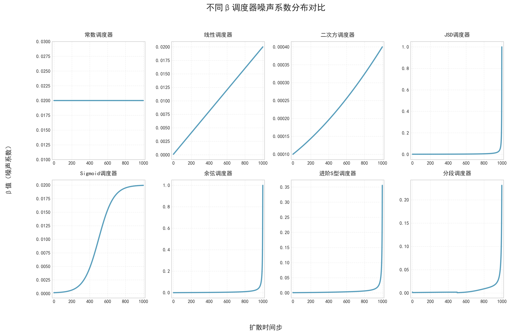
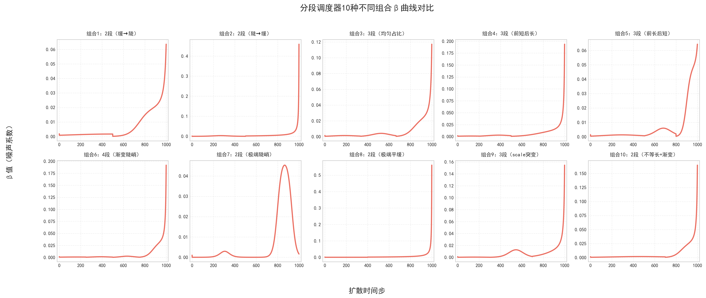

# beta调度器

复习一下扩散模型的计算过程：

**前向加噪**，已知$x_0$，直接计算第$t$时刻的加噪后图像：

$$
x_t = \sqrt{\bar{\alpha}_t}\cdot x_0 + \sqrt{1-\bar{\alpha}_t} \cdot \varepsilon
$$

**反向去噪**，已知$x_t$，根据模型预测的噪声得到下一时间步的数据：

$$
x_{t-1} = \frac{1}{\sqrt{\alpha_t}} [x_t - \frac{\beta_t}{\sqrt{1-\bar{\alpha}_t}} \cdot \varepsilon_ \theta(x_t,t)] + \sigma_t \cdot z
$$

- $\alpha_t = 1- \beta_t, \quad \beta_t,t \in [0,T]$

- $\bar{\alpha}_t = \prod_T \alpha_t$

- 噪声强度：$\sigma_t = \sqrt{\frac{1-\bar{\alpha}_{t-1}}{1-\bar{\alpha}_t}(1-\alpha_t)}$

- 随机噪声：$z \thicksim \mathcal{N}(0,1)$


在两个公式中涉及的系数 $\alpha_t$ 可以由 $\beta_t$ 推导出，也就是需要定义 $T$ 个超参数，$[\beta_0,\beta_1,\cdots , \beta_T]$。

具体的超参数$\beta$无需全部手动设置，在给定$\beta_{start}$和 $\beta_{end}$后，利用噪声调度策略生成序列。这里就涉及到如何生成$\beta$参数的问题，介绍几种常用的调度策略。

## 调度器类型

### 常数调度器

常数调度器是最简单的一种，即每个$\beta$均为相同的常数，要生成$\beta$序列可以：

$$
\beta_t = \beta_{\text{end}}, \quad \forall t \in [1, T]
$$

```python
@register_schedule(name="constant")
def const_schedule(num_timesteps: int, kwargs: Dict[str, Any]) -> np.ndarray:
    """常数调度器"""
    assert "beta_end" in kwargs, f"constant调度器必须传入 beta_end 参数"
    betas = np.full(num_timesteps, kwargs["beta_end"], dtype=np.float64)
    return betas
```

### 线性调度器

线性调度器需要设定起始值和结束值，并按步长将时间段分为多个等间隔均匀序列：

$$
\beta_t = \beta_{\text{start}} + \frac{t-1}{T-1} \cdot \left( \beta_{\text{end}} - \beta_{\text{start}} \right)
$$

```python
@register_schedule('linear')
def linear_schedule(num_timesteps: int, kwargs: Dict[str, Any]) -> np.ndarray:
    """线性调度器"""
    assert "beta_start" in kwargs, f"linear调度器必须传入 beta_start 参数"
    assert "beta_end" in kwargs, f"linear调度器必须传入 beta_end 参数"
    betas = np.linspace(kwargs["beta_start"], kwargs["beta_end"], num_timesteps, dtype=np.float64)
    return betas
```

### 平方调度器

在β的平方根空间做线性插值，再平方还原，使β呈“先慢后快”的非线性增长。

$$
\beta_t = \left( \sqrt{\beta_{\text{start}}} + \frac{t-1}{T-1} \cdot \left( \sqrt{\beta_{\text{end}}} - \sqrt{\beta_{\text{start}}} \right) \right)^2
$$

```python
@register_schedule('quad')
def quad_schedule(num_timesteps: int, kwargs: Dict[str, Any]) -> np.ndarray:
    """二次方调度器"""
    assert "beta_start" in kwargs, f"quad调度器必须传入 beta_start 参数"
    assert "beta_end" in kwargs, f"quad调度器必须传入 beta_end 参数"
    betas = np.linspace(np.sqrt(kwargs["beta_start"]), kwargs["beta_end"], num_timesteps, dtype=np.float64) **2
    return betas
```

### JSD调度器

β值与时间步成反比，随时间步增大线性递增$[\frac{1}{T}, 1]$。总时间步$T$

$$
\beta_t = \frac{1}{T - t + 1}, \quad t \in [1, T]
$$

```python
@register_schedule('jsd')
def jsd_schedule(num_timesteps: int, kwargs: Dict[str, Any]) -> np.ndarray:
    """JSD调度器"""
    return (1.0 / np.linspace(num_timesteps, 1, num_timesteps, dtype=np.float64))
```

### Sigmoid调度器
基于Sigmoid函数实现β值的“S型”增长（慢→快→慢），需要先将$x_t$线性映射到$[-s, s]$的时间步变量，再对$x_t$计算Sigmoid函数。

$$
\begin{align*}
x_t &= -s + \frac{2s(t-1)}{T-1} \\[6pt]
\sigma(x) &= \frac{1}{1 + e^{-x}} \\[6pt]
\beta_t &= \sigma(x_t) \cdot (\beta_{\text{end}} - \beta_{\text{start}}) + \beta_{\text{start}}
\end{align*}
$$

```python
@register_schedule('sigmoid')
def sigmoid_schedule(num_timesteps: int, kwargs: Dict[str, Any]) -> np.ndarray:
    """Sigmoid调度器"""
    assert "beta_start" in kwargs, f"sigmoid调度器必须传入 beta_start 参数"
    assert "beta_end" in kwargs, f"sigmoid调度器必须传入 beta_end 参数"
    # 默认sigmoid系数s=6
    s = kwargs.get('s', 6)
    # 线性时间序列
    x = np.linspace(-s, s, num_timesteps, dtype=np.float64)
    betas = (sigmoid(x) * (kwargs["beta_end"] - kwargs["beta_start"]) + kwargs["beta_start"]).astype(np.float64)
    return betas
```

### 余弦调度器
基于余弦函数生成累积$\alpha$值，再推导$\beta$值，$\beta$值先慢后快，无明显突变。

总时间步$T$，平滑参数$s$，扩散过程的保留系数$\alpha_t = 1 - \beta_t$，累积保留系数，$\bar{\alpha}_t = \prod_{i=1}^t \alpha_i$

首先生成生成包含0的扩展时间步：
$$
x_k = k, \quad k \in [0, T+1]
$$
计算累积$\alpha$值：
$$
\bar{\alpha}_k = \frac{\cos\left( \frac{\frac{x_k}{T+1} + s}{1 + s} \cdot \frac{\pi}{2} \right)^2}{\cos\left( \frac{s}{1 + s} \cdot \frac{\pi}{2} \right)^2}
$$
再计算出$\beta$值：
$$
\beta_t = 1 - \frac{\bar{\alpha}_t}{\bar{\alpha}_{t-1}}, \quad \beta_t \in [0, 0.999]
$$
```python
@register_schedule('cosine')
def cosine_schedule(num_timesteps: int, kwargs: Dict[str, Any]) -> np.ndarray:
    """余弦调度器"""
    kwargs = kwargs or {}
    # 默认平滑参数s=0.008
    s = kwargs.get('s', 0.008)
    # 含0的扩展总时间步数
    steps = num_timesteps + 1
    # 生成线性序列
    x = np.linspace(0, steps, steps, dtype=np.float64)
    # 计算alphas
    alphas_cumprod = np.cos(((x / steps) + s) / (1 + s) * np.pi * 0.5) **2
    alphas_cumprod /= alphas_cumprod[0]
    # 计算betas序列
    betas = 1 - (alphas_cumprod[1:] / alphas_cumprod[:-1])
    return np.clip(betas, 0.0, 0.999).astype(np.float64)
```

### 进阶S型调度器
可以自定义陡峭度的S型累积$\alpha$值，再推导$\beta$值，更灵活控制增长曲线。

总时间步$T$，起始累积$\bar{\alpha}_{start}$值$A_1$，终止累积$\bar{\alpha}_{end}$值$A_0$，S型曲线的陡峭度参数$k$。

将离散时间线性映射到$[-1, 1]$区间：
$$
x_t = -1 + \frac{2(t-1)}{T-1}
$$

使用缩放平移后的 Sigmoid 曲线计算累积保留系数$\bar{\alpha}_t$：
$$
\bar{\alpha}_t = a \cdot \sigma(-k \cdot x_t) + b, \quad \sigma(x) = \frac{1}{1 + e^{-x}} \\[6pt]
$$

其中缩放平移系数a,b：
$$
a = \frac{A_0 - A_1}{\sigma(-k) - \sigma(k)}, \quad b = 0.5(A_0 + A_1 - a)
$$

计算β值（同余弦调度器）：
$$
\beta_t = 1 - \frac{\bar{\alpha}_t}{\bar{\alpha}_{t-1}}, \quad \beta_t \in [0, 0.999]
$$
```python
@register_schedule('advance')
def advance_schedule(num_timesteps: int, kwargs: Dict[str, Any], return_alphas_bar: bool=False):
    """进阶S型调度器"""
    assert "scale_start" in kwargs, f"advance调度器必须传入 scale_start 参数"
    assert "scale_end" in kwargs, f"advance调度器必须传入 scale_end 参数"
    assert "width" in kwargs, f"advance调度器必须传入 width 参数"
    k = kwargs['width']
    A0 = kwargs['scale_end']
    A1 = kwargs['scale_start']
    # 计算缩放系数
    a = (A0-A1)/(sigmoid(-k) - sigmoid(k))
    b = 0.5 * (A0 + A1 - a)
    # 生成线性映射的时间步
    x = np.linspace(-1, 1, num_timesteps)
    # 计算时间步的sigmoid值
    y = a * sigmoid(- k * x) + b
    # 累计alphas值
    alphas_cumprod = y
    # 根据累计alphas计算alpha
    alphas = np.zeros_like(alphas_cumprod)
    alphas[0] = alphas_cumprod[0]
    alphas[1:] = alphas_cumprod[1:] / alphas_cumprod[:-1]
    # 计算betas序列
    betas = 1 - alphas
    betas = np.clip(betas, 0, 1)

    if not return_alphas_bar:
        return betas
    else:
        return betas, alphas_cumprod
```

### 分段调度器
将总时间步拆分为多段，每段使用进阶S型调度器，实现混合增长曲线。

对每段独立生成累积$\alpha$值：$\bar{\alpha}_{i,1:T_i} = (T_i, \text{kwargs}_i)$，再拼接所有分段的累积$\alpha$值：$\bar{\alpha}_{\text{total}} = [\bar{\alpha}_{1,1}, ..., \bar{\alpha}_{1,T_1}, \bar{\alpha}_{2,1}, ..., \bar{\alpha}_{n,T_n}]$

推导全局β值：
$$
\beta_t = 1 - \frac{\bar{\alpha}_{\text{total},t}}{\bar{\alpha}_{\text{total},t-1}}
$$
```python
@register_schedule('segment')
def segment_schedule(num_timesteps: int, kwargs: Dict[str, Any]) -> np.ndarray:
    """分段调度器"""
    time_segment: List[int] = kwargs['time_segment']
    segment_diff: List[Dict[str, Any]] = kwargs['segment_diff']
    assert np.sum(time_segment) == num_timesteps, "分段时间总和不匹配"
    alphas_cumprod = []

    for i in range(len(time_segment)):
        time_this = time_segment[i] + 1
        params = segment_diff[i]
        _, alphas_this = advance_schedule(
            num_timesteps=time_this,
            kwargs=params,
            return_alphas_bar=True
        )
        alphas_cumprod.extend(alphas_this[1:])
    
    alphas_cumprod = np.array(alphas_cumprod, dtype=np.float64)
    alphas = np.zeros_like(alphas_cumprod, dtype=np.float64)
    alphas[0] = alphas_cumprod[0]
    alphas[1:] = alphas_cumprod[1:] / alphas_cumprod[:-1]
    betas = 1 - alphas
    betas = np.clip(betas, 0.0, 1.0)
    return betas
```


## 策略模式优化

可以看到每种调度器方法有相似的输入参数，完全相同的输出，如果使用if-else来判断，会使得分支结构过长，代码可读性下降，因此这里使用策略模式+装饰器自动管理路由表的方式实现动态选择调度函数：

```python
import numpy as np
import inspect
import sys
from typing import Dict, List, Callable, TypeVar, Any

# 定义类型别名
ScheduleFunc = TypeVar('ScheduleFunc', bound=Callable[[int, Dict[str, Any]], np.ndarray])

# β调度器路由管理器
class BetaScheduleRouter:
    """β调度器路由管理器"""
    def __init__(self):
        # 核心路由表：{调度器名称: 调度器函数}
        self.routes: Dict[str, ScheduleFunc] = {}

    def register(self, name: str = None):
        """
        装饰器：注册调度器函数
        :param name: 调度器名称（默认用函数名，如linear_schedule→"linear"）
        """
        def decorator(func: ScheduleFunc) -> ScheduleFunc:
            # 自动推导名称：去掉后缀"_schedule"
            func_name = name or func.__name__.replace("_schedule", "")
            if func_name in self.routes:
                raise ValueError(f"调度器{func_name}已存在！")
            self.routes[func_name] = func
            # 标记函数（用于自动扫描）
            setattr(func, "__beta_schedule__", func_name)
            return func
        return decorator

    def scan_module(self, module: Any):
        """
        自动扫描模块内所有带@register装饰器的调度器函数
        :param module: 要扫描的模块
        """
        # 遍历模块内所有成员
        for name, obj in inspect.getmembers(module):
            # 只处理函数，且是被@register装饰过的（有__beta_schedule__标记）
            if inspect.isfunction(obj) and hasattr(obj, "__beta_schedule__"):
                # 自动注册
                func_name = obj.__beta_schedule__
                self.routes[func_name] = obj

    def get_schedule(self, schedule_name: str) -> ScheduleFunc:
        """获取调度器函数（路由匹配）"""
        if schedule_name not in self.routes:
            raise NotImplementedError(
                f"调度器{schedule_name}未注册！可选：{list(self.routes.keys())}"
            )
        return self.routes[schedule_name]
```

实现类的实例化，创建路由
```python
# 全局路由实例化
beta_router = BetaScheduleRouter()
# 导出装饰器
register_schedule = beta_router.register
```

外部使用的策略函数的定义
```python
# 统一入口
def get_beta_schedule(beta_schedule: str, num_timesteps: int, **kwargs) -> np.ndarray:
    """自动路由到对应调度器函数"""
    # 匹配路由
    schedule_func = beta_router.get_schedule(beta_schedule)
    # 执行函数生成β序列（将**kwargs转为字典传入）
    betas = schedule_func(num_timesteps, kwargs)
    # 校验形状
    assert betas.shape == (num_timesteps,), f"β序列长度错误：{betas.shape} != ({num_timesteps},)"
    return betas
```

最后只把`get_beta_schedule`函数对外暴露，这样在外部可以直接通过此函数动态选择调度器类型，获取betas序列，实现代码解耦，而后续需要新增调度器时，只要使用`@register_schedule`装饰器即可自动注入。

```python
__all__ = ["get_beta_schedule"]
```

## 生成比较

无论何种方法，最终的目的都是生成一组符合要求的$\beta$序列，在扩散过程中需要参与噪声的计算。我们可视化的观察每种噪声调度算法的生成结果，具体的配置如下：

```json
schedule_configs = {
    "constant": {"name": "常数调度器", "config": {"beta_end": 0.02}},
    "linear": {"name": "线性调度器", "config": {"beta_start": 0.0001, "beta_end": 0.02}},
    "quad": {"name": "二次方调度器", "config": {"beta_start": 0.0001, "beta_end": 0.02}},
    "jsd": {"name": "JSD调度器", "config": {}},
    "sigmoid": {"name": "Sigmoid调度器", "config": {"beta_start": 0.0001, "beta_end": 0.02, "s": 6}},
    "cosine": {"name": "余弦调度器", "config": {"s": 0.008}},
    "advance": {"name": "进阶S型调度器", "config": {"scale_start": 0.999, "scale_end": 0.001, "width": 2}},
    "segment": {"name": "分段调度器", "config": {
        "time_segment": [500, 500],
        "segment_diff": [
            {"scale_start": 0.999, "scale_end": 0.5, "width": 1},
            {"scale_start": 0.5, "scale_end": 0.001, "width": 3}
        ]
    }}
}
```



还可以观察不同配置下segment调度器的曲线，通过调整参数类型，可以得到各种需要的$\beta$曲线：

