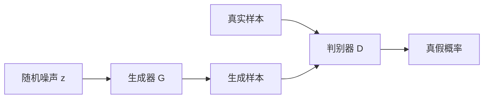

# GAN

生成对抗网络（Generative Adversarial Network, GAN）由生成器和判别器组成。生成器负责制造样本，判别器负责判断样本是真实数据还是生成数据，两者在对抗中共同提升。

## 概念详解

生成器：

$$
G(z;\theta_g)
$$

把随机噪声 $z$ 映射为生成样本。判别器：

$$
D(x;\theta_d)
$$

输出样本来自真实数据的概率。



## 数学公式及其推导

GAN 的极小极大目标为：

$$
\min_G\max_D V(D,G)
=E_{x\sim p_{data}}[\log D(x)]
+E_{z\sim p_z}[\log(1-D(G(z)))]
$$

固定生成器 $G$ 时，判别器对每个 $x$ 的目标为：

$$
p_{data}(x)\log D(x)+p_g(x)\log(1-D(x))
$$

对 $D(x)$ 求导并令其为 0：

$$
\frac{p_{data}(x)}{D(x)}-\frac{p_g(x)}{1-D(x)}=0
$$

得到最优判别器：

$$
D^\*(x)=\frac{p_{data}(x)}{p_{data}(x)+p_g(x)}
$$

当 $p_g=p_{data}$ 时：

$$
D^\*(x)=\frac{1}{2}
$$

此时判别器无法区分真实样本和生成样本，生成器达到理想状态。

## 应用代码：最小 GAN 训练骨架

```python
import torch
from torch import nn

class Generator(nn.Module):
    def __init__(self, z_dim=16, x_dim=2):
        super().__init__()
        self.net = nn.Sequential(
            nn.Linear(z_dim, 32),
            nn.ReLU(),
            nn.Linear(32, x_dim)
        )

    def forward(self, z):
        return self.net(z)

class Discriminator(nn.Module):
    def __init__(self, x_dim=2):
        super().__init__()
        self.net = nn.Sequential(
            nn.Linear(x_dim, 32),
            nn.ReLU(),
            nn.Linear(32, 1),
            nn.Sigmoid()
        )

    def forward(self, x):
        return self.net(x)

G = Generator()
D = Discriminator()
loss_fn = nn.BCELoss()
opt_g = torch.optim.Adam(G.parameters(), lr=1e-3)
opt_d = torch.optim.Adam(D.parameters(), lr=1e-3)

for step in range(200):
    real = torch.randn(64, 2) + torch.tensor([2.0, 2.0])
    z = torch.randn(64, 16)
    fake = G(z).detach()

    d_loss = loss_fn(D(real), torch.ones(64, 1)) + loss_fn(D(fake), torch.zeros(64, 1))
    opt_d.zero_grad()
    d_loss.backward()
    opt_d.step()

    z = torch.randn(64, 16)
    fake = G(z)
    g_loss = loss_fn(D(fake), torch.ones(64, 1))
    opt_g.zero_grad()
    g_loss.backward()
    opt_g.step()

print("D loss:", d_loss.item(), "G loss:", g_loss.item())
```

## 小结

GAN 的核心是对抗训练。它能生成清晰样本，但训练容易不稳定，常见问题包括模式崩溃、判别器过强和损失震荡。
