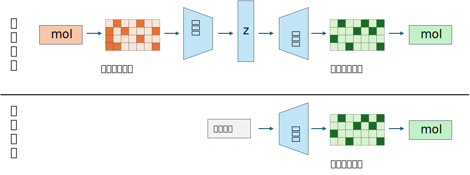
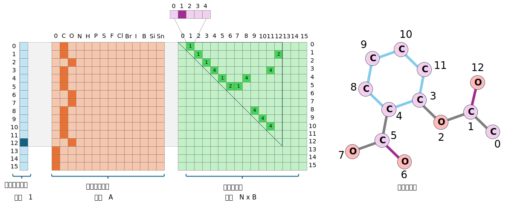
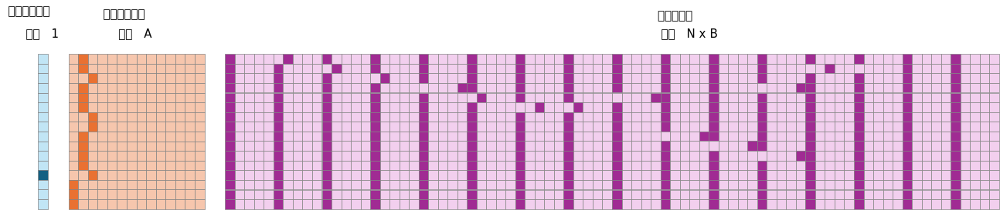

# 基于VAE的分子生成

本文将介绍分子生成模型的入门介绍——基于VAE的平面分子生成，通过学习分子特征矩阵实现采样生成分子的功能，项目结构如下：

```bash
VAE 2D/
├── data/               # 数据集文件
│   └── ZINC.csv
├── result/             # 结果目录
│   ├── model.pth       # 模型权重
│   ├── result.csv      # 推理生成的结果
│   └── losses.csv      # 平均损失记录
├── config.py           # 超参数配置文件
├── dataset.py          # 加载数据集
└── train.py            # 训练代码
```

本文基于该文章进行了代码优化和改造：

参考文献：MGCVAE: Multi-Objective Inverse Design via Molecular Graph Conditional Variational Autoencoder，[文章链接在此处](https://doi.org/10.1021/acs.jcim.2c00487)


## 项目概述

模型的架构流程如下图，编码器和解码器的内部实现是多层线性层：



## 数据嵌入

该模型使用固定大小的特征矩阵来描述分子特征，为了解决每个分子大小和边数不一致的问题，首先要定义最大支持的分子数为$N$，支持的原子种类为$A$（覆盖有机物常见原子C、H、O、N、P、S、Cl、Br、I等），支持的最大化学键种类为$B$（覆盖单键、双键、三键、芳香键等）。

单个分子的特征由三部分描述，首先是$[N, 1]$的原子数独热编码，表示该分子有多少个原子；第二部分是形状为$[N, A]$的每个原子的特征向量（独热编码），每一行表示一个原子的类型；第三部分是形状为$[N, N \times B]$的边特征向量，它实际上是一个$[N,N]$的邻接矩阵，每个元素表示第$i.j$号原子的成键类型，用$B$维独热表示。

具体的示意图用阿司匹林分子来演示，如下图：



最后我们可以可视化一下阿司匹林分子的全局特征矩阵，如下图：



## 代码详解

最后对项目的代码进行详细讲解。

### 配置文件

首先定义常用的模型超参数、相关文件的保存路径，该部分在`config.py`中实现。
```python
import torch
import torch.nn as nn
from rdkit import Chem
from rdkit.Chem import rdchem
from pathlib import Path
result_path = Path('./result')
result_path.mkdir(exist_ok=True, parents=True)

# 数据集路径
DATA_FILE = "./data/ZINC.csv"
# 权重保存文件
PT_PATH = "./result/model.pth"
# 损失保存路径
LOSS_PATH = "./result/losses.csv"
# 推理生成结果文件
RESTULT_PATH = "restult.csv"

# 测试集/训练集划分比例
DIVIDE_RATIO = 0.1

# 要生成的分子数
GEN_NUM = 1000

# 批次大小
BATCH_SIZE = 1024
# 训练周期
EPOCH = 200
# 学习率
LR = 0.00005
# 设备
DEVICE = "cuda" if torch.cuda.is_available() else "cpu"
```

定义支持的原子种类和化学键类型，构建索引列表（将用于独热编码的构建和解析）
```python
# 支持的原子类型列表
ATOM_LIST = ( 'C', 'O', 'N', 'H', 'P', 'S',  'F', 'Cl', 'Br', 'I', 'B', 'Si', 'Sn')
ATOM_LIST = [0] + [Chem.Atom(x).GetAtomicNum() for x in ATOM_LIST]

# 支持的原子种类数
ATOM_LEN = len(ATOM_LIST)

# 支持的键类型列表
BOND_LIST = (
    rdchem.BondType.ZERO,
    rdchem.BondType.SINGLE,
    rdchem.BondType.DOUBLE,
    rdchem.BondType.TRIPLE,
    rdchem.BondType.AROMATIC
)
# 支持的键类型数
BOND_LEN = len(BOND_LIST)

# 索引和实际类型对照表
atom_encoder_m = {l: i for i, l in enumerate(ATOM_LIST)}
atom_decoder_m = {i: l for i, l in enumerate(ATOM_LIST)}
bond_encoder_m = {l: i for i, l in enumerate(BOND_LIST)}
bond_decoder_m = {i: l for i, l in enumerate(BOND_LIST)}
```

定义模型的超参数，这里使用两个线性层来进行特征提取，将输入特征压缩到隐空间维度。
```python
# VAE参数配置
# Encoder: IN_DIM -> H1_DIM -> H2_DIM -> Z_DIM
# Decoder: Z_DIM -> H2_DIM -> H1_DIM -> IN_DIM (out)
# 最大原子数
MAX_SIZE = 16
# 分子特征矩阵列数
F_COL = 1 + ATOM_LEN + MAX_SIZE * BOND_LEN
# 输入维度
IN_DIM = MAX_SIZE * F_COL
# 隐空间维度
Z_DIM = 128
# 隐藏层1
H1_DIM = 512
# 隐藏层2
H2_DIM = 256
```

### 数据集加载

该部分代码在`dataset.py`中实现，首先要导入所需要的库文件
```python
import pandas as pd
from rdkit import Chem
import torch
from torch.utils.data import Dataset, DataLoader
from config import *
import numpy as np
```

根据mol对象构建节点特征矩阵，大小$[N, A]$，N是支持的最大原子数，A是支持的原子种类。

通过先创建全零矩阵，矩阵一行表示一个原子的独热编码；随后遍历该分子的所有原子，根据索引将对应编码位置1，若原子数小于最大原子数，则将剩下的原子设为虚拟原子"0"。
```python
# 生成节点特征矩阵
def node_features(mol, max_length=MAX_SIZE, atom_types=ATOM_LEN):
    # 预制全零张量
    features = np.zeros([max_length, atom_types], dtype=np.float32)
    # 填充真实原子
    for i, atom in enumerate(mol.GetAtoms()):
        atomic_num = atom.GetAtomicNum()
        if atomic_num in atom_encoder_m:
            features[i, atom_encoder_m[atomic_num]] = 1.0
    # 多出的原子标记为0号（虚拟原子）
    actual_atoms = min(mol.GetNumAtoms(), max_length)
    features[actual_atoms:, 0] = 1.0

    return torch.tensor(features, dtype=torch.float32)
```

根据mol对象生成边特征矩阵，该矩阵大小为$[N, B \times N]$，B是支持的化学键种类。

那么，可以先构建三维张量，形状为$[N,N,B]$，可以理解为一个二维矩阵，矩阵每个元素是一个B维的独热编码向量。

随后遍历分子的每一条边，得到边两端的原子索引，单独构建上三角矩阵，根据边类型构建独热编码向量。

最后把原三维张量$[N,N,B]$按最后一维展开，就得到了$[N, N \times B]$的二维矩阵。
```python
# 生成边特征矩阵
def bond_features(mol, bond_encoder_m, max_length=MAX_SIZE):
    bond_types = len(bond_encoder_m)
    # 预先构建三维张量，所有键均为“非键”编码的独热向量
    A = torch.zeros(bond_types, dtype=torch.int32)
    A[0] = 1
    A = A.expand(max_length, max_length, bond_types).clone()
    # 遍历每个边
    for bond in mol.GetBonds():
        begin = bond.GetBeginAtomIdx()  # 键的起始原子索引
        end = bond.GetEndAtomIdx()      # 键的终止原子索引
        i = min(begin, end)             # 行号=原子对中较小的索引
        j = max(begin, end)             # 列号=原子对中较大的索引
        # 构建边类型独热编码向量，替换原值
        bond_code = bond_encoder_m[bond.GetBondType()]
        bond_onehot = torch.zeros(bond_types, dtype=torch.int32)
        bond_onehot[bond_code] = 1
        A[i, j] = bond_onehot
    # 将三维矩阵按最后一维展开，得到二维特征矩阵
    A = A.reshape(max_length, -1)
    return A
```

构建分子的全局特征，将上述节点特征、边特征和分子的原子数独热编码向量拼接，得到总特征矩阵，形状为$[N, 1 + A + N \times B]$
```python
# mol对象生成分子特征矩阵
def mol_to_graph(mol, length, smiles='', max_num=MAX_SIZE):
    try:
        mol_length = int(length) - 1
        vec_length = torch.zeros([max_num,1], dtype=torch.float)
        vec_length[mol_length, 0] = 1.0
        graph = torch.cat([vec_length, node_features(mol, max_num),bond_features(mol, bond_encoder_m)], 1).float()
        return graph
    except Exception as e:
        print('Error:', smiles, 'more information:', e)
```

读取csv文件，将smiles转为mol对象，再利用上述`mol_to_graph`函数将mol对象构建为特征矩阵。
```python
# 读取数据集源文件
df = pd.read_csv(DATA_FILE)
# 按设定大小抽样
df = df[df['Length'] <= MAX_SIZE].reset_index(drop=True)
# 生成mol对象列
df["mol"] = df["SMILES"].apply(lambda x: Chem.MolFromSmiles(x))
# 去除空值
df = df[df["mol"].notna()].reset_index(drop=True)
# 生成特征矩阵列
df['graph'] = df[['mol', 'Length', 'SMILES']].apply(
    lambda row: mol_to_graph(mol=row['mol'], length=row['Length'], smiles=row['SMILES']),  
    axis=1  
)
# 去除空值
df = df[df['graph'].notna()].reset_index(drop=True)
# 单独保存特征矩阵列为列表
data_list = df['graph'].to_list()
```

最后定义数据集类，划分数据集，构建数据集加载器（和之前相同）
```python
# 定义数据集类
class MolGraphDataset(Dataset):
    def __init__(self, data_list):
        self.data_list = data_list
    
    def __len__(self):
        return len(self.data_list)
    
    def __getitem__(self, idx):
        return self.data_list[idx]

# 初始化自定义数据集
mol_dataset = MolGraphDataset(data_list)
# 划分训练/测试集
tr = 1 - DIVIDE_RATIO
train_size = int(len(mol_dataset) * tr)
test_size = len(mol_dataset) - train_size

# 随机划分
train_dataset, test_dataset = torch.utils.data.random_split(
    mol_dataset, 
    [train_size, test_size],
    generator=torch.Generator().manual_seed(42)
)

# 构建DataLoader
train_loader = DataLoader(
    dataset=train_dataset,
    batch_size=BATCH_SIZE,
    shuffle=True,
    drop_last=True,
)
test_loader = DataLoader(
    dataset=test_dataset,
    batch_size=BATCH_SIZE,
    shuffle=False,
    drop_last=True,
)
```

进行单元测试验证：
```python
if __name__ == "__main__":
    print(f"Train dataset size: {len(train_dataset)} samples")
    print(f"Test dataset size: {len(test_dataset)} samples")
    print(f"Train loader batch count: {len(train_loader)}")
    print(f"Test loader batch count: {len(test_loader)}")

    # 测试加载单个批次
    for batch in train_loader:
        print(f"Batch shape: {batch.shape}") 
        break
```

得到如下结果，获取构建的数据集形状和批次形状。
```python
Train dataset size: 90000 samples
Test dataset size: 10000 samples
Train loader batch count: 87
Test loader batch count: 9
Batch shape: torch.Size([1024, 16, 95])
```


### 训练与推理

该部分代码在`train.py`中实现。先导入相关的库，禁用rdkit警告
```python
import numpy as np
import pandas as pd
from rdkit import Chem
from rdkit.Chem.Crippen import MolLogP, MolMR
import torch
import torch.nn as nn
import torch.nn.functional as F
import torch.optim as optim
from config import *


# 禁用rdkit警告
from rdkit import RDLogger
RDLogger.DisableLog('rdApp.*')
import warnings
warnings.filterwarnings(action='ignore')
```

根据节点特征矩阵+边特征矩阵构建新的mol对象，完成合理性检验后返回。
```python
# 分子特征矩阵转为mol对象
def graph_to_mol(node_labels, adjacency, atom_decoder_m, bond_decoder_m, strict=False):
    mol = Chem.RWMol()
    for node_label in node_labels:
        mol.AddAtom(Chem.Atom(atom_decoder_m[node_label]))
    for start, end in zip(*np.nonzero(adjacency)):
        if start < end:
            mol.AddBond(int(start), int(end), bond_decoder_m[adjacency[start, end]])
    if strict:
        try:
            Chem.SanitizeMol(mol)
        except:
            mol = None
    return mol
```

定义推理函数，根据设定的生成分子总数一次生成多个分子矩阵，按输入规则将每个分子特征矩阵拆分为原子数编码+节点特征矩阵+边特征矩阵，再用同样的规则解析即可。
```python
# 解析推理得到的数据
def vae_results(
        vae,
        atom_decoder_m, 
        bond_decoder_m,
        gen_num=GEN_NUM,
        z_dim=Z_DIM,
        atom_types=ATOM_LEN,
        bond_types=BOND_LEN,
        row_dim=MAX_SIZE,
        col_dim=F_COL,
        ):
    with torch.no_grad():
        z = torch.randn(int(gen_num), z_dim).to(DEVICE)
        sample = vae.decoder(z)
    smi = []
    logp = []
    mr = []
    for matrix in sample.view(int(gen_num), 1, row_dim, col_dim).cpu():
        try:
            # 单个分子特征矩阵
            matrix = matrix[0]
            # 原子数编码矩阵
            atom_num = matrix[:, 0]
            # 独热转特征
            atom_num = torch.argmax(atom_num).item() + 1
            # 原子类型编码矩阵
            atom_type = matrix[:,1:atom_types+1]
            # 原子类型独热编码转类型索引
            atom_type = torch.max(atom_type, -1)[1]
            # 边特征编码矩阵
            bonds = matrix[:, atom_types+1:]
            # 边特征独热编码转特征索引的邻接矩阵
            bonds = bonds.reshape(row_dim, row_dim, bond_types)
            bonds = torch.max(bonds, dim=-1)[1]
            # 只保留有效原子部分
            nodes_hard_max = atom_type[:atom_num]
            edges_hard_max = bonds[:atom_num, :atom_num]
            # 从特征矩阵解码还原分子mol对象
            mol = graph_to_mol(
                nodes_hard_max.numpy(),
                edges_hard_max.numpy(),
                atom_decoder_m,
                bond_decoder_m,
                strict=True
                )
            # 有效性检查
            if mol and '.' not in Chem.MolToSmiles(mol):
                smi.append(Chem.MolToSmiles(mol))
                logp.append(MolLogP(mol))
                mr.append(MolMR(mol))
        except Exception as e:
            print(e)
            continue
    return pd.DataFrame({'SMILES': smi, 'logP': logp, 'MR': mr})
```

根据模型输出矩阵和原始矩阵，计算BCE损失和KL散度损失，作为总损失返回。
```python
# 损失函数
def loss_function(recon_x, x, mu, log_var):
    # BCE损失
    BCE = F.binary_cross_entropy(recon_x, x.view(-1, IN_DIM), reduction='sum')
    # KL散度损失
    KLD = -0.5 * torch.sum(1 + log_var - mu.pow(2) - log_var.exp())
    return BCE + KLD
```

模型的架构与之前的图像VAE基本一致：
```python
# 模型定义
class VAE(nn.Module):
    def __init__(self, x_dim=IN_DIM, h_dim1=H1_DIM, h_dim2=H2_DIM, z_dim=Z_DIM):
        super(VAE, self).__init__()
        self.x_dim = x_dim
        # 编码器
        self.fc1 = nn.Linear(x_dim, h_dim1)
        self.fc2 = nn.Linear(h_dim1, h_dim2)
        self.fc31 = nn.Linear(h_dim2, z_dim)
        self.fc32 = nn.Linear(h_dim2, z_dim)
        # 解码器
        self.fc4 = nn.Linear(z_dim, h_dim2)
        self.fc5 = nn.Linear(h_dim2, h_dim1)
        self.fc6 = nn.Linear(h_dim1, x_dim)

    def encoder(self, x):
        h = F.relu(self.fc1(x))
        h = F.relu(self.fc2(h))
        return self.fc31(h), self.fc32(h)

    def sampling(self, mu, log_var):
        std = torch.exp(0.5*log_var)
        eps = torch.randn_like(std)
        return eps.mul(std).add(mu)

    def decoder(self, z):
        h = F.relu(self.fc4(z))
        h = F.relu(self.fc5(h))
        return torch.sigmoid(self.fc6(h))

    def forward(self, x):
        mu, log_var = self.encoder(x.view(-1, self.x_dim))
        z = self.sampling(mu, log_var)
        return self.decoder(z), mu, log_var
```

实现训练+测试函数
```python
# 训练函数
def train(model, train_loader):
    train_loss = 0
    model.train()
    for graph in train_loader:
        graph = graph.to(DEVICE)
        optimizer.zero_grad()
        recon_batch, mu, log_var = model(graph)
        loss = loss_function(recon_batch, graph, mu, log_var)
        loss.backward()
        optimizer.step()
        train_loss += loss.item()
    return train_loss

# 测试函数
def test(model, test_loader):
    test_loss= 0
    model.eval()
    with torch.no_grad():
        for graph in test_loader:
            graph = graph.to(DEVICE)
            recon, mu, log_var = model(graph)
            test_loss += loss_function(recon, graph, mu, log_var).item()
    return test_loss
```


最后初始化模型，开始训练，完成后保存权重，进行推理即可。
```python
if __name__ == "__main__":
    # 定义模型，迁移设备
    vae = VAE()
    vae.to(DEVICE)
    # 设置优化器
    optimizer = optim.Adam(vae.parameters(), lr=LR)

    print(f'Train device:{DEVICE}')
    print('Load Dataset......')
    # 载入数据集
    from dataset import train_loader, test_loader
    print('='*50)
    print(f"Train dataset size: {len(train_loader.dataset)} samples")
    print(f"Test dataset size: {len(test_loader.dataset)} samples")
    print(f"Train loader batch count: {len(train_loader)}")
    print(f"Test loader batch count: {len(test_loader)}")
    print('='*50)
    print('Training the model...')

    # 开始迭代训练周期
    train_loss_list = []
    test_loss_list = []
    for epoch in range(1, EPOCH+1):
        # 训练周期损失
        train_loss = train(vae, train_loader) / len(train_loader.dataset)
        train_loss_list.append(train_loss)
        # 测试周期损失
        test_loss = test(vae, test_loader) / len(test_loader.dataset)
        test_loss_list.append(test_loss)
        print(f'Epoch [{epoch}/{EPOCH}], train loss {train_loss:.4f}; val loss {test_loss:.4f}')
    
    # 保存权重
    torch.save(
        vae.state_dict(),  
        PT_PATH
    )
    print(f"Saving PTH to:{PT_PATH}")

    # 保存每轮损失
    import pandas as pd
    df = pd.DataFrame({
        'Epoch': range(1, len(train_loss_list) + 1),
        'Training Loss': train_loss_list,
        'Test Loss': test_loss_list
    })
    df.to_csv(LOSS_PATH, index=False)
    print(f"Saving Loss to:{LOSS_PATH}")

    # 加载权重
    vae.load_state_dict(torch.load(PT_PATH, map_location=DEVICE), strict=True)
    print('Generating molecules...')
    vae_df = vae_results(vae, atom_decoder_m, bond_decoder_m)
    vae_df.to_csv(RESTULT_PATH, index=False)
    print(f'Saving {RESTULT_PATH} ({vae_df.shape[0]})...')
```

最终的训练结果如下：
```bash
Train device:cuda
Load Dataset......
==================================================
Train dataset size: 90000 samples
Test dataset size: 10000 samples
Train loader batch count: 87
Test loader batch count: 9
==================================================
Training the model...
Epoch [1/200], train loss 747.0516; val loss 208.7150
Epoch [2/200], train loss 141.5465; val loss 101.5751
Epoch [3/200], train loss 99.4068; val loss 86.2277
......
Epoch [196/200], train loss 37.5508; val loss 35.0344
Epoch [197/200], train loss 37.5112; val loss 35.0496
Epoch [198/200], train loss 37.4262; val loss 34.9374
Epoch [199/200], train loss 37.3526; val loss 34.8599
Epoch [200/200], train loss 37.3289; val loss 34.8170
Saving PTH to:./result/model.pth
Saving Loss to:./result/losses.csv
Generating molecules...
Saving ./result/restult.csv (323)...
```

观察损失曲线：


模型推理得到的分子列表如下：
```cs
SMILES,logP,MR
CC1(C(=O)NCCCN)CO1,-0.7596999999999994,41.03810000000001
CC(=O)NC(=O)NC(=O)CCCO,-0.8687999999999998,43.67520000000001
COC1CC1(C)NNCC(C)O,-0.36119999999999997,46.63820000000002
CCCNCC(C)NCN(C)C,0.4831999999999999,54.31240000000004
CCOC(O)C(C)C(C)CO,0.6057999999999999,43.04660000000001
CCC(CCO)C(C)CCCO,1.8035999999999999,50.96760000000003
CC(=O)CCCCC(C)CC(O)O,1.4726999999999997,51.155600000000035
CC(CO)NC(=O)CCCNC=O,-0.9903999999999991,47.99120000000003
```


本文中我们基于VAE架构实现了最简单的二维分子生成模型，该模型还有许多需要改进的地方，后续我们将对其进行改造，实现条件生成的功能。

其他的，还可以引入图数据结构，用GNN做特征提取，结合图解码器实现生成。后续模型详见本站其他文章。