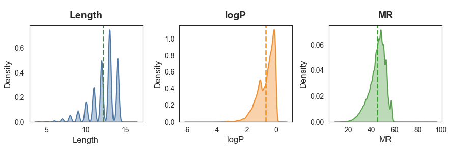
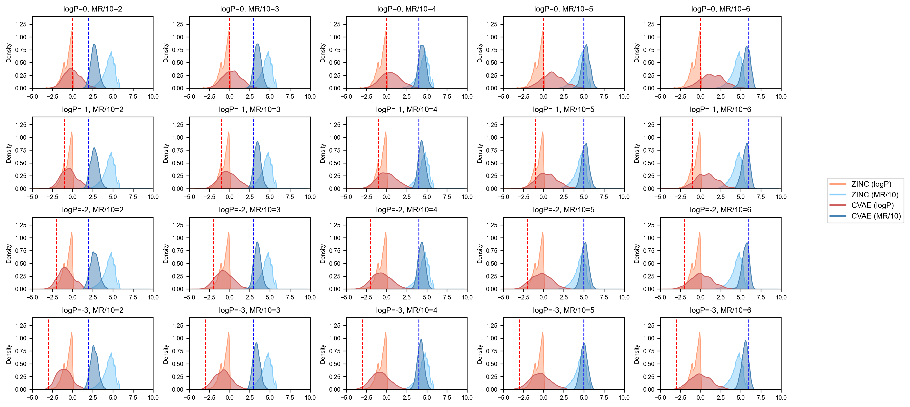

# 基于CVAE的二维分子条件生成

上篇文章我们实现了基于VAE架构的分子生成，他支持有上限原子的分子随机生成，接下来我们将学习如何引入条件控制，从而做到生成给定条件（分子性质）范围的分子，本文项目结构如下：

```bash
CVAE 2D/
├── data/               # 数据集文件
│   └── ZINC.csv
├── result/             # 结果目录
│   ├── model.pth       # 模型权重
│   ├── result.csv      # 推理生成的结果
│   └── losses.csv      # 平均损失记录
├── config.py           # 超参数配置文件
├── dataset.py          # 加载数据集
├── model.py            # 训练代码
├── generate.py         # 生成代码
└── draw.py             # 绘图分析脚本
```

项目结构和VAE版本大致相同，我们把训练和推理的代码分开实现，同时补充进行数据分析的脚本函数。

本文基于该文章进行了代码优化和改造：

参考文献：MGCVAE: Multi-Objective Inverse Design via Molecular Graph Conditional Variational Autoencoder，[文章链接在此处](https://doi.org/10.1021/acs.jcim.2c00487)

## 配置信息

以下文件在`config.py`中实现，这些和VAE生成的配置完全一致。

```python
import torch
import torch.nn as nn
from rdkit import Chem
from rdkit.Chem import rdchem
from pathlib import Path
result_path = Path('./result')
result_path.mkdir(exist_ok=True, parents=True)

# 数据集路径
DATA_FILE = "./data/ZINC.csv"
# 权重保存文件
PT_PATH = "./result/model.pth"
# 损失保存路径
LOSS_PATH = "./result/losses.csv"
# 推理生成结果文件
RESTULT_PATH = "./result/result"

# 测试集/训练集划分比例
DIVIDE_RATIO = 0.1
```

主要增加了`CONDITIONS`字段，用于配置需要生成的“条件”约束，这里我们约束的是logP和MR值。
```python
# 要生成的分子数
GEN_NUM = 10000
# 生成条件
CONDITIONS = {
    'logP_list':[0, -1, -2, -3],
    'mr_list': [2, 3, 4, 5, 6]
}
```

模型配置和超参数等也和之前的完全一致，最后增加了`COND_DIM`条件编码向量的维度，这里设置为16。

```python
# 批次大小
BATCH_SIZE = 1000
# 训练周期
EPOCH = 200
# 学习率
LR = 0.00005
# 设备
DEVICE = "cuda" if torch.cuda.is_available() else "cpu"

# 支持的原子类型列表
ATOM_LIST = ( 'C', 'O', 'N', 'H', 'P', 'S',  'F', 'Cl', 'Br', 'I', 'B', 'Si', 'Sn')
ATOM_LIST = [0] + [Chem.Atom(x).GetAtomicNum() for x in ATOM_LIST]

# 支持的原子种类数
ATOM_LEN = len(ATOM_LIST)

# 支持的键类型列表
BOND_LIST = (
    rdchem.BondType.ZERO,
    rdchem.BondType.SINGLE,
    rdchem.BondType.DOUBLE,
    rdchem.BondType.TRIPLE,
    rdchem.BondType.AROMATIC
)
# 支持的键类型数
BOND_LEN = len(BOND_LIST)

# 索引和实际类型对照表
atom_encoder_m = {l: i for i, l in enumerate(ATOM_LIST)}
atom_decoder_m = {i: l for i, l in enumerate(ATOM_LIST)}
bond_encoder_m = {l: i for i, l in enumerate(BOND_LIST)}
bond_decoder_m = {i: l for i, l in enumerate(BOND_LIST)}

# VAE参数配置
# Encoder: IN_DIM -> H1_DIM -> H2_DIM -> Z_DIM
# Decoder: Z_DIM -> H2_DIM -> H1_DIM -> IN_DIM (out)
# 最大原子数
MAX_SIZE = 16
# 分子特征矩阵列数
F_COL = 1 + ATOM_LEN + MAX_SIZE * BOND_LEN
# 输入维度
IN_DIM = MAX_SIZE * F_COL
# 隐空间维度
Z_DIM = 128
# 隐藏层1
H1_DIM = 512
# 隐藏层2
H2_DIM = 256
# 条件编码维度
COND_DIM = 16  # [!code warning]
```

## 数据集加载

该部分代码在`dataset.py`中实现。

节点特征矩阵、边特征矩阵和mol对象转特征矩阵的函数和VAE部分完全一致。

```python
import pandas as pd
from rdkit import Chem
import torch
from torch.utils.data import Dataset, DataLoader
from config import *
import numpy as np

# 生成节点特征矩阵
def node_features(mol, max_length=MAX_SIZE, atom_types=ATOM_LEN):
    # 预制全零张量
    features = np.zeros([max_length, atom_types], dtype=np.float32)
    # 填充真实原子
    for i, atom in enumerate(mol.GetAtoms()):
        atomic_num = atom.GetAtomicNum()
        if atomic_num in atom_encoder_m:
            features[i, atom_encoder_m[atomic_num]] = 1.0
    # 多出的原子标记为0号（虚拟原子）
    actual_atoms = min(mol.GetNumAtoms(), max_length)
    features[actual_atoms:, 0] = 1.0

    return torch.tensor(features, dtype=torch.float32)

# 生成边特征矩阵
def bond_features(mol, bond_encoder_m, max_length=MAX_SIZE):
    bond_types = len(bond_encoder_m)
    # 预先构建三维张量，所有键均为“非键”编码的独热向量
    A = torch.zeros(bond_types, dtype=torch.int32)
    A[0] = 1
    A = A.expand(max_length, max_length, bond_types).clone()
    # 遍历每个边
    for bond in mol.GetBonds():
        begin = bond.GetBeginAtomIdx()  # 键的起始原子索引
        end = bond.GetEndAtomIdx()      # 键的终止原子索引
        i = min(begin, end)             # 行号=原子对中较小的索引
        j = max(begin, end)             # 列号=原子对中较大的索引
        # 构建边类型独热编码向量，替换原值
        bond_code = bond_encoder_m[bond.GetBondType()]
        bond_onehot = torch.zeros(bond_types, dtype=torch.int32)
        bond_onehot[bond_code] = 1
        A[i, j] = bond_onehot
    # 将三维矩阵按最后一维展开，得到二维特征矩阵
    A = A.reshape(max_length, -1)
    return A

# mol对象生成分子特征矩阵
def mol_to_graph(mol, length, smiles='', max_num=MAX_SIZE):
    try:
        mol_length = int(length) - 1
        vec_length = torch.zeros([max_num,1], dtype=torch.float)
        vec_length[mol_length, 0] = 1.0
        graph = torch.cat([vec_length, node_features(mol, max_num),bond_features(mol, bond_encoder_m)], 1).float()
        return graph
    except Exception as e:
        print('Error:', smiles, 'more information:', e)
```

随后是读取CSV数据集的内容，创建mol对象，和CVAE也完全一致。
```python
# 读取数据集源文件
df = pd.read_csv(DATA_FILE)
# 按设定大小抽样
df = df[df['Length'] <= MAX_SIZE].reset_index(drop=True)
# 生成mol对象列
df["mol"] = df["SMILES"].apply(lambda x: Chem.MolFromSmiles(x))
# 去除空值
df = df[df["mol"].notna()].reset_index(drop=True)
# 生成特征矩阵列
df['graph'] = df[['mol', 'Length', 'SMILES']].apply(
    lambda row: mol_to_graph(mol=row['mol'], length=row['Length'], smiles=row['SMILES']),  
    axis=1  
)
# 去除空值
df = df[df['graph'].notna()].reset_index(drop=True)
```

不同的是，这里我们把df对象传入数据集类，构建`get`、`len`方法，不同的是这里返回的是特征矩阵、logP、MR三个张量。
```python
# 定义数据集类
class MolGraphDataset(Dataset):
    def __init__(self, df):
        self.df = df.reset_index(drop=True)
    
    def __len__(self):
        return self.df.shape[0]
    
    def __getitem__(self, idx):
        row = self.df.iloc[idx]

        feat_tensor = row['graph']  # [!code warning]
        logp_tensor = torch.tensor([row['logP']], dtype=torch.float32)  # [!code warning]
        mr_tensor = torch.tensor([row['MR']], dtype=torch.float32)  # [!code warning]
        return feat_tensor, logp_tensor, mr_tensor  # [!code warning]
```

划分数据集的内容也和VAE完全一致。
```python
# 初始化自定义数据集
mol_dataset = MolGraphDataset(df)
# 划分训练/测试集
tr = 1 - DIVIDE_RATIO
train_size = int(len(mol_dataset) * tr)
test_size = len(mol_dataset) - train_size

# 随机划分
train_dataset, test_dataset = torch.utils.data.random_split(
    mol_dataset, 
    [train_size, test_size],
    generator=torch.Generator().manual_seed(42)
)

# 构建DataLoader
train_loader = DataLoader(
    dataset=train_dataset,
    batch_size=BATCH_SIZE,
    shuffle=True,
    drop_last=True,
)
test_loader = DataLoader(
    dataset=test_dataset,
    batch_size=BATCH_SIZE,
    shuffle=False,
    drop_last=True,
)
```

对Dataloader进行单元测试，单批次会返回三个张量，看看他们的形状。
```python
if __name__ == "__main__":
    print(f"Train dataset size: {len(train_dataset)} samples")
    print(f"Test dataset size: {len(test_dataset)} samples")
    print(f"Train loader batch count: {len(train_loader)}")
    print(f"Test loader batch count: {len(test_loader)}")

    # 测试加载单个批次
    for feat_tensor, logp_tensor, mr_tensor in train_loader:
        print(f"Feature shape: {feat_tensor.shape}") 
        print(f"LogP shape: {logp_tensor.shape}") 
        print(f"MR shape: {mr_tensor.shape}") 
        break
```

可以看到，全部10w条样本以9:1被划分为训练集和测试集，每批次1000个样本，特征矩阵$[16, 9]$，每个样本还对应这一个logP和MR属性值。
```python
Train dataset size: 90000 samples
Test dataset size: 10000 samples
Train loader batch count: 90
Test loader batch count: 10
Feature shape: torch.Size([1000, 16, 95])
LogP shape: torch.Size([1000, 1])
MR shape: torch.Size([1000, 1])
```
此外，我们可以查看数据集的分布情况：



```python
========== 各属性关键统计信息 ==========
          Length       logP         MR
mean       12.20      -0.69      44.79
std         1.66       0.59       6.94
min         4.00      -5.97       9.70
max        16.00       0.58      94.42
```

我们的数据集分子大小最大是16个原子，logP集中在[-6,1]，MR集中在[20,60]，因此配置`MAX_SIZE = 16`，`COND_DIM = 16`完全足够。

在生成时，条件限制在$logP \in [-3,0]$，$MR \in [20,60]$，也就是：

```python
CONDITIONS = {
    'logP_list':[0, -1, -2, -3],
    'mr_list': [2, 3, 4, 5, 6]
}
```

## 模型定义

该部分代码在`model.py`中实现，完成模型的定义、损失函数计算和必要的工具函数。

损失函数依然使用KL散度+重构BCE损失，主要增加了生成条件编码向量的函数。

因为我们的属性值是连续特征，实际上这里是将其做了风箱划分，利用`round`四舍五入**把连续特征变成离散特征**，这样就可以使用独热编码向量来表征属性条件。
```python
import torch
import torch.nn as nn
import torch.nn.functional as F
from config import *

# 损失函数
def loss_function(recon_x, x, mu, log_var):
    # BCE损失
    BCE = F.binary_cross_entropy(recon_x, x.view(-1, IN_DIM), reduction='sum')
    # KL散度损失
    KLD = -0.5 * torch.sum(1 + log_var - mu.pow(2) - log_var.exp())
    return BCE + KLD

# 条件编码
def one_hot(labels, class_size=COND_DIM):
    targets = torch.zeros(labels.shape[0], class_size, device=DEVICE)
    for i, label in enumerate(labels):
        targets[i, round(label.item())] = 1 # [!code warning]
    return targets
```

随后是模型的结构定义，因为我们是将分子图展平为一维向量送入VAE中，因此在有条件的情况下，只需要把多个条件向量拼接到分子图向量后即可，这样模型的输入维度将变成$x+c_1+c_2$，在encoder和decoder中分别实现拼接的代码，其他部分不变即可：
```python
# 模型定义
class CVAE(nn.Module):
    def __init__(self, x_dim=IN_DIM, h_dim1=H1_DIM, h_dim2=H2_DIM, z_dim=Z_DIM, c_dim=COND_DIM):
        super(CVAE, self).__init__()
        self.x_dim = x_dim
        # 编码器
        self.fc1 = nn.Linear(x_dim+c_dim*2, h_dim1)
        self.fc2 = nn.Linear(h_dim1, h_dim2)
        self.fc31 = nn.Linear(h_dim2, z_dim)
        self.fc32 = nn.Linear(h_dim2, z_dim)
        # 解码器
        self.fc4 = nn.Linear(c_dim*2+z_dim, h_dim2)
        self.fc5 = nn.Linear(h_dim2, h_dim1)
        self.fc6 = nn.Linear(h_dim1, x_dim)

    # 在编码器的输入中将特征和条件拼接
    def encoder(self, x, c1, c2):
        concat_input = torch.cat([x, c1, c2], 1)
        h = F.relu(self.fc1(concat_input))
        h = F.relu(self.fc2(h))
        return self.fc31(h), self.fc32(h)

    def sampling(self, mu, log_var):
        std = torch.exp(0.5*log_var)
        eps = torch.randn_like(std)
        return eps.mul(std).add(mu)

    # 同样在解码器的输入中将特征和条件拼接
    def decoder(self, z, c1, c2):
        concat_input = torch.cat([z, c1, c2], 1)
        h = F.relu(self.fc4(concat_input))
        h = F.relu(self.fc5(h))
        return torch.sigmoid(self.fc6(h))

    def forward(self, x, c1, c2):
        mu, log_var = self.encoder(x.view(-1, self.x_dim), c1, c2)
        z = self.sampling(mu, log_var)
        return self.decoder(z, c1, c2), mu, log_var
```

## 训练

以下代码在`train.py`中实现，主要是在训练和测试函数中处理了属性值，对于mr值要缩放10倍，让其分布在[0,16]之间（不超出独热向量的范围）。

```python
import pandas as pd
import torch.optim as optim

from config import *
from model import *

# 训练函数
def train(model, train_loader):
    train_loss = 0
    model.train()
    for (graph, logp, mr) in train_loader:
        graph = graph.to(DEVICE)
        # 生成条件对应的one-hot向量,mr值要缩小10倍
        logp = one_hot(logp).to(DEVICE) # [!code warning]
        mr = one_hot(mr/10).to(DEVICE)  # [!code warning]

        optimizer.zero_grad()
        recon_batch, mu, log_var = model(graph, logp, mr)
        loss = loss_function(recon_batch, graph, mu, log_var)
        loss.backward()
        optimizer.step()
        train_loss += loss.item()
    return train_loss

# 测试函数
def test(model, test_loader):
    test_loss= 0
    model.eval()
    with torch.no_grad():
        for (graph, logp, mr) in test_loader:
            graph = graph.to(DEVICE)
            # 生成条件对应的one-hot向量
            logp = one_hot(logp).to(DEVICE) # [!code warning]
            mr = one_hot(mr/10).to(DEVICE)  # [!code warning]

            recon, mu, log_var = model(graph, logp, mr)
            test_loss += loss_function(recon, graph, mu, log_var).item()
    return test_loss
```

开始训练模型：
```python
if __name__ == "__main__":
    # 定义模型，迁移设备
    cvae = CVAE()
    cvae.to(DEVICE)
    # 设置优化器
    optimizer = optim.Adam(cvae.parameters(), lr=LR)

    print(f'Train device:{DEVICE}')
    print('Load Dataset......')
    # 载入数据集
    from dataset import train_loader, test_loader
    print('='*50)
    print(f"Train dataset size: {len(train_loader.dataset)} samples")
    print(f"Test dataset size: {len(test_loader.dataset)} samples")
    print(f"Train loader batch count: {len(train_loader)}")
    print(f"Test loader batch count: {len(test_loader)}")
    print('='*50)
    print('Training the model...')

    # 开始迭代训练周期
    train_loss_list = []
    test_loss_list = []
    for epoch in range(1, EPOCH+1):
        # 训练周期损失
        train_loss = train(cvae, train_loader) / len(train_loader.dataset)
        train_loss_list.append(train_loss)
        # 测试周期损失
        test_loss = test(cvae, test_loader) / len(test_loader.dataset)
        test_loss_list.append(test_loss)
        print(f'Epoch [{epoch}/{EPOCH}], train loss {train_loss:.4f}; val loss {test_loss:.4f}')
    
    # 保存权重
    torch.save(
        cvae.state_dict(),  
        PT_PATH
    )
    print(f"Saving PTH to:{PT_PATH}")

    # 保存每轮损失
    import pandas as pd
    df = pd.DataFrame({
        'Epoch': range(1, len(train_loss_list) + 1),
        'Training Loss': train_loss_list,
        'Test Loss': test_loss_list
    })
    df.to_csv(LOSS_PATH, index=False)
    print(f"Saving Loss to:{LOSS_PATH}")
```

训练详细信息：
```python
Load Dataset......
==================================================
Train dataset size: 90000 samples
Test dataset size: 10000 samples
Train loader batch count: 90
Test loader batch count: 10
==================================================
Training the model...
Epoch [1/200], train loss 747.6686; val loss 213.2999
Epoch [2/200], train loss 139.1853; val loss 109.0857
Epoch [3/200], train loss 99.8494; val loss 93.2989
Epoch [4/200], train loss 89.7221; val loss 87.0099
......
Epoch [196/200], train loss 36.0690; val loss 36.1617
Epoch [197/200], train loss 35.9917; val loss 36.0512
Epoch [198/200], train loss 35.9444; val loss 36.0481
Epoch [199/200], train loss 35.8941; val loss 35.9624
Epoch [200/200], train loss 35.8199; val loss 35.9190
Saving PTH to:./result/model.pth
Saving Loss to:./result/losses.csv
```

损失函数变化曲线：


## 生成

以下代码在`generate.py`中实现，主要的差异在生成条件的独热编码，并输入模型（代码标黄部分）。

```python
import numpy as np
import pandas as pd
from rdkit import Chem
from rdkit.Chem.Crippen import MolLogP, MolMR
import torch
from config import *
from model import CVAE

from rdkit import RDLogger
RDLogger.DisableLog('rdApp.*')
import warnings
warnings.filterwarnings(action='ignore')

# 分子特征矩阵转为mol对象
def graph_to_mol(node_labels, adjacency, atom_decoder_m, bond_decoder_m, strict=False):
    mol = Chem.RWMol()
    for node_label in node_labels:
        mol.AddAtom(Chem.Atom(atom_decoder_m[node_label]))
    for start, end in zip(*np.nonzero(adjacency)):
        if start < end:
            mol.AddBond(int(start), int(end), bond_decoder_m[adjacency[start, end]])
    if strict:
        try:
            Chem.SanitizeMol(mol)
        except:
            mol = None
    return mol


# 解析推理得到的数据
def cvae_results(
        vae,
        logP,
        MR,
        atom_decoder_m, 
        bond_decoder_m,
        gen_num=GEN_NUM,
        z_dim=Z_DIM,
        cond_DIM=COND_DIM,
        atom_types=ATOM_LEN,
        bond_types=BOND_LEN,
        row_dim=MAX_SIZE,
        col_dim=F_COL,
        ):
    with torch.no_grad():
        z = torch.randn(int(gen_num), z_dim).to(DEVICE)
        c1 = torch.zeros(int(gen_num), cond_DIM).to(DEVICE) # [!code warning]
        c1[:,logP] = 1  # [!code warning]
        c2 = torch.zeros(int(gen_num), cond_DIM).to(DEVICE) # [!code warning]
        c2[:,MR] = 1    # [!code warning]
        sample = vae.decoder(z, c1, c2)
    smi = []
    logp = []
    mr = []
    for matrix in sample.view(int(gen_num), 1, row_dim, col_dim).cpu():
        try:
            # 单个分子特征矩阵
            matrix = matrix[0]
            # 原子数编码矩阵
            atom_num = matrix[:, 0]
            # 独热转特征
            atom_num = torch.argmax(atom_num).item() + 1
            # 原子类型编码矩阵
            atom_type = matrix[:,1:atom_types+1]
            # 原子类型独热编码转类型索引
            atom_type = torch.max(atom_type, -1)[1]
            # 边特征编码矩阵
            bonds = matrix[:, atom_types+1:]
            # 边特征独热编码转特征索引的邻接矩阵
            bonds = bonds.reshape(row_dim, row_dim, bond_types)
            bonds = torch.max(bonds, dim=-1)[1]
            # 只保留有效原子部分
            nodes_hard_max = atom_type[:atom_num]
            edges_hard_max = bonds[:atom_num, :atom_num]
            # 从特征矩阵解码还原分子mol对象
            mol = graph_to_mol(
                nodes_hard_max.numpy(),
                edges_hard_max.numpy(),
                atom_decoder_m,
                bond_decoder_m,
                strict=True
                )
            # 有效性检查
            if mol and '.' not in Chem.MolToSmiles(mol):
                smi.append(Chem.MolToSmiles(mol))
                logp.append(MolLogP(mol))
                mr.append(MolMR(mol))
        except Exception as e:
            print(e)
            continue
    return pd.DataFrame({'SMILES': smi, 'logP': logp, 'MR': mr})
```

最后把设定的条件输入模型，逐个组合生成需要的分子。
```python
if __name__ == '__main__':
    # 定义模型，迁移设备
    cvae = CVAE()
    cvae.to(DEVICE)

    # 加载权重
    cvae.load_state_dict(torch.load(PT_PATH, map_location=DEVICE), strict=True)

    # 条件列
    logP_list = CONDITIONS['log_list']
    mr_list = CONDITIONS['mr_list']
    conditions = [(logp, mr) for logp in logP_list for mr in mr_list]
    print('Generating molecules...')

    # 生成所有组合
    for logp, mr in conditions:
        cvae_df = cvae_results(cvae, int(logp), int(mr), atom_decoder_m, bond_decoder_m) # [!code warning]
        cvae_df.to_csv(f'{RESTULT_PATH}_{logp}_{mr}.csv', index=False)
        print(f'Saving {RESTULT_PATH}_{logp}_{mr}.csv ({cvae_df.shape[0]})...')
```

最终会生成多个给定条件的分子文件：
```python
Generating molecules...
Saving ./result/result_0_2.csv (1531)...
Saving ./result/result_0_3.csv (3137)...
Saving ./result/result_0_4.csv (3533)...
Saving ./result/result_0_5.csv (3440)...
```


## 数据分析

最后对模型生成的新分子性质分布做可视化查看，该部分代码在`draw.py`中实现：

```python
import numpy as np
import pandas as pd
import matplotlib.pyplot as plt
import seaborn as sns
import matplotlib

from config import *

matplotlib.interactive(True)

# 数据加载
zinc = pd.read_csv('./data/ZINC.csv')
zinc = zinc[zinc['Length'] <= 16].reset_index(drop=True)
zinc_logP = zinc['logP'].tolist()
zinc_MR = [i/10 for i in zinc['MR'].tolist()]

# 样式配置
plt.rcParams["font.family"] = "Arial"
plt.rcParams["font.size"] = 8
plt.rcParams["axes.linewidth"] = 0.8
colors = {
    "zinc_logP": "#FFA07A",    
    "zinc_MR": "#87CEFA",      
    "cvae_logP": "#CD5C5C",    
    "cvae_MR": "#4682B4"       
}

# 动态获取参数列表
# 从 CONDITIONS 中动态读取，兼容任意长度
logP_list = CONDITIONS.get('logP_list', [])
MR_list = CONDITIONS.get('mr_list', [])

# 动态计算子图布局
n_rows = len(logP_list)          # 行数
n_cols = len(MR_list)            # 列数
total_plots = n_rows * n_cols    # 总子图数

# 动态调整画布尺寸
# 基础尺寸：每列3英寸，每行2英寸，可根据需求调整
fig_width = 3 * n_cols if n_cols * 3 < 18 else 18  # 最大宽度限制18英寸
fig_height = 2 * n_rows if n_rows * 2 < 12 else 12  # 最大高度限制12英寸

# 生成动态子图
fig, axes = plt.subplots(
    n_rows, n_cols, 
    figsize=(fig_width, fig_height),
    gridspec_kw={"hspace": 0.4, "wspace": 0.3}
)

# 处理单行列的情况
if n_rows == 1 and n_cols == 1:
    axes = np.array([[axes]])  # 转为2D数组
elif n_rows == 1:
    axes = axes.reshape(1, -1) 
elif n_cols == 1:
    axes = axes.reshape(-1, 1)
# 展平用于循环
axes_flat = axes.flatten()  

# 填充子图
for idx, ax in enumerate(axes_flat):
    # 计算当前子图对应的 logP 和 MR 索引
    row_idx = idx // n_cols
    col_idx = idx % n_cols   
    
    target_logP = logP_list[row_idx]
    target_MR = MR_list[col_idx]
    
    try:
        df = pd.read_csv(f'./result/result_{target_logP}_{target_MR}.csv')
        cvae_logP = df['logP'].tolist()
        cvae_MR = [i/10 for i in df['MR'].tolist()]
    except FileNotFoundError:
        print(f"警告：未找到文件 result_{target_logP}_{target_MR}.csv，跳过该子图")
        ax.axis('off')
        continue
    
    # 绘制核密度曲线
    sns.kdeplot(zinc_logP, color=colors["zinc_logP"], fill=True, alpha=0.5, ax=ax, label="_nolegend_")
    sns.kdeplot(zinc_MR, color=colors["zinc_MR"], fill=True, alpha=0.5, ax=ax, label="_nolegend_")
    sns.kdeplot(cvae_logP, color=colors["cvae_logP"], fill=True, alpha=0.5, ax=ax, label="_nolegend_")
    sns.kdeplot(cvae_MR, color=colors["cvae_MR"], fill=True, alpha=0.5, ax=ax, label="_nolegend_")
    
    # 绘制目标值垂直线
    ax.axvline(x=-target_logP, color="red", linestyle="--", linewidth=1)
    ax.axvline(x=target_MR, color="blue", linestyle="--", linewidth=1)
    
    # 设置子图标题和轴属性
    ax.set_title(f"logP={target_logP}, MR/10={target_MR}", fontsize=9)
    ax.set_xlim(-5, 10)
    ax.set_ylim(0, 1.4)
    ax.set_xlabel("")
    ax.set_ylabel("Density", fontsize=7)
    ax.tick_params(axis="both", labelsize=7)

# 图例配置
handles = [
    plt.Line2D([0], [0], color=colors["zinc_logP"], lw=2, label="ZINC (logP)"),
    plt.Line2D([0], [0], color=colors["zinc_MR"], lw=2, label="ZINC (MR/10)"),
    plt.Line2D([0], [0], color=colors["cvae_logP"], lw=2, label="CVAE (logP)"),
    plt.Line2D([0], [0], color=colors["cvae_MR"], lw=2, label="CVAE (MR/10)")
]

fig.legend(
    handles=handles,
    labels=[h.get_label() for h in handles],
    loc="center left",          
    bbox_to_anchor=(1.0, 0.5),
    fontsize=9,
    frameon=True,
    borderaxespad=0.1        
)

# 布局调整
plt.subplots_adjust(right=0.95)
plt.tight_layout()  # 自动调整子图间距
plt.savefig('./result/generate.png', dpi=300, bbox_inches='tight')
plt.show(block=True)
```



图中深色曲线是模型生成的数据分布，纵向标注线是我们指定的生成条件，可以看到对于MR条件，模型生成的分布和我们给定的条件基本一致，而logP分布匹配一般，这主要是因为训练数据集较少，后续可以尝试全量数据集训练，以达到最佳效果。