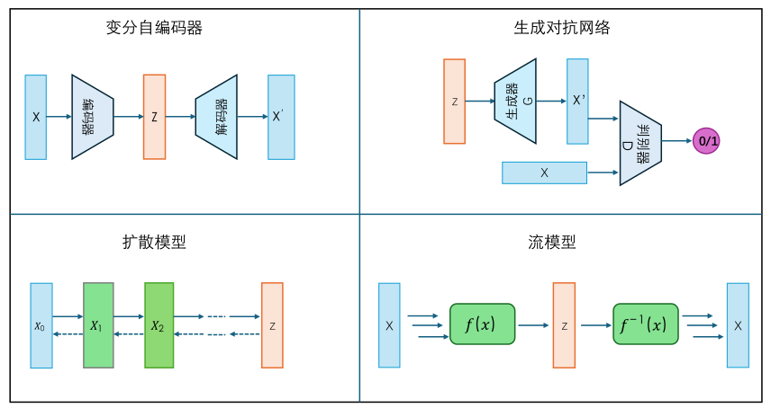

# 生成式模型的概述

生成模型是指能够随机生成观测数据的模型，尤其是要具有在给定某些隐含参数的条件下生成新内容的能力。在深度学习领域，我们往往期望从给定训练数据集中学习构建一个能够描述数据生成机制的模型。一旦模型训练完成，就可以从该分布中采样，生成与训练数据相似的新样本。

目前根据生成方式的不同主要可分为变分`自编码器`、`扩散模型`、`生成对抗网络`、`基于流的模型`四种，以下是具体简述。

## 四种生成模型

四种不同类型的生成模型架构示意图如下：

### 变分自编码器
变分自编码器模型学习的是数据->隐空间->数据的映射关系，编码器生成的均值和方差通过重参数化采样输入解码器，解决了隐空间的连续性问题，在解码过程中具有了“创作”能力。

### 扩散模型

扩散模型模仿雕塑创作的过程，涉及加噪和去噪两个过程，一个完整的图像通过前向加噪逐步得到纯噪声数据，而模型通过预测每个时间步对应的噪声，将正态分布采样逐渐去噪得到新的图像。

### 生成对抗网络

生成对抗网络是利用生成器和判别器两个神经网络互相抗衡，生成网络不断提高生成模仿的相似程度，而判别网络不断训练提高区分“真假”能力，最终的优化结果是模型具备了很好的生成能力。

### 基于流的模型

流模型通过一系列可逆的数学变换，把简单的标准正态分布（像均匀的 “基础噪声”），一步步变成复杂的数据分布（比如逼真的图像、文字等）。训练时能精确计算数据的 “合理性”，还能反向操作还原，不过处理高维数据时计算可能慢，建模超复杂分布也有局限。

## 其他生成模型

除以上四种主流生成模型外，还有几种其他方式的生成模型，他们各具特色，在不同领域都有广泛应用，做如下简略介绍：

### 自回归模型
- **原理**：按顺序逐个生成数据的元素，利用已生成元素的信息来预测下一个元素。例如在图像生成中，可按像素或按块的顺序生成；在文本生成中，按单词或字符的顺序生成。典型代表有 PixelCNN、PixelRNN （图像生成）、GPT 系列（文本生成，虽常归为语言模型，但本质是自回归生成）。
- **特点**：能生成高度结构化、细节丰富的内容，因为每一步都依赖之前的信息。但生成过程是串行的，速度较慢，且难以并行加速。

### 能量模型
- **原理**：通过定义一个能量函数来衡量数据的“合理性”，能量越低表示数据越合理。模型学习能量函数后，可通过采样（如马尔可夫链蒙特卡罗方法）来生成符合能量分布的数据。
- **特点**：建模灵活，能处理多种类型的数据和任务（如图像生成、分类、去噪等）。但训练和采样过程通常比较复杂、耗时，限制了其在大规模场景下的应用。

### 对比学习生成模型
- **原理**：结合对比学习的思想，通过构建正负样本对，让生成的样本与真实样本在特征空间中更接近，与负样本（如生成的低质量样本、其他不相关样本）更远离，从而学习生成高质量样本。
- **特点**：能利用对比学习的优势，更好地捕捉数据的分布特征，在一些生成任务中可提升生成质量。不过对比学习的正负样本构建和损失函数设计需要仔细斟酌，以适配生成任务。
