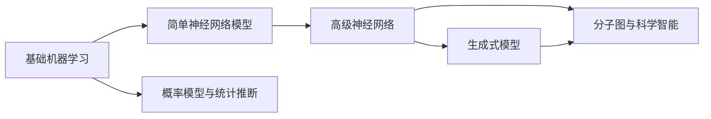

# 人工智能

本栏目整理机器学习、神经网络和生成式模型的核心知识。整体顺序从传统机器学习开始，逐步过渡到深度学习、注意力机制、图神经网络和生成模型。

学习时建议关注三条线索：

1. **模型假设**：模型认为数据是怎样产生的。
2. **优化目标**：损失函数如何定义，为什么这个目标能推动模型学习。
3. **代码实现**：公式如何转化为矩阵运算、自动求导和训练循环。

## 章节结构

- **基础机器学习**：感知机、KNN、朴素贝叶斯、决策树、Logistic 回归、SVM、EM、HMM、CRF、PCA、SVD、聚类、MCMC 等。
- **简单神经网络模型**：前馈网络、卷积神经网络、循环神经网络。
- **高级神经网络**：残差网络、注意力机制、Transformer、图神经网络、U-Net 等。
- **生成式模型**：自编码器、VAE、CVAE、GAN、Diffusion Model 以及分子生成应用。

这些内容并不是彼此割裂的：Logistic 回归可以看作单层神经网络，EM 算法是 GMM 和 HMM 的重要训练方法，注意力机制又是 Transformer 和现代大模型的核心模块。
