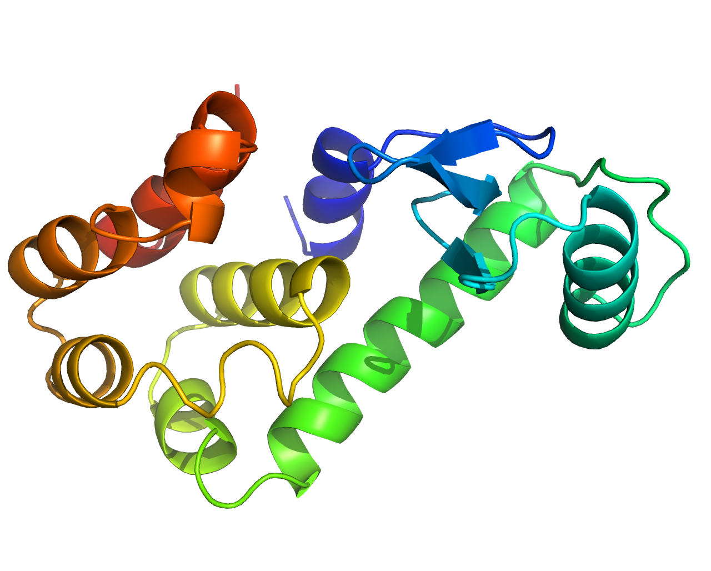
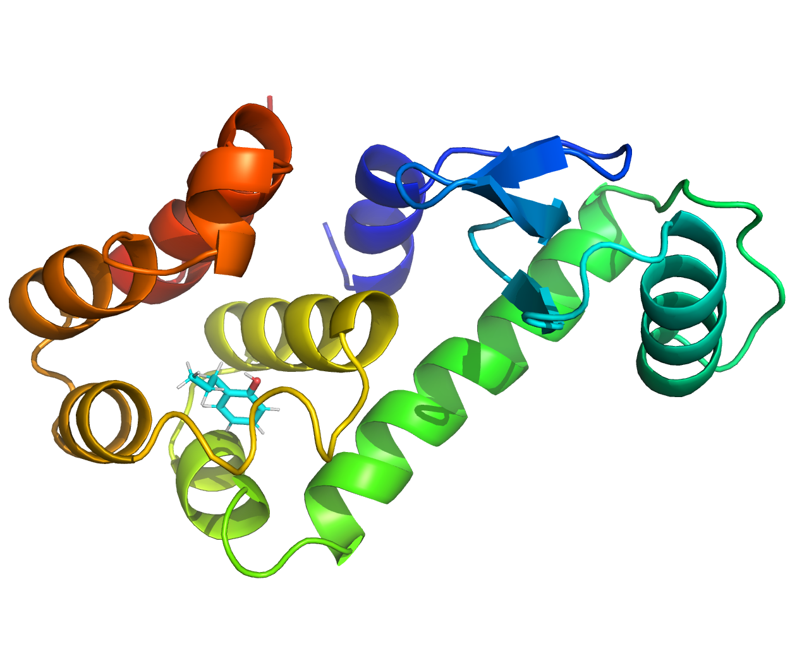
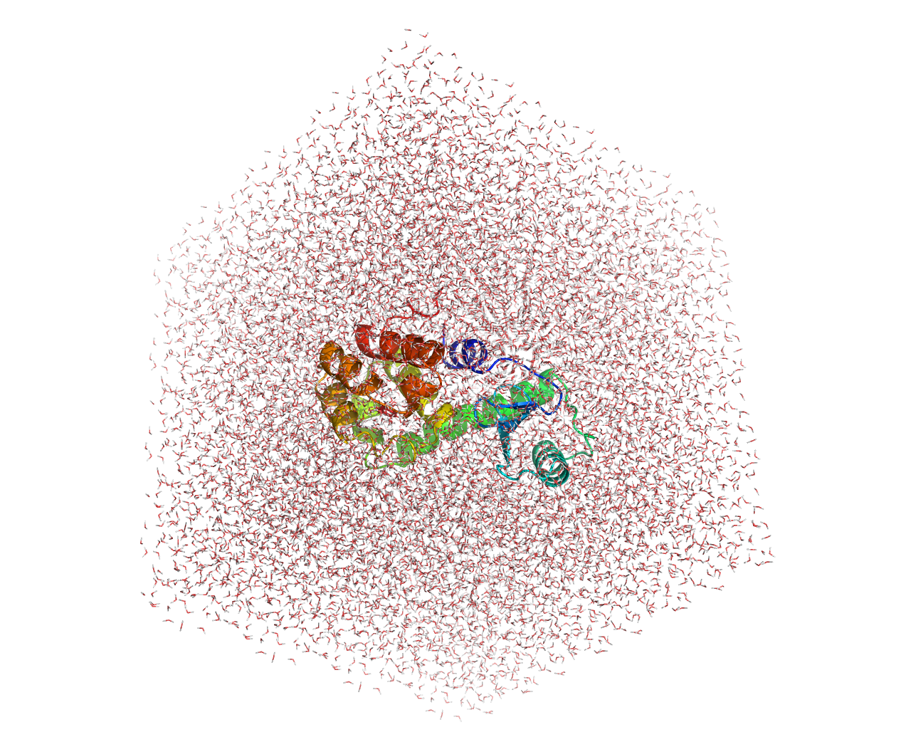
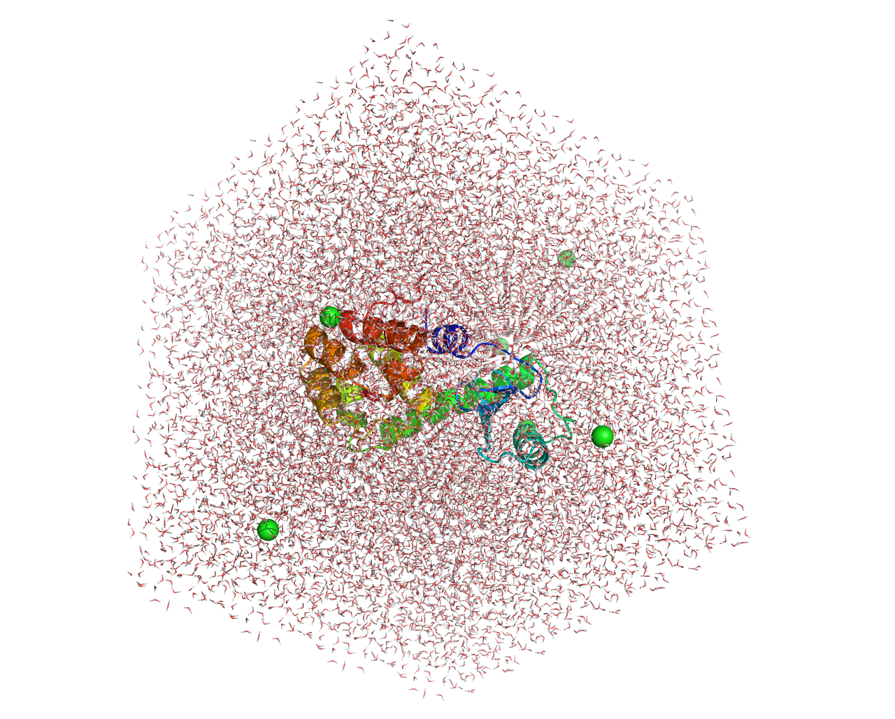

# 案例五 蛋白-配体相互作用
本例将指导新用户完成设置模拟系统的过程，该系统包含蛋白质（T4 溶菌酶 L99A/M102Q）与配体的复合物。本教程特别关注与处理配体相关的问题，前提是用户熟悉基本的 GROMACS作和拓扑的内容。


## 准备文件
分子对接一般负责寻找小分子配体和大分子受体的某个相互结合位点，相当于单帧图片；而动力学模拟则是在此基础上计算模拟配体-受体的动态相互作用过程，因此，动力学模拟往往是在分子对接完成后，对对接复合物进行操作的。

这里的示例大蛋白选用3HTB蛋白，在RCSB数据库中下载蛋白文件[3THB](https://www.rcsb.org/structure/3HTB)，提前将蛋白质进行加氢、去水、去配体操作，在日常操作中，最好选择使用分子对接后的大蛋白和小分子，分别为PDB和MOL2文件。

建议工作中蛋白质统一命名为`protein.pdb`，小分子统一命名为`mol.mol2`

本教程的所有蛋白、配体文件以及所需的五种参数配置文件可[点击此处下载](/gromacs%20Tutorial5.zip)


## 大分子准备

使用以下命令选择力场，构建蛋白质拓扑：
```
gmx pdb2gmx -f protein.pdb -o protein.gro -ter
```
对于输出的下列待选项目，我们需要选择力场和水模型，力场选择`AMBER99SB-ILDN`,水模型选择`TIP3P`
```
From '/usr/local/gromacs/share/gromacs/top':
 2: AMBER03 protein, nucleic AMBER94 (Duan et al., J. Comp. Chem. 24, 1999-2012, 2003)
 3: AMBER94 force field (Cornell et al., JACS 117, 5179-5197, 1995)
 4: AMBER96 protein, nucleic AMBER94 (Kollman et al., Acc. Chem. Res. 29, 461-469, 1996)
 5: AMBER99 protein, nucleic AMBER94 (Wang et al., J. Comp. Chem. 21, 1049-1074, 2000)
 6: AMBER99SB protein, nucleic AMBER94 (Hornak et al., Proteins 65, 712-725, 2006)
 7: AMBER99SB-ILDN protein, nucleic AMBER94 (Lindorff-Larsen et al., Proteins 78, 1950-58, 2010)
 8: AMBERGS force field (Garcia & Sanbonmatsu, PNAS 99, 2782-2787, 2002)
 9: CHARMM27 all-atom force field (CHARM22 plus CMAP for proteins)
10: GROMOS96 43a1 force field
11: GROMOS96 43a2 force field (improved alkane dihedrals)
12: GROMOS96 45a3 force field (Schuler JCC 2001 22 1205)
13: GROMOS96 53a5 force field (JCC 2004 vol 25 pag 1656)
14: GROMOS96 53a6 force field (JCC 2004 vol 25 pag 1656)
15: GROMOS96 54a7 force field (Eur. Biophys. J. (2011), 40,, 843-856, DOI: 10.1007/s00249-011-0700-9)
16: OPLS-AA/L all-atom force field (2001 aminoacid dihedrals)
```

在此过程中可能会报错，提示H原子类型不匹配或氢原子命名错误，这时可以选择使用-ignh命令，忽视原有氢原子，此时gromacs会自动加全氢

```
gmx pdb2gmx -f protein.pdb -o protein.gro -ter -ignh
```

在这一步里可能会出现`Total charge in system x.000 e`的提示，说明体系电荷不为零，在后续的溶剂化过程中为其添加抗衡离子即可。

最终会生成拓`topol.top`拓扑文件，和大蛋白的`protein.gro`文件，该文件可以用pymol可视化预览。



## 小分子准备
上步中拆分的小分子配体保存为`MOL2`格式，如果是`PDB`格式，则需要将其转化为`MOL2`格式，得到一个mol.mol2文件。

该文件只包含一个小分子，可以利用Pymol为其加氢，同时将`@<TRIPOS>MOLECULE`下的名称改为MOL，或其他统一名称，作为该配体的名称，同时确保`ATOM`列的MOL与该名称一致即可。

```ts:line-numbers {}
@<TRIPOS>MOLECULE
MOL // [!code warning]
22 22 1                 
SMALL
USER_CHARGES
@<TRIPOS>ATOM
1	 OAB	23.412	-23.536	-4.342	O.3	1	MOL1	0.000	
2	  C4	24.294	-24.124	-0.071	C.3	1	MOL1	0.000	
3	  C7	21.553	-27.214	-4.112	C.2	1	MOL1	0.000	
4	  C8	22.068	-26.747	-5.331	C.2	1	MOL1	0.000	
5	  C9	22.671	-25.512	-5.448	C.2	1	MOL1	0.000	
6	 C10	22.769	-24.730	-4.295	C.2	1	MOL1	0.000	
7	 C11	21.693	-26.459	-2.954	C.2	1	MOL1	0.000	
8	 C12	22.294	-25.187	-3.075	C.2	1	MOL1	0.000	
9	 C13	22.463	-24.414	-1.808	C.3	1	MOL1	0.000	
10	 C14	23.925	-24.704	-1.394	C.3	1	MOL1	0.000	
11	 H01	23.560	-23.216	-3.449	 H	1	MOL1	0.000	
12	 H02	25.135	-23.442	-0.196	 H	1	MOL1	0.000	
13	 H03	23.443	-23.579	0.337	 H	1	MOL1	0.000	
14	 H04	24.575	-24.926	0.612	 H	1	MOL1	0.000	
15	 H05	21.040	-28.175	-4.073	 H	1	MOL1	0.000	
16	 H06	21.989	-27.381	-6.214	 H	1	MOL1	0.000	
17	 H07	23.057	-25.160	-6.405	 H	1	MOL1	0.000	
18	 H08	21.352	-26.834	-1.989	 H	1	MOL1	0.000	
19	 H09	21.743	-24.698	-1.041	 H	1	MOL1	0.000	
20	 H10	22.311	-23.348	-1.979	 H	1	MOL1	0.000	
21	 H11	24.026	-25.786	-1.309	 H	1	MOL1	0.000	
22	 H12	24.588	-24.287	-2.152	 H	1	MOL1	0.000	
@<TRIPOS>BOND
1 1 6 1
2 1 11 1
3 2 10 1
4 2 12 1
5 2 13 1
6 2 14 1
7 3 4 ar
8 3 7 ar
9 3 15 1
10 4 5 ar
11 4 16 1
12 5 6 ar
13 5 17 1
14 6 8 ar
15 7 8 ar
16 7 18 1
17 8 9 1
18 9 10 1
19 9 19 1
20 9 20 1
21 10 21 1
22 10 22 1
```

该小分子mol2文件（邻丙基苯酚）可用pymol预览如下：


小分子力场的选择是一个非常复杂的过程，还涉及多个软件配合，这里我们可以使用计算化学公社卢天老师开发的sobtop软件，快速构建小分子拓扑具体步骤如下：

- 打开sobtop，把小分子mol.mol2拖入sobtop
- //选择1，生成top文件
- //选择3，尽可能使用GAFF力场
- //选择0，进入下一步
- //选择4，如果可能，预先构建成键参数，任意猜测缺少的选项
- //回车，生成的top文件生成在sobtop软件根目录下
- //回车，生成的itp位置限制文件在sobtop软件根目录下
- //选择2，生成gro文件
- //回车，生成的gro文件在sobtop软件根目录下
- //回车，退出sobtop软件

这时sobtop工作路径会出现`mol.gro`、`mol.itp`、`mol.top`三个文件，这就是小分子的拓扑文件，把他们复制到模拟的路径即可。

## 构建复合体
### 合并文件
新建一个`complex.gro`文件，先将`3HTB_processed.gro`的内容复制进去，再把sobtop生成的小分子`mol.gro`的以下内容复制进去，并规整文件。

更新总的原子数目，增加 `complex.gro` 的第二行，即原有大蛋白的原子数加上添加进来的小分子原子数，注意该文件不能有空行的出现:

```
Gyas ROwers Mature At Cryogenic Speed
2614+22=2636 // [!code warning]
```

修改后的`complex.gro`文件如下：

```ts:line-numbers {}
  163ASN    OC1 2613   0.566  -0.780  -0.053
  163ASN    OC2 2614   0.624  -0.616  -0.140
    1MOL    OAB    1   2.341  -2.354  -0.434 // [!code ++]
    1MOL     C4    2   2.429  -2.412  -0.007 // [!code ++]
    1MOL     C7    3   2.155  -2.721  -0.411 // [!code ++]
    1MOL     C8    4   2.207  -2.675  -0.533 // [!code ++]
    1MOL     C9    5   2.267  -2.551  -0.545 // [!code ++]
    1MOL    C10    6   2.277  -2.473  -0.429 // [!code ++]
    1MOL    C11    7   2.169  -2.646  -0.295 // [!code ++]
    1MOL    C12    8   2.229  -2.519  -0.307 // [!code ++]
    1MOL    C13    9   2.246  -2.441  -0.181 // [!code ++]
    1MOL    C14   10   2.393  -2.470  -0.139 // [!code ++]
    1MOL    H01   11   2.356  -2.322  -0.345 // [!code ++]
    1MOL    H02   12   2.514  -2.344  -0.020 // [!code ++]
    1MOL    H03   13   2.344  -2.358   0.034 // [!code ++]
    1MOL    H04   14   2.458  -2.493   0.061 // [!code ++]
    1MOL    H05   15   2.104  -2.817  -0.407 // [!code ++]
    1MOL    H06   16   2.199  -2.738  -0.621 // [!code ++]
    1MOL    H07   17   2.306  -2.516  -0.641 // [!code ++]
    1MOL    H08   18   2.135  -2.683  -0.199 // [!code ++]
    1MOL    H09   19   2.174  -2.470  -0.104 // [!code ++]
    1MOL    H10   20   2.231  -2.335  -0.198 // [!code ++]
    1MOL    H11   21   2.403  -2.579  -0.131 // [!code ++]
    1MOL    H12   22   2.459  -2.429  -0.215 // [!code ++]
   5.99500   5.19182   9.66100   0.00000   0.00000  -2.99750   0.00000   0.00000   0.00000
```


添加完成后，可以使用pymol可视化观察`complex.gro`，应该可以看到大蛋白和小分子配体共存。


### 构建拓扑

蛋白质的限制势itp文件在pdb2gmx的时候已经产生，但小分子的没有，genrestr是对输入的结构产生坐标或距离限制势itp文件（`posre_mol.itp`）的工具，接下来运行命令，进行限制势的产生：

```
gmx genrestr -f mol.gro -o posre_mol.itp
```

选择**组0**，system默认的位置限制势常数是1000kJ/mol/nm2，已经足够大。
```
Reading structure file
Select group to position restrain
Group     0 (         System) has    22 elements
Group     1 (          Other) has    22 elements
Group     2 (            MOL) has    22 elements
```

得到了小分子的位置限制文件`posre_mol.itp`，将下列语句插入到mol.itp文件的末尾，复制时连同“#”井号一同复制，最好在末尾添加之前空一行，方便检查文件错误。

```
#ifdef POSRES
#include "posre_mol.itp"
#endif
```

最终修改好的`mol.itp`文件末尾应该为如下内容：

```
[ dihedrals ] ; impropers
; atom_i  atom_j  atom_k  atom_l  functype  phase (Deg.)  kd (kJ/mol)  pn
    4       7       3      15         4       180.000       4.60240    2     ; C8-C11-C7-H05, prebuilt X-X-ca-ha
    3       5       4      16         4       180.000       4.60240    2     ; C7-C9-C8-H06, prebuilt X-X-ca-ha
    4       6       5      17         4       180.000       4.60240    2     ; C8-C10-C9-H07, prebuilt X-X-ca-ha
    1       5       6       8         4       180.000       4.60240    2     ; OAB-C9-C10-C12, guess (same as GAFF X -X -ca-ha)
    3       8       7      18         4       180.000       4.60240    2     ; C7-C12-C11-H08, prebuilt X-X-ca-ha
    6       7       8       9         4       180.000       4.60240    2     ; C10-C11-C12-C13, prebuilt ca-ca-ca-c3

#ifdef POSRES  // [!code warning]
#include "posre_mol.itp" // [!code warning]
#endif // [!code warning]
```

这样当mdp中使用define = -DPOSRES的时候配体的位置也会被限制。

把配体的itp文件引入整体的拓扑文件topol.top，在引入的时候需要将小分子的mol.itp文件引入到蛋白质链之前，因为mol.itp最开头定义了[atomtypes]因此，这个itp要最优先被引入。

即，将下列黄色语句插入到引入蛋白质的`topol.itp`文件引入之前，最终顺序如下；

```
; Include forcefield parameters
#include "amber99sb-ildn.ff/forcefield.itp"

#include "mol.itp"  // [!code warning]

[ moleculetype ]
; Name            nrexcl
Protein_chain_A     3
```

在末尾的`[molecules]`中引入**MOL 1**，将`topol.top`的格式与`complex.gro`中分子出现的顺序对应：
```
[ molecules ]
; Compound        #mols
Protein_chain_A     1
MOL                 1 // [!code warning]
```

## 溶剂化
### 设置盒子

使用以下命令设置模拟盒子，这里选用立方体盒子，可能会增加计算量，但是不容易产生边界相互作用的问题：

```
gmx editconf -f complex.gro -o complex_box.gro -d 0.8 -bt cubic
```

也可以选择三斜晶胞盒子：

```
gmx editconf -f complex.gro -o complex_box.gro -bt dodecahedron -d 1.0
```

## 加溶剂

得到`complex_box.gro`文件后为容器内加水：

```
gmx solvate -cp complex_box.gro -cs spc216.gro -o complex_SOL.gro -p topol.top
```
这里的`-cs spc216.gro`可以不写，意思是默认选择GROMACS内置的预平衡的SPC水模型（216个水分子构成的立方盒子），默认是简单点电荷（SPC）水模型。其他可选溶剂如`tip3p.gro`、`tip4p.gro`等。

注意这一步加水后有可能topol.top文件最后一行的SOL可能会串行，需要手动添加回车，避免其与`mol 1`连在同一行，容易在后续处理中报错。

这一步完成后的`topol.itp`文件末尾会增加数万个水分子：

```
[ molecules ]
; Compound        #mols
Protein_chain_A     1
MOL                 1
SOL             12750   // [!code warning]
```

最终得到的`complex_SOL.gro`文件可用pymol预览：


### 添加中和离子

构建一个`ions.mdp`配置文件：

```
; LINES STARTING WITH ';' ARE COMMENTS
title		    = Minimization	; Title of run

; Parameters describing what to do, when to stop and what to save
integrator	    = steep		; Algorithm (steep = steepest descent minimization)
emtol		    = 1000.0  	; Stop minimization when the maximum force < 10.0 kJ/mol
emstep          = 0.01      ; Energy step size
nsteps		    = 50000	  	; Maximum number of (minimization) steps to perform

; Parameters describing how to find the neighbors of each atom and how to calculate the interactions
nstlist		    = 1		    ; Frequency to update the neighbor list and long range forces
cutoff-scheme   = Verlet
ns_type		    = grid		; Method to determine neighbor list (simple, grid)
rlist		    = 1.0		; Cut-off for making neighbor list (short range forces)
coulombtype	    = cutoff	; Treatment of long range electrostatic interactions
rcoulomb	    = 1.0		; long range electrostatic cut-off
rvdw		    = 1.0		; long range Van der Waals cut-off
pbc             = xyz 		; Periodic Boundary Conditions
```

生成临时tpr文件：

```
gmx grompp -f ions.mdp -c complex_SOL.gro -p topol.top -o ions.tpr -maxwarn 1
```
这里如果警告较多可以将maxwarn的数值改大一些。

最后为体系加离子，使得整个体系变为电中性：

```
gmx genion -s ions.tpr -p topol.top -o system.gro -neutral
```

这里选择分组时选择**SOL（15）**对应的分组，产生的带有离子且电中性的体系为`system.gro`。同时可以额外使用`-pname NA -nname CL`来选择添加的阴阳离子类型，具体名称根据力场来选择。

最终的结果为总拓扑文件`[ molecules ]`后出现对应数目的离子，同时使用pymol也观察到`system.gro`文件中加载了氯离子，离子数目应该和上文的电荷数`Total charge in system x.000 e`相对应：

```
[ molecules ]
; Compound        #mols
Protein_chain_A     1
MOL                 1
SOL             12744
CL                  6  // [!code warning]
```

最终得到的`system.gro`文件可以用pymol预览，看到已经成功添加了6个氯离子：

## 能量最小化

创建如下`em.mdp`文件：

```
; LINES STARTING WITH ';' ARE COMMENTS
title		    = Minimization	; Title of run

; Parameters describing what to do, when to stop and what to save
integrator	    = steep		; Algorithm (steep = steepest descent minimization)
emtol		    = 1000.0  	; Stop minimization when the maximum force < 10.0 kJ/mol
emstep          = 0.01      ; Energy step size
nsteps		    = 50000	  	; Maximum number of (minimization) steps to perform

; Parameters describing how to find the neighbors of each atom and how to calculate the interactions
nstlist		    = 1		        ; Frequency to update the neighbor list and long range forces
cutoff-scheme   = Verlet
ns_type		    = grid		    ; Method to determine neighbor list (simple, grid)
rlist		    = 1.2		    ; Cut-off for making neighbor list (short range forces)
coulombtype	    = PME		    ; Treatment of long range electrostatic interactions
rcoulomb	    = 1.2		    ; long range electrostatic cut-off
vdwtype         = cutoff
vdw-modifier    = force-switch
rvdw-switch     = 1.0
rvdw		    = 1.2		    ; long range Van der Waals cut-off
pbc             = xyz 		    ; Periodic Boundary Conditions
DispCorr        = no
```

使用以下命令载入`em.mdp`文件，开始能量最小化：

```
gmx grompp -f em.mdp -c system.gro -p topol.top -o em.tpr
```

使用启动能量最小化：

```
gmx mdrun -v -deffnm em
```

最终的系统收敛会输出以下内容：

```
Steepest Descents converged to Fmax < 1000 in 143 steps
Potential Energy  = -4.9014547e+05
Maximum force     =  8.7411469e+02 on atom 27
Norm of force     =  5.6676244e+01
```

然后运行该命令，选择 **"10 0" (Potential, system)** ，可以得到能量最小化曲线，使用看图软件即可查看能量变化图：

```
gmx energy -f em.edr -o potential.xvg
```


## 平衡
### 约束配体
为了约束配体，我们需要为其生成位置约束拓扑。首先，为 MOL 创建一个仅包含其非氢原子的索引组：
```
gmx make_ndx -f mol.gro -o index_mol.ndx
```

依次输入下列内容：

```
 > 0 & ! a H*
 > q
```
然后，执行 genrestr 模块并选择这个新创建的索引组（将是 index_mol.ndx 文件中的第 3 组）：
```
gmx genrestr -f mol.gro -n index_mol.ndx -o posre_mol.itp -fc 1000 1000 1000
```

选择**组 3**：

```
Reading structure file
Select group to position restrain
Group     0 (         System) has    22 elements
Group     1 (          Other) has    22 elements
Group     2 (            MOL) has    22 elements
Group     3 (   System_&_!H*) has    10 elements  // [!code warning]
```

将此信息包含在拓扑中，方法有很多种。最简单的，如果只想在蛋白质也被约束时抑制配体，在指示的位置将以下黄色代码行添加到拓扑结构对应位置中：

```
; Include Position restraint file
#ifdef POSRES
#include "posre.itp"
#endif

; Ligand position restraints  // [!code warning]
#ifdef POSRES // [!code warning]
#include "posre_mol.itp" // [!code warning]
#endif // [!code warning]

; Include water topology
#include "amber99sb-ildn.ff/tip3p.itp"

#ifdef POSRES_WATER
```

位置很重要，必须按照指示在拓扑中调用 `posre_mol.itp`。

`mol.itp` 中的参数为我们的配体定义了一个指令，引用文件以包含水拓扑结构 （tip3p.itp） 结束，在其他任何位置调用 posre_mol.itp 将尝试将位置约束参数应用于错误的分子类型。

最后需要一个合并蛋白质和 MOL 的特殊索引组，通过 `make_ndx` 模块来实现这，提供整个系统的任何坐标文件。这里使用的是 em.gro，这是我们系统的输出（最小化）结构：

```
gmx make_ndx -f em.gro -o index.ndx
```

将显示以下提示词：

```
  0 System              : 33506 atoms
  1 Protein             :  2614 atoms
  2 Protein-H           :  1301 atoms
  3 C-alpha             :   163 atoms
  4 Backbone            :   489 atoms
  5 MainChain           :   651 atoms
  6 MainChain+Cb        :   803 atoms
  7 MainChain+H         :   813 atoms
  8 SideChain           :  1801 atoms
  9 SideChain-H         :   650 atoms
 10 Prot-Masses         :  2614 atoms
 11 non-Protein         : 30892 atoms
 12 Other               :    22 atoms
 13 MOL                 :    22 atoms
 14 CL                  :     6 atoms
 15 Water               : 30864 atoms
 16 SOL                 : 30864 atoms
 17 non-Water           :  2642 atoms
 18 Ion                 :     6 atoms
 19 MOL                 :    22 atoms
 20 CL                  :     6 atoms
 21 Water_and_ions      : 30870 atoms
```

将 “Protein” 和 “MOL” 组与以下内容合并，输入"1 | 13"，再输入q退出：

```
> 1 | 13
> q
```

可以看到输出信息，创建了一个编号为**22**的索引组：
```
Copied index group 1 'Protein'
Copied index group 13 'MOL'
Merged two groups with OR: 2614 22 -> 2636

 22 Protein_MOL         :  2636 atoms  // [!code warning]
```

该索引组的名称为`Protein_MOL`，应该确保名称和下面的.mdp文件相对应。

为了确保名称一致，可以使用name命令更改名称,最后输入q，退出：

```
Copied index group 1 'Protein'
Copied index group 13 'MOL'
Merged two groups with OR: 2614 22 -> 2636

 22 Protein_MOL         :  2636 atoms

> name 22 New_name   // [!code warning]


> q
```

也可以直接在`index.ndx`中修改索引组标题即可，把红色部分改成想要的名称：

```
40842 40843 40844 40845 40846 40847 40848 40849 40850 40851 40852 40853 40854 40855 40856
40857 40858 40859 40860 40861 40862 40863 40864 40865 40866 40867 40868 40869 40870 40871
40872 40873 40874
[ Protein_MOL ]    // [!code error]
   1    2    3    4    5    6    7    8    9   10   11   12   13   14   15
  16   17   18   19   20   21   22   23   24   25   26   27   28   29   30
  31   32   33   34   35   36   37   38   39   40   41   42   43   44   45
```

### NVT平衡

构建如下`nvt.mdp`文件，注意标黄列的名称与上述索引组名称一致：

```ts {}
title                   = Protein-ligand complex NVT equilibration 
define                  = -DPOSRES  ; position restrain the protein and ligand
; Run parameters
integrator              = md        ; leap-frog integrator
nsteps                  = 50000     ; 2 * 50000 = 100 ps
dt                      = 0.002     ; 2 fs
; Output control
nstenergy               = 500   ; save energies every 1.0 ps
nstlog                  = 500   ; update log file every 1.0 ps
nstxout-compressed      = 500   ; save coordinates every 1.0 ps
; Bond parameters
continuation            = no        ; first dynamics run
constraint_algorithm    = lincs     ; holonomic constraints 
constraints             = h-bonds   ; bonds to H are constrained 
lincs_iter              = 1         ; accuracy of LINCS
lincs_order             = 4         ; also related to accuracy
; Neighbor searching and vdW
cutoff-scheme           = Verlet
ns_type                 = grid      ; search neighboring grid cells
nstlist                 = 20        ; largely irrelevant with Verlet
rlist                   = 1.2
vdwtype                 = cutoff
vdw-modifier            = force-switch
rvdw-switch             = 1.0
rvdw                    = 1.2       ; short-range van der Waals cutoff (in nm)
; Electrostatics
coulombtype             = PME       ; Particle Mesh Ewald for long-range electrostatics
rcoulomb                = 1.2       ; short-range electrostatic cutoff (in nm)
pme_order               = 4         ; cubic interpolation
fourierspacing          = 0.16      ; grid spacing for FFT
; Temperature coupling
tcoupl                  = V-rescale                     ; modified Berendsen thermostat
tc-grps                 = Protein_MOL Water_and_ions    ; two coupling groups - more accurate  // [!code warning]
tau_t                   = 0.1   0.1                     ; time constant, in ps
ref_t                   = 300   300                     ; reference temperature, one for each group, in K
; Pressure coupling
pcoupl                  = no        ; no pressure coupling in NVT
; Periodic boundary conditions
pbc                     = xyz       ; 3-D PBC
; Dispersion correction is not used for proteins with the C36 additive FF
DispCorr                = no 
; Velocity generation
gen_vel                 = yes       ; assign velocities from Maxwell distribution
gen_temp                = 300       ; temperature for Maxwell distribution
gen_seed                = -1        ; generate a random seed
```

执行平衡：

```
gmx grompp -f nvt.mdp -c em.gro -r em.gro -p topol.top -n index.ndx -o nvt.tpr

gmx mdrun -deffnm nvt -v
```

平衡后输出以下内容：

```
step 50000, remaining wall clock time:     0 s
               Core t (s)   Wall t (s)        (%)
       Time:      984.000      123.000      800.0
                 (ns/day)    (hour/ns)
Performance:       70.245        0.342

```

下列命令输出NVT平衡图像，选择 **"15 0"  Temperature** ，并查看：

```
gmx energy -f nvt.edr -o temperature.xvg
```


### NPT平衡

构建下列`npt.mdp`文件，注意标黄列的名称与上述索引组名称一致：

```ts {}
title                   = Protein-ligand complex NPT equilibration 
define                  = -DPOSRES  ; position restrain the protein and ligand
; Run parameters
integrator              = md        ; leap-frog integrator
nsteps                  = 50000     ; 2 * 50000 = 100 ps
dt                      = 0.002     ; 2 fs
; Output control
nstenergy               = 500       ; save energies every 1.0 ps
nstlog                  = 500       ; update log file every 1.0 ps
nstxout-compressed      = 500       ; save coordinates every 1.0 ps
; Bond parameters
continuation            = yes       ; continuing from NVT 
constraint_algorithm    = lincs     ; holonomic constraints 
constraints             = h-bonds   ; bonds to H are constrained 
lincs_iter              = 1         ; accuracy of LINCS
lincs_order             = 4         ; also related to accuracy
; Neighbor searching and vdW
cutoff-scheme           = Verlet
ns_type                 = grid      ; search neighboring grid cells
nstlist                 = 20        ; largely irrelevant with Verlet
rlist                   = 1.2
vdwtype                 = cutoff
vdw-modifier            = force-switch
rvdw-switch             = 1.0
rvdw                    = 1.2       ; short-range van der Waals cutoff (in nm)
; Electrostatics
coulombtype             = PME       ; Particle Mesh Ewald for long-range electrostatics
rcoulomb                = 1.2
pme_order               = 4         ; cubic interpolation
fourierspacing          = 0.16      ; grid spacing for FFT
; Temperature coupling
tcoupl                  = V-rescale                     ; modified Berendsen thermostat
tc-grps                 = Protein_MOL Water_and_ions    ; two coupling groups - more accurate  // [!code warning]
tau_t                   = 0.1   0.1                     ; time constant, in ps
ref_t                   = 300   300                     ; reference temperature, one for each group, in K
; Pressure coupling
pcoupl                  = Berendsen                     ; pressure coupling is on for NPT
pcoupltype              = isotropic                     ; uniform scaling of box vectors
tau_p                   = 2.0                           ; time constant, in ps
ref_p                   = 1.0                           ; reference pressure, in bar
compressibility         = 4.5e-5                        ; isothermal compressibility of water, bar^-1
refcoord_scaling        = com
; Periodic boundary conditions
pbc                     = xyz       ; 3-D PBC
; Dispersion correction is not used for proteins with the C36 additive FF
DispCorr                = no 
; Velocity generation
gen_vel                 = no        ; velocity generation off after NVT 
```

执行平衡：

```
gmx grompp -f npt.mdp -c nvt.gro -t nvt.cpt -r nvt.gro -p topol.top -n index.ndx -o npt.tpr

gmx mdrun -deffnm npt -v
```

最终输出的npt状态如下：

```
step 50000, remaining wall clock time:     0 s
               Core t (s)   Wall t (s)        (%)
       Time:      992.000      124.000      800.0
                 (ns/day)    (hour/ns)
Performance:       69.679        0.344
```

显示压力平衡过程图，选择 **"16 0"  Pressure** ，并查看：

```
gmx energy -f npt.edr -o pressure.xvg
```


显示压力平衡过程图，选择 **“22 0"  Density** ，并查看：

```
gmx energy -f npt.edr -o density.xvg
```


## 开始模拟
构建以下`md.mdp`文件，设置合理时间（标红列），一般是大于100ns。同时还要注意标黄列的名称与上述索引组名称一致：

```ts {}
title                   = Protein-ligand complex MD simulation 
; Run parameters
integrator              = md        ; leap-frog integrator
nsteps                  = 5000000   ; 2 * 5000000 = 10000 ps (10 ns)   // [!code error]
dt                      = 0.002     ; 2 fs
; Output control
nstenergy               = 5000      ; save energies every 10.0 ps
nstlog                  = 5000      ; update log file every 10.0 ps
nstxout-compressed      = 5000      ; save coordinates every 10.0 ps
; Bond parameters
continuation            = yes       ; continuing from NPT 
constraint_algorithm    = lincs     ; holonomic constraints 
constraints             = h-bonds   ; bonds to H are constrained
lincs_iter              = 1         ; accuracy of LINCS
lincs_order             = 4         ; also related to accuracy
; Neighbor searching and vdW
cutoff-scheme           = Verlet
ns_type                 = grid      ; search neighboring grid cells
nstlist                 = 20        ; largely irrelevant with Verlet
rlist                   = 1.2
vdwtype                 = cutoff
vdw-modifier            = force-switch
rvdw-switch             = 1.0
rvdw                    = 1.2       ; short-range van der Waals cutoff (in nm)
; Electrostatics
coulombtype             = PME       ; Particle Mesh Ewald for long-range electrostatics
rcoulomb                = 1.2
pme_order               = 4         ; cubic interpolation
fourierspacing          = 0.16      ; grid spacing for FFT
; Temperature coupling
tcoupl                  = V-rescale                     ; modified Berendsen thermostat
tc-grps                 = Protein_MOL Water_and_ions    ; two coupling groups - more accurate   // [!code warning]
tau_t                   = 0.1   0.1                     ; time constant, in ps
ref_t                   = 300   300                     ; reference temperature, one for each group, in K
; Pressure coupling 
pcoupl                  = Parrinello-Rahman             ; pressure coupling is on for NPT
pcoupltype              = isotropic                     ; uniform scaling of box vectors
tau_p                   = 2.0                           ; time constant, in ps
ref_p                   = 1.0                           ; reference pressure, in bar
compressibility         = 4.5e-5                        ; isothermal compressibility of water, bar^-1
; Periodic boundary conditions
pbc                     = xyz       ; 3-D PBC
; Dispersion correction is not used for proteins with the C36 additive FF
DispCorr                = no 
; Velocity generation
gen_vel                 = no        ; continuing from NPT equilibration 
```

执行命令，启动模拟，利用GPU加速，并输出详细步骤：

```
gmx grompp -f md.mdp -c npt.gro -t npt.cpt -p topol.top -n index.ndx -o md_0.tpr

gmx mdrun -deffnm md_0 -nb gpu -v
```

## 结果分析

