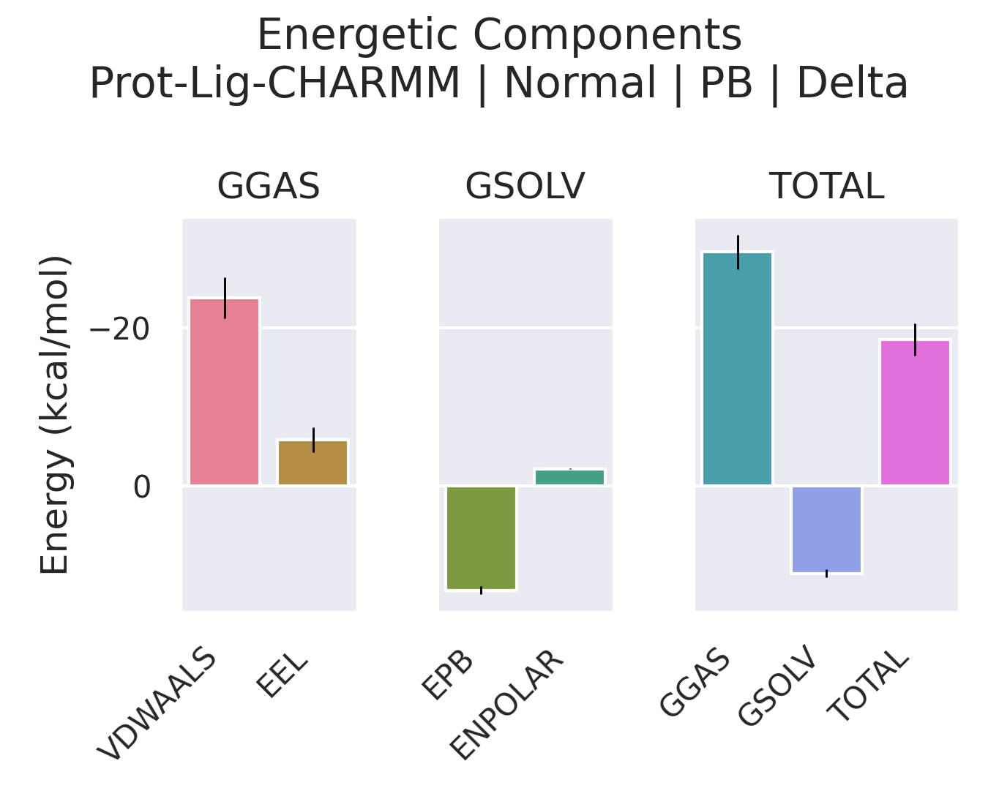

# 安装教程

gmx_mmpbsa 同样只能在Linux下运行，所以可以使用纯linux服务器安装，或WSL、虚拟机等方式在Windows平台安装，这里介绍虚拟机安装的方法，安装前请确保已经安装conda。

## 安装gmx_mmpbsa

`gmx_mmpbsa`是一个很好用的自由能分析工具，以下将介绍在Linux上的安装方法，其中，点击[此处](https://valdes-tresanco-ms.github.io/gmx_MMPBSA/dev/installation/)进入官方下载地址。

推荐使用conda来安装，首先创建下列`env.yml`文件：

```yml
name: gmxMMPBSA
channels:
  - conda-forge
  - bioconda
  - defaults
dependencies:
  - python=3.9
  - ambertools=21.12
  - mpi4py=3.1.3
  - compilers
  - gromacs==2021.3
  - pip
  - pip: 
    - pyqt5==5.15.6
    - gmx-mmpbsa
    - pandas>=1.2.2
    - seaborn>=0.11.2
    - scipy>=1.6.1
    - matplotlib>=3.5.1
    - h5py==3.7.0
```

随后输入下列命令，将根据yml文件创建一个名为`gmxMMPBSA`的虚拟环境：

```
conda env create --file env.yml
```

安装完成后，先激活该环境：

```
conda activate gmxMMPBSA
```

因为网速的问题，之前的yml文件里没有配置`ParmED`包，这里我们从github上手动下载安装，仓库地址点击[此处](https://github.com/Valdes-Tresanco-MS/ParmEd)下载。

从仓库下载到文件后，解压到以下路径：

```
/home/aether/.conda/envs/gmxMMPBSA
```

随后进入该文件夹下：
```
cd ParmED-master/
```

输入以下命令进行安装：
```
python -m pip install . -U
```

若出现报错，多为版本不兼容导致，此时根据提示，需要重新下载匹配的版本，因为各个系统和时间对应的报错问题大不相同，这里不做介绍，需要用户根据具体情况结合报错信息自行处理。不过，绝大多数问题经过安装合适的包后均能得到解决。

## 简单测试
最终，输入下列命令，检查安装情况：
```
gmx_MMPBSA --help
```

若输出下列内容，则说明安装成功：

```
[INFO   ] Starting gmx_MMPBSA v1.6.3
[INFO   ] Command-line
  gmx_MMPBSA --help

usage: gmx_MMPBSA [-h] [-v] [--input-file-help]
                  [--create_input [{gb,pb,rism,ala,decomp,nmode,gbnsr6,all} ...]]
                  [-O] [-prefix <file prefix>] [-i FILE] [-xvvfile XVVFILE]
                  [-o FILE] [-do FILE] [-eo FILE] [-deo FILE] [-nogui] [-s]
                  [-cs <Structure File>] [-ci <Index File>] [-cg index index]
                  [-ct [TRJ ...]] [-cp <Topology>] [-cr <PDB File>]
                  [-rs <Structure File>] [-ri <Index File>] [-rg index]
                  [-rt [TRJ ...]] [-rp <Topology>] [-lm <Structure File>]
                  [-ls <Structure File>] [-li <Index File>] [-lg index]
                  [-lt [TRJ ...]] [-lp <Topology>] [--rewrite-output]
                  [--clean]

................
```

## 运行官方案例

在官方仓库中提供了丰富的示例文件，我们可以利用这些示例来验证gmx_mmbpsa的安装运行情况。

首先从官方仓库下载示例文件，点击[此处](https://github.com/Valdes-Tresanco-MS/gmx_MMPBSA/tree/master)下载，随后在项目文件夹内找到 `gmx_MMPBSA-master\examples\Protein_ligand_CHARMMff` 示例，将其复制到工作区，进入命令行终端并激活conda环境：

```
conda activate gmxMMPBSA
```

在readme.nd文件中阅读教学方法，运行该行命令：

```
gmx_MMPBSA -O -i mmpbsa.in -cs com.tpr -ci index.ndx -cg 1 13 -ct com_traj.xtc -cp topol.top
```

在前面加上mpirun -np可以设置cpu多核心运算：

```
mpirun -np 8 gmx_MMPBSA -O -i mmpbsa.in -cs com.tpr -ci index.ndx -cg 1 13 -ct com_traj.xtc -cp topol.top
```

等待程序计算完成后在文件夹下找到`FINAL_DECOMP_MMPBSA.dat`、`FINAL_RESULTS_MMPBSA.dat`文件，同时会启动可视化界面，点击`accept`，选择 `delta`，即可查看图表：



打开`FINAL_RESULTS_MMPBSA.dat`文件，可以找以下内容，即为自由能计算结果：

```
Delta (Complex - Receptor - Ligand):
Energy Component       Average     SD(Prop.)         SD   SEM(Prop.)        SEM
-------------------------------------------------------------------------------
ΔBOND                     0.00          0.25       0.00         0.12       0.00
ΔANGLE                   -0.00          0.56       0.00         0.28       0.00
ΔDIHED                   -0.00          0.56       0.00         0.28       0.00
ΔUB                      -0.00          0.30       0.00         0.15       0.00
ΔIMP                      0.00          0.00       0.00         0.00       0.00
ΔCMAP                     0.00          0.00       0.00         0.00       0.00
ΔVDWAALS                -23.82          1.37       2.58         0.68       1.29
ΔEEL                     -5.78          0.61       1.58         0.31       0.79
Δ1-4 VDW                  0.00          1.25       0.00         0.63       0.00
Δ1-4 EEL                  0.00          0.12       0.00         0.06       0.00
ΔEPB                     13.24          0.13       0.53         0.06       0.27
ΔENPOLAR                 -2.15          0.00       0.01         0.00       0.01
ΔEDISPER                  0.00          0.00       0.00         0.00       0.00

ΔGGAS                   -29.60          1.53       2.21         0.76       1.11
ΔGSOLV                   11.10          0.13       0.54         0.06       0.27

ΔTOTAL                  -18.50          1.53       2.05         0.77       1.03
```

如果不小心关闭了可视化分析界面，可输入下列命令，重新打开（_GMXMMPBSA_info应和项目文件一致）：

```
gmx_MMPBSA_ana -f _GMXMMPBSA_info
```