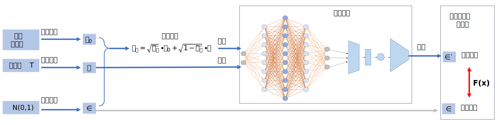

# Diffusion Model

Diffusion Model被称为扩散模型，最开始一种用于图像生成的模型，在AIDD领域可以被用于分子生成。其核心思想可以类比为雕刻雕塑的过程，即由一块完整的石材一步一步地雕刻出造型。

Diffusion Model则是在一个给定的纯噪声数据中经过时间步长T，一步步去噪而得到最终图像，在这一过程中模型需要根据每一步输入的数据$x_t$和时间步$t$输出预测噪声，随后进行去噪得到$x_{t-1}$，以此往复得到最终结果。

根据上述流程我们可以得出，Diffusion Model主要分为前向加噪和反向去噪两个步骤，下面对这两个步骤进行详细说明。

## 前向加噪

模型训练时需要输入给定原始图像加噪后的数据，设原数据为$x_0$，第t步加噪后的数据为$x_t$，最终加噪完成的数据$x_T$应为纯噪声数据。

我们假设随机噪声符合正态分布，即$\varepsilon_t = \mathcal{N}(0,1)$，加噪过程可以描述为均值为$\sqrt{1-\beta_t}x_{t-1}$，方差为$\beta_tI$的正态分布，$I$ 代表单位矩阵：
$$q(x_t|x_{t-1}) = \mathcal{N}(x_t;\sqrt{1-\beta_t}x_{t-1},\beta_tI)$$

由此可以得到加噪迭代公式：

$$
x_t = \sqrt{\alpha_t}x_{t-1} + \sqrt{\beta_t}\varepsilon_t; \quad \alpha_t = 1- \beta_t
$$

迭代后推导出的加噪公式，即第t步加噪后的数据可表示为：
$$ x_t = \sqrt{\bar{\alpha}_t}\cdot x_0 + \sqrt{1-\bar{\alpha}_t} \cdot \varepsilon , \quad \bar{\alpha}_t = \prod_T \alpha_t$$
写成加噪分布的形式为：
$$
q(x_{t}|x_0) =\mathcal{N}(x_{t};\sqrt{\bar{\alpha}_t}x_0,(1-\bar{\alpha}_t)I)
$$

## 反向去噪

Diffusion Model并不是直接由$x_t$预测$x_{t-1}$，而是预测加在$x_t$上的“噪声”，通过去噪得到$x_{t-1}$，这样做是兼顾 “训练效率、模型稳定性、生成多样性” 的最优选择。

反向过程则是从纯噪声$x_T$ 到真实数据 $x_0$，这里反向分布公式可由**贝叶斯定理**推出：
$$q(x_{t-1} | x_t) = \frac{q(x_t|x_{t-1}) \cdot q(x_{t-1}|x_0)}{q(x_t|x_0)}$$

该公式表示给定$x_t$去求$x_{t-1}$，分子分母的三个分布在前向加噪中都已得到，分式的三个分布都是高斯分布，则$q(x_{t-1} | x_t)$也必然是高斯分布。

- 单步加噪分布，$\alpha_t=1-\beta_t$，$\beta_t$是单步噪声方差：
  $$q(x_t|x_{t-1}) \thicksim \mathcal{N}(\sqrt{\alpha_t}x_{t-1},(1-\alpha_t)I)$$

- 从$x_0$到$x_{t-1}$的累计加噪分布，$\bar{\alpha}_{t-1} = \prod\nolimits_{i=1}^{t-1} \alpha_i$
  $$q(x_{t-1}|x_0) \thicksim \mathcal{N}( \sqrt{\bar{\alpha}_{t-1}}x_0,(1-\bar{\alpha}_{t-1})I )$$

- 从$x_0$到$x_t$的累计加噪分布，$\bar{\alpha}_t = \prod\nolimits_{i=1}^t \alpha_i$
  $$q(x_t|x_0) \thicksim \mathcal{N} ( \sqrt{\bar{\alpha}_t}x_0,(1-\bar{\alpha}_t)I )$$

随后推导出已知第t步时第t-1步的数据分布$q(x_{t-1}|x_t)$的均值和方差，用角标表示条件分布。
均值：
$$ \mu_{t-1|t} = \frac{\sqrt{\alpha_t}(1-\bar{\alpha}_{t-1})}{1-\bar{\alpha}_t}x_t + \frac{\sqrt{\bar{\alpha}_{t-1}}(1-\alpha_t)}{1-\bar{\alpha}_t} x_0 $$
方差：
$$ \sigma_{t-1|t} = \frac{1-\bar{\alpha}_{t-1}}{1-\bar{\alpha}_t}(1-\alpha_t)I$$

这里的均值使用了参数$x_0$，但在预测中我们并不预先知道，不然就不用预测了，所以我们要用$x_t$来预测$x_0$，由前向扩散公式反解出$x_0$，这里$\varepsilon_t$是第t步的真实噪声：
$$x_0 = \frac{1}{\sqrt{\bar{\alpha}_t}} (x_t - \sqrt{1-\bar{\alpha}_t} \cdot \varepsilon_t) $$

将其代入反向分布的均值$\mu_{t-1|t}$中，用预测噪声$\varepsilon_ \theta$近似真实噪声$\varepsilon_t$，得到反向去噪公式：
$$ x_{t-1} = \frac{1}{\sqrt{\alpha_t}} (x_t - \frac{\beta_t}{\sqrt{1-\bar{\alpha}_t}} \cdot \varepsilon_ \theta(x_t,t)) + \sigma_t \cdot z $$

这里$\sigma_t = \sqrt{\frac{1-\bar{\alpha}_{t-1}}{1-\bar{\alpha}_t}(1-\alpha_t)}$是噪声强度系数，$z \thicksim \mathcal{N}(0,1)$是随机噪声。
因此，利用该公式，针对模型每轮预测的噪声$\varepsilon_ \theta$，都可以得到下一步的数据$x_{t-1}$

## 损失函数

## 模型训练流程

Diffusion Model的训练示意图如下：

由图可知，实际上是要得到一个神经网络模型，接收时间步t和含噪数据$x_t$，预测出加在数据中的噪声$\varepsilon$，再通过反向过程去除噪声得到下一步的数据$x_{t-1}$

## 神经网络部分

接下来我们讨论Diffusion Model预测噪声功能的核心部分，根据上述讨论，我们可以理解，扩散模型实际上还是一种神经网络，只不过该神经网络的输入数据经过处理，接收含噪数据和时间步，输出的预测数据也经过了处理得到去噪后数据，那么接下来我们深入研究核心模块——u-net网络。