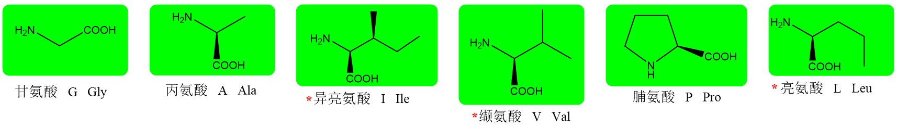
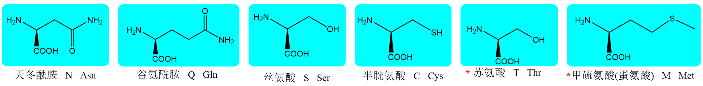
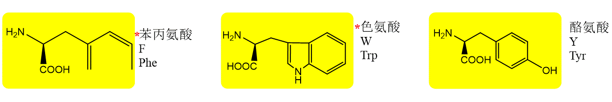
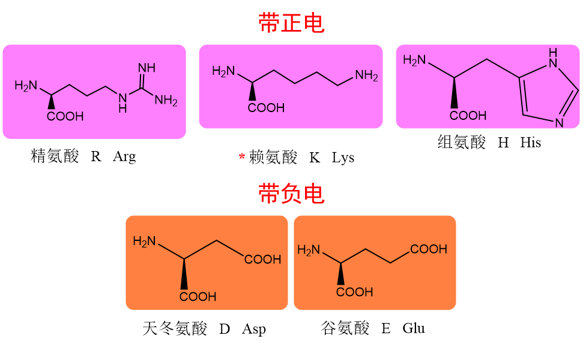
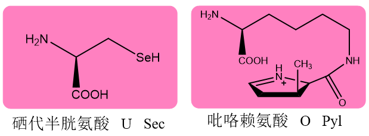

# 蛋白质氨基酸

蛋白质氨基酸又称为标准氨基酸，由遗传密码直接编码，有专门的tRNA结合，合成时被转运到核糖体上，直接参与肽链合成，目前已发现的有22种，其中最早发现的20种较为常见。

各种蛋白质氨基酸的主要差异在R基团的不同，分类的依据可以根据R基团的化学结构，也可以根据R基团对水的亲和性。

根据R基团的化学结构和pH=7的带电情况可分为四类：

## 非极性的脂肪族氨基酸

包括Gly、Ala、Val、Leu、Ile、Pro。这些氨基酸的侧链都不能与水分子形成氢键，所以是非极性的。

其中Gly是最小的氨基酸，也是22种蛋白质氨基酸中唯一没有手性的，其R基团仅仅是一个H原子。

Ala的R基团是非极性的甲基。

VaI、LeU和Ile的R基团较大，都是非极性的带有分支的碳氢链。

Pro实际上是一种亚氨基酸，其侧链与亚氨基形成一个刚性的环，它和Gly一样通常会造成多肽链的弯曲。

## 不带电荷的极性氨基酸

包括Ser、Thr、Asn、Gln、Cys和Met

Ser和Thr的R基团含有极性的羟基。

Asn和Gln分别是Asp和Glu发生酰胺化反应的产物，它们的R基团含有极性的酰胺基。羟基和酰胺基的存在使得这4种氨基酸不仅能和水分子，还可以彼此之间或者与肽链主链、其他极性化合物之间形成氢键。

Cys和Met的R基团都含有S原子，其中Cys含有巯基，其pKa约为8.4，因此Cys在生理pH下主要以非解离的形式存在。溶液中游离的Cys分子之间可以发生氧化还原反应形成二硫键，由此形成一种非蛋白质氨基酸胱氨酸。胱氨酸存在于血液和组织中，但水溶性并不高。

Met尽管也有S原子，但是其侧链基团其余部分是非极性的，因此有人主张将Met归为非极性氨基酸。Met在代谢中的重要作用与S原子上的甲基有关，它受到激活以后，可作为甲基供体参与多种生物分子的甲基化修饰，例如DNA，RNA和组蛋白的甲基化。

## 芳香族氨基酸

包括Phe、Tyr和Trp。它们的R基团都含有苯环，但极性差别很大。极性的差别是由苯环上的取代基团造成的。

Phe的苯环上没有取代基团，因此其非极性最强。

Tyr的苯环上含有羟基，能够参与氢键的形成，因此它的R基团极性最强。

Trp的环结构较复杂，但其吲哚环上含有N原子，因而它的极性也比Phe强。

## 带电荷的极性氨基酸

包括Asp、Glu、Sec、His、Lys、Pyl和Arg。这7种氨基酸的R基团在生理pH下带电荷，其中前3种带负电荷，后4种带正电荷。

两种新发现氨基酸

Asp和Glu为酸性氨基酸，其R基团带羧基；Sec的R基团是硒醇基，其pKa只有5.74，因此在生理PH下即发生解离，而带负电荷。

His、Lys、Pyl和Arg为碱性氨基酸，它们的R基团在生理pH或更低pH下被质子化而带正电荷。

His的R基团有一个含N的咪唑环；Lys含有的是一级的ε-氨基；Pyl与Lys相似，但多了一个与ε-氨基通过酰胺键相连的毗咯环；Arg含有的是胍基。

碱性氨基酸R基团上的正电荷能够与带负电荷的基团形成离子键，如磷酸基团和酸性氨基酸的R基团。

此外，酸性氨基酸和碱性氨基酸的R基团也参与形成氢键。

## 按亲水性分类

仅根据R 基团对水分子的亲和性，可将氨基酸简单地分为两类

### 亲水氨基酸

亲水氨基酸的R基团有极性，对水分子具有一定的亲和性，一般能和水分子之间形成氢键。属于亲水氨基酸的有Ser、Thr、Tyr、Cys、Sec、Asn、Gln、Asp、Glu、PyL、Arg、Cys、His

R基团的亲水性质使得这些氨基酸通常分布在球状蛋白质的表面。

### 疏水氨基酸

疏水氨基酸的R基团呈非极性，对水分子的亲和性不高或者很低，但对脂溶性物质的亲和性较高。主要有：Gly、Ala、Val、Leu、Ile、Pro、Met、Phe和Trp

R基团的疏水性质使得这些氨基酸通常分布在球状蛋白质的内部。

### 中性氨基酸

Gly和Met的疏水性与其他疏水氨基酸相比要差。

Gly侧链为氢原子，不是碳氢链；Met侧链含有与氧原子性质相似的S。

因此有人把这两种氨基酸放到亲水氨基酸之中，或者干脆将它们另立为一类中性氨基酸。

所有的氨基酸都溶于水，原因是它们都含有亲水的氨基和竣基，只是水溶性有高有低

## 其他分类标准

根据它们对于动物(通常指人)的营养价值，将20种常见的蛋白质氨基酸分为必需氨基酸和非必需氨基酸。

### 必需氨基酸

必需氨基酸是指人体或动物体必不可少，但却不能合成，或者虽能合成，但合成量不够，必须从食物中补充的氨基酸。如果饮食中经常缺少它们，就会影响到机体的健康。必需氨基酸共有10种：Lys、Trp、Phe、Met、Thr、Jle、Leu、Val、Arg和His。

前8种是绝对的必需氨基酸，因为人体或动物体完全不能合成它们，只能从食物中获取。

### 半必需氨基酸

后2种(即Arg和His)，人体虽能合成，但合成的量有限，在特定的阶段（如青少年发育和妇女怀孕期间）不能满足正常的需要，这时也需要从食物中加以补充，因此这两种氨基酸又称为半必需氨基酸。

### 非必需氨基酸

余下的氨基酸则属于非必需氨基酸，动物体自身可以进行有效的合成：Ala、Asn、Asp、Gln、Glu、Pro、Ser、Cys、Tyr和Gly