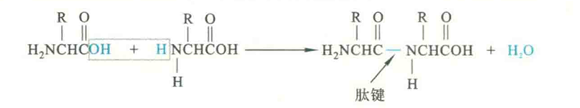
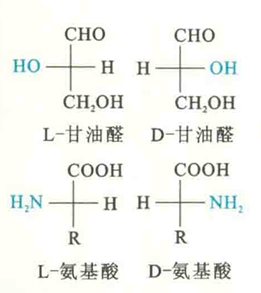
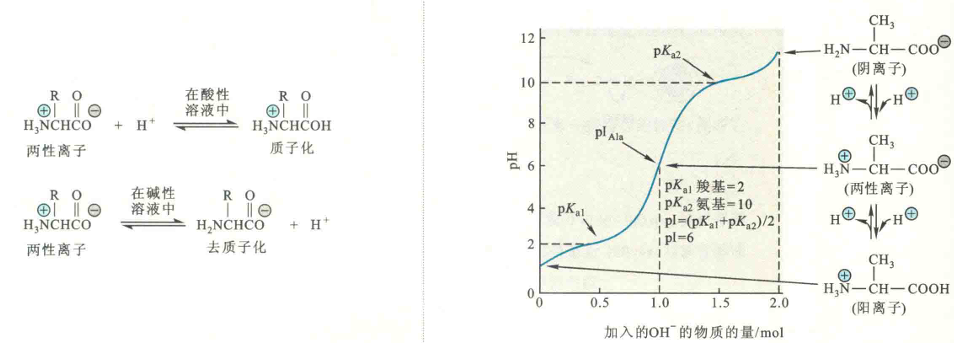
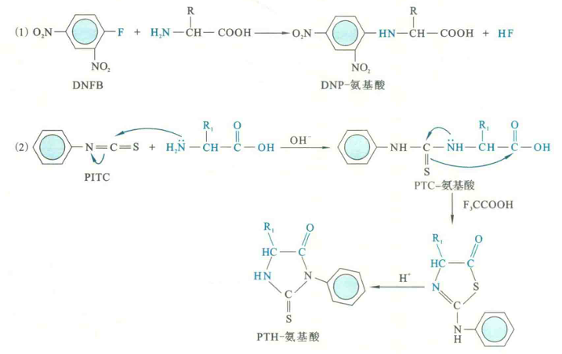
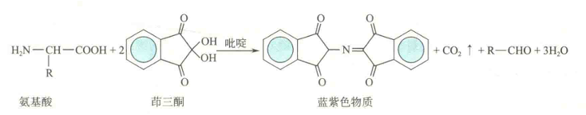

# 共同特性

## 缩合反应

在一定的条件下，一个氨基酸的氨基可以和另外一个氨基酸的羧基发生缩合反应，以酰胺键或肽键相连形成肽。此反应是肽的人工合成或生物合成的分子基础。

## 手性

除了甘氨酸，其余氨基酸均至少含有一个不对称碳原子，即手性碳（Thr和Ile有两个手性碳原子），因此都具有手性。

### 手性的确定

以具有手性的甘油醛分子为参照物，将其与手性碳原子相连的醛基和羟甲基的位置固定，醛基在上，羟甲基在下。其余的羟基和氢原子一左一右，若羟基在左，代表是L-甘油醛，反之就是D-甘油醛。

为了能更好地想象出这种投影式的立体结构，需要将上下两个基团想象成指向平面，而左右两个基团则伸向平面。对于具有手性的氨基酸来说，需要将与手性碳原子相连的羧基和R基团的位置固定，羧基在上，R基团在下。其余的氨基和氢原子一左一右，若氨基在左，就是L-氨基酸，反之就是D-氨基酸。

实验证明，蛋白质分子中的不对称氨基酸都是L型，D型氨基酸仅存在于一些特殊的抗菌肽（如短杆菌肽）和细菌细胞壁的主要成分——肽聚糖中，它们不能直接参入到在核糖体上合成的多肽或蛋白质分子之中。

但是，已在许多革兰阳性细菌产生的羊毛硫抗生素和海蜗牛毒液存在的芋螺毒素中，发现了D型氨基酸。羊毛硫抗生素和芋螺毒素都是在核糖体上合成的肽，显然它们带有的D型氨基酸是由相应的L型氨基酸在特定的异构酶催化下发生消旋化而成。

### 旋光性

具有手性的分子就具有旋光性。旋光性是指一种分子对偏振光的振动方向产生旋转的特性。

显然，一对镜像异构体的旋光方向正好相反。但一种手性分子的D型和L型与旋光方向没有必然的联系。

对于氨基酸来说，某些L型氨基酸使偏振光的振动方向顺时针旋转(正值)，而另一些则是逆时针旋转(负值)，其旋光性可由旋光仪测量。

## 特殊的酸碱性质与等电点

### 氨基酸的两性

氨基酸由于同时含有碱性的氨基和酸性的羧基，因此具有特殊的解离性质，但一种氨基酸的碱性和酸性分别弱于单纯的胺和羧酸。一个氨基酸分子内部的酸碱反应使氨基酸同时带有正负两种电荷，以这种形式存在的离子称为两性离子或兼性离子。

实际上，游离的氨基酸在生理pH下，主要以两性离子的形式存在。与单纯的胺或单纯的羧酸相比，氨基酸具有更高的熔点（超过200℃）和更高的水溶性，这就是氨基酸主要以两性离子存在的证据。

在溶液中，一种氨基酸主要以哪一种形式存在取决于溶液的pH

对于R基团没有解离性质的氨基酸而言，在强酸性溶液中，其羧基接受质子，从而转变为不带电荷的羧基；相反，在强碱性溶液中，其氨基则失去质子而成为不带电荷的基团。

对于R基团也有解离性质的氨基酸而言，R基团是否解离可直接影响到它们的带电状态。

### 氨基酸的等电点

然而，对于任何一种氨基酸来说，总存在一定的pH，使其净电荷为零，这时的pH称为等电点（pI）。

pl是一种氨基酸的特征常数。当一种氨基酸处于pH=pl的溶液中，这种氨基酸绝大多数处于两性离子状态，少数可能解离成阳离子和阴离子，但解离成阴、阳离子的趋势和数目相等，由于所带的净电荷为零，因而若处在电场中，则不会向两极移动。利用上述性质，很容易推导出各种氨基酸pI的计算公式，也可以使用酸、碱滴定的方法直接测出各种氨基酸的pI。

### 计算一种氨基酸的pl

①找出所有的可解离基团，并注明它们各自的pKa

②假定将其放在极低的pH下，这时所有可解离基团都处于非解离的质子化状态

③逐步提高溶液的pH，各个可解离基团将按照pKa从低到高的顺序依次释放出质子，pKa越低的就越先释放出质子

④写出所有可能的解离形式，并找出净电荷为0的形式

⑤将净电荷为零形式两侧的pKa相加除以2

根据上述计算的方法，不难得出：

对于只含有两个pKa的即侧链上无可解离基团的氨基酸而言，它们的PI是将两个pKa相加除以2；

对于两个酸性氨基酸而言，是将两个最低的pKa相加除以2；

而对于3个碱性氨基酸而言，是将两个最高的pKa相加除以2

一种氨基酸在pH等于其pl的溶液中，其水溶性最低，因此有些疏水氨基酸在pH等于其pl的溶液中会发生沉淀

## R基团的疏水性

R基团的疏水性是一种氨基酸的R基团对疏水环境的相对亲和能力。

一种氨基酸疏水性越高，那么它对疏水环境的亲和力就越高。

氨基酸的疏水性直接影响到蛋白质的折叠：

在水溶液中，疏水氨基酸一般位于蛋白质内部；亲水氨基酸位于蛋白质的表面，这是驱动蛋白质折叠的动力之一。但带相反电荷的极性氨基酸有可能成对地存在于一种球状蛋白质的内部。

## 氨基酸氨基和羧基参与的化学反应

### DNTP反应

与2，4-二硝基氟苯的反应在弱碱性溶液中，氨基酸的α-氨基很容易与2，4-二硝基氟苯（DNFB）反应，生成稳定的黄色物质2，4-二硝基苯氨基酸。此反应最初由Frederick Sanger发现，因此也称为Sanger反应，而DNFB也称为Sanger试剂。

肽（包括蛋白质）在N端游离的α-氨基也能与DNFB反应，但生成的是DNP-肽。由于DNP与氨基结合牢固，不易被水解，因此当DNP-肽被酸完全水解以后，原来的N端氨基酸便成为黄色的DNP-氨基酸。

由于DNP-氨基酸溶于乙酸乙酯或乙醛等有机溶剂，因此可以用这两种试剂对其进行抽提，随后进行色谱分析，并以标准的DNP-氨基酸作为对照，就可以鉴定出是何种氨基酸。Sanger当初就是使用上述方法，测出胰岛素两条链在N端的氨基酸。现在仍然可用此方法来鉴定多肽或蛋白质的N端氨基酸。

### 异硫氰酸苯酯反应

在弱碱性条件下，氨基酸的氨基可与异硫氟酸苯酯（PITC）反应，生成相应的苯氨基硫甲酰氨基酸。在酸性条件（如HF和三氟乙酸）下，PTC-氨基酸会迅速环化，形成稳定的苯乙内酰硫脲氨基酸（PTH-氨基酸）

一条肽链在N端氨基酸的α-氨基如果没有被封闭，那么也能发生此反应，生成PTC-肽，但若被其他基团封闭，如发生甲酰化修饰，就无法反应了。

在酸性溶液中，PTC-肽会释放出末端的PTH-氨基酸，同时产生比原来少1个氨基酸残基的肽链。这条肽链的N端氨基可再次进行同样的反应。经过多次重复，构成一条肽链的所有氨基酸可以从N端依次释放出来，成为PTH-氨基酸。

由于PTH氨基酸在酸性条件下非常稳定，并可溶于乙酸乙酯，因此在每一次反应结束后用乙酸乙酯抽提，再经高效液相层析，就可以确定是何种氨基酸，并逐步推断出一个完整多肽链的氨基酸顺序。氨基酸自动顺序分析仪就是根据该反应原理而设计的。

### 茚三酮反应

氨基酸与水合茚三酮一起在水溶液中加热，可发生反应，生成蓝紫色物质。

反应首先是氨基酸被水合前三酮氧化分解成醛、氨和CO2，同时等量的水合茚三酮被还原；然后在弱酸性条件下，氨、还原型苛三酮和另一分子前三酮缩合生成一种蓝紫色物质.

绝大多数氨基酸以及同时具有游离α-氨基和α-羧基的肽都能与茚三酮发生反应，并产生蓝紫色物质，只有脯氨酸和它的修饰产物（羟脯氨酸）与茚三酮反应产生黄色物质。

此反应十分灵敏，对反应所生成的蓝紫色物质在570 nm 波长下进行比色法测定，就可确定样品中氨基酸的含量，也可以在分离氨基酸时作为显色剂，对氨基酸进行定性或定量分析。

在法医学上，可使用茚三酮反应来采集犯罪嫌疑人在现场留下来的指纹。这是因为手汗中含有多种氨基酸和肽，遇茚三酮后能起显色反应。

除了以上3种重要的化学反应以外，氨基酸还能与亚硝酸、甲醛等发生特征反应，这些性质也可用于氨基酸的定量或定性分析

