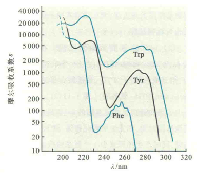

# 个别侧链性质

不同氨基酸的差别在于侧链的不同。不同的侧链会给一种氨基酸带来一些特有的性质，同时它们对一种蛋白质的生物学功能也会有不同的贡献。

## Phe、Trp和Tyr的紫外吸收性质

这3种氨基酸的R基团含有苯环，这使得它们对在近紫外（230〜300nm）波长范围内的光具有强吸收。

其中，Trp的紫外吸收最强，它和Tyr的吸收峰靠近280nm，与核苷酸或核酸的吸收不同（吸收峰在260nm）

利用上述性质可用来定性、定量测定蛋白质。

## 个别氨基酸的R基团对蛋白质功能的贡献

R基团有亲水的和疏水的两类，疏水的R基团缺乏反应性，因此它们一般对蛋白质的功能没有直接作用，所起的作用主要是结构上的。蛋白质需要它们形成疏水核心来驱动折叠，并稳定三维结构，少数蛋白质会利用它们组装成疏水的口袋，以结合脂溶性分子。

与此相反，亲水的氨基酸在侧链上含有各种反应性基团，正是这些反应性基团赋予大多数蛋白质能够行使各种各样的生物学功能。例如，一种酶若没有亲水基团的参与，它是无法催化反应的。

### ①含有羟基的侧链

Ser、Thr和Tyr这3种氨基酸的侧链含有羟基，而羟基含有孤对电子，可作为亲核基团参与多种酶的催化。另外，这3种氨基酸侧链上的羟基，可被磷酸化修饰。机体（主要是真核生物）可使用这种方式来调节多种酶和蛋白质的活性

### ②含有ε-氨基的侧链LyS的侧链

含有ε-氨基，而ε-氨基含有孤对电子，因此也可以作为亲核基团参与多种酶的催化。

有些蛋白质的辅基含有羧基（如生物素和硫辛酸）能够与ε-氨基反应形成酰胺键，从而实现与蛋白质的共价连接。

有些蛋白质的辅基含有醛基（如磷酸吡哆醛和视黄醛）能够与ε-氨基反应形成希夫碱。

ε-氨基可以发生特定的化学修饰，如乙酰化、甲基化和泛酰化等。组蛋白可以通过这种修饰调节活性，从而影响到基因的表达。

### ③含有疏基和硒醇基的侧链

Cys含有巯基，巯基也可以作为亲核基团参与多种酶的催化。此外，两个Cys的端基可被氧化成二硫键。二硫键对于许多蛋白质的三维结构有稳定作用。

Ses含有更容易氧化的硒醇基，它在蛋白质分子中具有抗氧化的活性。

### ④含有咪唑基的侧链

His的侧链含有咪嗖基，而咪唑基的pKa接近7。此性质使得它在生理条件下，既可以作为质子受体，又可以作为质子供体，故许多酶的活性中心含有His。此外，咪唑基也可以发生磷酸化修饰。

### ⑤含有羧基的侧链

谷氨酸和天冬氨酸的侧链含有非α-羧基，这种羧基在特定的情况下可以作为质子供体（非解离的状态）或受体（解离的状态），许多酶利用它们作为一种催化的手段——广义的酸碱催化。

另外，解离的羧基带有负电荷，有些金属蛋白利用它们结合金属离子。

此外，某些氨基酸的侧链可以发生特殊的反应，这些反应对于未知氨基酸的鉴定很有用。