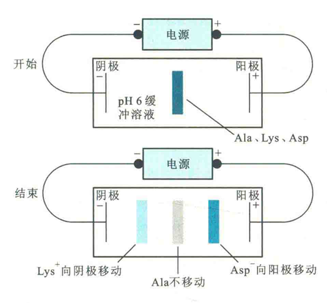
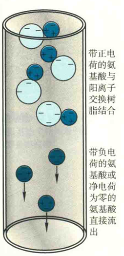

# 氨基酸的分离纯化

根据氨基酸之间在物理性质（大小）或化学性质（电荷）上的差别，人们已经建立了多种分离、纯化氨基酸的方法，其中主要的方法是电泳和层析。

## 电泳

电泳是指带电的颗粒或生物分子在外加电场作用下，向带相反电荷的电极做定向移动的现象。显然，带电粒子或分子的大小、形状和带电状况都会影响它们的电泳速率。在待分离样品中，各种生物分子在大小、形状和带电性质上的差异使得它们的“泳动”速率不同，因而可以利用电泳技术对它们进行分离、鉴定或纯化。

电泳技术有多种方式，但一般根据有无支持物将其分为无支持物的自由电泳和有支持物的区带电泳两大类。

自由电泳包括显微电泳和密度梯度电泳等。

区带电泳则包括以滤纸作为支持物的纸电泳、以醋酸纤维素等薄膜为支持物的薄层电泳，以及以凝胶（如琼脂糖和聚丙烯酰胺凝胶）为支持物的凝胶电泳。对于小分子的氨基酸来说，比较适合用纸电泳对其进行分离和分析。

以Lys、Asp和Ala为例，如果将它们点在电泳槽中央，在pH=6的缓冲溶液中电泳，那么Lys和Asp因各带正、负电荷会分别向阴极和阳极移动，而Ala正好处于pH等于其pl的缓冲溶液中，净电荷为零，所以不发生泳动。

## 层析

层析最早被俄国植物学家用来分离植物色素，因此又称为色谱。

所有的层析系统都由两相组成：一个是固定相，它可以是固体物质，也可以是固定在固体物质上的成分；另一个是由可以流动的物质组成的流动相，如水和各种溶剂。

当待分离样品随着流动相通过固定相时，各组分在理化性质上的差别使得各自与两相发生相互作用（如吸附、溶解或结合等）的能力不同，最终导致它们在两相中的分配不同，而且随着流动相向前移动，各组分会不断地在两相中进行再分配。与固定相相互作用力越弱的组分，随流动相移动时受到的阻力就越小，向前移动的速率越快；反之，与固定相相互作用越强的组分，向前移动速率越慢。

经过分步收集流出液，可得到样品中所含的各单一组分，从而达到分离各组分的目的。

### 离子交换层析

应用于氨基酸分离的层析主要是离子交换层析。以含有带电基团的树脂作固定相，利用它与流动相中带相反电荷的离子结合并进行可逆交换的性质来分离目标带电分子的一种方法。

如果进行可逆交换的离子是阳离子，则为阳离子交换层析；反之，则称为阴离子交换层析。

在进行离子交换层析时，首先需要用几倍于柱体积的低盐缓冲溶液对树脂进行平衡，然后在低盐条件下，将样品上柱。

与树脂带相反电荷的分子会通过静电作用与树脂结合，而不带电荷的或带相同电荷的分子直接流出。最后，用高盐缓冲溶液洗脱，以取代与树脂结合的分子。

同样以Lys、Asp和Ala为例，如果选用阳离子交换层析，在pH=6的低盐缓冲溶液下上柱，那么带正电荷的Lys将被吸附在树脂上、而带负电荷的Asp和净电荷为零的Ala会直接出现在流出液中，Lys会在随后的高盐缓冲溶液洗脱时得到，这样就实现了Lys与Asp和Ala的分离。

如果还需要将Asp和Ala分开，可以将收集到的直接流出液再进行阴离子交换层析。

