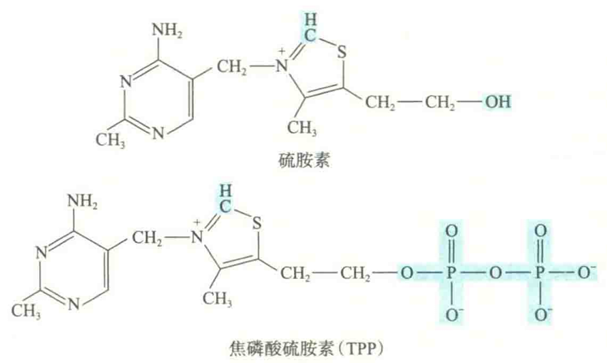

# 维生素B1

维生素B1是第一个被发现的维生素，又名为硫胺素（thiamine）

噻唑环位于N和S之间的C上的氢原子，由于受到周围吸电子基团的影响，可以质子的形式释放出去，形成强亲核性碳负离子

维生素B1易被小肠吸收，在细胞内受激酶的催化被磷酸化成硫胺素焦磷酸（TPP）

TPP是体内催化α酮酸氧化脱竣的酶的辅酶，也是磷酸戊糖途径中转酮酶的辅酶，在反应中睡嗖环上的碳负离子直接作为亲核试剂参与催化。

## 缺乏症

由于TPP合成不足，丙酮酸和α-酮戊二酸的氧化脱羧以及磷酸戊糖途径发生障碍，这必然会导致糖的氧化利用受阻。

在正常情况下，神经组织的能量供应依赖于糖的氧化分解，因此维生素B1缺乏首先会影响神经组织的能量供应，并伴有丙酮酸及乳酸等在神经组织中的堆积，出现手足麻木、四肢无力等多发性外周神经炎的症状；重者引起心跳加快、心脏扩大和心力衰竭，临床上称为脚气病，因此维生素B1又被称为**抗脚气病维生素**。 

维生素B1还有抑制乙酰胆碱酯酶的作用，乙酰胆碱酯酶能催化神经递质——乙酰胆碱的水解。当缺乏维生素B1时，乙酰胆碱酯酶活性将增强，乙酰胆碱水解加速，神经传导会受到影响，可造成胃肠蠕动缓慢、消化液分泌减少、食欲不振和消化不良等症状。反之，补充维生素B1则可增加食欲、促进消化。

## 食物来源

富含B1的食品有肉类、绿叶素菜、谷物及麦片等。
