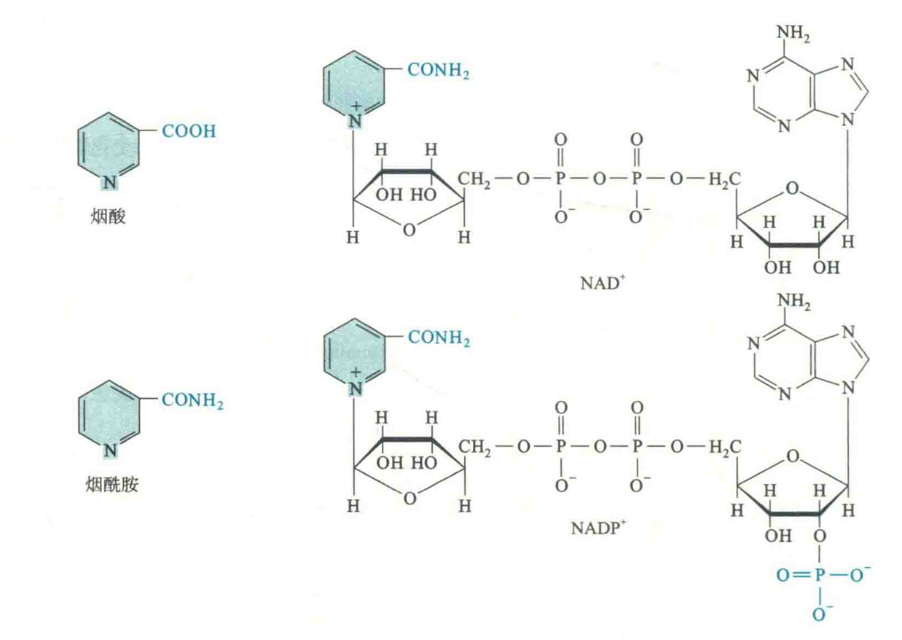

# 维生素B3

维生素PP即维生素B3，包括烟酸和烟酰胺，两者均为吡啶衍生物，在体内可以相互转变。在动物组织中，维生素PP大多以烟酰胺的形式存在。

烟酰胺是构成辅酶Ⅰ（NAD+）和辅酶Ⅱ（NADP+）的成分之一，与FMN和FAD一样，也具有可逆的加氢和脱氢的特性，因此这两种辅酶也参与生物氧化，作为细胞内很多重要的脱氢酶的辅酶，例如，3-磷酸甘油醛脱氢酶和6-磷酸葡糖脱氢酶分别以辅酶Ⅰ和辅酶Ⅱ作为辅酶。

NAD+除了可以作为许多脱氢酶的辅酶以外，在体内至少还能作为其他3种酶的底物参与相关的反应:

1. 细菌的DNA连接酶;
2. 真核细胞内依赖于NAD+的组蛋白去乙酰酶;
3. 催化蛋白质发生ADP-核糖基化修饰的ADP-核糖基转移酶。例如，霍乱毒素、百日咳毒素和白喉毒素都具有这种酶的活性。

## 食物来源和缺乏症

烟酸在人体内可从色氨酸代谢产生，但量不能满足机体的需要，仍需从食物中获取。一般营养条件下，很少会出现缺乏维生素PP的情况。

维生素PP缺乏时，主要表现为癞皮病。补充维生素PP可预防和治愈癞皮病，因此维生素PP又称为抗癞皮病因子或抗癞皮病维生素。

## 辅酶Ⅰ和辅酶Ⅱ的区别

辅酶Ⅰ与辅酶Ⅱ之间只是相差一个磷酸基团，而这个磷酸基团远离功能端，对两种辅酶所参与的氧化还原反应没有任何影响，那为什么细胞有了辅酶I还需要辅酶H?究其原因，是因为这个磷酸基团能让它们与不同类型的酶相互作用。由于所有消耗或再生NAD+的酶在共享相同的胞内辅酶I的库，因此所有这些酶催化的反应的平衡都受到同样的[NAD+]/[NADH]比率的影响。

辅酶Ⅱ中额外的磷酸基团使得其与另外一类酶相互作用，因此辅酶Π与另外一类不同的氧化还原反应的平衡有关，这样就可以与辅酶I维持在不同的氧化还原的状态。两种辅酶就好像是你手头有两种不同的货币，虽然都是钱，但是用途不一样，一种是平时用来消费的，另一种却是用来保值的。在细胞里，辅酶I大多数是氧化的，在细胞质基质中[NADH]/[NAD+]的比率约为0.001，因为这样有助于为细胞产生ATP的代谢途径（如糖酵解和三竣酸循环）的正常进行;相反，细胞内的辅酶U主要是还原的，在细胞质基质[NADPH]/[NADP+]的比率约为100，比[NADH]/[NAD*]的比率高近10$倍，因为这样可促进胞内生物合成途径中的还原反应。