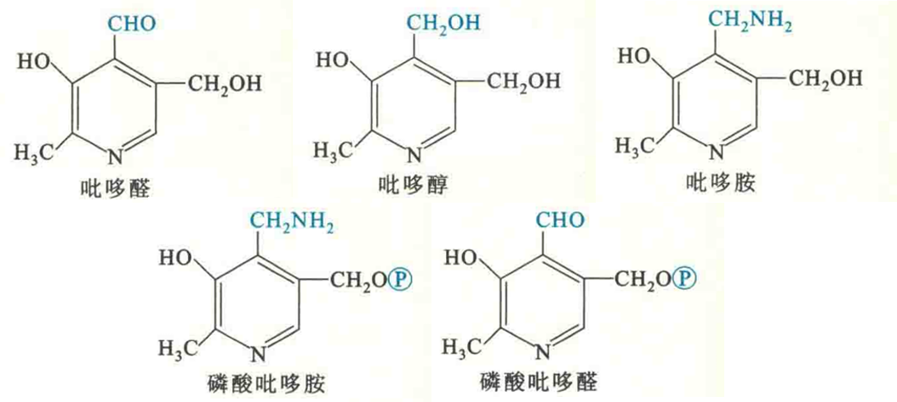

# 维生素B6

维生素B6包括吡哆醇、吡哆醛和吡哆胺3种形式，在体内可以相互转变。

细胞内的维生素B6在激酶的催化下经磷酸化作用转变为相应的磷酸酯，其中作为辅酶的主要是磷酸吡哆醛（PLP）和磷酸吡哆胺。它们在体内参与氨基酸的转氨、消旋、某些氨基酸的脱羧、半胱氨酸的脱巯基作用和糖原的磷酸化，此外还参与5-羟色胺、去甲肾上腺素、鞘磷脂以及血红素的合成。

## 食物来源和缺乏症

维生素B6在动植物中分布极广，同时，人体内的肠道细菌也能够合成它，因此人类尚未发现单纯的维生素B6缺乏病。动物缺乏维生素B6可引发与癞皮病相似的皮炎。