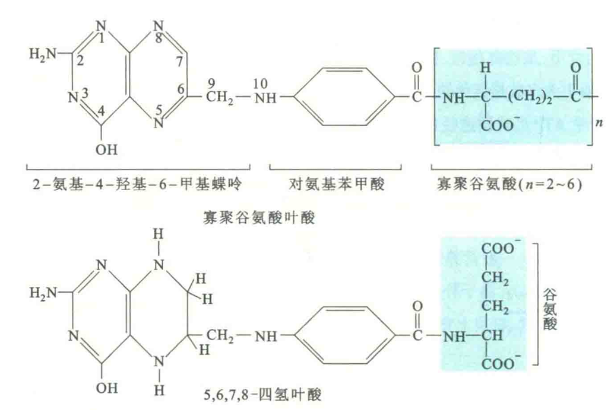
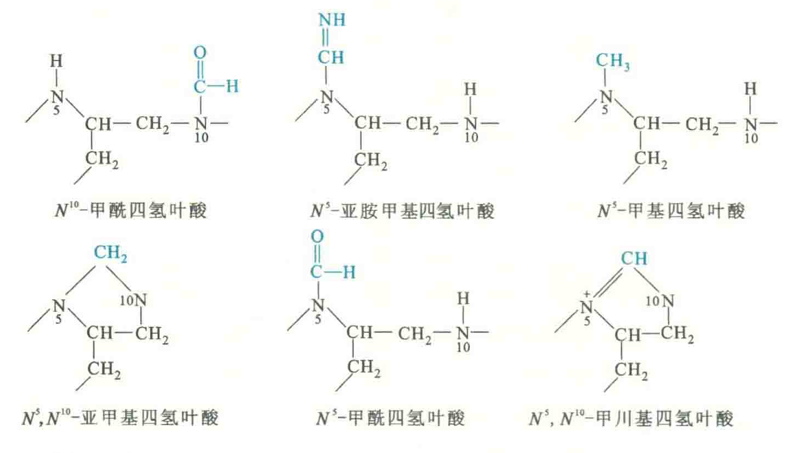

# 叶酸

叶酸也称维生素B9，是由蝶酸和谷氨酸缩合构成，因在植物绿叶中含量丰富而得名。

食物中的叶酸主要是蝶酸与寡聚谷氨酸的缩合物，即寡聚谷氨酸叶酸。在消化道内，这种形式的叶酸经结合酶的作用，转变为单谷氨酸叶酸后才能被吸收。

## 生理作用

细胞吸收叶酸的过程是受体介导的，叶酸受体是位于细胞膜上的一种糖基磷脂酰肌醇锚定蛋白。当叶酸与膜上的受体结合以后，发生受体介导的内吞，但叶酸与受体在胞内遇到偏酸的环境即发生解离。

叶酸在细胞内的辅酶形式为四氢叶酸（FH4或THF），其作用是**参与体内一碳单位的转移**，充当甲基、亚甲基、甲酰基、甲川基和亚胺甲基等基团的载体，在体内很多重要物质的合成中起作用。

甲酰四氢叶酸参与胞内嘌呤核苷酸的从头合成，作为嘌呤环中C8和C2位的来源。在脱氧核苷酸转变成脱氧胸甘酸的过程中，胸腺嘧啶中的甲基由亚甲基四氢叶酸提供。

亚甲基四氢叶酸提供亚甲基使甘氨酸转变成丝氨酸，N5-甲基四氢叶酸提供甲基使高半胱氨酸转变为甲硫氨酸

## 食物来源

叶酸在绿叶中大量存在，肠道细菌也能合成，故一般不容易缺乏。但当吸收不良、代谢失常或细胞需要过多，以及长期使用抗生素或叶酸拮抗药的情况下，可造成叶酸缺乏。

## 缺乏症

叶酸与核甘酸以及某些氨基酸的合成有密切关系。当体内缺乏叶酸时，“一碳单位”的转移即发生障碍，核苷酸（尤其是脱氧核甘酸）的合成就会减少，进而影响到骨髓中幼红细胞DNA的合成，使得幼红细胞的分裂速率明显下降。幼红细胞因分裂障碍而体积增大，形成巨幼红细胞，最终导致巨红细胞性贫血。

许多癌细胞膜上的叶酸受体过量表达，这显然有利于癌细胞与正常细胞竞争，获得更多的叶酸资源，满足其对核甘酸合成的大量需求。很多抗癌药物就是叶酸的类似物，其作用机制是抑制癌细胞对叶酸的利用和转化。

