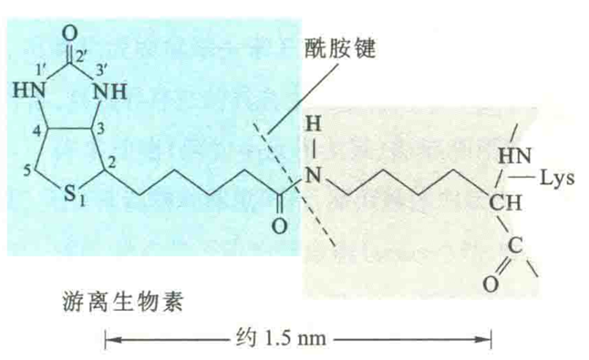

## 维生素B7

生物素又名维生素H或维生素B7，由带有戊酸侧链的噻吩与尿素骈合而成

在生物体内，生物素作为多种羧化酶的辅基参与CO2的固定。

在细胞内，受生物素蛋白连接酶的催化，生物素通过戊酸侧链与羧化酶的一个Lys残基上的-NH2形成酰胺键。于是，生物素通过细长的碳氢链系在酶分子上，这种结构对羧化反应十分重要，通常将以这种形式存在的生物素和赖氨酸残基的复合物称为**生物胞素**

由于生物素在动植物组织中广泛存在，肠道细菌也能合成，故一般很少发生生物素缺乏病。但是，长期生吃鸡蛋可导致该维生素的缺乏，这是因为鸡蛋清中含有一种抗生物素蛋白即亲和素，此蛋白质与生物素具有高度的亲和力，可妨碍人体对生物素的吸收