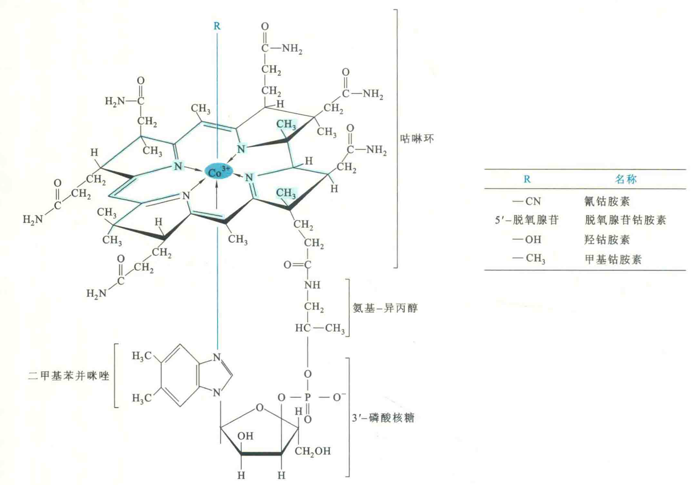

# 维生素B12

维生素B12含有复杂的类似卟啉环的咕咻环结构，分子中含有金属元素钴和若干酰胺基，故又称为钴胺素。

维生素B12特有的结构特征是含有活泼的C-Co键，一旦这个化学键断裂，将产生自由基，从而引发催化.

分子中的钴可以是一价、二价或三价，并能与CN、0H、CH3或5-脱氧腺苷等基团相连，其中甲基钴胺素和5-脱氧腺苷钴胺素为维生素B12的两种辅酶形式，但两者在代谢中的作用并不同。

## 生理作用

甲基钴胺素参与体内的转甲基反应和叶酸代谢，是甲基四氢叶酸甲基转移酶的辅酶，催化甲基四氢叶酸和高半胱氨酸之间不可逆的甲基移换反应，产生四氢叶酸和甲硫氨酸。

而由甲硫氨酸转变成的S-腺苷甲硫氨酸作为甲基供体，参与DNA、组蛋白和RNA的甲基化，从而在不改变基因序列的情况下影响到基因表达，由此产生表观遗传。

5'-脱氧腺苷钴胺素(在体内作为几种变位酶的辅酶，参与反应的是活泼的C-Co键，如甲基天冬氨酸变位酶。

维生素B12与叶酸一样参与体内一碳单位的代谢，与叶酸的作用常常相互关联、相互依赖，缺乏维生素B12的临床表现有恶性贫血和神经系统受损。

## 食物来源和缺乏症

维生素B12只能由某些细菌和古菌合成，少见于植物，但可贮存在动物性食品中，特别是肝。人体对它的需要量甚少，每日仅需2μg，肠道细菌也能合成它，因此因摄入不足而导致维生素B12缺乏在临床上很少见，但严格的素食者还是有可能缺乏维生素B12的。

维生素B12的吸收与胃粘膜分泌的一种糖蛋白密切相关，这种糖蛋白称为内在因子（IF）维生素B12必须与内在因子结合后才能被小肠吸收。若一个人患有萎缩性胃炎、胃全切除或先天缺乏IF，那就很容易缺乏维生素B12