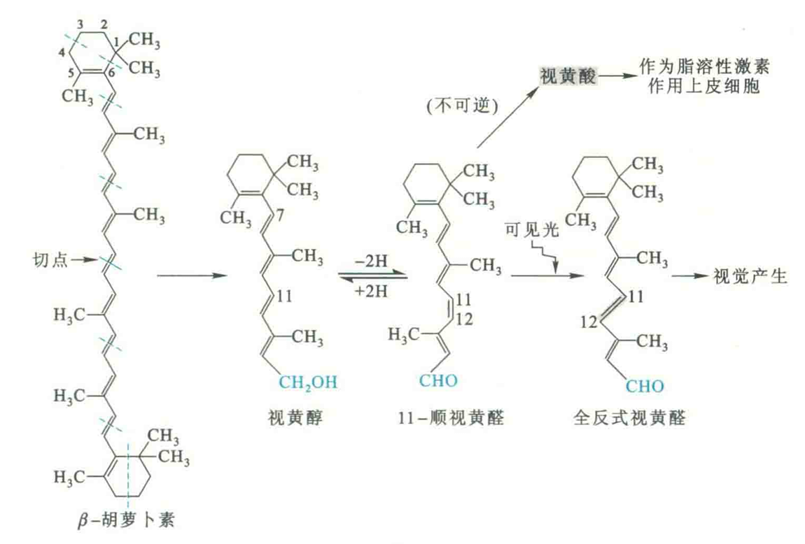

# 维生素A

维生素A是由β-白芷酮环和两个异戊二烯单位缩合而成的不饱和一元醇，有A1和A2两种。

A1为视黄醇，A2为3-脱氢视黄醇。A1在体内经脱氢可转变为11-顺视黄醛，11-顺视黄醛可异构化为全反式视黄醛。11-顺视黄醛可进一步被氧化成视黄酸即维甲酸，但此反应是不可逆的。

## 生理功能

维生素A的生理功能由视黄醇、视黄醛和视黄酸来完成，主要表现在以下3个方面：

①视黄醇和视黄酸可作为脂溶性激素，通过与它们的细胞核受体的结合来启动某些基因的表达，从而促进细胞的生长和分化，还可以阻止角蛋白的合成，并具有一定的抗癌作用。

[^1]: 中国科学家陈竺夫妇发明的一种可有效治疗急性早幼粒细胞白血病的方法就使用了全反式维甲酸，与砒霜联合用药。其中全反式维甲酸所起的作用就是与调节细胞分化有关。

与此同时，视黄醇的磷酸酯——磷酸视黄醇作为糖基供体直接参与某些糖蛋白和黏多糖的合成，这些糖蛋白和黏多糖绝大多数是上皮组织分泌黏液的主要成分，参与调节细胞的生长。

②视黄醛构成视网膜的感光物质，作为视蛋白的辅基参与视觉的形成，缺乏它可导致夜盲症。

③抗氧化作用：维生素A只存在于动物性食品中，但是在很多植物性食品如胡萝卜、红辣椒、菠菜、芥菜等有色蔬菜中含有维生素A的前体β-胡萝卜素。β-胡萝卜素可被小肠黏膜或肝中的一种酶裂解为视黄醇，故又被称作维生素A原

## 缺乏症

维生素A是维持一切上皮组织的完整与健全所必需的物质，缺乏时上皮干燥、增生及角蛋白大量分泌导致角质化，其中对眼部、消化道、呼吸道、尿道、膀胱及生殖系统等处的上皮影响最为显著。在眼部，由于泪腺上皮角化，泪液分泌受阻，以致角膜、结膜干燥而产生眼干燥症，因此维生素A又称为抗眼干燥症维生素。