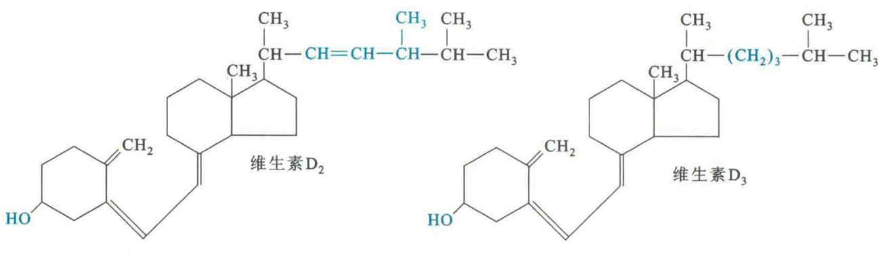

# 维生素D

维生素D属于固醇类衍生物，人体内的维生素D主要是由7-脱氢胆固醇经紫外线照射转变而成，也可从动物食品中获取，这种形式的维生素D为维生素D3或胆钙化醇。真菌中的麦角固醇经紫外线照射后可产生维生素D2或钙化醇。

## 来源

7-脱氢胆固醇存在于皮肤内，它可由胆固醇脱氢产生。一般人体只要充分接受阳光照射，通过这种方式合成的维生素D完全可以满足生理需要。

## 生理作用

两种维生素D的生理作用基本相同，但不论是哪一种，本身都没有明显的生理活性，它们必须先在肝细胞内经羟基化转变为25-羟基维生素D，然后在肾小管内进行第二次羟基化反应，最后形成具有活性的1，25-二羟维生素D，其作为一种脂溶性激素发挥作用，可诱导某些基因的表达，如骨钙蛋白。

维生素D在体内与甲状旁腺素协同作用，共同促进小肠对食物中钙和磷的吸收，维持血中钙和磷的正常含量，促进骨和齿的钙化作用。

由于维生素D具有抗佝偻病的作用，故又名抗佝偻病维生素。