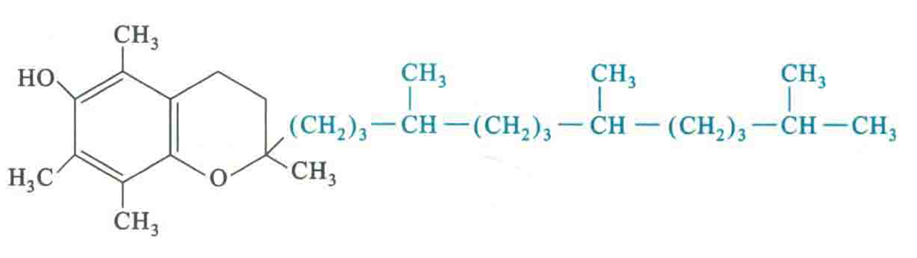

# 维生素E

维生素E又称为生育酚，有α、β、γ、δ4种，其中以生育酚的生理效用最强，它们都是苯骈二氢毗喃的衍生物。

## 生理功能

维生素E的主要生理功能是在体内作为一种强抗氧化剂，与硫辛酸、维生素Α、β-胡萝卜素、维生素C、超氧化物歧化酶、过氧化氢酶及谷胱甘肽过氧化物酶一起，防止自由基和过氧化物对脂质(特别是不饱和脂肪酸)的氧化，保护细胞膜免受氧化损伤以及维护红细胞的完整。

维生素E在体内还可以去调节某些酶的活性，例如在抑制蛋白激酶C（PKC）活性的同时，激活磷蛋白磷酸酶2A的活性。

维生素E还参与生物氧化，在呼吸链中既可以稳定辅酶Q，又可以协助电子传递给辅酶Q

维生素E还与动物生殖机能有关，因此又名为生育酚。

## 缺乏症

维生素E分布极广，在植物油中特别丰富，因此人类还没有发现相关的缺乏病。