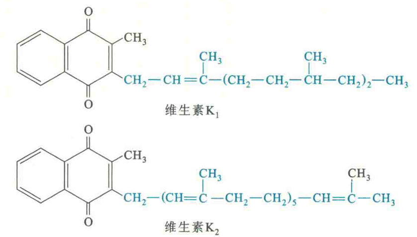
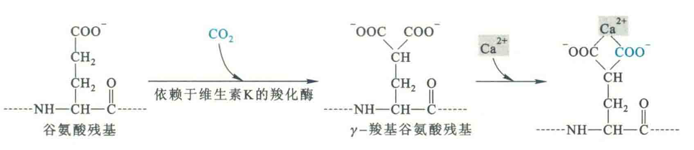

# 维生素K

维生素K是2-甲基1，4-萘醌的衍生物，自然界已发现的有存在于绿叶植物中的维生素KI和由肠道细菌合成的维生素K2

## 生理活性

在体内，维生素K主要作为依赖于维生素K的羧化酶的辅酶，去参与某些蛋白质的后加工，使这些蛋白质分子上特定的谷氨酸残基经历γ-羧基化修饰，并最终激活它们的活性。

需要进行γ-羧基化修饰的蛋白质有凝血因子Π、VⅠ、IX、和X以及骨钙蛋白。其中凝血因子可以促进血液凝固，因此维生素K又称为凝血维生素。而骨钙蛋白能够结合钙离子，因此维生素K也参与骨的形成

此外，在某些生物体内，维生素K还可以作为呼吸链的一部分，参与生物氧化。

## 缺乏症

因为肠道细菌能合成维生素Κ，所以人类维生素K缺乏病多系吸收障碍或因长期使用抗生素或维生素K的代谢拮抗药所致。