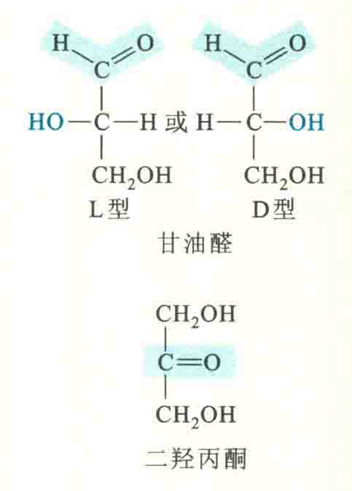
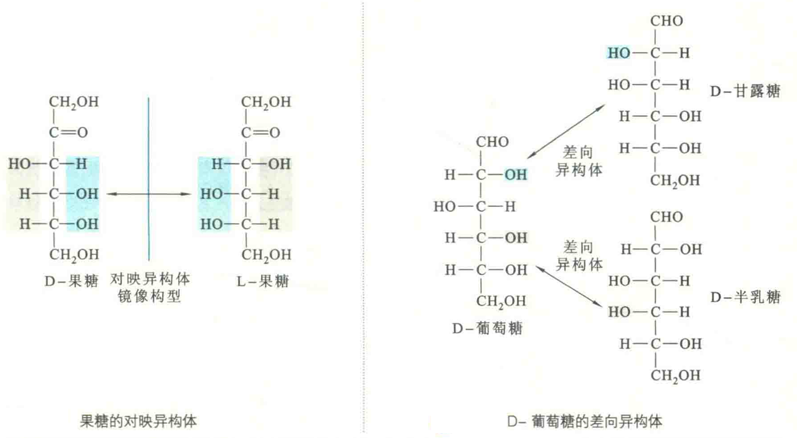

# 单糖

## 单糖的命名和缩写

单糖的本意就是简单糖，简单到已不能再水解成更简单的单位。

根据碳原子的数目，可将单糖分为丙糖、丁糖、戊糖、己糖和庚糖等，它们含有的碳原子数目分别是3、4、5、6和7。丙糖、丁糖、戊糖、己糖和庚糖也可分别称为三碳糖、四碳糖、五碳糖、六碳糖和七碳糖。

根据各单糖的化学结构，丙糖以外的单糖可看成是由丙糖衍生而来的，其中醛糖衍生于甘油醛，酮糖衍生于二羟丙酮。具体的单糖多是根据各自的来源来命名的，如葡萄糖、果糖和半乳糖。

## 单糖的结构

从结构上来看，除了最简单的酮糖——二羟丙酮没有手性C以外，其他单糖都有手性C。

具有手性C的单糖就具有对映异构体或镜像异构体。以甘油醛为例，它有1个手性C，根据惯例，在其Fischer投影式中，醛基放在最上方，羟甲基放在最下方，羟基位于左侧的甘油醛定为L型，羟基位于右侧的甘油醛定为D型。

这两种甘油醛呈镜像关系或对映关系。对于其他具有手性C的单糖来说，需要以D-甘油醛和L-甘油醛为标准，以区分它们的D型和L型。

然而，除了丁酮糖以外，其他具有手性C的单糖都至少有2个手性C。对于含有多个手性C的单糖来说，要判断它们的一种立体结构究竟是D型还是L型，需要将其在Fischer投影式中编号最高的手性C，即距离羰基最远的手性C与甘油醛唯一的手性C进行比较，与D型甘油醛一致的就是D型，反之就是L型。

D型和L型并不能提供任何有关旋光方向的信息。

事实表明，与氨基酸正好相反，自然界的单糖绝大多数为D型。

对于绝大多数单糖来说，除了具有互为镜像的对映异构体以外，还有非对映异构体和差向异构体两种情形。

如果一对旋光异构体有一个或一个以上的手性C的构型相反，但并不呈镜像关系，那么就称为非对映异构体；

如果一对旋光异构体只有一个手性C的构型不同，则称为差向异构体。

例如D-葡萄糖与D-甘露糖，D-葡萄糖与D-半乳糖就互为差向异构体，但D-甘露糖和D-半乳糖并非差向异构体，只能是非对映异构体，因为它们之间有两个手性C的构型不同。

## 几种生化上重要的单糖

D-甘油醛和二羟丙酮：两者都是糖酵解的中间物。

D-葡萄糖也称右旋糖：是细胞重要的能源，对于神经细胞尤为重要。血糖由溶解在血液中的葡萄糖组成，其浓度需要稳定在0.7~1.0 mg/mL

D-半乳糖：在动物体内较为少见，它通常是脑和神经组织中糖蛋白的成分，因此有时被称为脑糖

D-果糖：主要存在于许多果实和蜂蜜之中，是所有天然糖类中最甜的一种。

D-核糖和2-脱氧-D-核糖：两者分别是RNA和DNA的组分。

## 单糖的衍生物

在特定的酶催化下，单糖在机体内可进行各种修饰反应而形成一系列衍生物。

常见的衍生物包括：氨基糖，如葡糖胺、N乙酰葡糖胺、半乳糖胺、N-乙酰氨基半乳糖胺、胞壁酸和神经氨酸；

氧化糖，如葡萄糖内酯、葡糖酸、葡糖醛酸、半乳糖醛酸和甘露糖醛酸；

脱氧糖，如2-脱氧核糖、L-鼠李糖和L-岩藻糖；

糖醇，如山梨醇、甘露醇、木糖醇、半乳糖醇、核糖醇和肌醇；

糖苷，如毛地黄毒苷和乌本苷