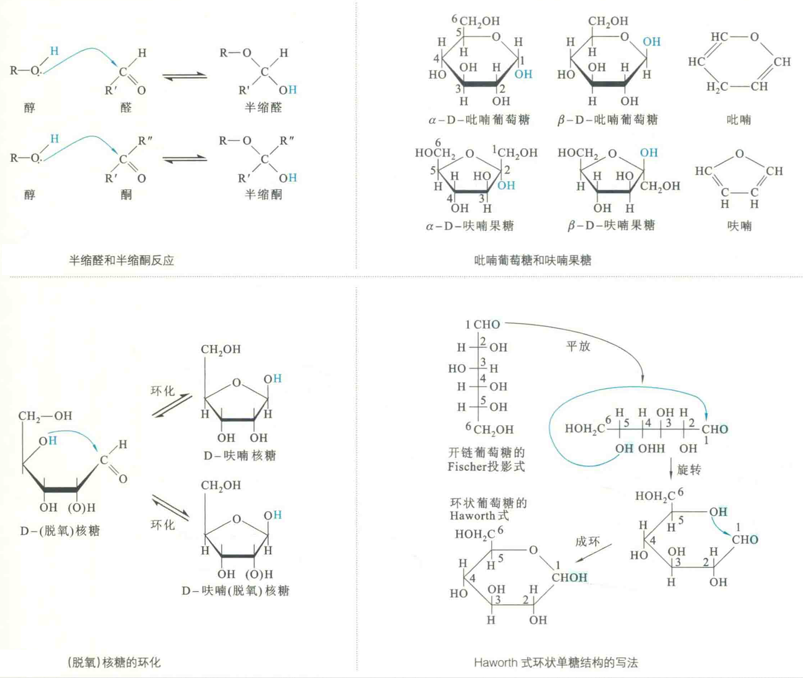
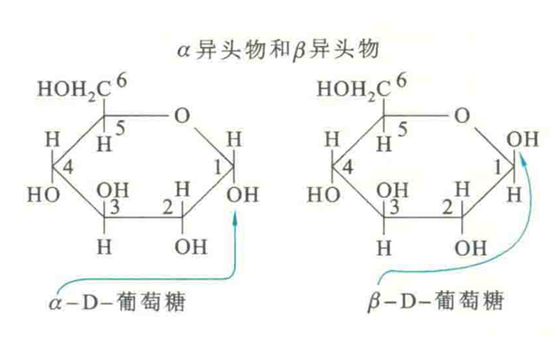
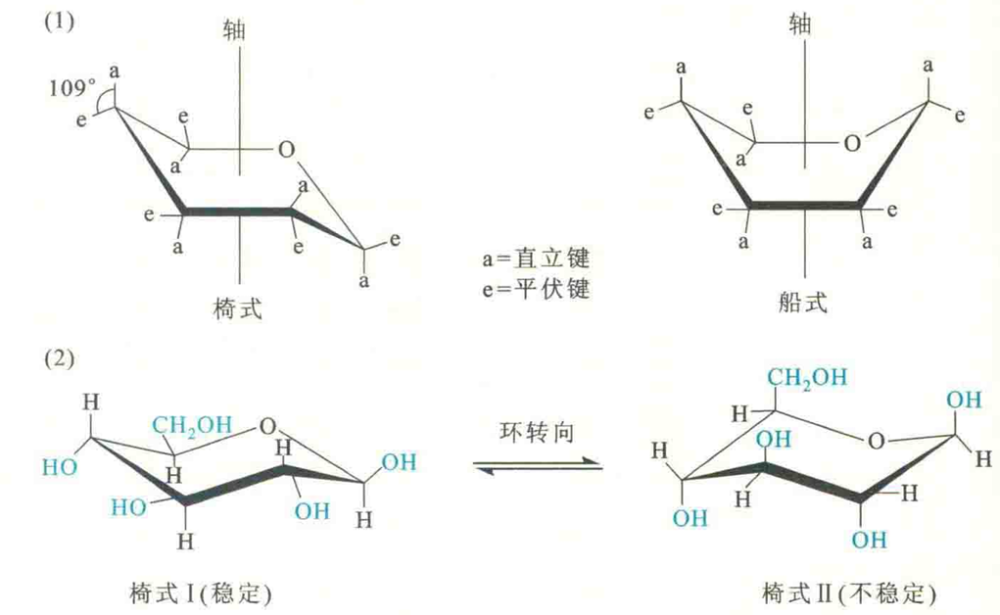
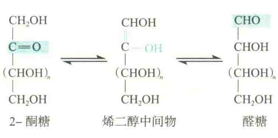
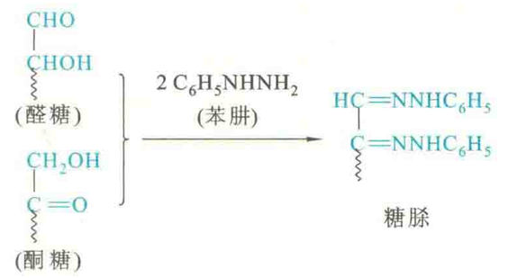
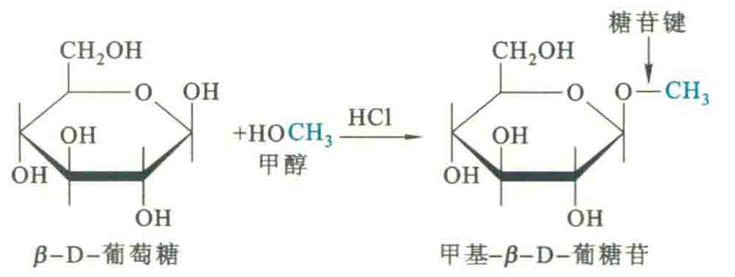

# 单糖的性质

## 物理性质

室温下的纯单糖为无色晶体，溶于水，微溶于乙醇，具甜味，其中果糖最甜。

除了二羟丙酮，其他所有的单糖因具有手性C，所以都具有旋光性。

## 化学性质

单糖具有藻基和羟基这两种反应性基团，因而能与多种化学试剂反应

### 成环

醇羟基很容易对醛或酮中的埃基作亲核进攻，形成半缩醛或半缩酮。除了丙糖和丁酮糖以外，其他直链的单糖分子在分子内也能发生类似的反应，从而形成环状结构，其中醛糖环化形成环式半缩醛，酮糖环化形成环式半缩酮。

丙糖和丁酮糖之所以不能成环，是因为如果它们发生分子内的半缩醛或半缩酮反应，只能形成三元环或四元环，而这样的环结构无法满足碳原子需要采取的键角，故很难存在。

实验证明，葡萄糖环化主要形成六元环的吡喃糖，果糖、核糖和脱氧核糖环化主要形成五元环的呋喃糖。

通常使用Haworth式来表示单糖的环状结构，按照正确的方法，可以很容易地将一种单糖的开链Fischer投影式正确地过渡到它的环状Haworth式。

然而，一旦单糖由直链结构变成环状结构以后，原来的埃基C便“摇身一变”，成为一个新的手性中心，从而也具有两种不同的构型。这两种不同构型的形成是羟基从两个不同的方向对羰基C作亲核进攻的结果，由此产生α和β两种异构体。

通常将在半缩醛或半缩酮C上形成的异构体称为异头物或异头体，新出现的手性C称为异头物C。如果形成的半缩醛或半缩酮羟基在环的下方，与原来编号最高的手性C上的羟基具有相同的取向，这种异头物就称为α异头物，反之就称为β异头物。

形成的环状结构由于其中单键的自由旋转，可以采取不同的构象，以葡萄糖为例，其半缩醛环上的C-O-C键角为111°，与环己烷的键角109°相近，故葡萄糖的吡喃环和环己烷环相似，也有椅式构象和船式构象。

椅式构象可使各单键的扭张强度降低到最小，因而较稳定。在两种椅式构象之中，I型上的-OH和-CHOH这两种较大的基团均为平伏键，将可能产生的空间位阻降低到最小，所以在热力学上I型比Ⅱ型稳定。此外，β异头物的半缩醛羟基以平伏键存在，空间位阻比半缩醛羟基以直立键存在的α异头物小，因此β-D-葡萄糖要比α-D-葡萄糖稳定。

### 变旋

变旋是指一种糖类化合物的两种异头物在水溶液中发生互变，并达到平衡，从而导致旋光度改变的现象。

例如，新鲜配制的α-D-葡萄糖或β-D-葡萄糖溶液的比旋光度分别是112.0°和18.7°，变旋后的比旋光度均为52.7°

变旋的直接原因是环状的异头物转变成开链形式，而当开链形式重新成环变为异头物的时候有两种可能，即可能变为α异头物或β异头物。

在任何情况下，只有很少一部分为开链形式。如果一种单糖不能形成环状结构，就不会有变旋现象，如甘油醛。

### 异构

单糖分子中，α-氢原子由于受到羰基和羟基的双重影响而变得十分活泼，在碱性条件下，醛糖可通过烯二醇中间物与2-酮糖实现互变。

D-葡萄糖，D-甘露糖和D-果糖在C3、C4、C5上的构型相同，因此它们具有相同的烯二醇中间物，在碱性溶液中，实际上存在着这三种单糖的平衡。

### 成脎

所有还原糖的Cl和C2都能够与苯肿起反应生成糖脎，糖脎的黄色结晶十分有用，可用来鉴别还原糖的存在，还可以从糖脎的熔点和晶形来鉴别某些糖。

### 成苷

在一定的条件下，糖类分子中的半缩醛或半缩酮羟基，可与其他带有羟基或氨基的化合物发生反应，经脱水生成的缩醛类或缩酮类化合物就是糖苷。此反应称为成苷反应。

糖苷分子中糖的部分称为糖基，非糖部分称为配基，连接糖基和配基的键称为糖苷键。例如，8-D-葡萄糖与甲醇在盐酸的催化下，形成甲基-S-D-葡糖苷。

由α-半缩醛或半缩酮羟基形成的糖苷称作α-糖苷，其糖苷键为α-糖苷键；由β-半缩醛或半缩酮羟基形成的糖苷称作β-糖苷，其糖甘键为β-糖苷键。自然界中以β-糖甘为主，存在于植物的根、茎、花叶和种子中。

核酸分子中的核苷实际上是由碱基与核糖或脱氧核糖之间形成的糖苷。糖苷一般怕酸不怕碱，这是因为糖苷键在酸性条件下容易发生水解。

由于失去了游离的半缩醛或半缩酮羟基，糖苷也就失去了本来的单糖所具有的一些性质：例如，它们虽然仍有旋光作用，但因半缩醛结构不复存在而无法开环，所以无变旋现象；再如，糖苷已不能被Fehling试剂或Benedict试剂所氧化，且不能成脎。

### 呈色反应

不同类型的糖类可以与特定的化学试剂发生反应，形成有颜色的产物，这些反应就是呈色反应。重要的呈色反应包括Molisch反应、SeIiwanoff反应和间苯三酚反应。

①Molisch反应：糖类与α-萘酚/乙醇在试管中混合，摇匀后沿管壁滴加浓硫酸，在两液面交界处出现紫红色环，此反应称为MoIiSCh反应。使用此反应，可以将糖类与非糖类区分开。

②SeIiwanoff反应：糖类与浓酸作用后再与间苯二酚反应，若是酮糖就显鲜红色，若是醛糖就显淡红色，这种反应称为SeIiwanoff反应。根据此反应可鉴别酮糖和醛糖。

③间苯三酚反应戊糖与间苯三酚/浓盐酸反应生成朱红色物质，其他单糖与间苯三酚/浓盐酸生成黄色物质；此外，戊糖还可以和甲基间苯二酚即地衣酚/浓盐酸反应，生成蓝绿色物质。利用这两个反应可以将戊糖和其他单糖区分开来。

除了以上5种反应以外，单糖还可以发生氧化或还原反应。其中所有的单糖都能与弱氧化剂起反应，如Fehling试剂或Benedict试剂，因此所有的单糖都具有还原性。