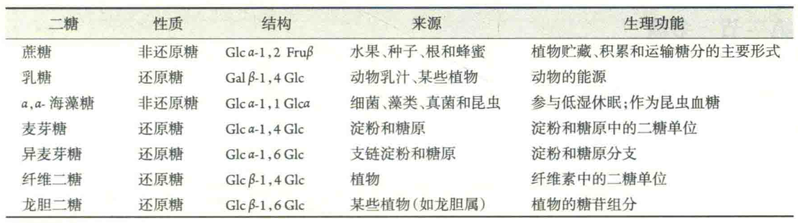
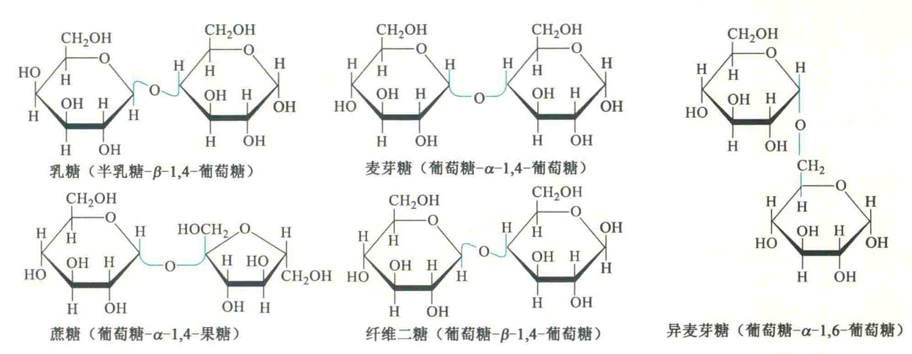

# 寡糖

寡糖也称为低聚糖，由2~10个单糖分子缩合并以糖苷键相连。

在寡糖分子之中，异头物C上的半缩醛羟基以游离形式存在的一端为还原端，异头物C参与形成糖苷键的一端为非还原端。按照惯例，在书写寡糖序列时，非还原端写在左边，还原端写在右边，同时需要标明各单糖单位的名称、构型、相互间的连接方式和异头物的构型。

二糖是最简单的寡糖，其中的一个单糖单位的连接碳总是C1，而另一个单糖单位的连接C的位置是可变的。在某种意义上，二糖可视为由两分子单糖连接而成的糖苷。

与其他糖苷一样，二糖在酸性条件下糖苷键发生水解，生成两分子单糖。

根据能否被弱氧化剂(如Fehling试剂)氧化的性质，二糖可以分为还原性和非还原性两类。

## 还原性二糖

还原性二糖是由一分子单糖的半缩醛羟基与另一分子单糖的醇羟基缩合而成，如麦芽糖和乳糖。

由于还原性二糖分子中还存在着一个游离的半缩醛羟基，因此它们不但具有还原性， 能被Fehling试剂或Benedict试剂氧化，而且具有变旋现象。

## 非还原性二糖

非还原性二糖是由二分子单糖各自使用半缩醛或半缩酮羟基脱水而成的，最常见的是蔗糖和α,α-海藻糖。

非还原二糖具有旋光性，但由于不存在游离的半缩醛或半缩酮羟基，因此既无变旋现象，也不能被Fehling试剂或Benedict试剂氧化，更不能成脎。

其中，蔗糖作为绿色植物光合作用的主要产物，广泛分布于多种植物体内，如甜菜、甘蔗和各种水果。蔗糖是植物贮藏、积累和运输糖分的主要形式。平时食用的白糖、红糖都是蔗糖;海藻糖存在于许多细菌、真菌、植物和昆虫等生物体内。其生物学功能主要包括：

①参与很多植物和动物的低湿休眠，赋予这些生物抵抗长时间脱水的能力。其作用机制是在细胞脱水的时候，它可取代细胞的内容物，形成胶状物，截留残留的水分子，防止细胞受损。

②作为昆虫的血糖：这更容易满足不断飞行的昆虫对能量的需求，因为在海藻糖酶的催化下，1分子海藻糖可水解成2分子游离的葡萄糖。

③作为一些昆虫抗冻的抗冻剂，可降低它们的过冷却点。

④作为一些动物血液代谢物的一部分，其水平的高低可通过调节味觉受体的反应以及通过中枢神经系统影响动物对食物的选择。寡糖除了能以游离的形式存在以外，还可以与蛋白质或脂类共价相连，成为糖蛋白或糖脂的重要成分，并具有多种功能