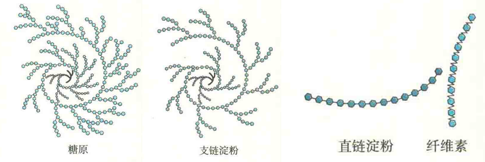
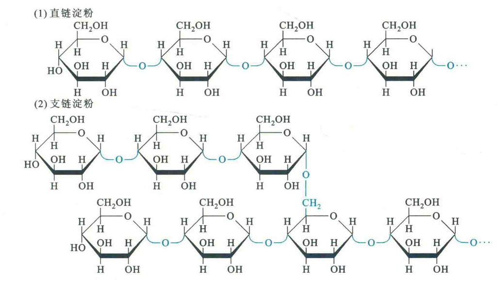

# 贮能多糖

常见的贮能多糖有淀粉、糖原、右旋糖酐、海带多糖、金藻昆布多糖和甘露聚糖。这几类多糖的基本组成单位都是D-葡萄糖（甘露聚糖除外），它们都属于同多糖。

生物之所以以多糖而不是单糖的形式贮存能量，是因为多糖形式能够降低糖贮备给细胞带来的渗透压。由于渗透压只取决于分子的数目，因此，1个游离的葡萄糖分子与1个由1万个葡糖残基组成的糖原分子给细胞带来的渗透压是相同的。

## 淀粉

淀粉又分为直链淀粉和支链淀粉两类。直链淀粉只有α-1,4-糖苷键，无分支，其重复的二糖单位为麦芽糖，而支链淀粉既含有α-1,4-糖苷键，又含有α-l,6-糖苷键，其重复的二糖单位主要是麦芽糖，还有少数异麦芽糖。

α-1,6-糖苷键的出现使得支链淀粉产生分支。虽然直链淀粉在水中的溶解性很低，但是它能在水中形成胶束悬液。胶束中的多糖链采取螺旋构象。如果这时遇到碘，碘就能插入到疏水螺旋的中间从而呈现蓝色。支链淀粉在水中也能形成胶束结构，但碘与其反应呈现紫红色。

## 糖原

糖原是动物的贮能多糖，有人称之为动物淀粉，主要有肝糖原、肌糖原和肾糖原三种形式。

其中，肝糖原是主要形式，最多能占肝重的10%，它负责为整个机体贮备能量，特别是神经细胞，有利于维持在饥饿状态下血糖浓度的稳定；

而肌糖原只为肌细胞贮存能量，肾糖原虽然也能为整个机体贮备能量，但所占比例有限。

此外，在脑部的某些神经胶质细胞中也发现有少量糖原，这可能是专门为神经组织贮存能量的。还有，孕妇在妊娠期间，其子宫也有糖原，这显然是为胚胎贮备的。

然而，与机体的另外一种能源贮备——脂肪相比，糖原是一种短期能源储备。之所以糖原适合充当机体的短期能源储备，是因为它是高度分支的分子，在结构上与支链淀粉相似，但分支点更加密集，平均每8~12个葡萄糖单位就出现一个分支，这种高度分支结构有利于它在机体内可迅速动员或重新合成。

## 右旋糖酊

右旋糖酎是一种主要以α-1,6糖苷键相连的分支多糖，通常存在于细菌和酵母中，其重复的二糖单位主要是异麦芽糖，分支点可能是α-1,3或α-1,4-糖苷键。

生长在牙齿表面的细菌所产生的右旋糖酊是牙菌斑的主要成分。细菌产生的右旋糖肝在实验室中经常被用作层析柱的支持介质。

## 海带多糖

海带多糖也称昆布多糖或海带淀粉，是一种存在于褐藻中的储能多糖昆布素，其葡萄糖单位主要以β-1,3-糖苷键相连，分支点为β-1,6-糖苷键，两种糖苷键的比例约为3：1。

## 金藻昆布多糖

金藻昆布多糖与海带多糖一样，也是一种贮能多糖，其葡萄糖单位的连接方式也与海带多糖相似，但分支点主要以β-1,3-糖苷键相连，也有β-1,6-糖苷键。两者比例约为11：1。它主要存在于浮游植物中，特别是硅藻。

## 甘露聚糖

甘露聚糖是由甘露糖通过β-1,4-糖苷键相连的直链多糖，它也是一种贮能多糖，存在于一些植物的果实中，如象牙棕桐的果实。