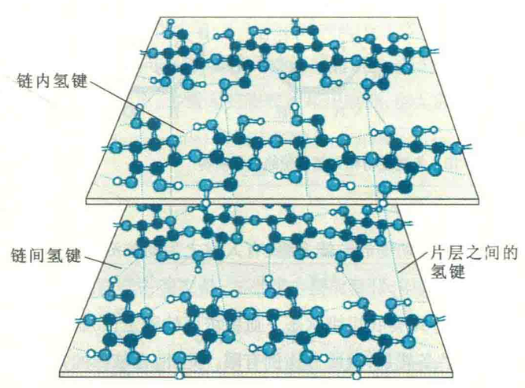
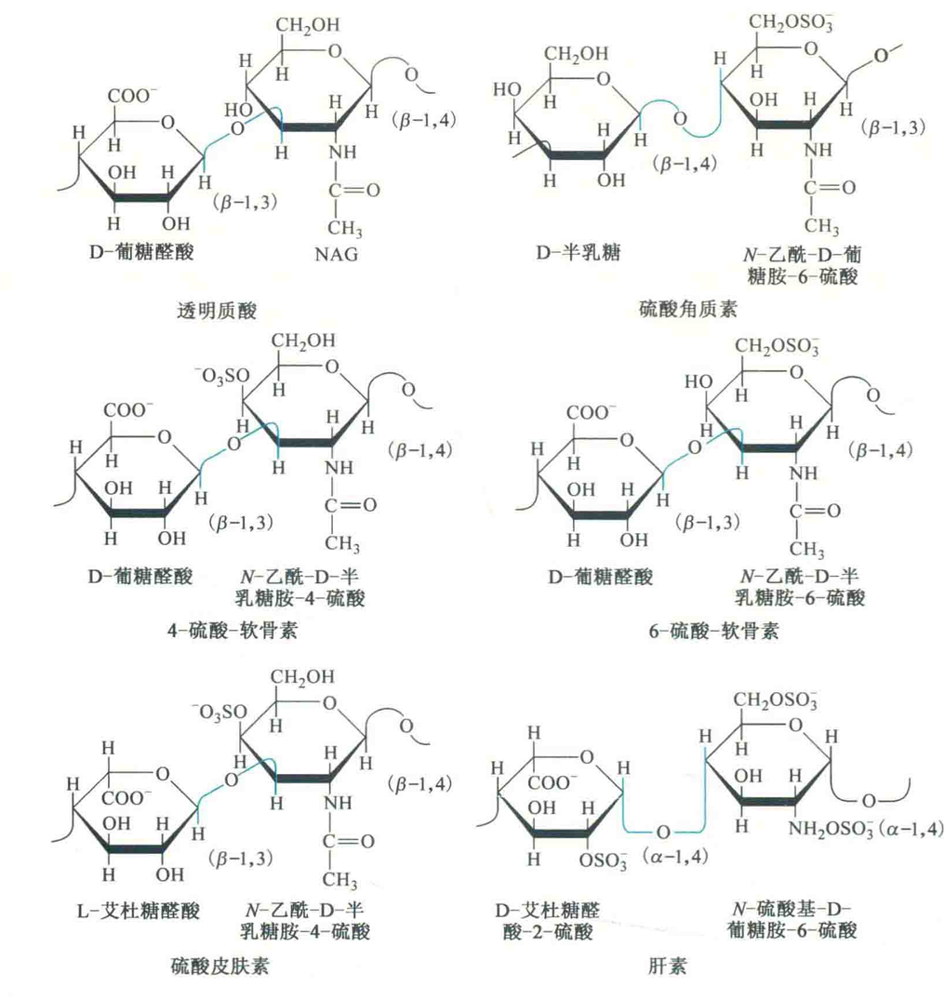
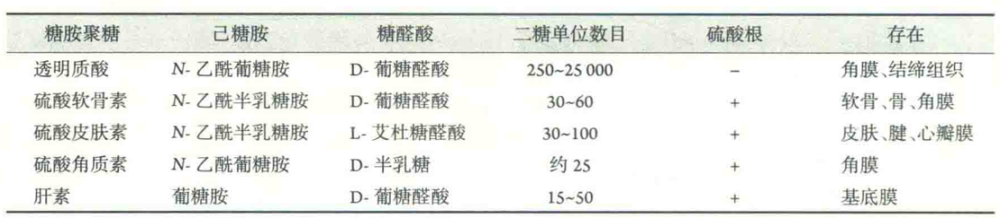

# 结构多糖

最重要的两种结构多糖为纤维素和几丁质。此外，还有胼胝糖和木聚糖。

## 纤维素

纤维素可以说是世界上最丰富的天然多聚物，几乎所有植物的细胞壁都有它，它对于维持植物细胞的形状十分重要。但纤维素也有其“温柔”的一面，如最舒适柔软的天然衣料——棉花几乎就是纯的纤维素。

纤维素与直链淀粉一样，也是一种线性无分支分子，但葡萄糖单位以β-1,4-糖苷键相连。因此，组成纤维素的二糖单位是纤维二糖。

在β-1,4-糖苷键的连接方式中，最稳定的构象是葡萄糖单位沿着链交替翻转180°，因而纤维素链采取的是一种完全伸展的带状构象。每条纤维素链除了有链内氢键以外，还与周围的纤维素链形成链间氢键。相邻的几条纤维素链肩并肩地靠在一起，通过链间氢键以及范德华力形成扁平片层。相邻的片层再垛叠在一起，片层内纤维素链呈锯齿状，片层之间的纤维素链也有氢键。纤维素的上述结构赋予了纤维素一定的强度。

大多数动物很难利用纤维素，原因是它们的消化道分泌的水解酶不能识别β-1,4-糖苷键。然而，反刍动物能够消化并利用纤维素。

## 几丁质

几丁质又名甲壳素、甲壳质、壳聚糖或壳糖胺，是由N-乙酰葡糖胺形成的直链多聚物。

几丁质不仅是甲壳纲动物、昆虫和蜘蛛的外骨骼的基本成分，还存在于真菌的细胞壁中，在生物功能和结构上与纤维素十分相似。在一级结构上，几丁质由N-乙酰葡糖胺通过β-1,4-糖苷键相连，其化学结构可看成2-羟基被乙酰胺所取代的纤维素;在高级结构上，它也是伸展的带状构象。

但是，纤维素与几丁质在结构上有一个十分重要的差别——片层结构的组织方式。所有片层链的还原端都集中在一侧，非还原端集中在另一侧的排列方式称为平行排列；一个片层内链的还原端与其上下片层内链的还原端位于异侧的排列方式称为反平行排列。

天然的纤维素似乎只以平行的方式排列。然而，几丁质有三种形式：全平行排列的α-几丁质、全反平行排列的β-几丁质和混合型排列的δ-几丁质。

在自然界中，几丁质资源非常丰富，其含量仅次于纤维素，具有广泛的工业、商业和医用价值。人们已发现，甲壳素有纤维素所不具备的特性，是目前世界上唯一含阳离子的可食性动物纤维，也是除蛋白质、糖类、脂肪、维生素、矿物质以外的一种生命要素，因此有人称之为第六生命要素。

## 胼胝糖

胼胝糖是由葡萄糖通过β-1,3-糖苷键相连的直链多糖，因此也称为β-葡聚糖，它与纤维素一样也存在于植物细胞壁中，对植物细胞有支持和保护的功能。

## 木聚糖

木聚糖主要是由木糖通过β-1,4-糖苷键相连的多糖，作为植物细胞壁中半纤维素的主要成分，约占植物细胞干重的35%，因此在自然界含量极其丰富。

## 糖胺聚糖

糖胺聚糖也称黏多糖，是由多个重复的二糖单位组成的无分支的杂多糖，主要存在于动物的细胞外基质中，形成水合的胶状物。糖胺聚糖共包括：透明质酸、硫酸角质素、硫酸软骨素、硫酸皮肤素和肝素。其中，后4种通常与核心蛋白以共价键相连构成蛋白聚糖，所以都是在高尔基体合成的，这样才有机会与在粗面内质网合成并转移过来的核心蛋白组装成蛋白聚糖。

只有透明质酸由定位在细胞膜上的酶合成并独立地被分泌到胞外。透明质酸也称玻尿酸，是唯一一种不含硫酸基团的糖胺聚糖，其聚糖链含有大量羟基。这些羟基有很强的亲水性，因此透明质酸现在被用于多种保湿护肤品中，还在整容手术中用作皮肤填充剂被直接注射到皮下，但在手术中有可能伤及神经和血管，产生疼痛和瘀伤，而且在某些情况下还可能导致异物反应。

除了上述几种结构多糖以外，藻酸和琼脂糖等也属于结构多糖，它们也存在于自然界，并具有特殊的生物功能。