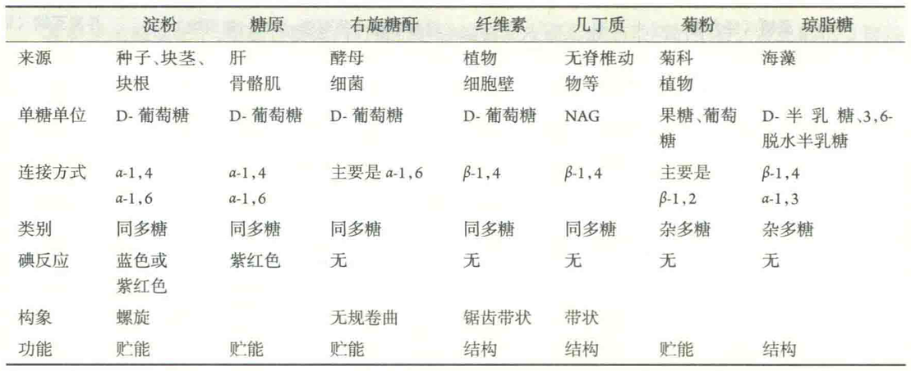

# 多糖

由多个单糖分子通过糖昔键缩合而成的糖类称为多糖或聚糖，其中由相同的单糖分子组成的多糖为同多糖，含有不同种单糖单位的多糖为杂多糖。

多糖中最常见的单糖是D-葡萄糖，其次是D-果糖、D-半乳糖、L-半乳糖、D-甘露糖、L阿拉伯糖和D-木糖。某些单糖的衍生物，如D-葡糖胺、D-半乳糖胺、N-乙酰葡糖胺、N-乙酰半乳糖胺和葡糖醛酸，也出现在一些多糖分子之中。

单糖之间的连接方式，即糖苷键的类型，直接与多糖的机械强度和溶解性质有关。以α-1,4-糖苷键相连的多糖往往比较软，在水里有一定的溶解度，如淀粉和糖原;而以β-1,4-糖苷键相连的多糖比较硬，难溶于水，如纤维素和几丁质。

与蛋白质和核酸相似的是，多糖分子也有两个不对称的末端：其中含有游离的半缩醛羟基的一端称为还原端，另一端就称为非还原端。与蛋白质和核酸不同的是，多糖无确定的相对分子质量，因为组成多糖的单糖单位的数目不是固定的。与单糖和寡糖相比，多糖无变旋现象和还原性，也无甜味。

按照功能的不同，多糖可分为贮能多糖和结构多糖。

