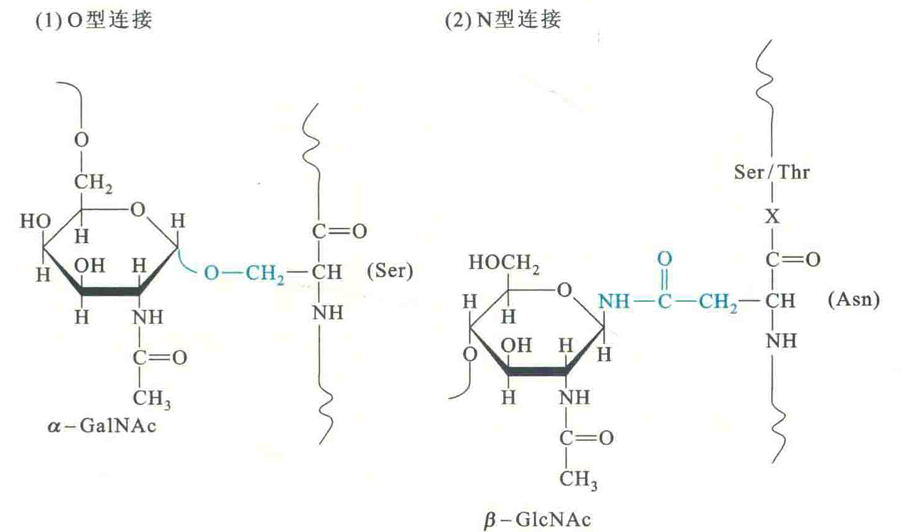
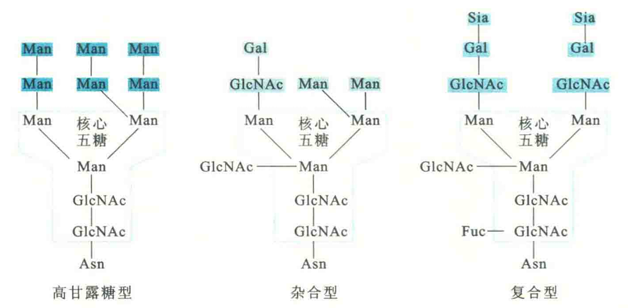
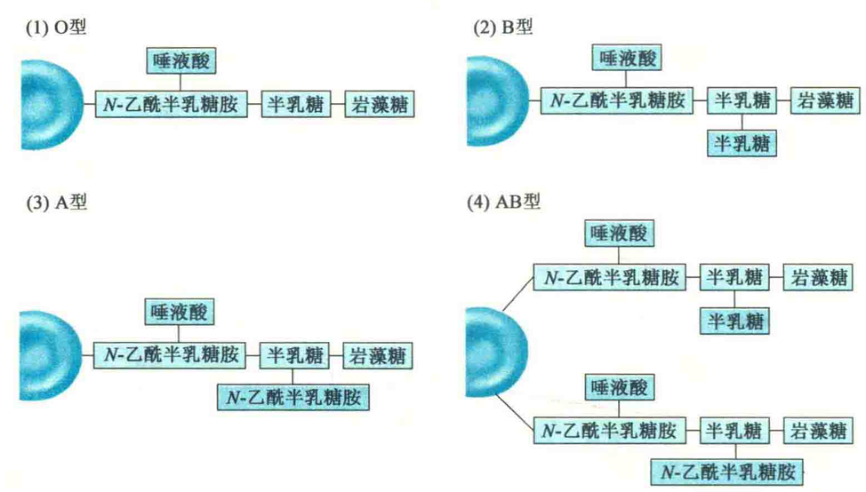
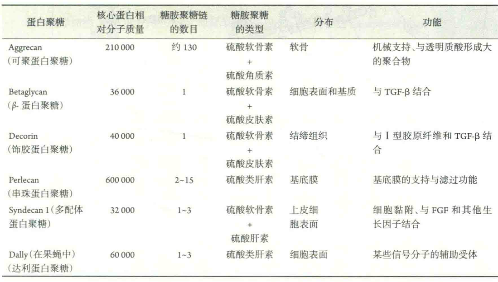

# 糖蛋白和蛋白聚糖

糖蛋白和蛋白聚糖都是由蛋白质与糖类通过共价键相连的复合物，两者都可以看成是蛋白质翻译后发生糖基化修饰的产物。就糖蛋白而言，其中蛋白质是结构与功能的中心，糖起“点缀”或“陪衬”的作用，由多种具分支的寡糖链组成，含量约占总质量的1%〜60%。两者通过糖肽键连接而成，而糖肽键主要有O型和N型。

以O型糖肽键相连的糖蛋白广泛存在于细菌、古菌和真核生物中，而以N型糖肽键相连的糖蛋白主要存在于古菌和真核生物中。

O型糖肽键一般是由寡糖链还原端α-Ν-乙酰氨基半乳糖胺残基的半缩醛羟基，与多肽链Ser/Thr残基的羟基缩合而成，若是真核细胞，是在高尔基体引入的；

N型糖肽键则是由寡糖链还原端β-N-乙酰氨基葡糖胺残基的半缩醛羟基，与多肽链Asn的酰胺基缩合而成，若是真核细胞，是在内质网引入的，引入的寡糖链由一相同的核心五糖链和若干外围糖基组成。根据外围糖基的组成特征，寡糖链可分为高甘露糖型、杂合型和复合型。

糖蛋白中的寡糖链除了对蛋白质的稳定性、溶解性等理化性质有影响以外，还参与多种生物学功能，例如分子识别、信号转导、多肽链折叠、蛋白质翻译后的分拣和定向。

糖蛋白一般为分泌蛋白和细胞膜蛋白，例如促红素和促卵泡激素为分泌性糖蛋白，大多数水溶性激素的受体为质膜上的糖蛋白。如果糖蛋白整合在质膜上，就会与质膜上的另外一种糖缀合物——糖脂一样，其寡糖链部分面向胞外。这些寡糖链在细胞的表面，相当于是一种分子天线，参与细胞与细胞之间的相互作用、细胞识别、细胞黏附以及信号转导。

例如，ABO血型系统就与红细胞表面寡糖链的性质有关。这些寡糖链主要与膜蛋白共价相连，也有一些与膜脂共价相连。有时，糖蛋白分子上的寡糖链在某些细胞的表面会形成一个保护性的薄层，如小肠黏膜细胞表面的糖萼可以保护细胞免受蛋白酶的消化。

在许多生物体内，有一类称为凝集素的蛋白质可以识别和结合特定的寡糖链。例如，来自刀豆中的凝集素——刀豆素A，就专门识别非还原端是甘露糖或葡萄糖的寡糖链。有些病毒在感染期间，会使用凝集素附着到宿主细胞表面。例如，H5N1禽流感病毒株中的H表示的就是一种称为血凝素的凝聚素。流感病毒就是通过它识别和结合宿主细胞膜上含有唾液酸的受体糖蛋白而启动感染过程的。

就蛋白聚糖来说，聚糖是结构与功能的中心，其含量可达总质量的98%，主要由无分支的糖胺聚糖链组成，蛋白质反倒成了“点缀”或“陪衬”。糖胺聚糖链多到100个以上，有时相对分子质量很大，可达3×10^9。

与糖胺聚糖共价结合的蛋白质称为核心蛋白。有时，与核心蛋白共价结合的糖胺聚糖不止一种，这样的蛋白聚糖称为多配体蛋白聚糖。已发现至少6类不同的蛋白聚糖，它们在核心蛋白的大小、糖胺聚糖链的数目、糖胺聚糖的类型、体内分布和功能等方面均有差别。

蛋白聚糖的主要功能包括：

①调节分泌蛋白的活性；

②形成带电的多孔凝胶，限制或促进某些物质的通过；

③与某些生长因子结合，调节它们的活性；

④在细胞表面作为辅助受体。