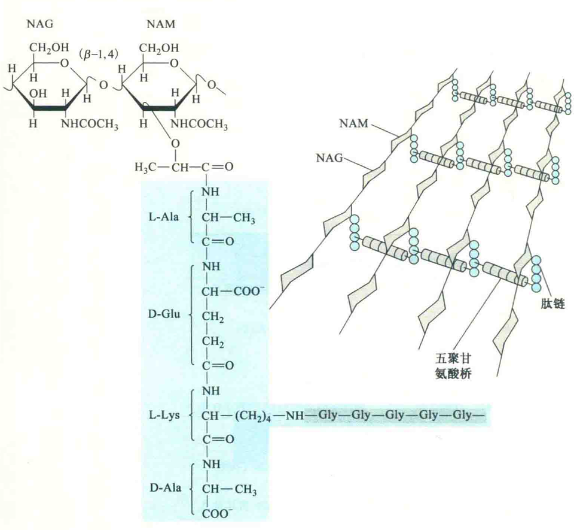

# 肽聚糖

肽聚糖又称黏肽，是细菌细胞壁的主要成分。古菌和真菌有细胞壁，但壁上都没有肽聚糖。肽聚糖主要是由N-乙酰葡糖胺(NAG)、N-乙酰胞壁酸(NAM)以及短肽构成。

NAG和NAM两种氨基糖经β-1,4-糖苷键连接，间隔排列形成聚糖骨架，短肽则靠肽键连接在聚糖骨架的NAM上。相邻的肽链之间再由肽桥或肽链（如五聚甘氨酸桥）联系起来，组成一个机械性能很强的网状结构。

不同种类的细菌，组成肽聚糖的聚糖骨架相同，但短肽的组成和相邻短肽间的联结方式不同。短肽并不是在核糖体上合成的，因此会有D型氨基酸。例如，金黄色葡萄球菌的短肽由L-Glu、D-Glu、L-Lys和D-Ala组成。

短肽中含有D型氨基酸可以防止宿主体内的蛋白酶对它的降解，因为一般的蛋白酶只水解由L型氨基酸形成的肽键，肽聚糖是许多酶和抗生素的作用目标。

例如，溶菌酶、葡萄糖球菌溶素能水解NAG和NAM之间的糖苷键，从而导致细胞壁解体。

再如，青霉素、头抱菌素能干扰短肽链间的联结，磷霉素、环丝氨酸能抑制聚糖骨架的合成，造成细胞壁缺陷，导致细菌在低渗溶液极易破裂而死亡。