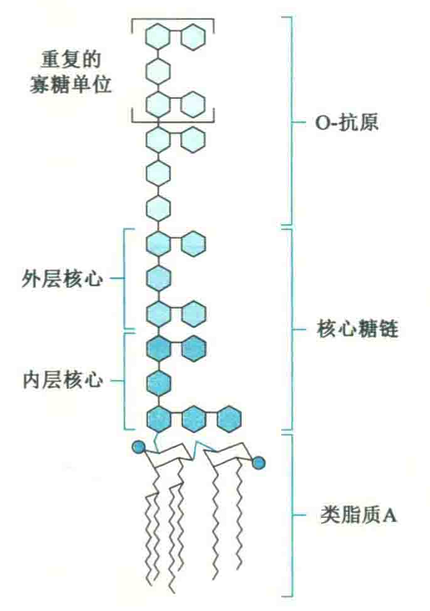

# 糖脂与脂多糖

糖脂与脂多糖之间的关系有点像糖蛋白与蛋白聚糖的关系。就糖脂而言，它是一种两性脂，一般定位在细胞膜上，脂这部分是疏水的，插在膜上，而糖这部分是亲水的，暴露在细胞的表面，参与多项重要的功能。

脂多糖也是两性的，由O-抗原、核心糖链和类脂质A三个部分通过共价键组成，作为革兰阴性细菌外膜中的一种成分，对宿主是有毒性的，但只有在细菌死亡溶解或用人工方法破坏菌体后才释放出来，因此称为内毒素。

其毒性成分主要为类脂质A，耐热而稳定，但抗原性弱。

各种细菌内毒素的毒性作用大致相同，一般较弱，可引起发热、微循环障碍、内毒素休克及播散性血管内凝血等。